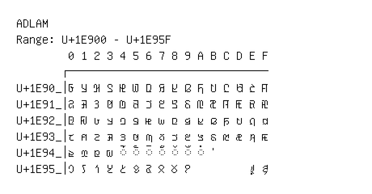

# Adlam

**Range:** `U+1E900` - `U+1E95F`

[← Back to Index](../README.md)

```text
        0 1 2 3 4 5 6 7 8 9 A B C D E F
       ┌───────────────────────────────
U+1E90_│𞤀 𞤁 𞤂 𞤃 𞤄 𞤅 𞤆 𞤇 𞤈 𞤉 𞤊 𞤋 𞤌 𞤍 𞤎 𞤏
U+1E91_│𞤐 𞤑 𞤒 𞤓 𞤔 𞤕 𞤖 𞤗 𞤘 𞤙 𞤚 𞤛 𞤜 𞤝 𞤞 𞤟
U+1E92_│𞤠 𞤡 𞤢 𞤣 𞤤 𞤥 𞤦 𞤧 𞤨 𞤩 𞤪 𞤫 𞤬 𞤭 𞤮 𞤯
U+1E93_│𞤰 𞤱 𞤲 𞤳 𞤴 𞤵 𞤶 𞤷 𞤸 𞤹 𞤺 𞤻 𞤼 𞤽 𞤾 𞤿
U+1E94_│𞥀 𞥁 𞥂 𞥃 ◌𞥄 ◌𞥅 ◌𞥆 ◌𞥇 ◌𞥈 ◌𞥉 ◌𞥊 𞥋
U+1E95_│𞥐 𞥑 𞥒 𞥓 𞥔 𞥕 𞥖 𞥗 𞥘 𞥙         𞥞 𞥟
```

## Visual Fallback Reference
If your system lacks the required fonts to render these characters properly, use the image below as a visual guide.


