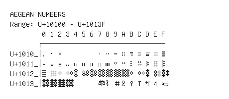

# Aegean Numbers

**Range:** `U+10100` - `U+1013F`

[← Back to Index](../README.md)

```text
        0 1 2 3 4 5 6 7 8 9 A B C D E F
       ┌───────────────────────────────
U+1010_│𐄀 𐄁 𐄂         𐄇 𐄈 𐄉 𐄊 𐄋 𐄌 𐄍 𐄎 𐄏
U+1011_│𐄐 𐄑 𐄒 𐄓 𐄔 𐄕 𐄖 𐄗 𐄘 𐄙 𐄚 𐄛 𐄜 𐄝 𐄞 𐄟
U+1012_│𐄠 𐄡 𐄢 𐄣 𐄤 𐄥 𐄦 𐄧 𐄨 𐄩 𐄪 𐄫 𐄬 𐄭 𐄮 𐄯
U+1013_│𐄰 𐄱 𐄲 𐄳       𐄷 𐄸 𐄹 𐄺 𐄻 𐄼 𐄽 𐄾 𐄿
```

## Visual Fallback Reference
If your system lacks the required fonts to render these characters properly, use the image below as a visual guide.


