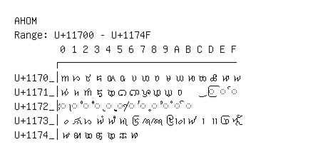

# Ahom

**Range:** `U+11700` - `U+1174F`

[← Back to Index](../README.md)

```text
        0 1 2 3 4 5 6 7 8 9 A B C D E F
       ┌───────────────────────────────
U+1170_│𑜀 𑜁 𑜂 𑜃 𑜄 𑜅 𑜆 𑜇 𑜈 𑜉 𑜊 𑜋 𑜌 𑜍 𑜎 𑜏
U+1171_│𑜐 𑜑 𑜒 𑜓 𑜔 𑜕 𑜖 𑜗 𑜘 𑜙 𑜚     ◌𑜝 ◌𑜞 ◌𑜟
U+1172_│◌𑜠 ◌𑜡 ◌𑜢 ◌𑜣 ◌𑜤 ◌𑜥 ◌𑜦 ◌𑜧 ◌𑜨 ◌𑜩 ◌𑜪 ◌𑜫
U+1173_│𑜰 𑜱 𑜲 𑜳 𑜴 𑜵 𑜶 𑜷 𑜸 𑜹 𑜺 𑜻 𑜼 𑜽 𑜾 𑜿
U+1174_│𑝀 𑝁 𑝂 𑝃 𑝄 𑝅 𑝆
```

## Visual Fallback Reference
If your system lacks the required fonts to render these characters properly, use the image below as a visual guide.


