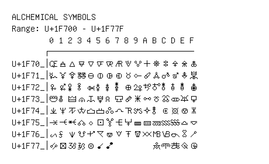

# Alchemical Symbols

**Range:** `U+1F700` - `U+1F77F`

[← Back to Index](../README.md)

```text
        0 1 2 3 4 5 6 7 8 9 A B C D E F
       ┌───────────────────────────────
U+1F70_│🜀 🜁 🜂 🜃 🜄 🜅 🜆 🜇 🜈 🜉 🜊 🜋 🜌 🜍 🜎 🜏
U+1F71_│🜐 🜑 🜒 🜓 🜔 🜕 🜖 🜗 🜘 🜙 🜚 🜛 🜜 🜝 🜞 🜟
U+1F72_│🜠 🜡 🜢 🜣 🜤 🜥 🜦 🜧 🜨 🜩 🜪 🜫 🜬 🜭 🜮 🜯
U+1F73_│🜰 🜱 🜲 🜳 🜴 🜵 🜶 🜷 🜸 🜹 🜺 🜻 🜼 🜽 🜾 🜿
U+1F74_│🝀 🝁 🝂 🝃 🝄 🝅 🝆 🝇 🝈 🝉 🝊 🝋 🝌 🝍 🝎 🝏
U+1F75_│🝐 🝑 🝒 🝓 🝔 🝕 🝖 🝗 🝘 🝙 🝚 🝛 🝜 🝝 🝞 🝟
U+1F76_│🝠 🝡 🝢 🝣 🝤 🝥 🝦 🝧 🝨 🝩 🝪 🝫 🝬 🝭 🝮 🝯
U+1F77_│🝰 🝱 🝲 🝳 🝴 🝵 🝶         🝻 🝼 🝽 🝾 🝿
```

## Visual Fallback Reference
If your system lacks the required fonts to render these characters properly, use the image below as a visual guide.


