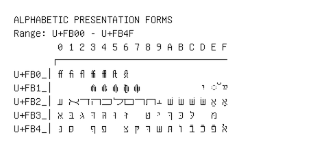

# Alphabetic Presentation Forms

**Range:** `U+FB00` - `U+FB4F`

[← Back to Index](../README.md)

```text
        0 1 2 3 4 5 6 7 8 9 A B C D E F
       ┌───────────────────────────────
U+FB0_│ff fi fl ffi ffl ſt st
U+FB1_│      ﬓ ﬔ ﬕ ﬖ ﬗ           יִ ◌ﬞ ײַ
U+FB2_│ﬠ ﬡ ﬢ ﬣ ﬤ ﬥ ﬦ ﬧ ﬨ ﬩ שׁ שׂ שּׁ שּׂ אַ אָ
U+FB3_│אּ בּ גּ דּ הּ וּ זּ   טּ יּ ךּ כּ לּ   מּ
U+FB4_│נּ סּ   ףּ פּ   צּ קּ רּ שּ תּ וֹ בֿ כֿ פֿ ﭏ
```

## Visual Fallback Reference
If your system lacks the required fonts to render these characters properly, use the image below as a visual guide.


