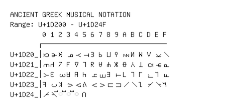

# Ancient Greek Musical Notation

**Range:** `U+1D200` - `U+1D24F`

[← Back to Index](../README.md)

```text
        0 1 2 3 4 5 6 7 8 9 A B C D E F
       ┌───────────────────────────────
U+1D20_│𝈀 𝈁 𝈂 𝈃 𝈄 𝈅 𝈆 𝈇 𝈈 𝈉 𝈊 𝈋 𝈌 𝈍 𝈎 𝈏
U+1D21_│𝈐 𝈑 𝈒 𝈓 𝈔 𝈕 𝈖 𝈗 𝈘 𝈙 𝈚 𝈛 𝈜 𝈝 𝈞 𝈟
U+1D22_│𝈠 𝈡 𝈢 𝈣 𝈤 𝈥 𝈦 𝈧 𝈨 𝈩 𝈪 𝈫 𝈬 𝈭 𝈮 𝈯
U+1D23_│𝈰 𝈱 𝈲 𝈳 𝈴 𝈵 𝈶 𝈷 𝈸 𝈹 𝈺 𝈻 𝈼 𝈽 𝈾 𝈿
U+1D24_│𝉀 𝉁 ◌𝉂 ◌𝉃 ◌𝉄 𝉅
```

## Visual Fallback Reference
If your system lacks the required fonts to render these characters properly, use the image below as a visual guide.


