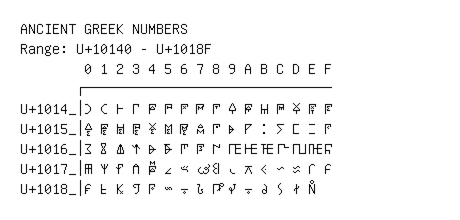

# Ancient Greek Numbers

**Range:** `U+10140` - `U+1018F`

[← Back to Index](../README.md)

```text
        0 1 2 3 4 5 6 7 8 9 A B C D E F
       ┌───────────────────────────────
U+1014_│𐅀 𐅁 𐅂 𐅃 𐅄 𐅅 𐅆 𐅇 𐅈 𐅉 𐅊 𐅋 𐅌 𐅍 𐅎 𐅏
U+1015_│𐅐 𐅑 𐅒 𐅓 𐅔 𐅕 𐅖 𐅗 𐅘 𐅙 𐅚 𐅛 𐅜 𐅝 𐅞 𐅟
U+1016_│𐅠 𐅡 𐅢 𐅣 𐅤 𐅥 𐅦 𐅧 𐅨 𐅩 𐅪 𐅫 𐅬 𐅭 𐅮 𐅯
U+1017_│𐅰 𐅱 𐅲 𐅳 𐅴 𐅵 𐅶 𐅷 𐅸 𐅹 𐅺 𐅻 𐅼 𐅽 𐅾 𐅿
U+1018_│𐆀 𐆁 𐆂 𐆃 𐆄 𐆅 𐆆 𐆇 𐆈 𐆉 𐆊 𐆋 𐆌 𐆍 𐆎
```

## Visual Fallback Reference
If your system lacks the required fonts to render these characters properly, use the image below as a visual guide.


