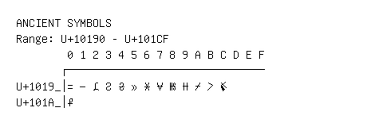

# Ancient Symbols

**Range:** `U+10190` - `U+101CF`

[← Back to Index](../README.md)

```text
        0 1 2 3 4 5 6 7 8 9 A B C D E F
       ┌───────────────────────────────
U+1019_│𐆐 𐆑 𐆒 𐆓 𐆔 𐆕 𐆖 𐆗 𐆘 𐆙 𐆚 𐆛 𐆜
U+101A_│𐆠
```

## Visual Fallback Reference
If your system lacks the required fonts to render these characters properly, use the image below as a visual guide.


