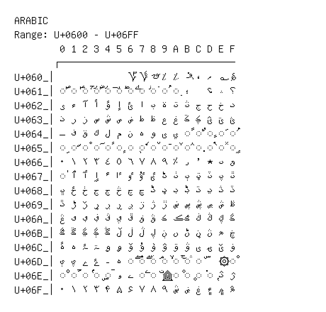

# Arabic

**Range:** `U+0600` - `U+06FF`

[← Back to Index](../README.md)

```text
        0 1 2 3 4 5 6 7 8 9 A B C D E F
       ┌───────────────────────────────
U+060_│            ؆ ؇ ؈ ؉ ؊ ؋ ، ؍ ؎ ؏
U+061_│◌ؐ ◌ؑ ◌ؒ ◌ؓ ◌ؔ ◌ؕ ◌ؖ ◌ؗ ◌ؘ ◌ؙ ◌ؚ ؛   ؝ ؞ ؟
U+062_│ؠ ء آ أ ؤ إ ئ ا ب ة ت ث ج ح خ د
U+063_│ذ ر ز س ش ص ض ط ظ ع غ ػ ؼ ؽ ؾ ؿ
U+064_│ـ ف ق ك ل م ن ه و ى ي ◌ً ◌ٌ ◌ٍ ◌َ ◌ُ
U+065_│◌ِ ◌ّ ◌ْ ◌ٓ ◌ٔ ◌ٕ ◌ٖ ◌ٗ ◌٘ ◌ٙ ◌ٚ ◌ٛ ◌ٜ ◌ٝ ◌ٞ ◌ٟ
U+066_│٠ ١ ٢ ٣ ٤ ٥ ٦ ٧ ٨ ٩ ٪ ٫ ٬ ٭ ٮ ٯ
U+067_│◌ٰ ٱ ٲ ٳ ٴ ٵ ٶ ٷ ٸ ٹ ٺ ٻ ټ ٽ پ ٿ
U+068_│ڀ ځ ڂ ڃ ڄ څ چ ڇ ڈ ډ ڊ ڋ ڌ ڍ ڎ ڏ
U+069_│ڐ ڑ ڒ ړ ڔ ڕ ږ ڗ ژ ڙ ښ ڛ ڜ ڝ ڞ ڟ
U+06A_│ڠ ڡ ڢ ڣ ڤ ڥ ڦ ڧ ڨ ک ڪ ګ ڬ ڭ ڮ گ
U+06B_│ڰ ڱ ڲ ڳ ڴ ڵ ڶ ڷ ڸ ڹ ں ڻ ڼ ڽ ھ ڿ
U+06C_│ۀ ہ ۂ ۃ ۄ ۅ ۆ ۇ ۈ ۉ ۊ ۋ ی ۍ ێ ۏ
U+06D_│ې ۑ ے ۓ ۔ ە ◌ۖ ◌ۗ ◌ۘ ◌ۙ ◌ۚ ◌ۛ ◌ۜ   ۞ ◌۟
U+06E_│◌۠ ◌ۡ ◌ۢ ◌ۣ ◌ۤ ۥ ۦ ◌ۧ ◌ۨ ۩ ◌۪ ◌۫ ◌۬ ◌ۭ ۮ ۯ
U+06F_│۰ ۱ ۲ ۳ ۴ ۵ ۶ ۷ ۸ ۹ ۺ ۻ ۼ ۽ ۾ ۿ
```

## Visual Fallback Reference
If your system lacks the required fonts to render these characters properly, use the image below as a visual guide.


