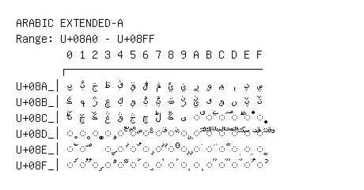

# Arabic Extended-A

**Range:** `U+08A0` - `U+08FF`

[← Back to Index](../README.md)

```text
        0 1 2 3 4 5 6 7 8 9 A B C D E F
       ┌───────────────────────────────
U+08A_│ࢠ ࢡ ࢢ ࢣ ࢤ ࢥ ࢦ ࢧ ࢨ ࢩ ࢪ ࢫ ࢬ ࢭ ࢮ ࢯ
U+08B_│ࢰ ࢱ ࢲ ࢳ ࢴ ࢵ ࢶ ࢷ ࢸ ࢹ ࢺ ࢻ ࢼ ࢽ ࢾ ࢿ
U+08C_│ࣀ ࣁ ࣂ ࣃ ࣄ ࣅ ࣆ ࣇ ࣈ ࣉ ◌࣊ ◌࣋ ◌࣌ ◌࣍ ◌࣎ ◌࣏
U+08D_│◌࣐ ◌࣑ ◌࣒ ◌࣓ ◌ࣔ ◌ࣕ ◌ࣖ ◌ࣗ ◌ࣘ ◌ࣙ ◌ࣚ ◌ࣛ ◌ࣜ ◌ࣝ ◌ࣞ ◌ࣟ
U+08E_│◌࣠ ◌࣡   ◌ࣣ ◌ࣤ ◌ࣥ ◌ࣦ ◌ࣧ ◌ࣨ ◌ࣩ ◌࣪ ◌࣫ ◌࣬ ◌࣭ ◌࣮ ◌࣯
U+08F_│◌ࣰ ◌ࣱ ◌ࣲ ◌ࣳ ◌ࣴ ◌ࣵ ◌ࣶ ◌ࣷ ◌ࣸ ◌ࣹ ◌ࣺ ◌ࣻ ◌ࣼ ◌ࣽ ◌ࣾ ◌ࣿ
```

## Visual Fallback Reference
If your system lacks the required fonts to render these characters properly, use the image below as a visual guide.


