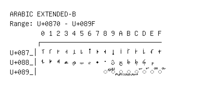

# Arabic Extended-B

**Range:** `U+0870` - `U+089F`

[← Back to Index](../README.md)

```text
        0 1 2 3 4 5 6 7 8 9 A B C D E F
       ┌───────────────────────────────
U+087_│ࡰ ࡱ ࡲ ࡳ ࡴ ࡵ ࡶ ࡷ ࡸ ࡹ ࡺ ࡻ ࡼ ࡽ ࡾ ࡿ
U+088_│ࢀ ࢁ ࢂ ࢃ ࢄ ࢅ ࢆ ࢇ ࢈ ࢉ ࢊ ࢋ ࢌ ࢍ ࢎ
U+089_│                ◌࢘ ◌࢙ ◌࢚ ◌࢛ ◌࢜ ◌࢝ ◌࢞ ◌࢟
```

## Visual Fallback Reference
If your system lacks the required fonts to render these characters properly, use the image below as a visual guide.


