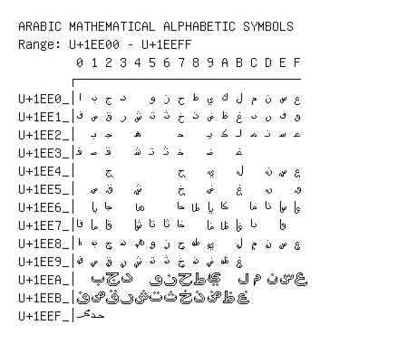

# Arabic Mathematical Alphabetic Symbols

**Range:** `U+1EE00` - `U+1EEFF`

[← Back to Index](../README.md)

```text
        0 1 2 3 4 5 6 7 8 9 A B C D E F
       ┌───────────────────────────────
U+1EE0_│𞸀 𞸁 𞸂 𞸃   𞸅 𞸆 𞸇 𞸈 𞸉 𞸊 𞸋 𞸌 𞸍 𞸎 𞸏
U+1EE1_│𞸐 𞸑 𞸒 𞸓 𞸔 𞸕 𞸖 𞸗 𞸘 𞸙 𞸚 𞸛 𞸜 𞸝 𞸞 𞸟
U+1EE2_│  𞸡 𞸢   𞸤     𞸧   𞸩 𞸪 𞸫 𞸬 𞸭 𞸮 𞸯
U+1EE3_│𞸰 𞸱 𞸲   𞸴 𞸵 𞸶 𞸷   𞸹   𞸻
U+1EE4_│    𞹂         𞹇   𞹉   𞹋   𞹍 𞹎 𞹏
U+1EE5_│  𞹑 𞹒   𞹔     𞹗   𞹙   𞹛   𞹝   𞹟
U+1EE6_│  𞹡 𞹢   𞹤     𞹧 𞹨 𞹩 𞹪   𞹬 𞹭 𞹮 𞹯
U+1EE7_│𞹰 𞹱 𞹲   𞹴 𞹵 𞹶 𞹷   𞹹 𞹺 𞹻 𞹼   𞹾
U+1EE8_│𞺀 𞺁 𞺂 𞺃 𞺄 𞺅 𞺆 𞺇 𞺈 𞺉   𞺋 𞺌 𞺍 𞺎 𞺏
U+1EE9_│𞺐 𞺑 𞺒 𞺓 𞺔 𞺕 𞺖 𞺗 𞺘 𞺙 𞺚 𞺛
U+1EEA_│  𞺡 𞺢 𞺣   𞺥 𞺦 𞺧 𞺨 𞺩   𞺫 𞺬 𞺭 𞺮 𞺯
U+1EEB_│𞺰 𞺱 𞺲 𞺳 𞺴 𞺵 𞺶 𞺷 𞺸 𞺹 𞺺 𞺻
U+1EEF_│𞻰 𞻱
```

## Visual Fallback Reference
If your system lacks the required fonts to render these characters properly, use the image below as a visual guide.


