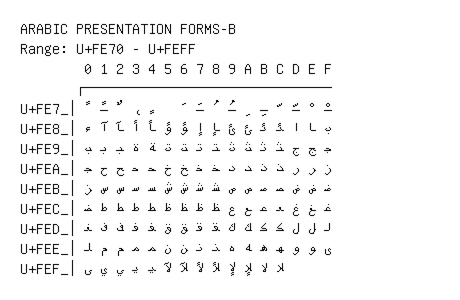

# Arabic Presentation Forms-B

**Range:** `U+FE70` - `U+FEFF`

[← Back to Index](../README.md)

```text
        0 1 2 3 4 5 6 7 8 9 A B C D E F
       ┌───────────────────────────────
U+FE7_│ﹰ ﹱ ﹲ ﹳ ﹴ   ﹶ ﹷ ﹸ ﹹ ﹺ ﹻ ﹼ ﹽ ﹾ ﹿ
U+FE8_│ﺀ ﺁ ﺂ ﺃ ﺄ ﺅ ﺆ ﺇ ﺈ ﺉ ﺊ ﺋ ﺌ ﺍ ﺎ ﺏ
U+FE9_│ﺐ ﺑ ﺒ ﺓ ﺔ ﺕ ﺖ ﺗ ﺘ ﺙ ﺚ ﺛ ﺜ ﺝ ﺞ ﺟ
U+FEA_│ﺠ ﺡ ﺢ ﺣ ﺤ ﺥ ﺦ ﺧ ﺨ ﺩ ﺪ ﺫ ﺬ ﺭ ﺮ ﺯ
U+FEB_│ﺰ ﺱ ﺲ ﺳ ﺴ ﺵ ﺶ ﺷ ﺸ ﺹ ﺺ ﺻ ﺼ ﺽ ﺾ ﺿ
U+FEC_│ﻀ ﻁ ﻂ ﻃ ﻄ ﻅ ﻆ ﻇ ﻈ ﻉ ﻊ ﻋ ﻌ ﻍ ﻎ ﻏ
U+FED_│ﻐ ﻑ ﻒ ﻓ ﻔ ﻕ ﻖ ﻗ ﻘ ﻙ ﻚ ﻛ ﻜ ﻝ ﻞ ﻟ
U+FEE_│ﻠ ﻡ ﻢ ﻣ ﻤ ﻥ ﻦ ﻧ ﻨ ﻩ ﻪ ﻫ ﻬ ﻭ ﻮ ﻯ
U+FEF_│ﻰ ﻱ ﻲ ﻳ ﻴ ﻵ ﻶ ﻷ ﻸ ﻹ ﻺ ﻻ ﻼ
```

## Visual Fallback Reference
If your system lacks the required fonts to render these characters properly, use the image below as a visual guide.


