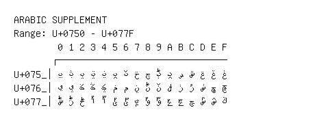

# Arabic Supplement

**Range:** `U+0750` - `U+077F`

[← Back to Index](../README.md)

```text
        0 1 2 3 4 5 6 7 8 9 A B C D E F
       ┌───────────────────────────────
U+075_│ݐ ݑ ݒ ݓ ݔ ݕ ݖ ݗ ݘ ݙ ݚ ݛ ݜ ݝ ݞ ݟ
U+076_│ݠ ݡ ݢ ݣ ݤ ݥ ݦ ݧ ݨ ݩ ݪ ݫ ݬ ݭ ݮ ݯ
U+077_│ݰ ݱ ݲ ݳ ݴ ݵ ݶ ݷ ݸ ݹ ݺ ݻ ݼ ݽ ݾ ݿ
```

## Visual Fallback Reference
If your system lacks the required fonts to render these characters properly, use the image below as a visual guide.


