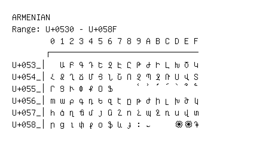

# Armenian

**Range:** `U+0530` - `U+058F`

[← Back to Index](../README.md)

```text
        0 1 2 3 4 5 6 7 8 9 A B C D E F
       ┌───────────────────────────────
U+053_│  Ա Բ Գ Դ Ե Զ Է Ը Թ Ժ Ի Լ Խ Ծ Կ
U+054_│Հ Ձ Ղ Ճ Մ Յ Ն Շ Ո Չ Պ Ջ Ռ Ս Վ Տ
U+055_│Ր Ց Ւ Փ Ք Օ Ֆ     ՙ ՚ ՛ ՜ ՝ ՞ ՟
U+056_│ՠ ա բ գ դ ե զ է ը թ ժ ի լ խ ծ կ
U+057_│հ ձ ղ ճ մ յ ն շ ո չ պ ջ ռ ս վ տ
U+058_│ր ց ւ փ ք օ ֆ և ֈ ։ ֊     ֍ ֎ ֏
```

## Visual Fallback Reference
If your system lacks the required fonts to render these characters properly, use the image below as a visual guide.


