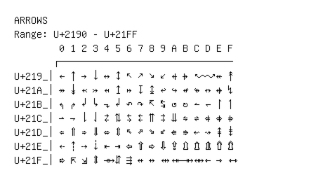

# Arrows

**Range:** `U+2190` - `U+21FF`

[← Back to Index](../README.md)

```text
        0 1 2 3 4 5 6 7 8 9 A B C D E F
       ┌───────────────────────────────
U+219_│← ↑ → ↓ ↔ ↕ ↖ ↗ ↘ ↙ ↚ ↛ ↜ ↝ ↞ ↟
U+21A_│↠ ↡ ↢ ↣ ↤ ↥ ↦ ↧ ↨ ↩ ↪ ↫ ↬ ↭ ↮ ↯
U+21B_│↰ ↱ ↲ ↳ ↴ ↵ ↶ ↷ ↸ ↹ ↺ ↻ ↼ ↽ ↾ ↿
U+21C_│⇀ ⇁ ⇂ ⇃ ⇄ ⇅ ⇆ ⇇ ⇈ ⇉ ⇊ ⇋ ⇌ ⇍ ⇎ ⇏
U+21D_│⇐ ⇑ ⇒ ⇓ ⇔ ⇕ ⇖ ⇗ ⇘ ⇙ ⇚ ⇛ ⇜ ⇝ ⇞ ⇟
U+21E_│⇠ ⇡ ⇢ ⇣ ⇤ ⇥ ⇦ ⇧ ⇨ ⇩ ⇪ ⇫ ⇬ ⇭ ⇮ ⇯
U+21F_│⇰ ⇱ ⇲ ⇳ ⇴ ⇵ ⇶ ⇷ ⇸ ⇹ ⇺ ⇻ ⇼ ⇽ ⇾ ⇿
```

## Visual Fallback Reference
If your system lacks the required fonts to render these characters properly, use the image below as a visual guide.


