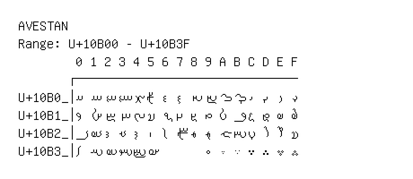

# Avestan

**Range:** `U+10B00` - `U+10B3F`

[← Back to Index](../README.md)

```text
        0 1 2 3 4 5 6 7 8 9 A B C D E F
       ┌───────────────────────────────
U+10B0_│𐬀 𐬁 𐬂 𐬃 𐬄 𐬅 𐬆 𐬇 𐬈 𐬉 𐬊 𐬋 𐬌 𐬍 𐬎 𐬏
U+10B1_│𐬐 𐬑 𐬒 𐬓 𐬔 𐬕 𐬖 𐬗 𐬘 𐬙 𐬚 𐬛 𐬜 𐬝 𐬞 𐬟
U+10B2_│𐬠 𐬡 𐬢 𐬣 𐬤 𐬥 𐬦 𐬧 𐬨 𐬩 𐬪 𐬫 𐬬 𐬭 𐬮 𐬯
U+10B3_│𐬰 𐬱 𐬲 𐬳 𐬴 𐬵       𐬹 𐬺 𐬻 𐬼 𐬽 𐬾 𐬿
```

## Visual Fallback Reference
If your system lacks the required fonts to render these characters properly, use the image below as a visual guide.


