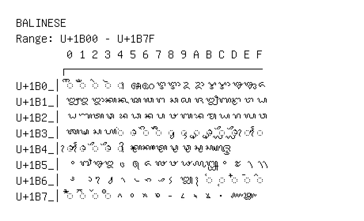

# Balinese

**Range:** `U+1B00` - `U+1B7F`

[← Back to Index](../README.md)

```text
        0 1 2 3 4 5 6 7 8 9 A B C D E F
       ┌───────────────────────────────
U+1B0_│◌ᬀ ◌ᬁ ◌ᬂ ◌ᬃ ◌ᬄ ᬅ ᬆ ᬇ ᬈ ᬉ ᬊ ᬋ ᬌ ᬍ ᬎ ᬏ
U+1B1_│ᬐ ᬑ ᬒ ᬓ ᬔ ᬕ ᬖ ᬗ ᬘ ᬙ ᬚ ᬛ ᬜ ᬝ ᬞ ᬟ
U+1B2_│ᬠ ᬡ ᬢ ᬣ ᬤ ᬥ ᬦ ᬧ ᬨ ᬩ ᬪ ᬫ ᬬ ᬭ ᬮ ᬯ
U+1B3_│ᬰ ᬱ ᬲ ᬳ ◌᬴ ◌ᬵ ◌ᬶ ◌ᬷ ◌ᬸ ◌ᬹ ◌ᬺ ◌ᬻ ◌ᬼ ◌ᬽ ◌ᬾ ◌ᬿ
U+1B4_│◌ᭀ ◌ᭁ ◌ᭂ ◌ᭃ ◌᭄ ᭅ ᭆ ᭇ ᭈ ᭉ ᭊ ᭋ ᭌ
U+1B5_│᭐ ᭑ ᭒ ᭓ ᭔ ᭕ ᭖ ᭗ ᭘ ᭙ ᭚ ᭛ ᭜ ᭝ ᭞ ᭟
U+1B6_│᭠ ᭡ ᭢ ᭣ ᭤ ᭥ ᭦ ᭧ ᭨ ᭩ ᭪ ◌᭫ ◌᭬ ◌᭭ ◌᭮ ◌᭯
U+1B7_│◌᭰ ◌᭱ ◌᭲ ◌᭳ ᭴ ᭵ ᭶ ᭷ ᭸ ᭹ ᭺ ᭻ ᭼ ᭽ ᭾
```

## Visual Fallback Reference
If your system lacks the required fonts to render these characters properly, use the image below as a visual guide.


