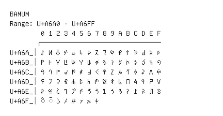

# Bamum

**Range:** `U+A6A0` - `U+A6FF`

[← Back to Index](../README.md)

```text
        0 1 2 3 4 5 6 7 8 9 A B C D E F
       ┌───────────────────────────────
U+A6A_│ꚠ ꚡ ꚢ ꚣ ꚤ ꚥ ꚦ ꚧ ꚨ ꚩ ꚪ ꚫ ꚬ ꚭ ꚮ ꚯ
U+A6B_│ꚰ ꚱ ꚲ ꚳ ꚴ ꚵ ꚶ ꚷ ꚸ ꚹ ꚺ ꚻ ꚼ ꚽ ꚾ ꚿ
U+A6C_│ꛀ ꛁ ꛂ ꛃ ꛄ ꛅ ꛆ ꛇ ꛈ ꛉ ꛊ ꛋ ꛌ ꛍ ꛎ ꛏ
U+A6D_│ꛐ ꛑ ꛒ ꛓ ꛔ ꛕ ꛖ ꛗ ꛘ ꛙ ꛚ ꛛ ꛜ ꛝ ꛞ ꛟ
U+A6E_│ꛠ ꛡ ꛢ ꛣ ꛤ ꛥ ꛦ ꛧ ꛨ ꛩ ꛪ ꛫ ꛬ ꛭ ꛮ ꛯ
U+A6F_│◌꛰ ◌꛱ ꛲ ꛳ ꛴ ꛵ ꛶ ꛷
```

## Visual Fallback Reference
If your system lacks the required fonts to render these characters properly, use the image below as a visual guide.


