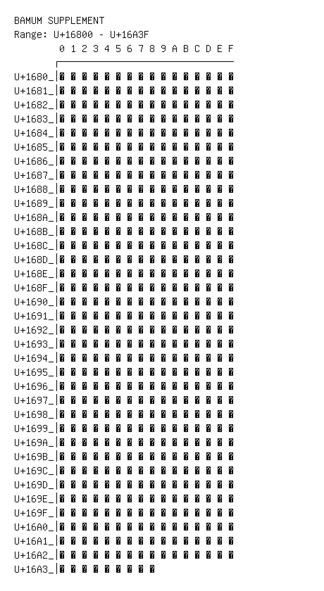

# Bamum Supplement

**Range:** `U+16800` - `U+16A3F`

[← Back to Index](../README.md)

```text
        0 1 2 3 4 5 6 7 8 9 A B C D E F
       ┌───────────────────────────────
U+1680_│𖠀 𖠁 𖠂 𖠃 𖠄 𖠅 𖠆 𖠇 𖠈 𖠉 𖠊 𖠋 𖠌 𖠍 𖠎 𖠏
U+1681_│𖠐 𖠑 𖠒 𖠓 𖠔 𖠕 𖠖 𖠗 𖠘 𖠙 𖠚 𖠛 𖠜 𖠝 𖠞 𖠟
U+1682_│𖠠 𖠡 𖠢 𖠣 𖠤 𖠥 𖠦 𖠧 𖠨 𖠩 𖠪 𖠫 𖠬 𖠭 𖠮 𖠯
U+1683_│𖠰 𖠱 𖠲 𖠳 𖠴 𖠵 𖠶 𖠷 𖠸 𖠹 𖠺 𖠻 𖠼 𖠽 𖠾 𖠿
U+1684_│𖡀 𖡁 𖡂 𖡃 𖡄 𖡅 𖡆 𖡇 𖡈 𖡉 𖡊 𖡋 𖡌 𖡍 𖡎 𖡏
U+1685_│𖡐 𖡑 𖡒 𖡓 𖡔 𖡕 𖡖 𖡗 𖡘 𖡙 𖡚 𖡛 𖡜 𖡝 𖡞 𖡟
U+1686_│𖡠 𖡡 𖡢 𖡣 𖡤 𖡥 𖡦 𖡧 𖡨 𖡩 𖡪 𖡫 𖡬 𖡭 𖡮 𖡯
U+1687_│𖡰 𖡱 𖡲 𖡳 𖡴 𖡵 𖡶 𖡷 𖡸 𖡹 𖡺 𖡻 𖡼 𖡽 𖡾 𖡿
U+1688_│𖢀 𖢁 𖢂 𖢃 𖢄 𖢅 𖢆 𖢇 𖢈 𖢉 𖢊 𖢋 𖢌 𖢍 𖢎 𖢏
U+1689_│𖢐 𖢑 𖢒 𖢓 𖢔 𖢕 𖢖 𖢗 𖢘 𖢙 𖢚 𖢛 𖢜 𖢝 𖢞 𖢟
U+168A_│𖢠 𖢡 𖢢 𖢣 𖢤 𖢥 𖢦 𖢧 𖢨 𖢩 𖢪 𖢫 𖢬 𖢭 𖢮 𖢯
U+168B_│𖢰 𖢱 𖢲 𖢳 𖢴 𖢵 𖢶 𖢷 𖢸 𖢹 𖢺 𖢻 𖢼 𖢽 𖢾 𖢿
U+168C_│𖣀 𖣁 𖣂 𖣃 𖣄 𖣅 𖣆 𖣇 𖣈 𖣉 𖣊 𖣋 𖣌 𖣍 𖣎 𖣏
U+168D_│𖣐 𖣑 𖣒 𖣓 𖣔 𖣕 𖣖 𖣗 𖣘 𖣙 𖣚 𖣛 𖣜 𖣝 𖣞 𖣟
U+168E_│𖣠 𖣡 𖣢 𖣣 𖣤 𖣥 𖣦 𖣧 𖣨 𖣩 𖣪 𖣫 𖣬 𖣭 𖣮 𖣯
U+168F_│𖣰 𖣱 𖣲 𖣳 𖣴 𖣵 𖣶 𖣷 𖣸 𖣹 𖣺 𖣻 𖣼 𖣽 𖣾 𖣿
U+1690_│𖤀 𖤁 𖤂 𖤃 𖤄 𖤅 𖤆 𖤇 𖤈 𖤉 𖤊 𖤋 𖤌 𖤍 𖤎 𖤏
U+1691_│𖤐 𖤑 𖤒 𖤓 𖤔 𖤕 𖤖 𖤗 𖤘 𖤙 𖤚 𖤛 𖤜 𖤝 𖤞 𖤟
U+1692_│𖤠 𖤡 𖤢 𖤣 𖤤 𖤥 𖤦 𖤧 𖤨 𖤩 𖤪 𖤫 𖤬 𖤭 𖤮 𖤯
U+1693_│𖤰 𖤱 𖤲 𖤳 𖤴 𖤵 𖤶 𖤷 𖤸 𖤹 𖤺 𖤻 𖤼 𖤽 𖤾 𖤿
U+1694_│𖥀 𖥁 𖥂 𖥃 𖥄 𖥅 𖥆 𖥇 𖥈 𖥉 𖥊 𖥋 𖥌 𖥍 𖥎 𖥏
U+1695_│𖥐 𖥑 𖥒 𖥓 𖥔 𖥕 𖥖 𖥗 𖥘 𖥙 𖥚 𖥛 𖥜 𖥝 𖥞 𖥟
U+1696_│𖥠 𖥡 𖥢 𖥣 𖥤 𖥥 𖥦 𖥧 𖥨 𖥩 𖥪 𖥫 𖥬 𖥭 𖥮 𖥯
U+1697_│𖥰 𖥱 𖥲 𖥳 𖥴 𖥵 𖥶 𖥷 𖥸 𖥹 𖥺 𖥻 𖥼 𖥽 𖥾 𖥿
U+1698_│𖦀 𖦁 𖦂 𖦃 𖦄 𖦅 𖦆 𖦇 𖦈 𖦉 𖦊 𖦋 𖦌 𖦍 𖦎 𖦏
U+1699_│𖦐 𖦑 𖦒 𖦓 𖦔 𖦕 𖦖 𖦗 𖦘 𖦙 𖦚 𖦛 𖦜 𖦝 𖦞 𖦟
U+169A_│𖦠 𖦡 𖦢 𖦣 𖦤 𖦥 𖦦 𖦧 𖦨 𖦩 𖦪 𖦫 𖦬 𖦭 𖦮 𖦯
U+169B_│𖦰 𖦱 𖦲 𖦳 𖦴 𖦵 𖦶 𖦷 𖦸 𖦹 𖦺 𖦻 𖦼 𖦽 𖦾 𖦿
U+169C_│𖧀 𖧁 𖧂 𖧃 𖧄 𖧅 𖧆 𖧇 𖧈 𖧉 𖧊 𖧋 𖧌 𖧍 𖧎 𖧏
U+169D_│𖧐 𖧑 𖧒 𖧓 𖧔 𖧕 𖧖 𖧗 𖧘 𖧙 𖧚 𖧛 𖧜 𖧝 𖧞 𖧟
U+169E_│𖧠 𖧡 𖧢 𖧣 𖧤 𖧥 𖧦 𖧧 𖧨 𖧩 𖧪 𖧫 𖧬 𖧭 𖧮 𖧯
U+169F_│𖧰 𖧱 𖧲 𖧳 𖧴 𖧵 𖧶 𖧷 𖧸 𖧹 𖧺 𖧻 𖧼 𖧽 𖧾 𖧿
U+16A0_│𖨀 𖨁 𖨂 𖨃 𖨄 𖨅 𖨆 𖨇 𖨈 𖨉 𖨊 𖨋 𖨌 𖨍 𖨎 𖨏
U+16A1_│𖨐 𖨑 𖨒 𖨓 𖨔 𖨕 𖨖 𖨗 𖨘 𖨙 𖨚 𖨛 𖨜 𖨝 𖨞 𖨟
U+16A2_│𖨠 𖨡 𖨢 𖨣 𖨤 𖨥 𖨦 𖨧 𖨨 𖨩 𖨪 𖨫 𖨬 𖨭 𖨮 𖨯
U+16A3_│𖨰 𖨱 𖨲 𖨳 𖨴 𖨵 𖨶 𖨷 𖨸
```

## Visual Fallback Reference
If your system lacks the required fonts to render these characters properly, use the image below as a visual guide.


