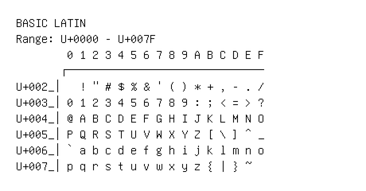

# Basic Latin

**Range:** `U+0000` - `U+007F`

[← Back to Index](../README.md)

```text
        0 1 2 3 4 5 6 7 8 9 A B C D E F
       ┌───────────────────────────────
U+002_│  ! " # $ % & ' ( ) * + , - . /
U+003_│0 1 2 3 4 5 6 7 8 9 : ; < = > ?
U+004_│@ A B C D E F G H I J K L M N O
U+005_│P Q R S T U V W X Y Z [ \ ] ^ _
U+006_│` a b c d e f g h i j k l m n o
U+007_│p q r s t u v w x y z { | } ~
```

## Visual Fallback Reference
If your system lacks the required fonts to render these characters properly, use the image below as a visual guide.


