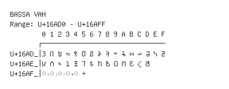

# Bassa Vah

**Range:** `U+16AD0` - `U+16AFF`

[← Back to Index](../README.md)

```text
        0 1 2 3 4 5 6 7 8 9 A B C D E F
       ┌───────────────────────────────
U+16AD_│𖫐 𖫑 𖫒 𖫓 𖫔 𖫕 𖫖 𖫗 𖫘 𖫙 𖫚 𖫛 𖫜 𖫝 𖫞 𖫟
U+16AE_│𖫠 𖫡 𖫢 𖫣 𖫤 𖫥 𖫦 𖫧 𖫨 𖫩 𖫪 𖫫 𖫬 𖫭
U+16AF_│◌𖫰 ◌𖫱 ◌𖫲 ◌𖫳 ◌𖫴 𖫵
```

## Visual Fallback Reference
If your system lacks the required fonts to render these characters properly, use the image below as a visual guide.


