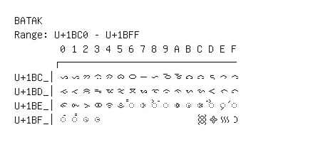

# Batak

**Range:** `U+1BC0` - `U+1BFF`

[← Back to Index](../README.md)

```text
        0 1 2 3 4 5 6 7 8 9 A B C D E F
       ┌───────────────────────────────
U+1BC_│ᯀ ᯁ ᯂ ᯃ ᯄ ᯅ ᯆ ᯇ ᯈ ᯉ ᯊ ᯋ ᯌ ᯍ ᯎ ᯏ
U+1BD_│ᯐ ᯑ ᯒ ᯓ ᯔ ᯕ ᯖ ᯗ ᯘ ᯙ ᯚ ᯛ ᯜ ᯝ ᯞ ᯟ
U+1BE_│ᯠ ᯡ ᯢ ᯣ ᯤ ᯥ ◌᯦ ◌ᯧ ◌ᯨ ◌ᯩ ◌ᯪ ◌ᯫ ◌ᯬ ◌ᯭ ◌ᯮ ◌ᯯ
U+1BF_│◌ᯰ ◌ᯱ ◌᯲ ◌᯳                 ᯼ ᯽ ᯾ ᯿
```

## Visual Fallback Reference
If your system lacks the required fonts to render these characters properly, use the image below as a visual guide.


