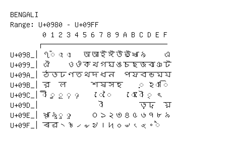

# Bengali

**Range:** `U+0980` - `U+09FF`

[← Back to Index](../README.md)

```text
        0 1 2 3 4 5 6 7 8 9 A B C D E F
       ┌───────────────────────────────
U+098_│ঀ ◌ঁ ◌ং ◌ঃ   অ আ ই ঈ উ ঊ ঋ ঌ     এ
U+099_│ঐ     ও ঔ ক খ গ ঘ ঙ চ ছ জ ঝ ঞ ট
U+09A_│ঠ ড ঢ ণ ত থ দ ধ ন   প ফ ব ভ ম য
U+09B_│র   ল       শ ষ স হ     ◌় ঽ ◌া ◌ি
U+09C_│◌ী ◌ু ◌ূ ◌ৃ ◌ৄ     ◌ে ◌ৈ     ◌ো ◌ৌ ◌্ ৎ
U+09D_│              ◌ৗ         ড় ঢ়   য়
U+09E_│ৠ ৡ ◌ৢ ◌ৣ     ০ ১ ২ ৩ ৪ ৫ ৬ ৭ ৮ ৯
U+09F_│ৰ ৱ ৲ ৳ ৴ ৵ ৶ ৷ ৸ ৹ ৺ ৻ ৼ ৽ ◌৾
```

## Visual Fallback Reference
If your system lacks the required fonts to render these characters properly, use the image below as a visual guide.


