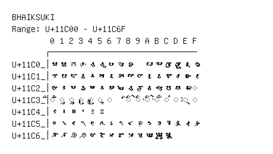

# Bhaiksuki

**Range:** `U+11C00` - `U+11C6F`

[← Back to Index](../README.md)

```text
        0 1 2 3 4 5 6 7 8 9 A B C D E F
       ┌───────────────────────────────
U+11C0_│𑰀 𑰁 𑰂 𑰃 𑰄 𑰅 𑰆 𑰇 𑰈   𑰊 𑰋 𑰌 𑰍 𑰎 𑰏
U+11C1_│𑰐 𑰑 𑰒 𑰓 𑰔 𑰕 𑰖 𑰗 𑰘 𑰙 𑰚 𑰛 𑰜 𑰝 𑰞 𑰟
U+11C2_│𑰠 𑰡 𑰢 𑰣 𑰤 𑰥 𑰦 𑰧 𑰨 𑰩 𑰪 𑰫 𑰬 𑰭 𑰮 ◌𑰯
U+11C3_│◌𑰰 ◌𑰱 ◌𑰲 ◌𑰳 ◌𑰴 ◌𑰵 ◌𑰶   ◌𑰸 ◌𑰹 ◌𑰺 ◌𑰻 ◌𑰼 ◌𑰽 ◌𑰾 ◌𑰿
U+11C4_│𑱀 𑱁 𑱂 𑱃 𑱄 𑱅
U+11C5_│𑱐 𑱑 𑱒 𑱓 𑱔 𑱕 𑱖 𑱗 𑱘 𑱙 𑱚 𑱛 𑱜 𑱝 𑱞 𑱟
U+11C6_│𑱠 𑱡 𑱢 𑱣 𑱤 𑱥 𑱦 𑱧 𑱨 𑱩 𑱪 𑱫 𑱬
```

## Visual Fallback Reference
If your system lacks the required fonts to render these characters properly, use the image below as a visual guide.


