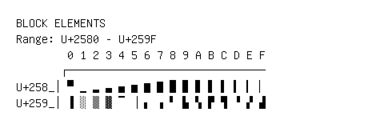

# Block Elements

**Range:** `U+2580` - `U+259F`

[← Back to Index](../README.md)

```text
        0 1 2 3 4 5 6 7 8 9 A B C D E F
       ┌───────────────────────────────
U+258_│▀ ▁ ▂ ▃ ▄ ▅ ▆ ▇ █ ▉ ▊ ▋ ▌ ▍ ▎ ▏
U+259_│▐ ░ ▒ ▓ ▔ ▕ ▖ ▗ ▘ ▙ ▚ ▛ ▜ ▝ ▞ ▟
```

## Visual Fallback Reference
If your system lacks the required fonts to render these characters properly, use the image below as a visual guide.


