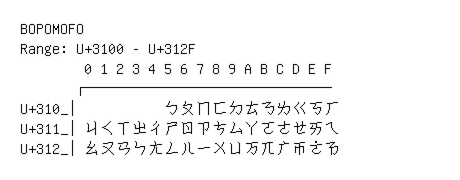

# Bopomofo

**Range:** `U+3100` - `U+312F`

[← Back to Index](../README.md)

```text
        0 1 2 3 4 5 6 7 8 9 A B C D E F
       ┌───────────────────────────────
U+310_│          ㄅㄆㄇㄈㄉㄊㄋㄌㄍㄎㄏ
U+311_│ㄐㄑㄒㄓㄔㄕㄖㄗㄘㄙㄚㄛㄜㄝㄞㄟ
U+312_│ㄠㄡㄢㄣㄤㄥㄦㄧㄨㄩㄪㄫㄬㄭㄮㄯ
```

## Visual Fallback Reference
If your system lacks the required fonts to render these characters properly, use the image below as a visual guide.


