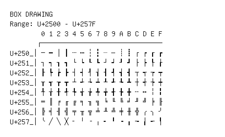

# Box Drawing

**Range:** `U+2500` - `U+257F`

[← Back to Index](../README.md)

```text
        0 1 2 3 4 5 6 7 8 9 A B C D E F
       ┌───────────────────────────────
U+250_│─ ━ │ ┃ ┄ ┅ ┆ ┇ ┈ ┉ ┊ ┋ ┌ ┍ ┎ ┏
U+251_│┐ ┑ ┒ ┓ └ ┕ ┖ ┗ ┘ ┙ ┚ ┛ ├ ┝ ┞ ┟
U+252_│┠ ┡ ┢ ┣ ┤ ┥ ┦ ┧ ┨ ┩ ┪ ┫ ┬ ┭ ┮ ┯
U+253_│┰ ┱ ┲ ┳ ┴ ┵ ┶ ┷ ┸ ┹ ┺ ┻ ┼ ┽ ┾ ┿
U+254_│╀ ╁ ╂ ╃ ╄ ╅ ╆ ╇ ╈ ╉ ╊ ╋ ╌ ╍ ╎ ╏
U+255_│═ ║ ╒ ╓ ╔ ╕ ╖ ╗ ╘ ╙ ╚ ╛ ╜ ╝ ╞ ╟
U+256_│╠ ╡ ╢ ╣ ╤ ╥ ╦ ╧ ╨ ╩ ╪ ╫ ╬ ╭ ╮ ╯
U+257_│╰ ╱ ╲ ╳ ╴ ╵ ╶ ╷ ╸ ╹ ╺ ╻ ╼ ╽ ╾ ╿
```

## Visual Fallback Reference
If your system lacks the required fonts to render these characters properly, use the image below as a visual guide.


