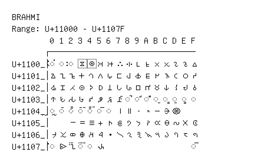

# Brahmi

**Range:** `U+11000` - `U+1107F`

[← Back to Index](../README.md)

```text
        0 1 2 3 4 5 6 7 8 9 A B C D E F
       ┌───────────────────────────────
U+1100_│◌𑀀 ◌𑀁 ◌𑀂 𑀃 𑀄 𑀅 𑀆 𑀇 𑀈 𑀉 𑀊 𑀋 𑀌 𑀍 𑀎 𑀏
U+1101_│𑀐 𑀑 𑀒 𑀓 𑀔 𑀕 𑀖 𑀗 𑀘 𑀙 𑀚 𑀛 𑀜 𑀝 𑀞 𑀟
U+1102_│𑀠 𑀡 𑀢 𑀣 𑀤 𑀥 𑀦 𑀧 𑀨 𑀩 𑀪 𑀫 𑀬 𑀭 𑀮 𑀯
U+1103_│𑀰 𑀱 𑀲 𑀳 𑀴 𑀵 𑀶 𑀷 ◌𑀸 ◌𑀹 ◌𑀺 ◌𑀻 ◌𑀼 ◌𑀽 ◌𑀾 ◌𑀿
U+1104_│◌𑁀 ◌𑁁 ◌𑁂 ◌𑁃 ◌𑁄 ◌𑁅 ◌𑁆 𑁇 𑁈 𑁉 𑁊 𑁋 𑁌 𑁍
U+1105_│    𑁒 𑁓 𑁔 𑁕 𑁖 𑁗 𑁘 𑁙 𑁚 𑁛 𑁜 𑁝 𑁞 𑁟
U+1106_│𑁠 𑁡 𑁢 𑁣 𑁤 𑁥 𑁦 𑁧 𑁨 𑁩 𑁪 𑁫 𑁬 𑁭 𑁮 𑁯
U+1107_│◌𑁰 𑁱 𑁲 ◌𑁳 ◌𑁴 𑁵                   ◌𑁿
```

## Visual Fallback Reference
If your system lacks the required fonts to render these characters properly, use the image below as a visual guide.


