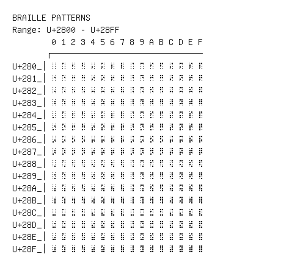

# Braille Patterns

**Range:** `U+2800` - `U+28FF`

[← Back to Index](../README.md)

```text
        0 1 2 3 4 5 6 7 8 9 A B C D E F
       ┌───────────────────────────────
U+280_│⠀ ⠁ ⠂ ⠃ ⠄ ⠅ ⠆ ⠇ ⠈ ⠉ ⠊ ⠋ ⠌ ⠍ ⠎ ⠏
U+281_│⠐ ⠑ ⠒ ⠓ ⠔ ⠕ ⠖ ⠗ ⠘ ⠙ ⠚ ⠛ ⠜ ⠝ ⠞ ⠟
U+282_│⠠ ⠡ ⠢ ⠣ ⠤ ⠥ ⠦ ⠧ ⠨ ⠩ ⠪ ⠫ ⠬ ⠭ ⠮ ⠯
U+283_│⠰ ⠱ ⠲ ⠳ ⠴ ⠵ ⠶ ⠷ ⠸ ⠹ ⠺ ⠻ ⠼ ⠽ ⠾ ⠿
U+284_│⡀ ⡁ ⡂ ⡃ ⡄ ⡅ ⡆ ⡇ ⡈ ⡉ ⡊ ⡋ ⡌ ⡍ ⡎ ⡏
U+285_│⡐ ⡑ ⡒ ⡓ ⡔ ⡕ ⡖ ⡗ ⡘ ⡙ ⡚ ⡛ ⡜ ⡝ ⡞ ⡟
U+286_│⡠ ⡡ ⡢ ⡣ ⡤ ⡥ ⡦ ⡧ ⡨ ⡩ ⡪ ⡫ ⡬ ⡭ ⡮ ⡯
U+287_│⡰ ⡱ ⡲ ⡳ ⡴ ⡵ ⡶ ⡷ ⡸ ⡹ ⡺ ⡻ ⡼ ⡽ ⡾ ⡿
U+288_│⢀ ⢁ ⢂ ⢃ ⢄ ⢅ ⢆ ⢇ ⢈ ⢉ ⢊ ⢋ ⢌ ⢍ ⢎ ⢏
U+289_│⢐ ⢑ ⢒ ⢓ ⢔ ⢕ ⢖ ⢗ ⢘ ⢙ ⢚ ⢛ ⢜ ⢝ ⢞ ⢟
U+28A_│⢠ ⢡ ⢢ ⢣ ⢤ ⢥ ⢦ ⢧ ⢨ ⢩ ⢪ ⢫ ⢬ ⢭ ⢮ ⢯
U+28B_│⢰ ⢱ ⢲ ⢳ ⢴ ⢵ ⢶ ⢷ ⢸ ⢹ ⢺ ⢻ ⢼ ⢽ ⢾ ⢿
U+28C_│⣀ ⣁ ⣂ ⣃ ⣄ ⣅ ⣆ ⣇ ⣈ ⣉ ⣊ ⣋ ⣌ ⣍ ⣎ ⣏
U+28D_│⣐ ⣑ ⣒ ⣓ ⣔ ⣕ ⣖ ⣗ ⣘ ⣙ ⣚ ⣛ ⣜ ⣝ ⣞ ⣟
U+28E_│⣠ ⣡ ⣢ ⣣ ⣤ ⣥ ⣦ ⣧ ⣨ ⣩ ⣪ ⣫ ⣬ ⣭ ⣮ ⣯
U+28F_│⣰ ⣱ ⣲ ⣳ ⣴ ⣵ ⣶ ⣷ ⣸ ⣹ ⣺ ⣻ ⣼ ⣽ ⣾ ⣿
```

## Visual Fallback Reference
If your system lacks the required fonts to render these characters properly, use the image below as a visual guide.


