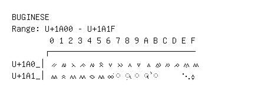

# Buginese

**Range:** `U+1A00` - `U+1A1F`

[← Back to Index](../README.md)

```text
        0 1 2 3 4 5 6 7 8 9 A B C D E F
       ┌───────────────────────────────
U+1A0_│ᨀ ᨁ ᨂ ᨃ ᨄ ᨅ ᨆ ᨇ ᨈ ᨉ ᨊ ᨋ ᨌ ᨍ ᨎ ᨏ
U+1A1_│ᨐ ᨑ ᨒ ᨓ ᨔ ᨕ ᨖ ◌ᨗ ◌ᨘ ◌ᨙ ◌ᨚ ◌ᨛ     ᨞ ᨟
```

## Visual Fallback Reference
If your system lacks the required fonts to render these characters properly, use the image below as a visual guide.


