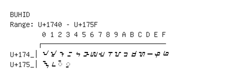

# Buhid

**Range:** `U+1740` - `U+175F`

[← Back to Index](../README.md)

```text
        0 1 2 3 4 5 6 7 8 9 A B C D E F
       ┌───────────────────────────────
U+174_│ᝀ ᝁ ᝂ ᝃ ᝄ ᝅ ᝆ ᝇ ᝈ ᝉ ᝊ ᝋ ᝌ ᝍ ᝎ ᝏ
U+175_│ᝐ ᝑ ◌ᝒ ◌ᝓ
```

## Visual Fallback Reference
If your system lacks the required fonts to render these characters properly, use the image below as a visual guide.


