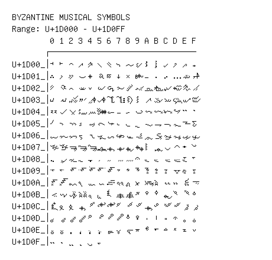

# Byzantine Musical Symbols

**Range:** `U+1D000` - `U+1D0FF`

[← Back to Index](../README.md)

```text
        0 1 2 3 4 5 6 7 8 9 A B C D E F
       ┌───────────────────────────────
U+1D00_│𝀀 𝀁 𝀂 𝀃 𝀄 𝀅 𝀆 𝀇 𝀈 𝀉 𝀊 𝀋 𝀌 𝀍 𝀎 𝀏
U+1D01_│𝀐 𝀑 𝀒 𝀓 𝀔 𝀕 𝀖 𝀗 𝀘 𝀙 𝀚 𝀛 𝀜 𝀝 𝀞 𝀟
U+1D02_│𝀠 𝀡 𝀢 𝀣 𝀤 𝀥 𝀦 𝀧 𝀨 𝀩 𝀪 𝀫 𝀬 𝀭 𝀮 𝀯
U+1D03_│𝀰 𝀱 𝀲 𝀳 𝀴 𝀵 𝀶 𝀷 𝀸 𝀹 𝀺 𝀻 𝀼 𝀽 𝀾 𝀿
U+1D04_│𝁀 𝁁 𝁂 𝁃 𝁄 𝁅 𝁆 𝁇 𝁈 𝁉 𝁊 𝁋 𝁌 𝁍 𝁎 𝁏
U+1D05_│𝁐 𝁑 𝁒 𝁓 𝁔 𝁕 𝁖 𝁗 𝁘 𝁙 𝁚 𝁛 𝁜 𝁝 𝁞 𝁟
U+1D06_│𝁠 𝁡 𝁢 𝁣 𝁤 𝁥 𝁦 𝁧 𝁨 𝁩 𝁪 𝁫 𝁬 𝁭 𝁮 𝁯
U+1D07_│𝁰 𝁱 𝁲 𝁳 𝁴 𝁵 𝁶 𝁷 𝁸 𝁹 𝁺 𝁻 𝁼 𝁽 𝁾 𝁿
U+1D08_│𝂀 𝂁 𝂂 𝂃 𝂄 𝂅 𝂆 𝂇 𝂈 𝂉 𝂊 𝂋 𝂌 𝂍 𝂎 𝂏
U+1D09_│𝂐 𝂑 𝂒 𝂓 𝂔 𝂕 𝂖 𝂗 𝂘 𝂙 𝂚 𝂛 𝂜 𝂝 𝂞 𝂟
U+1D0A_│𝂠 𝂡 𝂢 𝂣 𝂤 𝂥 𝂦 𝂧 𝂨 𝂩 𝂪 𝂫 𝂬 𝂭 𝂮 𝂯
U+1D0B_│𝂰 𝂱 𝂲 𝂳 𝂴 𝂵 𝂶 𝂷 𝂸 𝂹 𝂺 𝂻 𝂼 𝂽 𝂾 𝂿
U+1D0C_│𝃀 𝃁 𝃂 𝃃 𝃄 𝃅 𝃆 𝃇 𝃈 𝃉 𝃊 𝃋 𝃌 𝃍 𝃎 𝃏
U+1D0D_│𝃐 𝃑 𝃒 𝃓 𝃔 𝃕 𝃖 𝃗 𝃘 𝃙 𝃚 𝃛 𝃜 𝃝 𝃞 𝃟
U+1D0E_│𝃠 𝃡 𝃢 𝃣 𝃤 𝃥 𝃦 𝃧 𝃨 𝃩 𝃪 𝃫 𝃬 𝃭 𝃮 𝃯
U+1D0F_│𝃰 𝃱 𝃲 𝃳 𝃴 𝃵
```

## Visual Fallback Reference
If your system lacks the required fonts to render these characters properly, use the image below as a visual guide.


