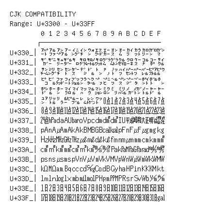

# CJK Compatibility

**Range:** `U+3300` - `U+33FF`

[← Back to Index](../README.md)

```text
        0 1 2 3 4 5 6 7 8 9 A B C D E F
       ┌───────────────────────────────
U+330_│㌀㌁㌂㌃㌄㌅㌆㌇㌈㌉㌊㌋㌌㌍㌎㌏
U+331_│㌐㌑㌒㌓㌔㌕㌖㌗㌘㌙㌚㌛㌜㌝㌞㌟
U+332_│㌠㌡㌢㌣㌤㌥㌦㌧㌨㌩㌪㌫㌬㌭㌮㌯
U+333_│㌰㌱㌲㌳㌴㌵㌶㌷㌸㌹㌺㌻㌼㌽㌾㌿
U+334_│㍀㍁㍂㍃㍄㍅㍆㍇㍈㍉㍊㍋㍌㍍㍎㍏
U+335_│㍐㍑㍒㍓㍔㍕㍖㍗㍘㍙㍚㍛㍜㍝㍞㍟
U+336_│㍠㍡㍢㍣㍤㍥㍦㍧㍨㍩㍪㍫㍬㍭㍮㍯
U+337_│㍰㍱㍲㍳㍴㍵㍶㍷㍸㍹㍺㍻㍼㍽㍾㍿
U+338_│㎀㎁㎂㎃㎄㎅㎆㎇㎈㎉㎊㎋㎌㎍㎎㎏
U+339_│㎐㎑㎒㎓㎔㎕㎖㎗㎘㎙㎚㎛㎜㎝㎞㎟
U+33A_│㎠㎡㎢㎣㎤㎥㎦㎧㎨㎩㎪㎫㎬㎭㎮㎯
U+33B_│㎰㎱㎲㎳㎴㎵㎶㎷㎸㎹㎺㎻㎼㎽㎾㎿
U+33C_│㏀㏁㏂㏃㏄㏅㏆㏇㏈㏉㏊㏋㏌㏍㏎㏏
U+33D_│㏐㏑㏒㏓㏔㏕㏖㏗㏘㏙㏚㏛㏜㏝㏞㏟
U+33E_│㏠㏡㏢㏣㏤㏥㏦㏧㏨㏩㏪㏫㏬㏭㏮㏯
U+33F_│㏰㏱㏲㏳㏴㏵㏶㏷㏸㏹㏺㏻㏼㏽㏾㏿
```

## Visual Fallback Reference
If your system lacks the required fonts to render these characters properly, use the image below as a visual guide.


