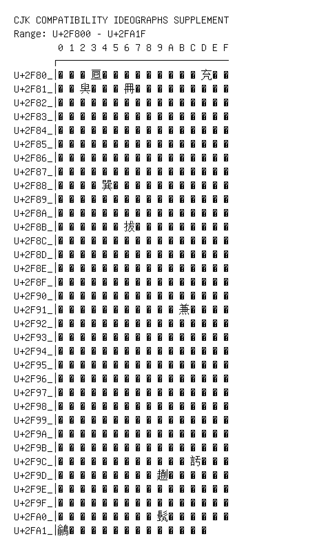

# CJK Compatibility Ideographs Supplement

**Range:** `U+2F800` - `U+2FA1F`

[← Back to Index](../README.md)

```text
        0 1 2 3 4 5 6 7 8 9 A B C D E F
       ┌───────────────────────────────
U+2F80_│丽丸乁𠄢你侮侻倂偺備僧像㒞𠘺免兔
U+2F81_│兤具𠔜㒹內再𠕋冗冤仌冬况𩇟凵刃㓟
U+2F82_│刻剆割剷㔕勇勉勤勺包匆北卉卑博即
U+2F83_│卽卿卿卿𠨬灰及叟𠭣叫叱吆咞吸呈周
U+2F84_│咢哶唐啓啣善善喙喫喳嗂圖嘆圗噑噴
U+2F85_│切壮城埴堍型堲報墬𡓤売壷夆多夢奢
U+2F86_│𡚨𡛪姬娛娧姘婦㛮㛼嬈嬾嬾𡧈寃寘寧
U+2F87_│寳𡬘寿将当尢㞁屠屮峀岍𡷤嵃𡷦嵮嵫
U+2F88_│嵼巡巢㠯巽帨帽幩㡢𢆃㡼庰庳庶廊𪎒
U+2F89_│廾𢌱𢌱舁弢弢㣇𣊸𦇚形彫㣣徚忍志忹
U+2F8A_│悁㤺㤜悔𢛔惇慈慌慎慌慺憎憲憤憯懞
U+2F8B_│懲懶成戛扝抱拔捐𢬌挽拼捨掃揤𢯱搢
U+2F8C_│揅掩㨮摩摾撝摷㩬敏敬𣀊旣書晉㬙暑
U+2F8D_│㬈㫤冒冕最暜肭䏙朗望朡杞杓𣏃㭉柺
U+2F8E_│枅桒梅𣑭梎栟椔㮝楂榣槪檨𣚣櫛㰘次
U+2F8F_│𣢧歔㱎歲殟殺殻𣪍𡴋𣫺汎𣲼沿泍汧洖
U+2F90_│派海流浩浸涅𣴞洴港湮㴳滋滇𣻑淹潮
U+2F91_│𣽞𣾎濆瀹瀞瀛㶖灊災灷炭𠔥煅𤉣熜𤎫
U+2F92_│爨爵牐𤘈犀犕𤜵𤠔獺王㺬玥㺸㺸瑇瑜
U+2F93_│瑱璅瓊㼛甤𤰶甾𤲒異𢆟瘐𤾡𤾸𥁄㿼䀈
U+2F94_│直𥃳𥃲𥄙𥄳眞真真睊䀹瞋䁆䂖𥐝硎碌
U+2F95_│磌䃣𥘦祖𥚚𥛅福秫䄯穀穊穏𥥼𥪧𥪧竮
U+2F96_│䈂𥮫篆築䈧𥲀糒䊠糨糣紀𥾆絣䌁緇縂
U+2F97_│繅䌴𦈨𦉇䍙𦋙罺𦌾羕翺者𦓚𦔣聠𦖨聰
U+2F98_│𣍟䏕育脃䐋脾媵𦞧𦞵𣎓𣎜舁舄辞䑫芑
U+2F99_│芋芝劳花芳芽苦𦬼若茝荣莭茣莽菧著
U+2F9A_│荓菊菌菜𦰶𦵫𦳕䔫蓱蓳蔖𧏊蕤𦼬䕝䕡
U+2F9B_│𦾱𧃒䕫虐虜虧虩蚩蚈蜎蛢蝹蜨蝫螆䗗
U+2F9C_│蟡蠁䗹衠衣𧙧裗裞䘵裺㒻𧢮𧥦䚾䛇誠
U+2F9D_│諭變豕𧲨貫賁贛起𧼯𠠄跋趼跰𠣞軔輸
U+2F9E_│𨗒𨗭邔郱鄑𨜮鄛鈸鋗鋘鉼鏹鐕𨯺開䦕
U+2F9F_│閷𨵷䧦雃嶲霣𩅅𩈚䩮䩶韠𩐊䪲𩒖頋頋
U+2FA0_│頩𩖶飢䬳餩馧駂駾䯎𩬰鬒鱀鳽䳎䳭鵧
U+2FA1_│𪃎䳸𪄅𪈎𪊑麻䵖黹黾鼅鼏鼖鼻𪘀
```

## Visual Fallback Reference
If your system lacks the required fonts to render these characters properly, use the image below as a visual guide.


