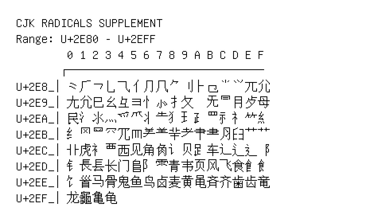

# CJK Radicals Supplement

**Range:** `U+2E80` - `U+2EFF`

[← Back to Index](../README.md)

```text
        0 1 2 3 4 5 6 7 8 9 A B C D E F
       ┌───────────────────────────────
U+2E8_│⺀⺁⺂⺃⺄⺅⺆⺇⺈⺉⺊⺋⺌⺍⺎⺏
U+2E9_│⺐⺑⺒⺓⺔⺕⺖⺗⺘⺙  ⺛⺜⺝⺞⺟
U+2EA_│⺠⺡⺢⺣⺤⺥⺦⺧⺨⺩⺪⺫⺬⺭⺮⺯
U+2EB_│⺰⺱⺲⺳⺴⺵⺶⺷⺸⺹⺺⺻⺼⺽⺾⺿
U+2EC_│⻀⻁⻂⻃⻄⻅⻆⻇⻈⻉⻊⻋⻌⻍⻎⻏
U+2ED_│⻐⻑⻒⻓⻔⻕⻖⻗⻘⻙⻚⻛⻜⻝⻞⻟
U+2EE_│⻠⻡⻢⻣⻤⻥⻦⻧⻨⻩⻪⻫⻬⻭⻮⻯
U+2EF_│⻰⻱⻲⻳
```

## Visual Fallback Reference
If your system lacks the required fonts to render these characters properly, use the image below as a visual guide.


