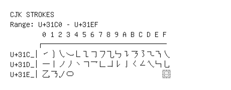

# CJK Strokes

**Range:** `U+31C0` - `U+31EF`

[← Back to Index](../README.md)

```text
        0 1 2 3 4 5 6 7 8 9 A B C D E F
       ┌───────────────────────────────
U+31C_│㇀㇁㇂㇃㇄㇅㇆㇇㇈㇉㇊㇋㇌㇍㇎㇏
U+31D_│㇐㇑㇒㇓㇔㇕㇖㇗㇘㇙㇚㇛㇜㇝㇞㇟
U+31E_│㇠㇡㇢㇣                      ㇯
```

## Visual Fallback Reference
If your system lacks the required fonts to render these characters properly, use the image below as a visual guide.


