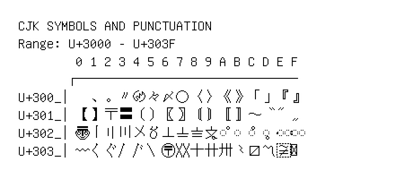

# CJK Symbols and Punctuation

**Range:** `U+3000` - `U+303F`

[← Back to Index](../README.md)

```text
        0 1 2 3 4 5 6 7 8 9 A B C D E F
       ┌───────────────────────────────
U+300_│　、。〃〄々〆〇〈〉《》「」『』
U+301_│【】〒〓〔〕〖〗〘〙〚〛〜〝〞〟
U+302_│〠〡〢〣〤〥〦〧〨〩◌〪 ◌〫 ◌〬 ◌〭 ◌〮 ◌〯
U+303_│〰〱〲〳〴〵〶〷〸〹〺〻〼〽〾〿
```

## Visual Fallback Reference
If your system lacks the required fonts to render these characters properly, use the image below as a visual guide.


