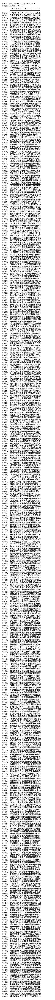

# CJK Unified Ideographs Extension A

**Range:** `U+3400` - `U+4DBF`

[← Back to Index](../README.md)

```text
        0 1 2 3 4 5 6 7 8 9 A B C D E F
       ┌───────────────────────────────
U+340_│㐀㐁㐂㐃㐄㐅㐆㐇㐈㐉㐊㐋㐌㐍㐎㐏
U+341_│㐐㐑㐒㐓㐔㐕㐖㐗㐘㐙㐚㐛㐜㐝㐞㐟
U+342_│㐠㐡㐢㐣㐤㐥㐦㐧㐨㐩㐪㐫㐬㐭㐮㐯
U+343_│㐰㐱㐲㐳㐴㐵㐶㐷㐸㐹㐺㐻㐼㐽㐾㐿
U+344_│㑀㑁㑂㑃㑄㑅㑆㑇㑈㑉㑊㑋㑌㑍㑎㑏
U+345_│㑐㑑㑒㑓㑔㑕㑖㑗㑘㑙㑚㑛㑜㑝㑞㑟
U+346_│㑠㑡㑢㑣㑤㑥㑦㑧㑨㑩㑪㑫㑬㑭㑮㑯
U+347_│㑰㑱㑲㑳㑴㑵㑶㑷㑸㑹㑺㑻㑼㑽㑾㑿
U+348_│㒀㒁㒂㒃㒄㒅㒆㒇㒈㒉㒊㒋㒌㒍㒎㒏
U+349_│㒐㒑㒒㒓㒔㒕㒖㒗㒘㒙㒚㒛㒜㒝㒞㒟
U+34A_│㒠㒡㒢㒣㒤㒥㒦㒧㒨㒩㒪㒫㒬㒭㒮㒯
U+34B_│㒰㒱㒲㒳㒴㒵㒶㒷㒸㒹㒺㒻㒼㒽㒾㒿
U+34C_│㓀㓁㓂㓃㓄㓅㓆㓇㓈㓉㓊㓋㓌㓍㓎㓏
U+34D_│㓐㓑㓒㓓㓔㓕㓖㓗㓘㓙㓚㓛㓜㓝㓞㓟
U+34E_│㓠㓡㓢㓣㓤㓥㓦㓧㓨㓩㓪㓫㓬㓭㓮㓯
U+34F_│㓰㓱㓲㓳㓴㓵㓶㓷㓸㓹㓺㓻㓼㓽㓾㓿
U+350_│㔀㔁㔂㔃㔄㔅㔆㔇㔈㔉㔊㔋㔌㔍㔎㔏
U+351_│㔐㔑㔒㔓㔔㔕㔖㔗㔘㔙㔚㔛㔜㔝㔞㔟
U+352_│㔠㔡㔢㔣㔤㔥㔦㔧㔨㔩㔪㔫㔬㔭㔮㔯
U+353_│㔰㔱㔲㔳㔴㔵㔶㔷㔸㔹㔺㔻㔼㔽㔾㔿
U+354_│㕀㕁㕂㕃㕄㕅㕆㕇㕈㕉㕊㕋㕌㕍㕎㕏
U+355_│㕐㕑㕒㕓㕔㕕㕖㕗㕘㕙㕚㕛㕜㕝㕞㕟
U+356_│㕠㕡㕢㕣㕤㕥㕦㕧㕨㕩㕪㕫㕬㕭㕮㕯
U+357_│㕰㕱㕲㕳㕴㕵㕶㕷㕸㕹㕺㕻㕼㕽㕾㕿
U+358_│㖀㖁㖂㖃㖄㖅㖆㖇㖈㖉㖊㖋㖌㖍㖎㖏
U+359_│㖐㖑㖒㖓㖔㖕㖖㖗㖘㖙㖚㖛㖜㖝㖞㖟
U+35A_│㖠㖡㖢㖣㖤㖥㖦㖧㖨㖩㖪㖫㖬㖭㖮㖯
U+35B_│㖰㖱㖲㖳㖴㖵㖶㖷㖸㖹㖺㖻㖼㖽㖾㖿
U+35C_│㗀㗁㗂㗃㗄㗅㗆㗇㗈㗉㗊㗋㗌㗍㗎㗏
U+35D_│㗐㗑㗒㗓㗔㗕㗖㗗㗘㗙㗚㗛㗜㗝㗞㗟
U+35E_│㗠㗡㗢㗣㗤㗥㗦㗧㗨㗩㗪㗫㗬㗭㗮㗯
U+35F_│㗰㗱㗲㗳㗴㗵㗶㗷㗸㗹㗺㗻㗼㗽㗾㗿
U+360_│㘀㘁㘂㘃㘄㘅㘆㘇㘈㘉㘊㘋㘌㘍㘎㘏
U+361_│㘐㘑㘒㘓㘔㘕㘖㘗㘘㘙㘚㘛㘜㘝㘞㘟
U+362_│㘠㘡㘢㘣㘤㘥㘦㘧㘨㘩㘪㘫㘬㘭㘮㘯
U+363_│㘰㘱㘲㘳㘴㘵㘶㘷㘸㘹㘺㘻㘼㘽㘾㘿
U+364_│㙀㙁㙂㙃㙄㙅㙆㙇㙈㙉㙊㙋㙌㙍㙎㙏
U+365_│㙐㙑㙒㙓㙔㙕㙖㙗㙘㙙㙚㙛㙜㙝㙞㙟
U+366_│㙠㙡㙢㙣㙤㙥㙦㙧㙨㙩㙪㙫㙬㙭㙮㙯
U+367_│㙰㙱㙲㙳㙴㙵㙶㙷㙸㙹㙺㙻㙼㙽㙾㙿
U+368_│㚀㚁㚂㚃㚄㚅㚆㚇㚈㚉㚊㚋㚌㚍㚎㚏
U+369_│㚐㚑㚒㚓㚔㚕㚖㚗㚘㚙㚚㚛㚜㚝㚞㚟
U+36A_│㚠㚡㚢㚣㚤㚥㚦㚧㚨㚩㚪㚫㚬㚭㚮㚯
U+36B_│㚰㚱㚲㚳㚴㚵㚶㚷㚸㚹㚺㚻㚼㚽㚾㚿
U+36C_│㛀㛁㛂㛃㛄㛅㛆㛇㛈㛉㛊㛋㛌㛍㛎㛏
U+36D_│㛐㛑㛒㛓㛔㛕㛖㛗㛘㛙㛚㛛㛜㛝㛞㛟
U+36E_│㛠㛡㛢㛣㛤㛥㛦㛧㛨㛩㛪㛫㛬㛭㛮㛯
U+36F_│㛰㛱㛲㛳㛴㛵㛶㛷㛸㛹㛺㛻㛼㛽㛾㛿
U+370_│㜀㜁㜂㜃㜄㜅㜆㜇㜈㜉㜊㜋㜌㜍㜎㜏
U+371_│㜐㜑㜒㜓㜔㜕㜖㜗㜘㜙㜚㜛㜜㜝㜞㜟
U+372_│㜠㜡㜢㜣㜤㜥㜦㜧㜨㜩㜪㜫㜬㜭㜮㜯
U+373_│㜰㜱㜲㜳㜴㜵㜶㜷㜸㜹㜺㜻㜼㜽㜾㜿
U+374_│㝀㝁㝂㝃㝄㝅㝆㝇㝈㝉㝊㝋㝌㝍㝎㝏
U+375_│㝐㝑㝒㝓㝔㝕㝖㝗㝘㝙㝚㝛㝜㝝㝞㝟
U+376_│㝠㝡㝢㝣㝤㝥㝦㝧㝨㝩㝪㝫㝬㝭㝮㝯
U+377_│㝰㝱㝲㝳㝴㝵㝶㝷㝸㝹㝺㝻㝼㝽㝾㝿
U+378_│㞀㞁㞂㞃㞄㞅㞆㞇㞈㞉㞊㞋㞌㞍㞎㞏
U+379_│㞐㞑㞒㞓㞔㞕㞖㞗㞘㞙㞚㞛㞜㞝㞞㞟
U+37A_│㞠㞡㞢㞣㞤㞥㞦㞧㞨㞩㞪㞫㞬㞭㞮㞯
U+37B_│㞰㞱㞲㞳㞴㞵㞶㞷㞸㞹㞺㞻㞼㞽㞾㞿
U+37C_│㟀㟁㟂㟃㟄㟅㟆㟇㟈㟉㟊㟋㟌㟍㟎㟏
U+37D_│㟐㟑㟒㟓㟔㟕㟖㟗㟘㟙㟚㟛㟜㟝㟞㟟
U+37E_│㟠㟡㟢㟣㟤㟥㟦㟧㟨㟩㟪㟫㟬㟭㟮㟯
U+37F_│㟰㟱㟲㟳㟴㟵㟶㟷㟸㟹㟺㟻㟼㟽㟾㟿
U+380_│㠀㠁㠂㠃㠄㠅㠆㠇㠈㠉㠊㠋㠌㠍㠎㠏
U+381_│㠐㠑㠒㠓㠔㠕㠖㠗㠘㠙㠚㠛㠜㠝㠞㠟
U+382_│㠠㠡㠢㠣㠤㠥㠦㠧㠨㠩㠪㠫㠬㠭㠮㠯
U+383_│㠰㠱㠲㠳㠴㠵㠶㠷㠸㠹㠺㠻㠼㠽㠾㠿
U+384_│㡀㡁㡂㡃㡄㡅㡆㡇㡈㡉㡊㡋㡌㡍㡎㡏
U+385_│㡐㡑㡒㡓㡔㡕㡖㡗㡘㡙㡚㡛㡜㡝㡞㡟
U+386_│㡠㡡㡢㡣㡤㡥㡦㡧㡨㡩㡪㡫㡬㡭㡮㡯
U+387_│㡰㡱㡲㡳㡴㡵㡶㡷㡸㡹㡺㡻㡼㡽㡾㡿
U+388_│㢀㢁㢂㢃㢄㢅㢆㢇㢈㢉㢊㢋㢌㢍㢎㢏
U+389_│㢐㢑㢒㢓㢔㢕㢖㢗㢘㢙㢚㢛㢜㢝㢞㢟
U+38A_│㢠㢡㢢㢣㢤㢥㢦㢧㢨㢩㢪㢫㢬㢭㢮㢯
U+38B_│㢰㢱㢲㢳㢴㢵㢶㢷㢸㢹㢺㢻㢼㢽㢾㢿
U+38C_│㣀㣁㣂㣃㣄㣅㣆㣇㣈㣉㣊㣋㣌㣍㣎㣏
U+38D_│㣐㣑㣒㣓㣔㣕㣖㣗㣘㣙㣚㣛㣜㣝㣞㣟
U+38E_│㣠㣡㣢㣣㣤㣥㣦㣧㣨㣩㣪㣫㣬㣭㣮㣯
U+38F_│㣰㣱㣲㣳㣴㣵㣶㣷㣸㣹㣺㣻㣼㣽㣾㣿
U+390_│㤀㤁㤂㤃㤄㤅㤆㤇㤈㤉㤊㤋㤌㤍㤎㤏
U+391_│㤐㤑㤒㤓㤔㤕㤖㤗㤘㤙㤚㤛㤜㤝㤞㤟
U+392_│㤠㤡㤢㤣㤤㤥㤦㤧㤨㤩㤪㤫㤬㤭㤮㤯
U+393_│㤰㤱㤲㤳㤴㤵㤶㤷㤸㤹㤺㤻㤼㤽㤾㤿
U+394_│㥀㥁㥂㥃㥄㥅㥆㥇㥈㥉㥊㥋㥌㥍㥎㥏
U+395_│㥐㥑㥒㥓㥔㥕㥖㥗㥘㥙㥚㥛㥜㥝㥞㥟
U+396_│㥠㥡㥢㥣㥤㥥㥦㥧㥨㥩㥪㥫㥬㥭㥮㥯
U+397_│㥰㥱㥲㥳㥴㥵㥶㥷㥸㥹㥺㥻㥼㥽㥾㥿
U+398_│㦀㦁㦂㦃㦄㦅㦆㦇㦈㦉㦊㦋㦌㦍㦎㦏
U+399_│㦐㦑㦒㦓㦔㦕㦖㦗㦘㦙㦚㦛㦜㦝㦞㦟
U+39A_│㦠㦡㦢㦣㦤㦥㦦㦧㦨㦩㦪㦫㦬㦭㦮㦯
U+39B_│㦰㦱㦲㦳㦴㦵㦶㦷㦸㦹㦺㦻㦼㦽㦾㦿
U+39C_│㧀㧁㧂㧃㧄㧅㧆㧇㧈㧉㧊㧋㧌㧍㧎㧏
U+39D_│㧐㧑㧒㧓㧔㧕㧖㧗㧘㧙㧚㧛㧜㧝㧞㧟
U+39E_│㧠㧡㧢㧣㧤㧥㧦㧧㧨㧩㧪㧫㧬㧭㧮㧯
U+39F_│㧰㧱㧲㧳㧴㧵㧶㧷㧸㧹㧺㧻㧼㧽㧾㧿
U+3A0_│㨀㨁㨂㨃㨄㨅㨆㨇㨈㨉㨊㨋㨌㨍㨎㨏
U+3A1_│㨐㨑㨒㨓㨔㨕㨖㨗㨘㨙㨚㨛㨜㨝㨞㨟
U+3A2_│㨠㨡㨢㨣㨤㨥㨦㨧㨨㨩㨪㨫㨬㨭㨮㨯
U+3A3_│㨰㨱㨲㨳㨴㨵㨶㨷㨸㨹㨺㨻㨼㨽㨾㨿
U+3A4_│㩀㩁㩂㩃㩄㩅㩆㩇㩈㩉㩊㩋㩌㩍㩎㩏
U+3A5_│㩐㩑㩒㩓㩔㩕㩖㩗㩘㩙㩚㩛㩜㩝㩞㩟
U+3A6_│㩠㩡㩢㩣㩤㩥㩦㩧㩨㩩㩪㩫㩬㩭㩮㩯
U+3A7_│㩰㩱㩲㩳㩴㩵㩶㩷㩸㩹㩺㩻㩼㩽㩾㩿
U+3A8_│㪀㪁㪂㪃㪄㪅㪆㪇㪈㪉㪊㪋㪌㪍㪎㪏
U+3A9_│㪐㪑㪒㪓㪔㪕㪖㪗㪘㪙㪚㪛㪜㪝㪞㪟
U+3AA_│㪠㪡㪢㪣㪤㪥㪦㪧㪨㪩㪪㪫㪬㪭㪮㪯
U+3AB_│㪰㪱㪲㪳㪴㪵㪶㪷㪸㪹㪺㪻㪼㪽㪾㪿
U+3AC_│㫀㫁㫂㫃㫄㫅㫆㫇㫈㫉㫊㫋㫌㫍㫎㫏
U+3AD_│㫐㫑㫒㫓㫔㫕㫖㫗㫘㫙㫚㫛㫜㫝㫞㫟
U+3AE_│㫠㫡㫢㫣㫤㫥㫦㫧㫨㫩㫪㫫㫬㫭㫮㫯
U+3AF_│㫰㫱㫲㫳㫴㫵㫶㫷㫸㫹㫺㫻㫼㫽㫾㫿
U+3B0_│㬀㬁㬂㬃㬄㬅㬆㬇㬈㬉㬊㬋㬌㬍㬎㬏
U+3B1_│㬐㬑㬒㬓㬔㬕㬖㬗㬘㬙㬚㬛㬜㬝㬞㬟
U+3B2_│㬠㬡㬢㬣㬤㬥㬦㬧㬨㬩㬪㬫㬬㬭㬮㬯
U+3B3_│㬰㬱㬲㬳㬴㬵㬶㬷㬸㬹㬺㬻㬼㬽㬾㬿
U+3B4_│㭀㭁㭂㭃㭄㭅㭆㭇㭈㭉㭊㭋㭌㭍㭎㭏
U+3B5_│㭐㭑㭒㭓㭔㭕㭖㭗㭘㭙㭚㭛㭜㭝㭞㭟
U+3B6_│㭠㭡㭢㭣㭤㭥㭦㭧㭨㭩㭪㭫㭬㭭㭮㭯
U+3B7_│㭰㭱㭲㭳㭴㭵㭶㭷㭸㭹㭺㭻㭼㭽㭾㭿
U+3B8_│㮀㮁㮂㮃㮄㮅㮆㮇㮈㮉㮊㮋㮌㮍㮎㮏
U+3B9_│㮐㮑㮒㮓㮔㮕㮖㮗㮘㮙㮚㮛㮜㮝㮞㮟
U+3BA_│㮠㮡㮢㮣㮤㮥㮦㮧㮨㮩㮪㮫㮬㮭㮮㮯
U+3BB_│㮰㮱㮲㮳㮴㮵㮶㮷㮸㮹㮺㮻㮼㮽㮾㮿
U+3BC_│㯀㯁㯂㯃㯄㯅㯆㯇㯈㯉㯊㯋㯌㯍㯎㯏
U+3BD_│㯐㯑㯒㯓㯔㯕㯖㯗㯘㯙㯚㯛㯜㯝㯞㯟
U+3BE_│㯠㯡㯢㯣㯤㯥㯦㯧㯨㯩㯪㯫㯬㯭㯮㯯
U+3BF_│㯰㯱㯲㯳㯴㯵㯶㯷㯸㯹㯺㯻㯼㯽㯾㯿
U+3C0_│㰀㰁㰂㰃㰄㰅㰆㰇㰈㰉㰊㰋㰌㰍㰎㰏
U+3C1_│㰐㰑㰒㰓㰔㰕㰖㰗㰘㰙㰚㰛㰜㰝㰞㰟
U+3C2_│㰠㰡㰢㰣㰤㰥㰦㰧㰨㰩㰪㰫㰬㰭㰮㰯
U+3C3_│㰰㰱㰲㰳㰴㰵㰶㰷㰸㰹㰺㰻㰼㰽㰾㰿
U+3C4_│㱀㱁㱂㱃㱄㱅㱆㱇㱈㱉㱊㱋㱌㱍㱎㱏
U+3C5_│㱐㱑㱒㱓㱔㱕㱖㱗㱘㱙㱚㱛㱜㱝㱞㱟
U+3C6_│㱠㱡㱢㱣㱤㱥㱦㱧㱨㱩㱪㱫㱬㱭㱮㱯
U+3C7_│㱰㱱㱲㱳㱴㱵㱶㱷㱸㱹㱺㱻㱼㱽㱾㱿
U+3C8_│㲀㲁㲂㲃㲄㲅㲆㲇㲈㲉㲊㲋㲌㲍㲎㲏
U+3C9_│㲐㲑㲒㲓㲔㲕㲖㲗㲘㲙㲚㲛㲜㲝㲞㲟
U+3CA_│㲠㲡㲢㲣㲤㲥㲦㲧㲨㲩㲪㲫㲬㲭㲮㲯
U+3CB_│㲰㲱㲲㲳㲴㲵㲶㲷㲸㲹㲺㲻㲼㲽㲾㲿
U+3CC_│㳀㳁㳂㳃㳄㳅㳆㳇㳈㳉㳊㳋㳌㳍㳎㳏
U+3CD_│㳐㳑㳒㳓㳔㳕㳖㳗㳘㳙㳚㳛㳜㳝㳞㳟
U+3CE_│㳠㳡㳢㳣㳤㳥㳦㳧㳨㳩㳪㳫㳬㳭㳮㳯
U+3CF_│㳰㳱㳲㳳㳴㳵㳶㳷㳸㳹㳺㳻㳼㳽㳾㳿
U+3D0_│㴀㴁㴂㴃㴄㴅㴆㴇㴈㴉㴊㴋㴌㴍㴎㴏
U+3D1_│㴐㴑㴒㴓㴔㴕㴖㴗㴘㴙㴚㴛㴜㴝㴞㴟
U+3D2_│㴠㴡㴢㴣㴤㴥㴦㴧㴨㴩㴪㴫㴬㴭㴮㴯
U+3D3_│㴰㴱㴲㴳㴴㴵㴶㴷㴸㴹㴺㴻㴼㴽㴾㴿
U+3D4_│㵀㵁㵂㵃㵄㵅㵆㵇㵈㵉㵊㵋㵌㵍㵎㵏
U+3D5_│㵐㵑㵒㵓㵔㵕㵖㵗㵘㵙㵚㵛㵜㵝㵞㵟
U+3D6_│㵠㵡㵢㵣㵤㵥㵦㵧㵨㵩㵪㵫㵬㵭㵮㵯
U+3D7_│㵰㵱㵲㵳㵴㵵㵶㵷㵸㵹㵺㵻㵼㵽㵾㵿
U+3D8_│㶀㶁㶂㶃㶄㶅㶆㶇㶈㶉㶊㶋㶌㶍㶎㶏
U+3D9_│㶐㶑㶒㶓㶔㶕㶖㶗㶘㶙㶚㶛㶜㶝㶞㶟
U+3DA_│㶠㶡㶢㶣㶤㶥㶦㶧㶨㶩㶪㶫㶬㶭㶮㶯
U+3DB_│㶰㶱㶲㶳㶴㶵㶶㶷㶸㶹㶺㶻㶼㶽㶾㶿
U+3DC_│㷀㷁㷂㷃㷄㷅㷆㷇㷈㷉㷊㷋㷌㷍㷎㷏
U+3DD_│㷐㷑㷒㷓㷔㷕㷖㷗㷘㷙㷚㷛㷜㷝㷞㷟
U+3DE_│㷠㷡㷢㷣㷤㷥㷦㷧㷨㷩㷪㷫㷬㷭㷮㷯
U+3DF_│㷰㷱㷲㷳㷴㷵㷶㷷㷸㷹㷺㷻㷼㷽㷾㷿
U+3E0_│㸀㸁㸂㸃㸄㸅㸆㸇㸈㸉㸊㸋㸌㸍㸎㸏
U+3E1_│㸐㸑㸒㸓㸔㸕㸖㸗㸘㸙㸚㸛㸜㸝㸞㸟
U+3E2_│㸠㸡㸢㸣㸤㸥㸦㸧㸨㸩㸪㸫㸬㸭㸮㸯
U+3E3_│㸰㸱㸲㸳㸴㸵㸶㸷㸸㸹㸺㸻㸼㸽㸾㸿
U+3E4_│㹀㹁㹂㹃㹄㹅㹆㹇㹈㹉㹊㹋㹌㹍㹎㹏
U+3E5_│㹐㹑㹒㹓㹔㹕㹖㹗㹘㹙㹚㹛㹜㹝㹞㹟
U+3E6_│㹠㹡㹢㹣㹤㹥㹦㹧㹨㹩㹪㹫㹬㹭㹮㹯
U+3E7_│㹰㹱㹲㹳㹴㹵㹶㹷㹸㹹㹺㹻㹼㹽㹾㹿
U+3E8_│㺀㺁㺂㺃㺄㺅㺆㺇㺈㺉㺊㺋㺌㺍㺎㺏
U+3E9_│㺐㺑㺒㺓㺔㺕㺖㺗㺘㺙㺚㺛㺜㺝㺞㺟
U+3EA_│㺠㺡㺢㺣㺤㺥㺦㺧㺨㺩㺪㺫㺬㺭㺮㺯
U+3EB_│㺰㺱㺲㺳㺴㺵㺶㺷㺸㺹㺺㺻㺼㺽㺾㺿
U+3EC_│㻀㻁㻂㻃㻄㻅㻆㻇㻈㻉㻊㻋㻌㻍㻎㻏
U+3ED_│㻐㻑㻒㻓㻔㻕㻖㻗㻘㻙㻚㻛㻜㻝㻞㻟
U+3EE_│㻠㻡㻢㻣㻤㻥㻦㻧㻨㻩㻪㻫㻬㻭㻮㻯
U+3EF_│㻰㻱㻲㻳㻴㻵㻶㻷㻸㻹㻺㻻㻼㻽㻾㻿
U+3F0_│㼀㼁㼂㼃㼄㼅㼆㼇㼈㼉㼊㼋㼌㼍㼎㼏
U+3F1_│㼐㼑㼒㼓㼔㼕㼖㼗㼘㼙㼚㼛㼜㼝㼞㼟
U+3F2_│㼠㼡㼢㼣㼤㼥㼦㼧㼨㼩㼪㼫㼬㼭㼮㼯
U+3F3_│㼰㼱㼲㼳㼴㼵㼶㼷㼸㼹㼺㼻㼼㼽㼾㼿
U+3F4_│㽀㽁㽂㽃㽄㽅㽆㽇㽈㽉㽊㽋㽌㽍㽎㽏
U+3F5_│㽐㽑㽒㽓㽔㽕㽖㽗㽘㽙㽚㽛㽜㽝㽞㽟
U+3F6_│㽠㽡㽢㽣㽤㽥㽦㽧㽨㽩㽪㽫㽬㽭㽮㽯
U+3F7_│㽰㽱㽲㽳㽴㽵㽶㽷㽸㽹㽺㽻㽼㽽㽾㽿
U+3F8_│㾀㾁㾂㾃㾄㾅㾆㾇㾈㾉㾊㾋㾌㾍㾎㾏
U+3F9_│㾐㾑㾒㾓㾔㾕㾖㾗㾘㾙㾚㾛㾜㾝㾞㾟
U+3FA_│㾠㾡㾢㾣㾤㾥㾦㾧㾨㾩㾪㾫㾬㾭㾮㾯
U+3FB_│㾰㾱㾲㾳㾴㾵㾶㾷㾸㾹㾺㾻㾼㾽㾾㾿
U+3FC_│㿀㿁㿂㿃㿄㿅㿆㿇㿈㿉㿊㿋㿌㿍㿎㿏
U+3FD_│㿐㿑㿒㿓㿔㿕㿖㿗㿘㿙㿚㿛㿜㿝㿞㿟
U+3FE_│㿠㿡㿢㿣㿤㿥㿦㿧㿨㿩㿪㿫㿬㿭㿮㿯
U+3FF_│㿰㿱㿲㿳㿴㿵㿶㿷㿸㿹㿺㿻㿼㿽㿾㿿
U+400_│䀀䀁䀂䀃䀄䀅䀆䀇䀈䀉䀊䀋䀌䀍䀎䀏
U+401_│䀐䀑䀒䀓䀔䀕䀖䀗䀘䀙䀚䀛䀜䀝䀞䀟
U+402_│䀠䀡䀢䀣䀤䀥䀦䀧䀨䀩䀪䀫䀬䀭䀮䀯
U+403_│䀰䀱䀲䀳䀴䀵䀶䀷䀸䀹䀺䀻䀼䀽䀾䀿
U+404_│䁀䁁䁂䁃䁄䁅䁆䁇䁈䁉䁊䁋䁌䁍䁎䁏
U+405_│䁐䁑䁒䁓䁔䁕䁖䁗䁘䁙䁚䁛䁜䁝䁞䁟
U+406_│䁠䁡䁢䁣䁤䁥䁦䁧䁨䁩䁪䁫䁬䁭䁮䁯
U+407_│䁰䁱䁲䁳䁴䁵䁶䁷䁸䁹䁺䁻䁼䁽䁾䁿
U+408_│䂀䂁䂂䂃䂄䂅䂆䂇䂈䂉䂊䂋䂌䂍䂎䂏
U+409_│䂐䂑䂒䂓䂔䂕䂖䂗䂘䂙䂚䂛䂜䂝䂞䂟
U+40A_│䂠䂡䂢䂣䂤䂥䂦䂧䂨䂩䂪䂫䂬䂭䂮䂯
U+40B_│䂰䂱䂲䂳䂴䂵䂶䂷䂸䂹䂺䂻䂼䂽䂾䂿
U+40C_│䃀䃁䃂䃃䃄䃅䃆䃇䃈䃉䃊䃋䃌䃍䃎䃏
U+40D_│䃐䃑䃒䃓䃔䃕䃖䃗䃘䃙䃚䃛䃜䃝䃞䃟
U+40E_│䃠䃡䃢䃣䃤䃥䃦䃧䃨䃩䃪䃫䃬䃭䃮䃯
U+40F_│䃰䃱䃲䃳䃴䃵䃶䃷䃸䃹䃺䃻䃼䃽䃾䃿
U+410_│䄀䄁䄂䄃䄄䄅䄆䄇䄈䄉䄊䄋䄌䄍䄎䄏
U+411_│䄐䄑䄒䄓䄔䄕䄖䄗䄘䄙䄚䄛䄜䄝䄞䄟
U+412_│䄠䄡䄢䄣䄤䄥䄦䄧䄨䄩䄪䄫䄬䄭䄮䄯
U+413_│䄰䄱䄲䄳䄴䄵䄶䄷䄸䄹䄺䄻䄼䄽䄾䄿
U+414_│䅀䅁䅂䅃䅄䅅䅆䅇䅈䅉䅊䅋䅌䅍䅎䅏
U+415_│䅐䅑䅒䅓䅔䅕䅖䅗䅘䅙䅚䅛䅜䅝䅞䅟
U+416_│䅠䅡䅢䅣䅤䅥䅦䅧䅨䅩䅪䅫䅬䅭䅮䅯
U+417_│䅰䅱䅲䅳䅴䅵䅶䅷䅸䅹䅺䅻䅼䅽䅾䅿
U+418_│䆀䆁䆂䆃䆄䆅䆆䆇䆈䆉䆊䆋䆌䆍䆎䆏
U+419_│䆐䆑䆒䆓䆔䆕䆖䆗䆘䆙䆚䆛䆜䆝䆞䆟
U+41A_│䆠䆡䆢䆣䆤䆥䆦䆧䆨䆩䆪䆫䆬䆭䆮䆯
U+41B_│䆰䆱䆲䆳䆴䆵䆶䆷䆸䆹䆺䆻䆼䆽䆾䆿
U+41C_│䇀䇁䇂䇃䇄䇅䇆䇇䇈䇉䇊䇋䇌䇍䇎䇏
U+41D_│䇐䇑䇒䇓䇔䇕䇖䇗䇘䇙䇚䇛䇜䇝䇞䇟
U+41E_│䇠䇡䇢䇣䇤䇥䇦䇧䇨䇩䇪䇫䇬䇭䇮䇯
U+41F_│䇰䇱䇲䇳䇴䇵䇶䇷䇸䇹䇺䇻䇼䇽䇾䇿
U+420_│䈀䈁䈂䈃䈄䈅䈆䈇䈈䈉䈊䈋䈌䈍䈎䈏
U+421_│䈐䈑䈒䈓䈔䈕䈖䈗䈘䈙䈚䈛䈜䈝䈞䈟
U+422_│䈠䈡䈢䈣䈤䈥䈦䈧䈨䈩䈪䈫䈬䈭䈮䈯
U+423_│䈰䈱䈲䈳䈴䈵䈶䈷䈸䈹䈺䈻䈼䈽䈾䈿
U+424_│䉀䉁䉂䉃䉄䉅䉆䉇䉈䉉䉊䉋䉌䉍䉎䉏
U+425_│䉐䉑䉒䉓䉔䉕䉖䉗䉘䉙䉚䉛䉜䉝䉞䉟
U+426_│䉠䉡䉢䉣䉤䉥䉦䉧䉨䉩䉪䉫䉬䉭䉮䉯
U+427_│䉰䉱䉲䉳䉴䉵䉶䉷䉸䉹䉺䉻䉼䉽䉾䉿
U+428_│䊀䊁䊂䊃䊄䊅䊆䊇䊈䊉䊊䊋䊌䊍䊎䊏
U+429_│䊐䊑䊒䊓䊔䊕䊖䊗䊘䊙䊚䊛䊜䊝䊞䊟
U+42A_│䊠䊡䊢䊣䊤䊥䊦䊧䊨䊩䊪䊫䊬䊭䊮䊯
U+42B_│䊰䊱䊲䊳䊴䊵䊶䊷䊸䊹䊺䊻䊼䊽䊾䊿
U+42C_│䋀䋁䋂䋃䋄䋅䋆䋇䋈䋉䋊䋋䋌䋍䋎䋏
U+42D_│䋐䋑䋒䋓䋔䋕䋖䋗䋘䋙䋚䋛䋜䋝䋞䋟
U+42E_│䋠䋡䋢䋣䋤䋥䋦䋧䋨䋩䋪䋫䋬䋭䋮䋯
U+42F_│䋰䋱䋲䋳䋴䋵䋶䋷䋸䋹䋺䋻䋼䋽䋾䋿
U+430_│䌀䌁䌂䌃䌄䌅䌆䌇䌈䌉䌊䌋䌌䌍䌎䌏
U+431_│䌐䌑䌒䌓䌔䌕䌖䌗䌘䌙䌚䌛䌜䌝䌞䌟
U+432_│䌠䌡䌢䌣䌤䌥䌦䌧䌨䌩䌪䌫䌬䌭䌮䌯
U+433_│䌰䌱䌲䌳䌴䌵䌶䌷䌸䌹䌺䌻䌼䌽䌾䌿
U+434_│䍀䍁䍂䍃䍄䍅䍆䍇䍈䍉䍊䍋䍌䍍䍎䍏
U+435_│䍐䍑䍒䍓䍔䍕䍖䍗䍘䍙䍚䍛䍜䍝䍞䍟
U+436_│䍠䍡䍢䍣䍤䍥䍦䍧䍨䍩䍪䍫䍬䍭䍮䍯
U+437_│䍰䍱䍲䍳䍴䍵䍶䍷䍸䍹䍺䍻䍼䍽䍾䍿
U+438_│䎀䎁䎂䎃䎄䎅䎆䎇䎈䎉䎊䎋䎌䎍䎎䎏
U+439_│䎐䎑䎒䎓䎔䎕䎖䎗䎘䎙䎚䎛䎜䎝䎞䎟
U+43A_│䎠䎡䎢䎣䎤䎥䎦䎧䎨䎩䎪䎫䎬䎭䎮䎯
U+43B_│䎰䎱䎲䎳䎴䎵䎶䎷䎸䎹䎺䎻䎼䎽䎾䎿
U+43C_│䏀䏁䏂䏃䏄䏅䏆䏇䏈䏉䏊䏋䏌䏍䏎䏏
U+43D_│䏐䏑䏒䏓䏔䏕䏖䏗䏘䏙䏚䏛䏜䏝䏞䏟
U+43E_│䏠䏡䏢䏣䏤䏥䏦䏧䏨䏩䏪䏫䏬䏭䏮䏯
U+43F_│䏰䏱䏲䏳䏴䏵䏶䏷䏸䏹䏺䏻䏼䏽䏾䏿
U+440_│䐀䐁䐂䐃䐄䐅䐆䐇䐈䐉䐊䐋䐌䐍䐎䐏
U+441_│䐐䐑䐒䐓䐔䐕䐖䐗䐘䐙䐚䐛䐜䐝䐞䐟
U+442_│䐠䐡䐢䐣䐤䐥䐦䐧䐨䐩䐪䐫䐬䐭䐮䐯
U+443_│䐰䐱䐲䐳䐴䐵䐶䐷䐸䐹䐺䐻䐼䐽䐾䐿
U+444_│䑀䑁䑂䑃䑄䑅䑆䑇䑈䑉䑊䑋䑌䑍䑎䑏
U+445_│䑐䑑䑒䑓䑔䑕䑖䑗䑘䑙䑚䑛䑜䑝䑞䑟
U+446_│䑠䑡䑢䑣䑤䑥䑦䑧䑨䑩䑪䑫䑬䑭䑮䑯
U+447_│䑰䑱䑲䑳䑴䑵䑶䑷䑸䑹䑺䑻䑼䑽䑾䑿
U+448_│䒀䒁䒂䒃䒄䒅䒆䒇䒈䒉䒊䒋䒌䒍䒎䒏
U+449_│䒐䒑䒒䒓䒔䒕䒖䒗䒘䒙䒚䒛䒜䒝䒞䒟
U+44A_│䒠䒡䒢䒣䒤䒥䒦䒧䒨䒩䒪䒫䒬䒭䒮䒯
U+44B_│䒰䒱䒲䒳䒴䒵䒶䒷䒸䒹䒺䒻䒼䒽䒾䒿
U+44C_│䓀䓁䓂䓃䓄䓅䓆䓇䓈䓉䓊䓋䓌䓍䓎䓏
U+44D_│䓐䓑䓒䓓䓔䓕䓖䓗䓘䓙䓚䓛䓜䓝䓞䓟
U+44E_│䓠䓡䓢䓣䓤䓥䓦䓧䓨䓩䓪䓫䓬䓭䓮䓯
U+44F_│䓰䓱䓲䓳䓴䓵䓶䓷䓸䓹䓺䓻䓼䓽䓾䓿
U+450_│䔀䔁䔂䔃䔄䔅䔆䔇䔈䔉䔊䔋䔌䔍䔎䔏
U+451_│䔐䔑䔒䔓䔔䔕䔖䔗䔘䔙䔚䔛䔜䔝䔞䔟
U+452_│䔠䔡䔢䔣䔤䔥䔦䔧䔨䔩䔪䔫䔬䔭䔮䔯
U+453_│䔰䔱䔲䔳䔴䔵䔶䔷䔸䔹䔺䔻䔼䔽䔾䔿
U+454_│䕀䕁䕂䕃䕄䕅䕆䕇䕈䕉䕊䕋䕌䕍䕎䕏
U+455_│䕐䕑䕒䕓䕔䕕䕖䕗䕘䕙䕚䕛䕜䕝䕞䕟
U+456_│䕠䕡䕢䕣䕤䕥䕦䕧䕨䕩䕪䕫䕬䕭䕮䕯
U+457_│䕰䕱䕲䕳䕴䕵䕶䕷䕸䕹䕺䕻䕼䕽䕾䕿
U+458_│䖀䖁䖂䖃䖄䖅䖆䖇䖈䖉䖊䖋䖌䖍䖎䖏
U+459_│䖐䖑䖒䖓䖔䖕䖖䖗䖘䖙䖚䖛䖜䖝䖞䖟
U+45A_│䖠䖡䖢䖣䖤䖥䖦䖧䖨䖩䖪䖫䖬䖭䖮䖯
U+45B_│䖰䖱䖲䖳䖴䖵䖶䖷䖸䖹䖺䖻䖼䖽䖾䖿
U+45C_│䗀䗁䗂䗃䗄䗅䗆䗇䗈䗉䗊䗋䗌䗍䗎䗏
U+45D_│䗐䗑䗒䗓䗔䗕䗖䗗䗘䗙䗚䗛䗜䗝䗞䗟
U+45E_│䗠䗡䗢䗣䗤䗥䗦䗧䗨䗩䗪䗫䗬䗭䗮䗯
U+45F_│䗰䗱䗲䗳䗴䗵䗶䗷䗸䗹䗺䗻䗼䗽䗾䗿
U+460_│䘀䘁䘂䘃䘄䘅䘆䘇䘈䘉䘊䘋䘌䘍䘎䘏
U+461_│䘐䘑䘒䘓䘔䘕䘖䘗䘘䘙䘚䘛䘜䘝䘞䘟
U+462_│䘠䘡䘢䘣䘤䘥䘦䘧䘨䘩䘪䘫䘬䘭䘮䘯
U+463_│䘰䘱䘲䘳䘴䘵䘶䘷䘸䘹䘺䘻䘼䘽䘾䘿
U+464_│䙀䙁䙂䙃䙄䙅䙆䙇䙈䙉䙊䙋䙌䙍䙎䙏
U+465_│䙐䙑䙒䙓䙔䙕䙖䙗䙘䙙䙚䙛䙜䙝䙞䙟
U+466_│䙠䙡䙢䙣䙤䙥䙦䙧䙨䙩䙪䙫䙬䙭䙮䙯
U+467_│䙰䙱䙲䙳䙴䙵䙶䙷䙸䙹䙺䙻䙼䙽䙾䙿
U+468_│䚀䚁䚂䚃䚄䚅䚆䚇䚈䚉䚊䚋䚌䚍䚎䚏
U+469_│䚐䚑䚒䚓䚔䚕䚖䚗䚘䚙䚚䚛䚜䚝䚞䚟
U+46A_│䚠䚡䚢䚣䚤䚥䚦䚧䚨䚩䚪䚫䚬䚭䚮䚯
U+46B_│䚰䚱䚲䚳䚴䚵䚶䚷䚸䚹䚺䚻䚼䚽䚾䚿
U+46C_│䛀䛁䛂䛃䛄䛅䛆䛇䛈䛉䛊䛋䛌䛍䛎䛏
U+46D_│䛐䛑䛒䛓䛔䛕䛖䛗䛘䛙䛚䛛䛜䛝䛞䛟
U+46E_│䛠䛡䛢䛣䛤䛥䛦䛧䛨䛩䛪䛫䛬䛭䛮䛯
U+46F_│䛰䛱䛲䛳䛴䛵䛶䛷䛸䛹䛺䛻䛼䛽䛾䛿
U+470_│䜀䜁䜂䜃䜄䜅䜆䜇䜈䜉䜊䜋䜌䜍䜎䜏
U+471_│䜐䜑䜒䜓䜔䜕䜖䜗䜘䜙䜚䜛䜜䜝䜞䜟
U+472_│䜠䜡䜢䜣䜤䜥䜦䜧䜨䜩䜪䜫䜬䜭䜮䜯
U+473_│䜰䜱䜲䜳䜴䜵䜶䜷䜸䜹䜺䜻䜼䜽䜾䜿
U+474_│䝀䝁䝂䝃䝄䝅䝆䝇䝈䝉䝊䝋䝌䝍䝎䝏
U+475_│䝐䝑䝒䝓䝔䝕䝖䝗䝘䝙䝚䝛䝜䝝䝞䝟
U+476_│䝠䝡䝢䝣䝤䝥䝦䝧䝨䝩䝪䝫䝬䝭䝮䝯
U+477_│䝰䝱䝲䝳䝴䝵䝶䝷䝸䝹䝺䝻䝼䝽䝾䝿
U+478_│䞀䞁䞂䞃䞄䞅䞆䞇䞈䞉䞊䞋䞌䞍䞎䞏
U+479_│䞐䞑䞒䞓䞔䞕䞖䞗䞘䞙䞚䞛䞜䞝䞞䞟
U+47A_│䞠䞡䞢䞣䞤䞥䞦䞧䞨䞩䞪䞫䞬䞭䞮䞯
U+47B_│䞰䞱䞲䞳䞴䞵䞶䞷䞸䞹䞺䞻䞼䞽䞾䞿
U+47C_│䟀䟁䟂䟃䟄䟅䟆䟇䟈䟉䟊䟋䟌䟍䟎䟏
U+47D_│䟐䟑䟒䟓䟔䟕䟖䟗䟘䟙䟚䟛䟜䟝䟞䟟
U+47E_│䟠䟡䟢䟣䟤䟥䟦䟧䟨䟩䟪䟫䟬䟭䟮䟯
U+47F_│䟰䟱䟲䟳䟴䟵䟶䟷䟸䟹䟺䟻䟼䟽䟾䟿
U+480_│䠀䠁䠂䠃䠄䠅䠆䠇䠈䠉䠊䠋䠌䠍䠎䠏
U+481_│䠐䠑䠒䠓䠔䠕䠖䠗䠘䠙䠚䠛䠜䠝䠞䠟
U+482_│䠠䠡䠢䠣䠤䠥䠦䠧䠨䠩䠪䠫䠬䠭䠮䠯
U+483_│䠰䠱䠲䠳䠴䠵䠶䠷䠸䠹䠺䠻䠼䠽䠾䠿
U+484_│䡀䡁䡂䡃䡄䡅䡆䡇䡈䡉䡊䡋䡌䡍䡎䡏
U+485_│䡐䡑䡒䡓䡔䡕䡖䡗䡘䡙䡚䡛䡜䡝䡞䡟
U+486_│䡠䡡䡢䡣䡤䡥䡦䡧䡨䡩䡪䡫䡬䡭䡮䡯
U+487_│䡰䡱䡲䡳䡴䡵䡶䡷䡸䡹䡺䡻䡼䡽䡾䡿
U+488_│䢀䢁䢂䢃䢄䢅䢆䢇䢈䢉䢊䢋䢌䢍䢎䢏
U+489_│䢐䢑䢒䢓䢔䢕䢖䢗䢘䢙䢚䢛䢜䢝䢞䢟
U+48A_│䢠䢡䢢䢣䢤䢥䢦䢧䢨䢩䢪䢫䢬䢭䢮䢯
U+48B_│䢰䢱䢲䢳䢴䢵䢶䢷䢸䢹䢺䢻䢼䢽䢾䢿
U+48C_│䣀䣁䣂䣃䣄䣅䣆䣇䣈䣉䣊䣋䣌䣍䣎䣏
U+48D_│䣐䣑䣒䣓䣔䣕䣖䣗䣘䣙䣚䣛䣜䣝䣞䣟
U+48E_│䣠䣡䣢䣣䣤䣥䣦䣧䣨䣩䣪䣫䣬䣭䣮䣯
U+48F_│䣰䣱䣲䣳䣴䣵䣶䣷䣸䣹䣺䣻䣼䣽䣾䣿
U+490_│䤀䤁䤂䤃䤄䤅䤆䤇䤈䤉䤊䤋䤌䤍䤎䤏
U+491_│䤐䤑䤒䤓䤔䤕䤖䤗䤘䤙䤚䤛䤜䤝䤞䤟
U+492_│䤠䤡䤢䤣䤤䤥䤦䤧䤨䤩䤪䤫䤬䤭䤮䤯
U+493_│䤰䤱䤲䤳䤴䤵䤶䤷䤸䤹䤺䤻䤼䤽䤾䤿
U+494_│䥀䥁䥂䥃䥄䥅䥆䥇䥈䥉䥊䥋䥌䥍䥎䥏
U+495_│䥐䥑䥒䥓䥔䥕䥖䥗䥘䥙䥚䥛䥜䥝䥞䥟
U+496_│䥠䥡䥢䥣䥤䥥䥦䥧䥨䥩䥪䥫䥬䥭䥮䥯
U+497_│䥰䥱䥲䥳䥴䥵䥶䥷䥸䥹䥺䥻䥼䥽䥾䥿
U+498_│䦀䦁䦂䦃䦄䦅䦆䦇䦈䦉䦊䦋䦌䦍䦎䦏
U+499_│䦐䦑䦒䦓䦔䦕䦖䦗䦘䦙䦚䦛䦜䦝䦞䦟
U+49A_│䦠䦡䦢䦣䦤䦥䦦䦧䦨䦩䦪䦫䦬䦭䦮䦯
U+49B_│䦰䦱䦲䦳䦴䦵䦶䦷䦸䦹䦺䦻䦼䦽䦾䦿
U+49C_│䧀䧁䧂䧃䧄䧅䧆䧇䧈䧉䧊䧋䧌䧍䧎䧏
U+49D_│䧐䧑䧒䧓䧔䧕䧖䧗䧘䧙䧚䧛䧜䧝䧞䧟
U+49E_│䧠䧡䧢䧣䧤䧥䧦䧧䧨䧩䧪䧫䧬䧭䧮䧯
U+49F_│䧰䧱䧲䧳䧴䧵䧶䧷䧸䧹䧺䧻䧼䧽䧾䧿
U+4A0_│䨀䨁䨂䨃䨄䨅䨆䨇䨈䨉䨊䨋䨌䨍䨎䨏
U+4A1_│䨐䨑䨒䨓䨔䨕䨖䨗䨘䨙䨚䨛䨜䨝䨞䨟
U+4A2_│䨠䨡䨢䨣䨤䨥䨦䨧䨨䨩䨪䨫䨬䨭䨮䨯
U+4A3_│䨰䨱䨲䨳䨴䨵䨶䨷䨸䨹䨺䨻䨼䨽䨾䨿
U+4A4_│䩀䩁䩂䩃䩄䩅䩆䩇䩈䩉䩊䩋䩌䩍䩎䩏
U+4A5_│䩐䩑䩒䩓䩔䩕䩖䩗䩘䩙䩚䩛䩜䩝䩞䩟
U+4A6_│䩠䩡䩢䩣䩤䩥䩦䩧䩨䩩䩪䩫䩬䩭䩮䩯
U+4A7_│䩰䩱䩲䩳䩴䩵䩶䩷䩸䩹䩺䩻䩼䩽䩾䩿
U+4A8_│䪀䪁䪂䪃䪄䪅䪆䪇䪈䪉䪊䪋䪌䪍䪎䪏
U+4A9_│䪐䪑䪒䪓䪔䪕䪖䪗䪘䪙䪚䪛䪜䪝䪞䪟
U+4AA_│䪠䪡䪢䪣䪤䪥䪦䪧䪨䪩䪪䪫䪬䪭䪮䪯
U+4AB_│䪰䪱䪲䪳䪴䪵䪶䪷䪸䪹䪺䪻䪼䪽䪾䪿
U+4AC_│䫀䫁䫂䫃䫄䫅䫆䫇䫈䫉䫊䫋䫌䫍䫎䫏
U+4AD_│䫐䫑䫒䫓䫔䫕䫖䫗䫘䫙䫚䫛䫜䫝䫞䫟
U+4AE_│䫠䫡䫢䫣䫤䫥䫦䫧䫨䫩䫪䫫䫬䫭䫮䫯
U+4AF_│䫰䫱䫲䫳䫴䫵䫶䫷䫸䫹䫺䫻䫼䫽䫾䫿
U+4B0_│䬀䬁䬂䬃䬄䬅䬆䬇䬈䬉䬊䬋䬌䬍䬎䬏
U+4B1_│䬐䬑䬒䬓䬔䬕䬖䬗䬘䬙䬚䬛䬜䬝䬞䬟
U+4B2_│䬠䬡䬢䬣䬤䬥䬦䬧䬨䬩䬪䬫䬬䬭䬮䬯
U+4B3_│䬰䬱䬲䬳䬴䬵䬶䬷䬸䬹䬺䬻䬼䬽䬾䬿
U+4B4_│䭀䭁䭂䭃䭄䭅䭆䭇䭈䭉䭊䭋䭌䭍䭎䭏
U+4B5_│䭐䭑䭒䭓䭔䭕䭖䭗䭘䭙䭚䭛䭜䭝䭞䭟
U+4B6_│䭠䭡䭢䭣䭤䭥䭦䭧䭨䭩䭪䭫䭬䭭䭮䭯
U+4B7_│䭰䭱䭲䭳䭴䭵䭶䭷䭸䭹䭺䭻䭼䭽䭾䭿
U+4B8_│䮀䮁䮂䮃䮄䮅䮆䮇䮈䮉䮊䮋䮌䮍䮎䮏
U+4B9_│䮐䮑䮒䮓䮔䮕䮖䮗䮘䮙䮚䮛䮜䮝䮞䮟
U+4BA_│䮠䮡䮢䮣䮤䮥䮦䮧䮨䮩䮪䮫䮬䮭䮮䮯
U+4BB_│䮰䮱䮲䮳䮴䮵䮶䮷䮸䮹䮺䮻䮼䮽䮾䮿
U+4BC_│䯀䯁䯂䯃䯄䯅䯆䯇䯈䯉䯊䯋䯌䯍䯎䯏
U+4BD_│䯐䯑䯒䯓䯔䯕䯖䯗䯘䯙䯚䯛䯜䯝䯞䯟
U+4BE_│䯠䯡䯢䯣䯤䯥䯦䯧䯨䯩䯪䯫䯬䯭䯮䯯
U+4BF_│䯰䯱䯲䯳䯴䯵䯶䯷䯸䯹䯺䯻䯼䯽䯾䯿
U+4C0_│䰀䰁䰂䰃䰄䰅䰆䰇䰈䰉䰊䰋䰌䰍䰎䰏
U+4C1_│䰐䰑䰒䰓䰔䰕䰖䰗䰘䰙䰚䰛䰜䰝䰞䰟
U+4C2_│䰠䰡䰢䰣䰤䰥䰦䰧䰨䰩䰪䰫䰬䰭䰮䰯
U+4C3_│䰰䰱䰲䰳䰴䰵䰶䰷䰸䰹䰺䰻䰼䰽䰾䰿
U+4C4_│䱀䱁䱂䱃䱄䱅䱆䱇䱈䱉䱊䱋䱌䱍䱎䱏
U+4C5_│䱐䱑䱒䱓䱔䱕䱖䱗䱘䱙䱚䱛䱜䱝䱞䱟
U+4C6_│䱠䱡䱢䱣䱤䱥䱦䱧䱨䱩䱪䱫䱬䱭䱮䱯
U+4C7_│䱰䱱䱲䱳䱴䱵䱶䱷䱸䱹䱺䱻䱼䱽䱾䱿
U+4C8_│䲀䲁䲂䲃䲄䲅䲆䲇䲈䲉䲊䲋䲌䲍䲎䲏
U+4C9_│䲐䲑䲒䲓䲔䲕䲖䲗䲘䲙䲚䲛䲜䲝䲞䲟
U+4CA_│䲠䲡䲢䲣䲤䲥䲦䲧䲨䲩䲪䲫䲬䲭䲮䲯
U+4CB_│䲰䲱䲲䲳䲴䲵䲶䲷䲸䲹䲺䲻䲼䲽䲾䲿
U+4CC_│䳀䳁䳂䳃䳄䳅䳆䳇䳈䳉䳊䳋䳌䳍䳎䳏
U+4CD_│䳐䳑䳒䳓䳔䳕䳖䳗䳘䳙䳚䳛䳜䳝䳞䳟
U+4CE_│䳠䳡䳢䳣䳤䳥䳦䳧䳨䳩䳪䳫䳬䳭䳮䳯
U+4CF_│䳰䳱䳲䳳䳴䳵䳶䳷䳸䳹䳺䳻䳼䳽䳾䳿
U+4D0_│䴀䴁䴂䴃䴄䴅䴆䴇䴈䴉䴊䴋䴌䴍䴎䴏
U+4D1_│䴐䴑䴒䴓䴔䴕䴖䴗䴘䴙䴚䴛䴜䴝䴞䴟
U+4D2_│䴠䴡䴢䴣䴤䴥䴦䴧䴨䴩䴪䴫䴬䴭䴮䴯
U+4D3_│䴰䴱䴲䴳䴴䴵䴶䴷䴸䴹䴺䴻䴼䴽䴾䴿
U+4D4_│䵀䵁䵂䵃䵄䵅䵆䵇䵈䵉䵊䵋䵌䵍䵎䵏
U+4D5_│䵐䵑䵒䵓䵔䵕䵖䵗䵘䵙䵚䵛䵜䵝䵞䵟
U+4D6_│䵠䵡䵢䵣䵤䵥䵦䵧䵨䵩䵪䵫䵬䵭䵮䵯
U+4D7_│䵰䵱䵲䵳䵴䵵䵶䵷䵸䵹䵺䵻䵼䵽䵾䵿
U+4D8_│䶀䶁䶂䶃䶄䶅䶆䶇䶈䶉䶊䶋䶌䶍䶎䶏
U+4D9_│䶐䶑䶒䶓䶔䶕䶖䶗䶘䶙䶚䶛䶜䶝䶞䶟
U+4DA_│䶠䶡䶢䶣䶤䶥䶦䶧䶨䶩䶪䶫䶬䶭䶮䶯
U+4DB_│䶰䶱䶲䶳䶴䶵䶶䶷䶸䶹䶺䶻䶼䶽䶾䶿
```

## Visual Fallback Reference
If your system lacks the required fonts to render these characters properly, use the image below as a visual guide.


