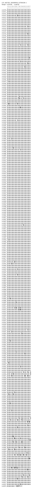

# CJK Unified Ideographs Extension C

**Range:** `U+2A700` - `U+2B73F`

[← Back to Index](../README.md)

```text
        0 1 2 3 4 5 6 7 8 9 A B C D E F
       ┌───────────────────────────────
U+2A70_│𪜀𪜁𪜂𪜃𪜄𪜅𪜆𪜇𪜈𪜉𪜊𪜋𪜌𪜍𪜎𪜏
U+2A71_│𪜐𪜑𪜒𪜓𪜔𪜕𪜖𪜗𪜘𪜙𪜚𪜛𪜜𪜝𪜞𪜟
U+2A72_│𪜠𪜡𪜢𪜣𪜤𪜥𪜦𪜧𪜨𪜩𪜪𪜫𪜬𪜭𪜮𪜯
U+2A73_│𪜰𪜱𪜲𪜳𪜴𪜵𪜶𪜷𪜸𪜹𪜺𪜻𪜼𪜽𪜾𪜿
U+2A74_│𪝀𪝁𪝂𪝃𪝄𪝅𪝆𪝇𪝈𪝉𪝊𪝋𪝌𪝍𪝎𪝏
U+2A75_│𪝐𪝑𪝒𪝓𪝔𪝕𪝖𪝗𪝘𪝙𪝚𪝛𪝜𪝝𪝞𪝟
U+2A76_│𪝠𪝡𪝢𪝣𪝤𪝥𪝦𪝧𪝨𪝩𪝪𪝫𪝬𪝭𪝮𪝯
U+2A77_│𪝰𪝱𪝲𪝳𪝴𪝵𪝶𪝷𪝸𪝹𪝺𪝻𪝼𪝽𪝾𪝿
U+2A78_│𪞀𪞁𪞂𪞃𪞄𪞅𪞆𪞇𪞈𪞉𪞊𪞋𪞌𪞍𪞎𪞏
U+2A79_│𪞐𪞑𪞒𪞓𪞔𪞕𪞖𪞗𪞘𪞙𪞚𪞛𪞜𪞝𪞞𪞟
U+2A7A_│𪞠𪞡𪞢𪞣𪞤𪞥𪞦𪞧𪞨𪞩𪞪𪞫𪞬𪞭𪞮𪞯
U+2A7B_│𪞰𪞱𪞲𪞳𪞴𪞵𪞶𪞷𪞸𪞹𪞺𪞻𪞼𪞽𪞾𪞿
U+2A7C_│𪟀𪟁𪟂𪟃𪟄𪟅𪟆𪟇𪟈𪟉𪟊𪟋𪟌𪟍𪟎𪟏
U+2A7D_│𪟐𪟑𪟒𪟓𪟔𪟕𪟖𪟗𪟘𪟙𪟚𪟛𪟜𪟝𪟞𪟟
U+2A7E_│𪟠𪟡𪟢𪟣𪟤𪟥𪟦𪟧𪟨𪟩𪟪𪟫𪟬𪟭𪟮𪟯
U+2A7F_│𪟰𪟱𪟲𪟳𪟴𪟵𪟶𪟷𪟸𪟹𪟺𪟻𪟼𪟽𪟾𪟿
U+2A80_│𪠀𪠁𪠂𪠃𪠄𪠅𪠆𪠇𪠈𪠉𪠊𪠋𪠌𪠍𪠎𪠏
U+2A81_│𪠐𪠑𪠒𪠓𪠔𪠕𪠖𪠗𪠘𪠙𪠚𪠛𪠜𪠝𪠞𪠟
U+2A82_│𪠠𪠡𪠢𪠣𪠤𪠥𪠦𪠧𪠨𪠩𪠪𪠫𪠬𪠭𪠮𪠯
U+2A83_│𪠰𪠱𪠲𪠳𪠴𪠵𪠶𪠷𪠸𪠹𪠺𪠻𪠼𪠽𪠾𪠿
U+2A84_│𪡀𪡁𪡂𪡃𪡄𪡅𪡆𪡇𪡈𪡉𪡊𪡋𪡌𪡍𪡎𪡏
U+2A85_│𪡐𪡑𪡒𪡓𪡔𪡕𪡖𪡗𪡘𪡙𪡚𪡛𪡜𪡝𪡞𪡟
U+2A86_│𪡠𪡡𪡢𪡣𪡤𪡥𪡦𪡧𪡨𪡩𪡪𪡫𪡬𪡭𪡮𪡯
U+2A87_│𪡰𪡱𪡲𪡳𪡴𪡵𪡶𪡷𪡸𪡹𪡺𪡻𪡼𪡽𪡾𪡿
U+2A88_│𪢀𪢁𪢂𪢃𪢄𪢅𪢆𪢇𪢈𪢉𪢊𪢋𪢌𪢍𪢎𪢏
U+2A89_│𪢐𪢑𪢒𪢓𪢔𪢕𪢖𪢗𪢘𪢙𪢚𪢛𪢜𪢝𪢞𪢟
U+2A8A_│𪢠𪢡𪢢𪢣𪢤𪢥𪢦𪢧𪢨𪢩𪢪𪢫𪢬𪢭𪢮𪢯
U+2A8B_│𪢰𪢱𪢲𪢳𪢴𪢵𪢶𪢷𪢸𪢹𪢺𪢻𪢼𪢽𪢾𪢿
U+2A8C_│𪣀𪣁𪣂𪣃𪣄𪣅𪣆𪣇𪣈𪣉𪣊𪣋𪣌𪣍𪣎𪣏
U+2A8D_│𪣐𪣑𪣒𪣓𪣔𪣕𪣖𪣗𪣘𪣙𪣚𪣛𪣜𪣝𪣞𪣟
U+2A8E_│𪣠𪣡𪣢𪣣𪣤𪣥𪣦𪣧𪣨𪣩𪣪𪣫𪣬𪣭𪣮𪣯
U+2A8F_│𪣰𪣱𪣲𪣳𪣴𪣵𪣶𪣷𪣸𪣹𪣺𪣻𪣼𪣽𪣾𪣿
U+2A90_│𪤀𪤁𪤂𪤃𪤄𪤅𪤆𪤇𪤈𪤉𪤊𪤋𪤌𪤍𪤎𪤏
U+2A91_│𪤐𪤑𪤒𪤓𪤔𪤕𪤖𪤗𪤘𪤙𪤚𪤛𪤜𪤝𪤞𪤟
U+2A92_│𪤠𪤡𪤢𪤣𪤤𪤥𪤦𪤧𪤨𪤩𪤪𪤫𪤬𪤭𪤮𪤯
U+2A93_│𪤰𪤱𪤲𪤳𪤴𪤵𪤶𪤷𪤸𪤹𪤺𪤻𪤼𪤽𪤾𪤿
U+2A94_│𪥀𪥁𪥂𪥃𪥄𪥅𪥆𪥇𪥈𪥉𪥊𪥋𪥌𪥍𪥎𪥏
U+2A95_│𪥐𪥑𪥒𪥓𪥔𪥕𪥖𪥗𪥘𪥙𪥚𪥛𪥜𪥝𪥞𪥟
U+2A96_│𪥠𪥡𪥢𪥣𪥤𪥥𪥦𪥧𪥨𪥩𪥪𪥫𪥬𪥭𪥮𪥯
U+2A97_│𪥰𪥱𪥲𪥳𪥴𪥵𪥶𪥷𪥸𪥹𪥺𪥻𪥼𪥽𪥾𪥿
U+2A98_│𪦀𪦁𪦂𪦃𪦄𪦅𪦆𪦇𪦈𪦉𪦊𪦋𪦌𪦍𪦎𪦏
U+2A99_│𪦐𪦑𪦒𪦓𪦔𪦕𪦖𪦗𪦘𪦙𪦚𪦛𪦜𪦝𪦞𪦟
U+2A9A_│𪦠𪦡𪦢𪦣𪦤𪦥𪦦𪦧𪦨𪦩𪦪𪦫𪦬𪦭𪦮𪦯
U+2A9B_│𪦰𪦱𪦲𪦳𪦴𪦵𪦶𪦷𪦸𪦹𪦺𪦻𪦼𪦽𪦾𪦿
U+2A9C_│𪧀𪧁𪧂𪧃𪧄𪧅𪧆𪧇𪧈𪧉𪧊𪧋𪧌𪧍𪧎𪧏
U+2A9D_│𪧐𪧑𪧒𪧓𪧔𪧕𪧖𪧗𪧘𪧙𪧚𪧛𪧜𪧝𪧞𪧟
U+2A9E_│𪧠𪧡𪧢𪧣𪧤𪧥𪧦𪧧𪧨𪧩𪧪𪧫𪧬𪧭𪧮𪧯
U+2A9F_│𪧰𪧱𪧲𪧳𪧴𪧵𪧶𪧷𪧸𪧹𪧺𪧻𪧼𪧽𪧾𪧿
U+2AA0_│𪨀𪨁𪨂𪨃𪨄𪨅𪨆𪨇𪨈𪨉𪨊𪨋𪨌𪨍𪨎𪨏
U+2AA1_│𪨐𪨑𪨒𪨓𪨔𪨕𪨖𪨗𪨘𪨙𪨚𪨛𪨜𪨝𪨞𪨟
U+2AA2_│𪨠𪨡𪨢𪨣𪨤𪨥𪨦𪨧𪨨𪨩𪨪𪨫𪨬𪨭𪨮𪨯
U+2AA3_│𪨰𪨱𪨲𪨳𪨴𪨵𪨶𪨷𪨸𪨹𪨺𪨻𪨼𪨽𪨾𪨿
U+2AA4_│𪩀𪩁𪩂𪩃𪩄𪩅𪩆𪩇𪩈𪩉𪩊𪩋𪩌𪩍𪩎𪩏
U+2AA5_│𪩐𪩑𪩒𪩓𪩔𪩕𪩖𪩗𪩘𪩙𪩚𪩛𪩜𪩝𪩞𪩟
U+2AA6_│𪩠𪩡𪩢𪩣𪩤𪩥𪩦𪩧𪩨𪩩𪩪𪩫𪩬𪩭𪩮𪩯
U+2AA7_│𪩰𪩱𪩲𪩳𪩴𪩵𪩶𪩷𪩸𪩹𪩺𪩻𪩼𪩽𪩾𪩿
U+2AA8_│𪪀𪪁𪪂𪪃𪪄𪪅𪪆𪪇𪪈𪪉𪪊𪪋𪪌𪪍𪪎𪪏
U+2AA9_│𪪐𪪑𪪒𪪓𪪔𪪕𪪖𪪗𪪘𪪙𪪚𪪛𪪜𪪝𪪞𪪟
U+2AAA_│𪪠𪪡𪪢𪪣𪪤𪪥𪪦𪪧𪪨𪪩𪪪𪪫𪪬𪪭𪪮𪪯
U+2AAB_│𪪰𪪱𪪲𪪳𪪴𪪵𪪶𪪷𪪸𪪹𪪺𪪻𪪼𪪽𪪾𪪿
U+2AAC_│𪫀𪫁𪫂𪫃𪫄𪫅𪫆𪫇𪫈𪫉𪫊𪫋𪫌𪫍𪫎𪫏
U+2AAD_│𪫐𪫑𪫒𪫓𪫔𪫕𪫖𪫗𪫘𪫙𪫚𪫛𪫜𪫝𪫞𪫟
U+2AAE_│𪫠𪫡𪫢𪫣𪫤𪫥𪫦𪫧𪫨𪫩𪫪𪫫𪫬𪫭𪫮𪫯
U+2AAF_│𪫰𪫱𪫲𪫳𪫴𪫵𪫶𪫷𪫸𪫹𪫺𪫻𪫼𪫽𪫾𪫿
U+2AB0_│𪬀𪬁𪬂𪬃𪬄𪬅𪬆𪬇𪬈𪬉𪬊𪬋𪬌𪬍𪬎𪬏
U+2AB1_│𪬐𪬑𪬒𪬓𪬔𪬕𪬖𪬗𪬘𪬙𪬚𪬛𪬜𪬝𪬞𪬟
U+2AB2_│𪬠𪬡𪬢𪬣𪬤𪬥𪬦𪬧𪬨𪬩𪬪𪬫𪬬𪬭𪬮𪬯
U+2AB3_│𪬰𪬱𪬲𪬳𪬴𪬵𪬶𪬷𪬸𪬹𪬺𪬻𪬼𪬽𪬾𪬿
U+2AB4_│𪭀𪭁𪭂𪭃𪭄𪭅𪭆𪭇𪭈𪭉𪭊𪭋𪭌𪭍𪭎𪭏
U+2AB5_│𪭐𪭑𪭒𪭓𪭔𪭕𪭖𪭗𪭘𪭙𪭚𪭛𪭜𪭝𪭞𪭟
U+2AB6_│𪭠𪭡𪭢𪭣𪭤𪭥𪭦𪭧𪭨𪭩𪭪𪭫𪭬𪭭𪭮𪭯
U+2AB7_│𪭰𪭱𪭲𪭳𪭴𪭵𪭶𪭷𪭸𪭹𪭺𪭻𪭼𪭽𪭾𪭿
U+2AB8_│𪮀𪮁𪮂𪮃𪮄𪮅𪮆𪮇𪮈𪮉𪮊𪮋𪮌𪮍𪮎𪮏
U+2AB9_│𪮐𪮑𪮒𪮓𪮔𪮕𪮖𪮗𪮘𪮙𪮚𪮛𪮜𪮝𪮞𪮟
U+2ABA_│𪮠𪮡𪮢𪮣𪮤𪮥𪮦𪮧𪮨𪮩𪮪𪮫𪮬𪮭𪮮𪮯
U+2ABB_│𪮰𪮱𪮲𪮳𪮴𪮵𪮶𪮷𪮸𪮹𪮺𪮻𪮼𪮽𪮾𪮿
U+2ABC_│𪯀𪯁𪯂𪯃𪯄𪯅𪯆𪯇𪯈𪯉𪯊𪯋𪯌𪯍𪯎𪯏
U+2ABD_│𪯐𪯑𪯒𪯓𪯔𪯕𪯖𪯗𪯘𪯙𪯚𪯛𪯜𪯝𪯞𪯟
U+2ABE_│𪯠𪯡𪯢𪯣𪯤𪯥𪯦𪯧𪯨𪯩𪯪𪯫𪯬𪯭𪯮𪯯
U+2ABF_│𪯰𪯱𪯲𪯳𪯴𪯵𪯶𪯷𪯸𪯹𪯺𪯻𪯼𪯽𪯾𪯿
U+2AC0_│𪰀𪰁𪰂𪰃𪰄𪰅𪰆𪰇𪰈𪰉𪰊𪰋𪰌𪰍𪰎𪰏
U+2AC1_│𪰐𪰑𪰒𪰓𪰔𪰕𪰖𪰗𪰘𪰙𪰚𪰛𪰜𪰝𪰞𪰟
U+2AC2_│𪰠𪰡𪰢𪰣𪰤𪰥𪰦𪰧𪰨𪰩𪰪𪰫𪰬𪰭𪰮𪰯
U+2AC3_│𪰰𪰱𪰲𪰳𪰴𪰵𪰶𪰷𪰸𪰹𪰺𪰻𪰼𪰽𪰾𪰿
U+2AC4_│𪱀𪱁𪱂𪱃𪱄𪱅𪱆𪱇𪱈𪱉𪱊𪱋𪱌𪱍𪱎𪱏
U+2AC5_│𪱐𪱑𪱒𪱓𪱔𪱕𪱖𪱗𪱘𪱙𪱚𪱛𪱜𪱝𪱞𪱟
U+2AC6_│𪱠𪱡𪱢𪱣𪱤𪱥𪱦𪱧𪱨𪱩𪱪𪱫𪱬𪱭𪱮𪱯
U+2AC7_│𪱰𪱱𪱲𪱳𪱴𪱵𪱶𪱷𪱸𪱹𪱺𪱻𪱼𪱽𪱾𪱿
U+2AC8_│𪲀𪲁𪲂𪲃𪲄𪲅𪲆𪲇𪲈𪲉𪲊𪲋𪲌𪲍𪲎𪲏
U+2AC9_│𪲐𪲑𪲒𪲓𪲔𪲕𪲖𪲗𪲘𪲙𪲚𪲛𪲜𪲝𪲞𪲟
U+2ACA_│𪲠𪲡𪲢𪲣𪲤𪲥𪲦𪲧𪲨𪲩𪲪𪲫𪲬𪲭𪲮𪲯
U+2ACB_│𪲰𪲱𪲲𪲳𪲴𪲵𪲶𪲷𪲸𪲹𪲺𪲻𪲼𪲽𪲾𪲿
U+2ACC_│𪳀𪳁𪳂𪳃𪳄𪳅𪳆𪳇𪳈𪳉𪳊𪳋𪳌𪳍𪳎𪳏
U+2ACD_│𪳐𪳑𪳒𪳓𪳔𪳕𪳖𪳗𪳘𪳙𪳚𪳛𪳜𪳝𪳞𪳟
U+2ACE_│𪳠𪳡𪳢𪳣𪳤𪳥𪳦𪳧𪳨𪳩𪳪𪳫𪳬𪳭𪳮𪳯
U+2ACF_│𪳰𪳱𪳲𪳳𪳴𪳵𪳶𪳷𪳸𪳹𪳺𪳻𪳼𪳽𪳾𪳿
U+2AD0_│𪴀𪴁𪴂𪴃𪴄𪴅𪴆𪴇𪴈𪴉𪴊𪴋𪴌𪴍𪴎𪴏
U+2AD1_│𪴐𪴑𪴒𪴓𪴔𪴕𪴖𪴗𪴘𪴙𪴚𪴛𪴜𪴝𪴞𪴟
U+2AD2_│𪴠𪴡𪴢𪴣𪴤𪴥𪴦𪴧𪴨𪴩𪴪𪴫𪴬𪴭𪴮𪴯
U+2AD3_│𪴰𪴱𪴲𪴳𪴴𪴵𪴶𪴷𪴸𪴹𪴺𪴻𪴼𪴽𪴾𪴿
U+2AD4_│𪵀𪵁𪵂𪵃𪵄𪵅𪵆𪵇𪵈𪵉𪵊𪵋𪵌𪵍𪵎𪵏
U+2AD5_│𪵐𪵑𪵒𪵓𪵔𪵕𪵖𪵗𪵘𪵙𪵚𪵛𪵜𪵝𪵞𪵟
U+2AD6_│𪵠𪵡𪵢𪵣𪵤𪵥𪵦𪵧𪵨𪵩𪵪𪵫𪵬𪵭𪵮𪵯
U+2AD7_│𪵰𪵱𪵲𪵳𪵴𪵵𪵶𪵷𪵸𪵹𪵺𪵻𪵼𪵽𪵾𪵿
U+2AD8_│𪶀𪶁𪶂𪶃𪶄𪶅𪶆𪶇𪶈𪶉𪶊𪶋𪶌𪶍𪶎𪶏
U+2AD9_│𪶐𪶑𪶒𪶓𪶔𪶕𪶖𪶗𪶘𪶙𪶚𪶛𪶜𪶝𪶞𪶟
U+2ADA_│𪶠𪶡𪶢𪶣𪶤𪶥𪶦𪶧𪶨𪶩𪶪𪶫𪶬𪶭𪶮𪶯
U+2ADB_│𪶰𪶱𪶲𪶳𪶴𪶵𪶶𪶷𪶸𪶹𪶺𪶻𪶼𪶽𪶾𪶿
U+2ADC_│𪷀𪷁𪷂𪷃𪷄𪷅𪷆𪷇𪷈𪷉𪷊𪷋𪷌𪷍𪷎𪷏
U+2ADD_│𪷐𪷑𪷒𪷓𪷔𪷕𪷖𪷗𪷘𪷙𪷚𪷛𪷜𪷝𪷞𪷟
U+2ADE_│𪷠𪷡𪷢𪷣𪷤𪷥𪷦𪷧𪷨𪷩𪷪𪷫𪷬𪷭𪷮𪷯
U+2ADF_│𪷰𪷱𪷲𪷳𪷴𪷵𪷶𪷷𪷸𪷹𪷺𪷻𪷼𪷽𪷾𪷿
U+2AE0_│𪸀𪸁𪸂𪸃𪸄𪸅𪸆𪸇𪸈𪸉𪸊𪸋𪸌𪸍𪸎𪸏
U+2AE1_│𪸐𪸑𪸒𪸓𪸔𪸕𪸖𪸗𪸘𪸙𪸚𪸛𪸜𪸝𪸞𪸟
U+2AE2_│𪸠𪸡𪸢𪸣𪸤𪸥𪸦𪸧𪸨𪸩𪸪𪸫𪸬𪸭𪸮𪸯
U+2AE3_│𪸰𪸱𪸲𪸳𪸴𪸵𪸶𪸷𪸸𪸹𪸺𪸻𪸼𪸽𪸾𪸿
U+2AE4_│𪹀𪹁𪹂𪹃𪹄𪹅𪹆𪹇𪹈𪹉𪹊𪹋𪹌𪹍𪹎𪹏
U+2AE5_│𪹐𪹑𪹒𪹓𪹔𪹕𪹖𪹗𪹘𪹙𪹚𪹛𪹜𪹝𪹞𪹟
U+2AE6_│𪹠𪹡𪹢𪹣𪹤𪹥𪹦𪹧𪹨𪹩𪹪𪹫𪹬𪹭𪹮𪹯
U+2AE7_│𪹰𪹱𪹲𪹳𪹴𪹵𪹶𪹷𪹸𪹹𪹺𪹻𪹼𪹽𪹾𪹿
U+2AE8_│𪺀𪺁𪺂𪺃𪺄𪺅𪺆𪺇𪺈𪺉𪺊𪺋𪺌𪺍𪺎𪺏
U+2AE9_│𪺐𪺑𪺒𪺓𪺔𪺕𪺖𪺗𪺘𪺙𪺚𪺛𪺜𪺝𪺞𪺟
U+2AEA_│𪺠𪺡𪺢𪺣𪺤𪺥𪺦𪺧𪺨𪺩𪺪𪺫𪺬𪺭𪺮𪺯
U+2AEB_│𪺰𪺱𪺲𪺳𪺴𪺵𪺶𪺷𪺸𪺹𪺺𪺻𪺼𪺽𪺾𪺿
U+2AEC_│𪻀𪻁𪻂𪻃𪻄𪻅𪻆𪻇𪻈𪻉𪻊𪻋𪻌𪻍𪻎𪻏
U+2AED_│𪻐𪻑𪻒𪻓𪻔𪻕𪻖𪻗𪻘𪻙𪻚𪻛𪻜𪻝𪻞𪻟
U+2AEE_│𪻠𪻡𪻢𪻣𪻤𪻥𪻦𪻧𪻨𪻩𪻪𪻫𪻬𪻭𪻮𪻯
U+2AEF_│𪻰𪻱𪻲𪻳𪻴𪻵𪻶𪻷𪻸𪻹𪻺𪻻𪻼𪻽𪻾𪻿
U+2AF0_│𪼀𪼁𪼂𪼃𪼄𪼅𪼆𪼇𪼈𪼉𪼊𪼋𪼌𪼍𪼎𪼏
U+2AF1_│𪼐𪼑𪼒𪼓𪼔𪼕𪼖𪼗𪼘𪼙𪼚𪼛𪼜𪼝𪼞𪼟
U+2AF2_│𪼠𪼡𪼢𪼣𪼤𪼥𪼦𪼧𪼨𪼩𪼪𪼫𪼬𪼭𪼮𪼯
U+2AF3_│𪼰𪼱𪼲𪼳𪼴𪼵𪼶𪼷𪼸𪼹𪼺𪼻𪼼𪼽𪼾𪼿
U+2AF4_│𪽀𪽁𪽂𪽃𪽄𪽅𪽆𪽇𪽈𪽉𪽊𪽋𪽌𪽍𪽎𪽏
U+2AF5_│𪽐𪽑𪽒𪽓𪽔𪽕𪽖𪽗𪽘𪽙𪽚𪽛𪽜𪽝𪽞𪽟
U+2AF6_│𪽠𪽡𪽢𪽣𪽤𪽥𪽦𪽧𪽨𪽩𪽪𪽫𪽬𪽭𪽮𪽯
U+2AF7_│𪽰𪽱𪽲𪽳𪽴𪽵𪽶𪽷𪽸𪽹𪽺𪽻𪽼𪽽𪽾𪽿
U+2AF8_│𪾀𪾁𪾂𪾃𪾄𪾅𪾆𪾇𪾈𪾉𪾊𪾋𪾌𪾍𪾎𪾏
U+2AF9_│𪾐𪾑𪾒𪾓𪾔𪾕𪾖𪾗𪾘𪾙𪾚𪾛𪾜𪾝𪾞𪾟
U+2AFA_│𪾠𪾡𪾢𪾣𪾤𪾥𪾦𪾧𪾨𪾩𪾪𪾫𪾬𪾭𪾮𪾯
U+2AFB_│𪾰𪾱𪾲𪾳𪾴𪾵𪾶𪾷𪾸𪾹𪾺𪾻𪾼𪾽𪾾𪾿
U+2AFC_│𪿀𪿁𪿂𪿃𪿄𪿅𪿆𪿇𪿈𪿉𪿊𪿋𪿌𪿍𪿎𪿏
U+2AFD_│𪿐𪿑𪿒𪿓𪿔𪿕𪿖𪿗𪿘𪿙𪿚𪿛𪿜𪿝𪿞𪿟
U+2AFE_│𪿠𪿡𪿢𪿣𪿤𪿥𪿦𪿧𪿨𪿩𪿪𪿫𪿬𪿭𪿮𪿯
U+2AFF_│𪿰𪿱𪿲𪿳𪿴𪿵𪿶𪿷𪿸𪿹𪿺𪿻𪿼𪿽𪿾𪿿
U+2B00_│𫀀𫀁𫀂𫀃𫀄𫀅𫀆𫀇𫀈𫀉𫀊𫀋𫀌𫀍𫀎𫀏
U+2B01_│𫀐𫀑𫀒𫀓𫀔𫀕𫀖𫀗𫀘𫀙𫀚𫀛𫀜𫀝𫀞𫀟
U+2B02_│𫀠𫀡𫀢𫀣𫀤𫀥𫀦𫀧𫀨𫀩𫀪𫀫𫀬𫀭𫀮𫀯
U+2B03_│𫀰𫀱𫀲𫀳𫀴𫀵𫀶𫀷𫀸𫀹𫀺𫀻𫀼𫀽𫀾𫀿
U+2B04_│𫁀𫁁𫁂𫁃𫁄𫁅𫁆𫁇𫁈𫁉𫁊𫁋𫁌𫁍𫁎𫁏
U+2B05_│𫁐𫁑𫁒𫁓𫁔𫁕𫁖𫁗𫁘𫁙𫁚𫁛𫁜𫁝𫁞𫁟
U+2B06_│𫁠𫁡𫁢𫁣𫁤𫁥𫁦𫁧𫁨𫁩𫁪𫁫𫁬𫁭𫁮𫁯
U+2B07_│𫁰𫁱𫁲𫁳𫁴𫁵𫁶𫁷𫁸𫁹𫁺𫁻𫁼𫁽𫁾𫁿
U+2B08_│𫂀𫂁𫂂𫂃𫂄𫂅𫂆𫂇𫂈𫂉𫂊𫂋𫂌𫂍𫂎𫂏
U+2B09_│𫂐𫂑𫂒𫂓𫂔𫂕𫂖𫂗𫂘𫂙𫂚𫂛𫂜𫂝𫂞𫂟
U+2B0A_│𫂠𫂡𫂢𫂣𫂤𫂥𫂦𫂧𫂨𫂩𫂪𫂫𫂬𫂭𫂮𫂯
U+2B0B_│𫂰𫂱𫂲𫂳𫂴𫂵𫂶𫂷𫂸𫂹𫂺𫂻𫂼𫂽𫂾𫂿
U+2B0C_│𫃀𫃁𫃂𫃃𫃄𫃅𫃆𫃇𫃈𫃉𫃊𫃋𫃌𫃍𫃎𫃏
U+2B0D_│𫃐𫃑𫃒𫃓𫃔𫃕𫃖𫃗𫃘𫃙𫃚𫃛𫃜𫃝𫃞𫃟
U+2B0E_│𫃠𫃡𫃢𫃣𫃤𫃥𫃦𫃧𫃨𫃩𫃪𫃫𫃬𫃭𫃮𫃯
U+2B0F_│𫃰𫃱𫃲𫃳𫃴𫃵𫃶𫃷𫃸𫃹𫃺𫃻𫃼𫃽𫃾𫃿
U+2B10_│𫄀𫄁𫄂𫄃𫄄𫄅𫄆𫄇𫄈𫄉𫄊𫄋𫄌𫄍𫄎𫄏
U+2B11_│𫄐𫄑𫄒𫄓𫄔𫄕𫄖𫄗𫄘𫄙𫄚𫄛𫄜𫄝𫄞𫄟
U+2B12_│𫄠𫄡𫄢𫄣𫄤𫄥𫄦𫄧𫄨𫄩𫄪𫄫𫄬𫄭𫄮𫄯
U+2B13_│𫄰𫄱𫄲𫄳𫄴𫄵𫄶𫄷𫄸𫄹𫄺𫄻𫄼𫄽𫄾𫄿
U+2B14_│𫅀𫅁𫅂𫅃𫅄𫅅𫅆𫅇𫅈𫅉𫅊𫅋𫅌𫅍𫅎𫅏
U+2B15_│𫅐𫅑𫅒𫅓𫅔𫅕𫅖𫅗𫅘𫅙𫅚𫅛𫅜𫅝𫅞𫅟
U+2B16_│𫅠𫅡𫅢𫅣𫅤𫅥𫅦𫅧𫅨𫅩𫅪𫅫𫅬𫅭𫅮𫅯
U+2B17_│𫅰𫅱𫅲𫅳𫅴𫅵𫅶𫅷𫅸𫅹𫅺𫅻𫅼𫅽𫅾𫅿
U+2B18_│𫆀𫆁𫆂𫆃𫆄𫆅𫆆𫆇𫆈𫆉𫆊𫆋𫆌𫆍𫆎𫆏
U+2B19_│𫆐𫆑𫆒𫆓𫆔𫆕𫆖𫆗𫆘𫆙𫆚𫆛𫆜𫆝𫆞𫆟
U+2B1A_│𫆠𫆡𫆢𫆣𫆤𫆥𫆦𫆧𫆨𫆩𫆪𫆫𫆬𫆭𫆮𫆯
U+2B1B_│𫆰𫆱𫆲𫆳𫆴𫆵𫆶𫆷𫆸𫆹𫆺𫆻𫆼𫆽𫆾𫆿
U+2B1C_│𫇀𫇁𫇂𫇃𫇄𫇅𫇆𫇇𫇈𫇉𫇊𫇋𫇌𫇍𫇎𫇏
U+2B1D_│𫇐𫇑𫇒𫇓𫇔𫇕𫇖𫇗𫇘𫇙𫇚𫇛𫇜𫇝𫇞𫇟
U+2B1E_│𫇠𫇡𫇢𫇣𫇤𫇥𫇦𫇧𫇨𫇩𫇪𫇫𫇬𫇭𫇮𫇯
U+2B1F_│𫇰𫇱𫇲𫇳𫇴𫇵𫇶𫇷𫇸𫇹𫇺𫇻𫇼𫇽𫇾𫇿
U+2B20_│𫈀𫈁𫈂𫈃𫈄𫈅𫈆𫈇𫈈𫈉𫈊𫈋𫈌𫈍𫈎𫈏
U+2B21_│𫈐𫈑𫈒𫈓𫈔𫈕𫈖𫈗𫈘𫈙𫈚𫈛𫈜𫈝𫈞𫈟
U+2B22_│𫈠𫈡𫈢𫈣𫈤𫈥𫈦𫈧𫈨𫈩𫈪𫈫𫈬𫈭𫈮𫈯
U+2B23_│𫈰𫈱𫈲𫈳𫈴𫈵𫈶𫈷𫈸𫈹𫈺𫈻𫈼𫈽𫈾𫈿
U+2B24_│𫉀𫉁𫉂𫉃𫉄𫉅𫉆𫉇𫉈𫉉𫉊𫉋𫉌𫉍𫉎𫉏
U+2B25_│𫉐𫉑𫉒𫉓𫉔𫉕𫉖𫉗𫉘𫉙𫉚𫉛𫉜𫉝𫉞𫉟
U+2B26_│𫉠𫉡𫉢𫉣𫉤𫉥𫉦𫉧𫉨𫉩𫉪𫉫𫉬𫉭𫉮𫉯
U+2B27_│𫉰𫉱𫉲𫉳𫉴𫉵𫉶𫉷𫉸𫉹𫉺𫉻𫉼𫉽𫉾𫉿
U+2B28_│𫊀𫊁𫊂𫊃𫊄𫊅𫊆𫊇𫊈𫊉𫊊𫊋𫊌𫊍𫊎𫊏
U+2B29_│𫊐𫊑𫊒𫊓𫊔𫊕𫊖𫊗𫊘𫊙𫊚𫊛𫊜𫊝𫊞𫊟
U+2B2A_│𫊠𫊡𫊢𫊣𫊤𫊥𫊦𫊧𫊨𫊩𫊪𫊫𫊬𫊭𫊮𫊯
U+2B2B_│𫊰𫊱𫊲𫊳𫊴𫊵𫊶𫊷𫊸𫊹𫊺𫊻𫊼𫊽𫊾𫊿
U+2B2C_│𫋀𫋁𫋂𫋃𫋄𫋅𫋆𫋇𫋈𫋉𫋊𫋋𫋌𫋍𫋎𫋏
U+2B2D_│𫋐𫋑𫋒𫋓𫋔𫋕𫋖𫋗𫋘𫋙𫋚𫋛𫋜𫋝𫋞𫋟
U+2B2E_│𫋠𫋡𫋢𫋣𫋤𫋥𫋦𫋧𫋨𫋩𫋪𫋫𫋬𫋭𫋮𫋯
U+2B2F_│𫋰𫋱𫋲𫋳𫋴𫋵𫋶𫋷𫋸𫋹𫋺𫋻𫋼𫋽𫋾𫋿
U+2B30_│𫌀𫌁𫌂𫌃𫌄𫌅𫌆𫌇𫌈𫌉𫌊𫌋𫌌𫌍𫌎𫌏
U+2B31_│𫌐𫌑𫌒𫌓𫌔𫌕𫌖𫌗𫌘𫌙𫌚𫌛𫌜𫌝𫌞𫌟
U+2B32_│𫌠𫌡𫌢𫌣𫌤𫌥𫌦𫌧𫌨𫌩𫌪𫌫𫌬𫌭𫌮𫌯
U+2B33_│𫌰𫌱𫌲𫌳𫌴𫌵𫌶𫌷𫌸𫌹𫌺𫌻𫌼𫌽𫌾𫌿
U+2B34_│𫍀𫍁𫍂𫍃𫍄𫍅𫍆𫍇𫍈𫍉𫍊𫍋𫍌𫍍𫍎𫍏
U+2B35_│𫍐𫍑𫍒𫍓𫍔𫍕𫍖𫍗𫍘𫍙𫍚𫍛𫍜𫍝𫍞𫍟
U+2B36_│𫍠𫍡𫍢𫍣𫍤𫍥𫍦𫍧𫍨𫍩𫍪𫍫𫍬𫍭𫍮𫍯
U+2B37_│𫍰𫍱𫍲𫍳𫍴𫍵𫍶𫍷𫍸𫍹𫍺𫍻𫍼𫍽𫍾𫍿
U+2B38_│𫎀𫎁𫎂𫎃𫎄𫎅𫎆𫎇𫎈𫎉𫎊𫎋𫎌𫎍𫎎𫎏
U+2B39_│𫎐𫎑𫎒𫎓𫎔𫎕𫎖𫎗𫎘𫎙𫎚𫎛𫎜𫎝𫎞𫎟
U+2B3A_│𫎠𫎡𫎢𫎣𫎤𫎥𫎦𫎧𫎨𫎩𫎪𫎫𫎬𫎭𫎮𫎯
U+2B3B_│𫎰𫎱𫎲𫎳𫎴𫎵𫎶𫎷𫎸𫎹𫎺𫎻𫎼𫎽𫎾𫎿
U+2B3C_│𫏀𫏁𫏂𫏃𫏄𫏅𫏆𫏇𫏈𫏉𫏊𫏋𫏌𫏍𫏎𫏏
U+2B3D_│𫏐𫏑𫏒𫏓𫏔𫏕𫏖𫏗𫏘𫏙𫏚𫏛𫏜𫏝𫏞𫏟
U+2B3E_│𫏠𫏡𫏢𫏣𫏤𫏥𫏦𫏧𫏨𫏩𫏪𫏫𫏬𫏭𫏮𫏯
U+2B3F_│𫏰𫏱𫏲𫏳𫏴𫏵𫏶𫏷𫏸𫏹𫏺𫏻𫏼𫏽𫏾𫏿
U+2B40_│𫐀𫐁𫐂𫐃𫐄𫐅𫐆𫐇𫐈𫐉𫐊𫐋𫐌𫐍𫐎𫐏
U+2B41_│𫐐𫐑𫐒𫐓𫐔𫐕𫐖𫐗𫐘𫐙𫐚𫐛𫐜𫐝𫐞𫐟
U+2B42_│𫐠𫐡𫐢𫐣𫐤𫐥𫐦𫐧𫐨𫐩𫐪𫐫𫐬𫐭𫐮𫐯
U+2B43_│𫐰𫐱𫐲𫐳𫐴𫐵𫐶𫐷𫐸𫐹𫐺𫐻𫐼𫐽𫐾𫐿
U+2B44_│𫑀𫑁𫑂𫑃𫑄𫑅𫑆𫑇𫑈𫑉𫑊𫑋𫑌𫑍𫑎𫑏
U+2B45_│𫑐𫑑𫑒𫑓𫑔𫑕𫑖𫑗𫑘𫑙𫑚𫑛𫑜𫑝𫑞𫑟
U+2B46_│𫑠𫑡𫑢𫑣𫑤𫑥𫑦𫑧𫑨𫑩𫑪𫑫𫑬𫑭𫑮𫑯
U+2B47_│𫑰𫑱𫑲𫑳𫑴𫑵𫑶𫑷𫑸𫑹𫑺𫑻𫑼𫑽𫑾𫑿
U+2B48_│𫒀𫒁𫒂𫒃𫒄𫒅𫒆𫒇𫒈𫒉𫒊𫒋𫒌𫒍𫒎𫒏
U+2B49_│𫒐𫒑𫒒𫒓𫒔𫒕𫒖𫒗𫒘𫒙𫒚𫒛𫒜𫒝𫒞𫒟
U+2B4A_│𫒠𫒡𫒢𫒣𫒤𫒥𫒦𫒧𫒨𫒩𫒪𫒫𫒬𫒭𫒮𫒯
U+2B4B_│𫒰𫒱𫒲𫒳𫒴𫒵𫒶𫒷𫒸𫒹𫒺𫒻𫒼𫒽𫒾𫒿
U+2B4C_│𫓀𫓁𫓂𫓃𫓄𫓅𫓆𫓇𫓈𫓉𫓊𫓋𫓌𫓍𫓎𫓏
U+2B4D_│𫓐𫓑𫓒𫓓𫓔𫓕𫓖𫓗𫓘𫓙𫓚𫓛𫓜𫓝𫓞𫓟
U+2B4E_│𫓠𫓡𫓢𫓣𫓤𫓥𫓦𫓧𫓨𫓩𫓪𫓫𫓬𫓭𫓮𫓯
U+2B4F_│𫓰𫓱𫓲𫓳𫓴𫓵𫓶𫓷𫓸𫓹𫓺𫓻𫓼𫓽𫓾𫓿
U+2B50_│𫔀𫔁𫔂𫔃𫔄𫔅𫔆𫔇𫔈𫔉𫔊𫔋𫔌𫔍𫔎𫔏
U+2B51_│𫔐𫔑𫔒𫔓𫔔𫔕𫔖𫔗𫔘𫔙𫔚𫔛𫔜𫔝𫔞𫔟
U+2B52_│𫔠𫔡𫔢𫔣𫔤𫔥𫔦𫔧𫔨𫔩𫔪𫔫𫔬𫔭𫔮𫔯
U+2B53_│𫔰𫔱𫔲𫔳𫔴𫔵𫔶𫔷𫔸𫔹𫔺𫔻𫔼𫔽𫔾𫔿
U+2B54_│𫕀𫕁𫕂𫕃𫕄𫕅𫕆𫕇𫕈𫕉𫕊𫕋𫕌𫕍𫕎𫕏
U+2B55_│𫕐𫕑𫕒𫕓𫕔𫕕𫕖𫕗𫕘𫕙𫕚𫕛𫕜𫕝𫕞𫕟
U+2B56_│𫕠𫕡𫕢𫕣𫕤𫕥𫕦𫕧𫕨𫕩𫕪𫕫𫕬𫕭𫕮𫕯
U+2B57_│𫕰𫕱𫕲𫕳𫕴𫕵𫕶𫕷𫕸𫕹𫕺𫕻𫕼𫕽𫕾𫕿
U+2B58_│𫖀𫖁𫖂𫖃𫖄𫖅𫖆𫖇𫖈𫖉𫖊𫖋𫖌𫖍𫖎𫖏
U+2B59_│𫖐𫖑𫖒𫖓𫖔𫖕𫖖𫖗𫖘𫖙𫖚𫖛𫖜𫖝𫖞𫖟
U+2B5A_│𫖠𫖡𫖢𫖣𫖤𫖥𫖦𫖧𫖨𫖩𫖪𫖫𫖬𫖭𫖮𫖯
U+2B5B_│𫖰𫖱𫖲𫖳𫖴𫖵𫖶𫖷𫖸𫖹𫖺𫖻𫖼𫖽𫖾𫖿
U+2B5C_│𫗀𫗁𫗂𫗃𫗄𫗅𫗆𫗇𫗈𫗉𫗊𫗋𫗌𫗍𫗎𫗏
U+2B5D_│𫗐𫗑𫗒𫗓𫗔𫗕𫗖𫗗𫗘𫗙𫗚𫗛𫗜𫗝𫗞𫗟
U+2B5E_│𫗠𫗡𫗢𫗣𫗤𫗥𫗦𫗧𫗨𫗩𫗪𫗫𫗬𫗭𫗮𫗯
U+2B5F_│𫗰𫗱𫗲𫗳𫗴𫗵𫗶𫗷𫗸𫗹𫗺𫗻𫗼𫗽𫗾𫗿
U+2B60_│𫘀𫘁𫘂𫘃𫘄𫘅𫘆𫘇𫘈𫘉𫘊𫘋𫘌𫘍𫘎𫘏
U+2B61_│𫘐𫘑𫘒𫘓𫘔𫘕𫘖𫘗𫘘𫘙𫘚𫘛𫘜𫘝𫘞𫘟
U+2B62_│𫘠𫘡𫘢𫘣𫘤𫘥𫘦𫘧𫘨𫘩𫘪𫘫𫘬𫘭𫘮𫘯
U+2B63_│𫘰𫘱𫘲𫘳𫘴𫘵𫘶𫘷𫘸𫘹𫘺𫘻𫘼𫘽𫘾𫘿
U+2B64_│𫙀𫙁𫙂𫙃𫙄𫙅𫙆𫙇𫙈𫙉𫙊𫙋𫙌𫙍𫙎𫙏
U+2B65_│𫙐𫙑𫙒𫙓𫙔𫙕𫙖𫙗𫙘𫙙𫙚𫙛𫙜𫙝𫙞𫙟
U+2B66_│𫙠𫙡𫙢𫙣𫙤𫙥𫙦𫙧𫙨𫙩𫙪𫙫𫙬𫙭𫙮𫙯
U+2B67_│𫙰𫙱𫙲𫙳𫙴𫙵𫙶𫙷𫙸𫙹𫙺𫙻𫙼𫙽𫙾𫙿
U+2B68_│𫚀𫚁𫚂𫚃𫚄𫚅𫚆𫚇𫚈𫚉𫚊𫚋𫚌𫚍𫚎𫚏
U+2B69_│𫚐𫚑𫚒𫚓𫚔𫚕𫚖𫚗𫚘𫚙𫚚𫚛𫚜𫚝𫚞𫚟
U+2B6A_│𫚠𫚡𫚢𫚣𫚤𫚥𫚦𫚧𫚨𫚩𫚪𫚫𫚬𫚭𫚮𫚯
U+2B6B_│𫚰𫚱𫚲𫚳𫚴𫚵𫚶𫚷𫚸𫚹𫚺𫚻𫚼𫚽𫚾𫚿
U+2B6C_│𫛀𫛁𫛂𫛃𫛄𫛅𫛆𫛇𫛈𫛉𫛊𫛋𫛌𫛍𫛎𫛏
U+2B6D_│𫛐𫛑𫛒𫛓𫛔𫛕𫛖𫛗𫛘𫛙𫛚𫛛𫛜𫛝𫛞𫛟
U+2B6E_│𫛠𫛡𫛢𫛣𫛤𫛥𫛦𫛧𫛨𫛩𫛪𫛫𫛬𫛭𫛮𫛯
U+2B6F_│𫛰𫛱𫛲𫛳𫛴𫛵𫛶𫛷𫛸𫛹𫛺𫛻𫛼𫛽𫛾𫛿
U+2B70_│𫜀𫜁𫜂𫜃𫜄𫜅𫜆𫜇𫜈𫜉𫜊𫜋𫜌𫜍𫜎𫜏
U+2B71_│𫜐𫜑𫜒𫜓𫜔𫜕𫜖𫜗𫜘𫜙𫜚𫜛𫜜𫜝𫜞𫜟
U+2B72_│𫜠𫜡𫜢𫜣𫜤𫜥𫜦𫜧𫜨𫜩𫜪𫜫𫜬𫜭𫜮𫜯
U+2B73_│𫜰𫜱𫜲𫜳𫜴𫜵𫜶𫜷𫜸𫜹
```

## Visual Fallback Reference
If your system lacks the required fonts to render these characters properly, use the image below as a visual guide.


