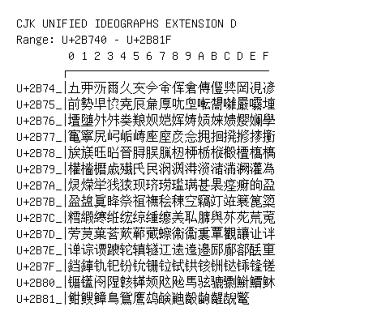

# CJK Unified Ideographs Extension D

**Range:** `U+2B740` - `U+2B81F`

[← Back to Index](../README.md)

```text
        0 1 2 3 4 5 6 7 8 9 A B C D E F
       ┌───────────────────────────────
U+2B74_│𫝀𫝁𫝂𫝃𫝄𫝅𫝆𫝇𫝈𫝉𫝊𫝋𫝌𫝍𫝎𫝏
U+2B75_│𫝐𫝑𫝒𫝓𫝔𫝕𫝖𫝗𫝘𫝙𫝚𫝛𫝜𫝝𫝞𫝟
U+2B76_│𫝠𫝡𫝢𫝣𫝤𫝥𫝦𫝧𫝨𫝩𫝪𫝫𫝬𫝭𫝮𫝯
U+2B77_│𫝰𫝱𫝲𫝳𫝴𫝵𫝶𫝷𫝸𫝹𫝺𫝻𫝼𫝽𫝾𫝿
U+2B78_│𫞀𫞁𫞂𫞃𫞄𫞅𫞆𫞇𫞈𫞉𫞊𫞋𫞌𫞍𫞎𫞏
U+2B79_│𫞐𫞑𫞒𫞓𫞔𫞕𫞖𫞗𫞘𫞙𫞚𫞛𫞜𫞝𫞞𫞟
U+2B7A_│𫞠𫞡𫞢𫞣𫞤𫞥𫞦𫞧𫞨𫞩𫞪𫞫𫞬𫞭𫞮𫞯
U+2B7B_│𫞰𫞱𫞲𫞳𫞴𫞵𫞶𫞷𫞸𫞹𫞺𫞻𫞼𫞽𫞾𫞿
U+2B7C_│𫟀𫟁𫟂𫟃𫟄𫟅𫟆𫟇𫟈𫟉𫟊𫟋𫟌𫟍𫟎𫟏
U+2B7D_│𫟐𫟑𫟒𫟓𫟔𫟕𫟖𫟗𫟘𫟙𫟚𫟛𫟜𫟝𫟞𫟟
U+2B7E_│𫟠𫟡𫟢𫟣𫟤𫟥𫟦𫟧𫟨𫟩𫟪𫟫𫟬𫟭𫟮𫟯
U+2B7F_│𫟰𫟱𫟲𫟳𫟴𫟵𫟶𫟷𫟸𫟹𫟺𫟻𫟼𫟽𫟾𫟿
U+2B80_│𫠀𫠁𫠂𫠃𫠄𫠅𫠆𫠇𫠈𫠉𫠊𫠋𫠌𫠍𫠎𫠏
U+2B81_│𫠐𫠑𫠒𫠓𫠔𫠕𫠖𫠗𫠘𫠙𫠚𫠛𫠜𫠝
```

## Visual Fallback Reference
If your system lacks the required fonts to render these characters properly, use the image below as a visual guide.


