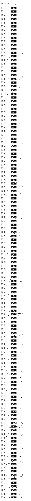

# CJK Unified Ideographs Extension E

**Range:** `U+2B820` - `U+2CEAF`

[← Back to Index](../README.md)

```text
        0 1 2 3 4 5 6 7 8 9 A B C D E F
       ┌───────────────────────────────
U+2B82_│𫠠𫠡𫠢𫠣𫠤𫠥𫠦𫠧𫠨𫠩𫠪𫠫𫠬𫠭𫠮𫠯
U+2B83_│𫠰𫠱𫠲𫠳𫠴𫠵𫠶𫠷𫠸𫠹𫠺𫠻𫠼𫠽𫠾𫠿
U+2B84_│𫡀𫡁𫡂𫡃𫡄𫡅𫡆𫡇𫡈𫡉𫡊𫡋𫡌𫡍𫡎𫡏
U+2B85_│𫡐𫡑𫡒𫡓𫡔𫡕𫡖𫡗𫡘𫡙𫡚𫡛𫡜𫡝𫡞𫡟
U+2B86_│𫡠𫡡𫡢𫡣𫡤𫡥𫡦𫡧𫡨𫡩𫡪𫡫𫡬𫡭𫡮𫡯
U+2B87_│𫡰𫡱𫡲𫡳𫡴𫡵𫡶𫡷𫡸𫡹𫡺𫡻𫡼𫡽𫡾𫡿
U+2B88_│𫢀𫢁𫢂𫢃𫢄𫢅𫢆𫢇𫢈𫢉𫢊𫢋𫢌𫢍𫢎𫢏
U+2B89_│𫢐𫢑𫢒𫢓𫢔𫢕𫢖𫢗𫢘𫢙𫢚𫢛𫢜𫢝𫢞𫢟
U+2B8A_│𫢠𫢡𫢢𫢣𫢤𫢥𫢦𫢧𫢨𫢩𫢪𫢫𫢬𫢭𫢮𫢯
U+2B8B_│𫢰𫢱𫢲𫢳𫢴𫢵𫢶𫢷𫢸𫢹𫢺𫢻𫢼𫢽𫢾𫢿
U+2B8C_│𫣀𫣁𫣂𫣃𫣄𫣅𫣆𫣇𫣈𫣉𫣊𫣋𫣌𫣍𫣎𫣏
U+2B8D_│𫣐𫣑𫣒𫣓𫣔𫣕𫣖𫣗𫣘𫣙𫣚𫣛𫣜𫣝𫣞𫣟
U+2B8E_│𫣠𫣡𫣢𫣣𫣤𫣥𫣦𫣧𫣨𫣩𫣪𫣫𫣬𫣭𫣮𫣯
U+2B8F_│𫣰𫣱𫣲𫣳𫣴𫣵𫣶𫣷𫣸𫣹𫣺𫣻𫣼𫣽𫣾𫣿
U+2B90_│𫤀𫤁𫤂𫤃𫤄𫤅𫤆𫤇𫤈𫤉𫤊𫤋𫤌𫤍𫤎𫤏
U+2B91_│𫤐𫤑𫤒𫤓𫤔𫤕𫤖𫤗𫤘𫤙𫤚𫤛𫤜𫤝𫤞𫤟
U+2B92_│𫤠𫤡𫤢𫤣𫤤𫤥𫤦𫤧𫤨𫤩𫤪𫤫𫤬𫤭𫤮𫤯
U+2B93_│𫤰𫤱𫤲𫤳𫤴𫤵𫤶𫤷𫤸𫤹𫤺𫤻𫤼𫤽𫤾𫤿
U+2B94_│𫥀𫥁𫥂𫥃𫥄𫥅𫥆𫥇𫥈𫥉𫥊𫥋𫥌𫥍𫥎𫥏
U+2B95_│𫥐𫥑𫥒𫥓𫥔𫥕𫥖𫥗𫥘𫥙𫥚𫥛𫥜𫥝𫥞𫥟
U+2B96_│𫥠𫥡𫥢𫥣𫥤𫥥𫥦𫥧𫥨𫥩𫥪𫥫𫥬𫥭𫥮𫥯
U+2B97_│𫥰𫥱𫥲𫥳𫥴𫥵𫥶𫥷𫥸𫥹𫥺𫥻𫥼𫥽𫥾𫥿
U+2B98_│𫦀𫦁𫦂𫦃𫦄𫦅𫦆𫦇𫦈𫦉𫦊𫦋𫦌𫦍𫦎𫦏
U+2B99_│𫦐𫦑𫦒𫦓𫦔𫦕𫦖𫦗𫦘𫦙𫦚𫦛𫦜𫦝𫦞𫦟
U+2B9A_│𫦠𫦡𫦢𫦣𫦤𫦥𫦦𫦧𫦨𫦩𫦪𫦫𫦬𫦭𫦮𫦯
U+2B9B_│𫦰𫦱𫦲𫦳𫦴𫦵𫦶𫦷𫦸𫦹𫦺𫦻𫦼𫦽𫦾𫦿
U+2B9C_│𫧀𫧁𫧂𫧃𫧄𫧅𫧆𫧇𫧈𫧉𫧊𫧋𫧌𫧍𫧎𫧏
U+2B9D_│𫧐𫧑𫧒𫧓𫧔𫧕𫧖𫧗𫧘𫧙𫧚𫧛𫧜𫧝𫧞𫧟
U+2B9E_│𫧠𫧡𫧢𫧣𫧤𫧥𫧦𫧧𫧨𫧩𫧪𫧫𫧬𫧭𫧮𫧯
U+2B9F_│𫧰𫧱𫧲𫧳𫧴𫧵𫧶𫧷𫧸𫧹𫧺𫧻𫧼𫧽𫧾𫧿
U+2BA0_│𫨀𫨁𫨂𫨃𫨄𫨅𫨆𫨇𫨈𫨉𫨊𫨋𫨌𫨍𫨎𫨏
U+2BA1_│𫨐𫨑𫨒𫨓𫨔𫨕𫨖𫨗𫨘𫨙𫨚𫨛𫨜𫨝𫨞𫨟
U+2BA2_│𫨠𫨡𫨢𫨣𫨤𫨥𫨦𫨧𫨨𫨩𫨪𫨫𫨬𫨭𫨮𫨯
U+2BA3_│𫨰𫨱𫨲𫨳𫨴𫨵𫨶𫨷𫨸𫨹𫨺𫨻𫨼𫨽𫨾𫨿
U+2BA4_│𫩀𫩁𫩂𫩃𫩄𫩅𫩆𫩇𫩈𫩉𫩊𫩋𫩌𫩍𫩎𫩏
U+2BA5_│𫩐𫩑𫩒𫩓𫩔𫩕𫩖𫩗𫩘𫩙𫩚𫩛𫩜𫩝𫩞𫩟
U+2BA6_│𫩠𫩡𫩢𫩣𫩤𫩥𫩦𫩧𫩨𫩩𫩪𫩫𫩬𫩭𫩮𫩯
U+2BA7_│𫩰𫩱𫩲𫩳𫩴𫩵𫩶𫩷𫩸𫩹𫩺𫩻𫩼𫩽𫩾𫩿
U+2BA8_│𫪀𫪁𫪂𫪃𫪄𫪅𫪆𫪇𫪈𫪉𫪊𫪋𫪌𫪍𫪎𫪏
U+2BA9_│𫪐𫪑𫪒𫪓𫪔𫪕𫪖𫪗𫪘𫪙𫪚𫪛𫪜𫪝𫪞𫪟
U+2BAA_│𫪠𫪡𫪢𫪣𫪤𫪥𫪦𫪧𫪨𫪩𫪪𫪫𫪬𫪭𫪮𫪯
U+2BAB_│𫪰𫪱𫪲𫪳𫪴𫪵𫪶𫪷𫪸𫪹𫪺𫪻𫪼𫪽𫪾𫪿
U+2BAC_│𫫀𫫁𫫂𫫃𫫄𫫅𫫆𫫇𫫈𫫉𫫊𫫋𫫌𫫍𫫎𫫏
U+2BAD_│𫫐𫫑𫫒𫫓𫫔𫫕𫫖𫫗𫫘𫫙𫫚𫫛𫫜𫫝𫫞𫫟
U+2BAE_│𫫠𫫡𫫢𫫣𫫤𫫥𫫦𫫧𫫨𫫩𫫪𫫫𫫬𫫭𫫮𫫯
U+2BAF_│𫫰𫫱𫫲𫫳𫫴𫫵𫫶𫫷𫫸𫫹𫫺𫫻𫫼𫫽𫫾𫫿
U+2BB0_│𫬀𫬁𫬂𫬃𫬄𫬅𫬆𫬇𫬈𫬉𫬊𫬋𫬌𫬍𫬎𫬏
U+2BB1_│𫬐𫬑𫬒𫬓𫬔𫬕𫬖𫬗𫬘𫬙𫬚𫬛𫬜𫬝𫬞𫬟
U+2BB2_│𫬠𫬡𫬢𫬣𫬤𫬥𫬦𫬧𫬨𫬩𫬪𫬫𫬬𫬭𫬮𫬯
U+2BB3_│𫬰𫬱𫬲𫬳𫬴𫬵𫬶𫬷𫬸𫬹𫬺𫬻𫬼𫬽𫬾𫬿
U+2BB4_│𫭀𫭁𫭂𫭃𫭄𫭅𫭆𫭇𫭈𫭉𫭊𫭋𫭌𫭍𫭎𫭏
U+2BB5_│𫭐𫭑𫭒𫭓𫭔𫭕𫭖𫭗𫭘𫭙𫭚𫭛𫭜𫭝𫭞𫭟
U+2BB6_│𫭠𫭡𫭢𫭣𫭤𫭥𫭦𫭧𫭨𫭩𫭪𫭫𫭬𫭭𫭮𫭯
U+2BB7_│𫭰𫭱𫭲𫭳𫭴𫭵𫭶𫭷𫭸𫭹𫭺𫭻𫭼𫭽𫭾𫭿
U+2BB8_│𫮀𫮁𫮂𫮃𫮄𫮅𫮆𫮇𫮈𫮉𫮊𫮋𫮌𫮍𫮎𫮏
U+2BB9_│𫮐𫮑𫮒𫮓𫮔𫮕𫮖𫮗𫮘𫮙𫮚𫮛𫮜𫮝𫮞𫮟
U+2BBA_│𫮠𫮡𫮢𫮣𫮤𫮥𫮦𫮧𫮨𫮩𫮪𫮫𫮬𫮭𫮮𫮯
U+2BBB_│𫮰𫮱𫮲𫮳𫮴𫮵𫮶𫮷𫮸𫮹𫮺𫮻𫮼𫮽𫮾𫮿
U+2BBC_│𫯀𫯁𫯂𫯃𫯄𫯅𫯆𫯇𫯈𫯉𫯊𫯋𫯌𫯍𫯎𫯏
U+2BBD_│𫯐𫯑𫯒𫯓𫯔𫯕𫯖𫯗𫯘𫯙𫯚𫯛𫯜𫯝𫯞𫯟
U+2BBE_│𫯠𫯡𫯢𫯣𫯤𫯥𫯦𫯧𫯨𫯩𫯪𫯫𫯬𫯭𫯮𫯯
U+2BBF_│𫯰𫯱𫯲𫯳𫯴𫯵𫯶𫯷𫯸𫯹𫯺𫯻𫯼𫯽𫯾𫯿
U+2BC0_│𫰀𫰁𫰂𫰃𫰄𫰅𫰆𫰇𫰈𫰉𫰊𫰋𫰌𫰍𫰎𫰏
U+2BC1_│𫰐𫰑𫰒𫰓𫰔𫰕𫰖𫰗𫰘𫰙𫰚𫰛𫰜𫰝𫰞𫰟
U+2BC2_│𫰠𫰡𫰢𫰣𫰤𫰥𫰦𫰧𫰨𫰩𫰪𫰫𫰬𫰭𫰮𫰯
U+2BC3_│𫰰𫰱𫰲𫰳𫰴𫰵𫰶𫰷𫰸𫰹𫰺𫰻𫰼𫰽𫰾𫰿
U+2BC4_│𫱀𫱁𫱂𫱃𫱄𫱅𫱆𫱇𫱈𫱉𫱊𫱋𫱌𫱍𫱎𫱏
U+2BC5_│𫱐𫱑𫱒𫱓𫱔𫱕𫱖𫱗𫱘𫱙𫱚𫱛𫱜𫱝𫱞𫱟
U+2BC6_│𫱠𫱡𫱢𫱣𫱤𫱥𫱦𫱧𫱨𫱩𫱪𫱫𫱬𫱭𫱮𫱯
U+2BC7_│𫱰𫱱𫱲𫱳𫱴𫱵𫱶𫱷𫱸𫱹𫱺𫱻𫱼𫱽𫱾𫱿
U+2BC8_│𫲀𫲁𫲂𫲃𫲄𫲅𫲆𫲇𫲈𫲉𫲊𫲋𫲌𫲍𫲎𫲏
U+2BC9_│𫲐𫲑𫲒𫲓𫲔𫲕𫲖𫲗𫲘𫲙𫲚𫲛𫲜𫲝𫲞𫲟
U+2BCA_│𫲠𫲡𫲢𫲣𫲤𫲥𫲦𫲧𫲨𫲩𫲪𫲫𫲬𫲭𫲮𫲯
U+2BCB_│𫲰𫲱𫲲𫲳𫲴𫲵𫲶𫲷𫲸𫲹𫲺𫲻𫲼𫲽𫲾𫲿
U+2BCC_│𫳀𫳁𫳂𫳃𫳄𫳅𫳆𫳇𫳈𫳉𫳊𫳋𫳌𫳍𫳎𫳏
U+2BCD_│𫳐𫳑𫳒𫳓𫳔𫳕𫳖𫳗𫳘𫳙𫳚𫳛𫳜𫳝𫳞𫳟
U+2BCE_│𫳠𫳡𫳢𫳣𫳤𫳥𫳦𫳧𫳨𫳩𫳪𫳫𫳬𫳭𫳮𫳯
U+2BCF_│𫳰𫳱𫳲𫳳𫳴𫳵𫳶𫳷𫳸𫳹𫳺𫳻𫳼𫳽𫳾𫳿
U+2BD0_│𫴀𫴁𫴂𫴃𫴄𫴅𫴆𫴇𫴈𫴉𫴊𫴋𫴌𫴍𫴎𫴏
U+2BD1_│𫴐𫴑𫴒𫴓𫴔𫴕𫴖𫴗𫴘𫴙𫴚𫴛𫴜𫴝𫴞𫴟
U+2BD2_│𫴠𫴡𫴢𫴣𫴤𫴥𫴦𫴧𫴨𫴩𫴪𫴫𫴬𫴭𫴮𫴯
U+2BD3_│𫴰𫴱𫴲𫴳𫴴𫴵𫴶𫴷𫴸𫴹𫴺𫴻𫴼𫴽𫴾𫴿
U+2BD4_│𫵀𫵁𫵂𫵃𫵄𫵅𫵆𫵇𫵈𫵉𫵊𫵋𫵌𫵍𫵎𫵏
U+2BD5_│𫵐𫵑𫵒𫵓𫵔𫵕𫵖𫵗𫵘𫵙𫵚𫵛𫵜𫵝𫵞𫵟
U+2BD6_│𫵠𫵡𫵢𫵣𫵤𫵥𫵦𫵧𫵨𫵩𫵪𫵫𫵬𫵭𫵮𫵯
U+2BD7_│𫵰𫵱𫵲𫵳𫵴𫵵𫵶𫵷𫵸𫵹𫵺𫵻𫵼𫵽𫵾𫵿
U+2BD8_│𫶀𫶁𫶂𫶃𫶄𫶅𫶆𫶇𫶈𫶉𫶊𫶋𫶌𫶍𫶎𫶏
U+2BD9_│𫶐𫶑𫶒𫶓𫶔𫶕𫶖𫶗𫶘𫶙𫶚𫶛𫶜𫶝𫶞𫶟
U+2BDA_│𫶠𫶡𫶢𫶣𫶤𫶥𫶦𫶧𫶨𫶩𫶪𫶫𫶬𫶭𫶮𫶯
U+2BDB_│𫶰𫶱𫶲𫶳𫶴𫶵𫶶𫶷𫶸𫶹𫶺𫶻𫶼𫶽𫶾𫶿
U+2BDC_│𫷀𫷁𫷂𫷃𫷄𫷅𫷆𫷇𫷈𫷉𫷊𫷋𫷌𫷍𫷎𫷏
U+2BDD_│𫷐𫷑𫷒𫷓𫷔𫷕𫷖𫷗𫷘𫷙𫷚𫷛𫷜𫷝𫷞𫷟
U+2BDE_│𫷠𫷡𫷢𫷣𫷤𫷥𫷦𫷧𫷨𫷩𫷪𫷫𫷬𫷭𫷮𫷯
U+2BDF_│𫷰𫷱𫷲𫷳𫷴𫷵𫷶𫷷𫷸𫷹𫷺𫷻𫷼𫷽𫷾𫷿
U+2BE0_│𫸀𫸁𫸂𫸃𫸄𫸅𫸆𫸇𫸈𫸉𫸊𫸋𫸌𫸍𫸎𫸏
U+2BE1_│𫸐𫸑𫸒𫸓𫸔𫸕𫸖𫸗𫸘𫸙𫸚𫸛𫸜𫸝𫸞𫸟
U+2BE2_│𫸠𫸡𫸢𫸣𫸤𫸥𫸦𫸧𫸨𫸩𫸪𫸫𫸬𫸭𫸮𫸯
U+2BE3_│𫸰𫸱𫸲𫸳𫸴𫸵𫸶𫸷𫸸𫸹𫸺𫸻𫸼𫸽𫸾𫸿
U+2BE4_│𫹀𫹁𫹂𫹃𫹄𫹅𫹆𫹇𫹈𫹉𫹊𫹋𫹌𫹍𫹎𫹏
U+2BE5_│𫹐𫹑𫹒𫹓𫹔𫹕𫹖𫹗𫹘𫹙𫹚𫹛𫹜𫹝𫹞𫹟
U+2BE6_│𫹠𫹡𫹢𫹣𫹤𫹥𫹦𫹧𫹨𫹩𫹪𫹫𫹬𫹭𫹮𫹯
U+2BE7_│𫹰𫹱𫹲𫹳𫹴𫹵𫹶𫹷𫹸𫹹𫹺𫹻𫹼𫹽𫹾𫹿
U+2BE8_│𫺀𫺁𫺂𫺃𫺄𫺅𫺆𫺇𫺈𫺉𫺊𫺋𫺌𫺍𫺎𫺏
U+2BE9_│𫺐𫺑𫺒𫺓𫺔𫺕𫺖𫺗𫺘𫺙𫺚𫺛𫺜𫺝𫺞𫺟
U+2BEA_│𫺠𫺡𫺢𫺣𫺤𫺥𫺦𫺧𫺨𫺩𫺪𫺫𫺬𫺭𫺮𫺯
U+2BEB_│𫺰𫺱𫺲𫺳𫺴𫺵𫺶𫺷𫺸𫺹𫺺𫺻𫺼𫺽𫺾𫺿
U+2BEC_│𫻀𫻁𫻂𫻃𫻄𫻅𫻆𫻇𫻈𫻉𫻊𫻋𫻌𫻍𫻎𫻏
U+2BED_│𫻐𫻑𫻒𫻓𫻔𫻕𫻖𫻗𫻘𫻙𫻚𫻛𫻜𫻝𫻞𫻟
U+2BEE_│𫻠𫻡𫻢𫻣𫻤𫻥𫻦𫻧𫻨𫻩𫻪𫻫𫻬𫻭𫻮𫻯
U+2BEF_│𫻰𫻱𫻲𫻳𫻴𫻵𫻶𫻷𫻸𫻹𫻺𫻻𫻼𫻽𫻾𫻿
U+2BF0_│𫼀𫼁𫼂𫼃𫼄𫼅𫼆𫼇𫼈𫼉𫼊𫼋𫼌𫼍𫼎𫼏
U+2BF1_│𫼐𫼑𫼒𫼓𫼔𫼕𫼖𫼗𫼘𫼙𫼚𫼛𫼜𫼝𫼞𫼟
U+2BF2_│𫼠𫼡𫼢𫼣𫼤𫼥𫼦𫼧𫼨𫼩𫼪𫼫𫼬𫼭𫼮𫼯
U+2BF3_│𫼰𫼱𫼲𫼳𫼴𫼵𫼶𫼷𫼸𫼹𫼺𫼻𫼼𫼽𫼾𫼿
U+2BF4_│𫽀𫽁𫽂𫽃𫽄𫽅𫽆𫽇𫽈𫽉𫽊𫽋𫽌𫽍𫽎𫽏
U+2BF5_│𫽐𫽑𫽒𫽓𫽔𫽕𫽖𫽗𫽘𫽙𫽚𫽛𫽜𫽝𫽞𫽟
U+2BF6_│𫽠𫽡𫽢𫽣𫽤𫽥𫽦𫽧𫽨𫽩𫽪𫽫𫽬𫽭𫽮𫽯
U+2BF7_│𫽰𫽱𫽲𫽳𫽴𫽵𫽶𫽷𫽸𫽹𫽺𫽻𫽼𫽽𫽾𫽿
U+2BF8_│𫾀𫾁𫾂𫾃𫾄𫾅𫾆𫾇𫾈𫾉𫾊𫾋𫾌𫾍𫾎𫾏
U+2BF9_│𫾐𫾑𫾒𫾓𫾔𫾕𫾖𫾗𫾘𫾙𫾚𫾛𫾜𫾝𫾞𫾟
U+2BFA_│𫾠𫾡𫾢𫾣𫾤𫾥𫾦𫾧𫾨𫾩𫾪𫾫𫾬𫾭𫾮𫾯
U+2BFB_│𫾰𫾱𫾲𫾳𫾴𫾵𫾶𫾷𫾸𫾹𫾺𫾻𫾼𫾽𫾾𫾿
U+2BFC_│𫿀𫿁𫿂𫿃𫿄𫿅𫿆𫿇𫿈𫿉𫿊𫿋𫿌𫿍𫿎𫿏
U+2BFD_│𫿐𫿑𫿒𫿓𫿔𫿕𫿖𫿗𫿘𫿙𫿚𫿛𫿜𫿝𫿞𫿟
U+2BFE_│𫿠𫿡𫿢𫿣𫿤𫿥𫿦𫿧𫿨𫿩𫿪𫿫𫿬𫿭𫿮𫿯
U+2BFF_│𫿰𫿱𫿲𫿳𫿴𫿵𫿶𫿷𫿸𫿹𫿺𫿻𫿼𫿽𫿾𫿿
U+2C00_│𬀀𬀁𬀂𬀃𬀄𬀅𬀆𬀇𬀈𬀉𬀊𬀋𬀌𬀍𬀎𬀏
U+2C01_│𬀐𬀑𬀒𬀓𬀔𬀕𬀖𬀗𬀘𬀙𬀚𬀛𬀜𬀝𬀞𬀟
U+2C02_│𬀠𬀡𬀢𬀣𬀤𬀥𬀦𬀧𬀨𬀩𬀪𬀫𬀬𬀭𬀮𬀯
U+2C03_│𬀰𬀱𬀲𬀳𬀴𬀵𬀶𬀷𬀸𬀹𬀺𬀻𬀼𬀽𬀾𬀿
U+2C04_│𬁀𬁁𬁂𬁃𬁄𬁅𬁆𬁇𬁈𬁉𬁊𬁋𬁌𬁍𬁎𬁏
U+2C05_│𬁐𬁑𬁒𬁓𬁔𬁕𬁖𬁗𬁘𬁙𬁚𬁛𬁜𬁝𬁞𬁟
U+2C06_│𬁠𬁡𬁢𬁣𬁤𬁥𬁦𬁧𬁨𬁩𬁪𬁫𬁬𬁭𬁮𬁯
U+2C07_│𬁰𬁱𬁲𬁳𬁴𬁵𬁶𬁷𬁸𬁹𬁺𬁻𬁼𬁽𬁾𬁿
U+2C08_│𬂀𬂁𬂂𬂃𬂄𬂅𬂆𬂇𬂈𬂉𬂊𬂋𬂌𬂍𬂎𬂏
U+2C09_│𬂐𬂑𬂒𬂓𬂔𬂕𬂖𬂗𬂘𬂙𬂚𬂛𬂜𬂝𬂞𬂟
U+2C0A_│𬂠𬂡𬂢𬂣𬂤𬂥𬂦𬂧𬂨𬂩𬂪𬂫𬂬𬂭𬂮𬂯
U+2C0B_│𬂰𬂱𬂲𬂳𬂴𬂵𬂶𬂷𬂸𬂹𬂺𬂻𬂼𬂽𬂾𬂿
U+2C0C_│𬃀𬃁𬃂𬃃𬃄𬃅𬃆𬃇𬃈𬃉𬃊𬃋𬃌𬃍𬃎𬃏
U+2C0D_│𬃐𬃑𬃒𬃓𬃔𬃕𬃖𬃗𬃘𬃙𬃚𬃛𬃜𬃝𬃞𬃟
U+2C0E_│𬃠𬃡𬃢𬃣𬃤𬃥𬃦𬃧𬃨𬃩𬃪𬃫𬃬𬃭𬃮𬃯
U+2C0F_│𬃰𬃱𬃲𬃳𬃴𬃵𬃶𬃷𬃸𬃹𬃺𬃻𬃼𬃽𬃾𬃿
U+2C10_│𬄀𬄁𬄂𬄃𬄄𬄅𬄆𬄇𬄈𬄉𬄊𬄋𬄌𬄍𬄎𬄏
U+2C11_│𬄐𬄑𬄒𬄓𬄔𬄕𬄖𬄗𬄘𬄙𬄚𬄛𬄜𬄝𬄞𬄟
U+2C12_│𬄠𬄡𬄢𬄣𬄤𬄥𬄦𬄧𬄨𬄩𬄪𬄫𬄬𬄭𬄮𬄯
U+2C13_│𬄰𬄱𬄲𬄳𬄴𬄵𬄶𬄷𬄸𬄹𬄺𬄻𬄼𬄽𬄾𬄿
U+2C14_│𬅀𬅁𬅂𬅃𬅄𬅅𬅆𬅇𬅈𬅉𬅊𬅋𬅌𬅍𬅎𬅏
U+2C15_│𬅐𬅑𬅒𬅓𬅔𬅕𬅖𬅗𬅘𬅙𬅚𬅛𬅜𬅝𬅞𬅟
U+2C16_│𬅠𬅡𬅢𬅣𬅤𬅥𬅦𬅧𬅨𬅩𬅪𬅫𬅬𬅭𬅮𬅯
U+2C17_│𬅰𬅱𬅲𬅳𬅴𬅵𬅶𬅷𬅸𬅹𬅺𬅻𬅼𬅽𬅾𬅿
U+2C18_│𬆀𬆁𬆂𬆃𬆄𬆅𬆆𬆇𬆈𬆉𬆊𬆋𬆌𬆍𬆎𬆏
U+2C19_│𬆐𬆑𬆒𬆓𬆔𬆕𬆖𬆗𬆘𬆙𬆚𬆛𬆜𬆝𬆞𬆟
U+2C1A_│𬆠𬆡𬆢𬆣𬆤𬆥𬆦𬆧𬆨𬆩𬆪𬆫𬆬𬆭𬆮𬆯
U+2C1B_│𬆰𬆱𬆲𬆳𬆴𬆵𬆶𬆷𬆸𬆹𬆺𬆻𬆼𬆽𬆾𬆿
U+2C1C_│𬇀𬇁𬇂𬇃𬇄𬇅𬇆𬇇𬇈𬇉𬇊𬇋𬇌𬇍𬇎𬇏
U+2C1D_│𬇐𬇑𬇒𬇓𬇔𬇕𬇖𬇗𬇘𬇙𬇚𬇛𬇜𬇝𬇞𬇟
U+2C1E_│𬇠𬇡𬇢𬇣𬇤𬇥𬇦𬇧𬇨𬇩𬇪𬇫𬇬𬇭𬇮𬇯
U+2C1F_│𬇰𬇱𬇲𬇳𬇴𬇵𬇶𬇷𬇸𬇹𬇺𬇻𬇼𬇽𬇾𬇿
U+2C20_│𬈀𬈁𬈂𬈃𬈄𬈅𬈆𬈇𬈈𬈉𬈊𬈋𬈌𬈍𬈎𬈏
U+2C21_│𬈐𬈑𬈒𬈓𬈔𬈕𬈖𬈗𬈘𬈙𬈚𬈛𬈜𬈝𬈞𬈟
U+2C22_│𬈠𬈡𬈢𬈣𬈤𬈥𬈦𬈧𬈨𬈩𬈪𬈫𬈬𬈭𬈮𬈯
U+2C23_│𬈰𬈱𬈲𬈳𬈴𬈵𬈶𬈷𬈸𬈹𬈺𬈻𬈼𬈽𬈾𬈿
U+2C24_│𬉀𬉁𬉂𬉃𬉄𬉅𬉆𬉇𬉈𬉉𬉊𬉋𬉌𬉍𬉎𬉏
U+2C25_│𬉐𬉑𬉒𬉓𬉔𬉕𬉖𬉗𬉘𬉙𬉚𬉛𬉜𬉝𬉞𬉟
U+2C26_│𬉠𬉡𬉢𬉣𬉤𬉥𬉦𬉧𬉨𬉩𬉪𬉫𬉬𬉭𬉮𬉯
U+2C27_│𬉰𬉱𬉲𬉳𬉴𬉵𬉶𬉷𬉸𬉹𬉺𬉻𬉼𬉽𬉾𬉿
U+2C28_│𬊀𬊁𬊂𬊃𬊄𬊅𬊆𬊇𬊈𬊉𬊊𬊋𬊌𬊍𬊎𬊏
U+2C29_│𬊐𬊑𬊒𬊓𬊔𬊕𬊖𬊗𬊘𬊙𬊚𬊛𬊜𬊝𬊞𬊟
U+2C2A_│𬊠𬊡𬊢𬊣𬊤𬊥𬊦𬊧𬊨𬊩𬊪𬊫𬊬𬊭𬊮𬊯
U+2C2B_│𬊰𬊱𬊲𬊳𬊴𬊵𬊶𬊷𬊸𬊹𬊺𬊻𬊼𬊽𬊾𬊿
U+2C2C_│𬋀𬋁𬋂𬋃𬋄𬋅𬋆𬋇𬋈𬋉𬋊𬋋𬋌𬋍𬋎𬋏
U+2C2D_│𬋐𬋑𬋒𬋓𬋔𬋕𬋖𬋗𬋘𬋙𬋚𬋛𬋜𬋝𬋞𬋟
U+2C2E_│𬋠𬋡𬋢𬋣𬋤𬋥𬋦𬋧𬋨𬋩𬋪𬋫𬋬𬋭𬋮𬋯
U+2C2F_│𬋰𬋱𬋲𬋳𬋴𬋵𬋶𬋷𬋸𬋹𬋺𬋻𬋼𬋽𬋾𬋿
U+2C30_│𬌀𬌁𬌂𬌃𬌄𬌅𬌆𬌇𬌈𬌉𬌊𬌋𬌌𬌍𬌎𬌏
U+2C31_│𬌐𬌑𬌒𬌓𬌔𬌕𬌖𬌗𬌘𬌙𬌚𬌛𬌜𬌝𬌞𬌟
U+2C32_│𬌠𬌡𬌢𬌣𬌤𬌥𬌦𬌧𬌨𬌩𬌪𬌫𬌬𬌭𬌮𬌯
U+2C33_│𬌰𬌱𬌲𬌳𬌴𬌵𬌶𬌷𬌸𬌹𬌺𬌻𬌼𬌽𬌾𬌿
U+2C34_│𬍀𬍁𬍂𬍃𬍄𬍅𬍆𬍇𬍈𬍉𬍊𬍋𬍌𬍍𬍎𬍏
U+2C35_│𬍐𬍑𬍒𬍓𬍔𬍕𬍖𬍗𬍘𬍙𬍚𬍛𬍜𬍝𬍞𬍟
U+2C36_│𬍠𬍡𬍢𬍣𬍤𬍥𬍦𬍧𬍨𬍩𬍪𬍫𬍬𬍭𬍮𬍯
U+2C37_│𬍰𬍱𬍲𬍳𬍴𬍵𬍶𬍷𬍸𬍹𬍺𬍻𬍼𬍽𬍾𬍿
U+2C38_│𬎀𬎁𬎂𬎃𬎄𬎅𬎆𬎇𬎈𬎉𬎊𬎋𬎌𬎍𬎎𬎏
U+2C39_│𬎐𬎑𬎒𬎓𬎔𬎕𬎖𬎗𬎘𬎙𬎚𬎛𬎜𬎝𬎞𬎟
U+2C3A_│𬎠𬎡𬎢𬎣𬎤𬎥𬎦𬎧𬎨𬎩𬎪𬎫𬎬𬎭𬎮𬎯
U+2C3B_│𬎰𬎱𬎲𬎳𬎴𬎵𬎶𬎷𬎸𬎹𬎺𬎻𬎼𬎽𬎾𬎿
U+2C3C_│𬏀𬏁𬏂𬏃𬏄𬏅𬏆𬏇𬏈𬏉𬏊𬏋𬏌𬏍𬏎𬏏
U+2C3D_│𬏐𬏑𬏒𬏓𬏔𬏕𬏖𬏗𬏘𬏙𬏚𬏛𬏜𬏝𬏞𬏟
U+2C3E_│𬏠𬏡𬏢𬏣𬏤𬏥𬏦𬏧𬏨𬏩𬏪𬏫𬏬𬏭𬏮𬏯
U+2C3F_│𬏰𬏱𬏲𬏳𬏴𬏵𬏶𬏷𬏸𬏹𬏺𬏻𬏼𬏽𬏾𬏿
U+2C40_│𬐀𬐁𬐂𬐃𬐄𬐅𬐆𬐇𬐈𬐉𬐊𬐋𬐌𬐍𬐎𬐏
U+2C41_│𬐐𬐑𬐒𬐓𬐔𬐕𬐖𬐗𬐘𬐙𬐚𬐛𬐜𬐝𬐞𬐟
U+2C42_│𬐠𬐡𬐢𬐣𬐤𬐥𬐦𬐧𬐨𬐩𬐪𬐫𬐬𬐭𬐮𬐯
U+2C43_│𬐰𬐱𬐲𬐳𬐴𬐵𬐶𬐷𬐸𬐹𬐺𬐻𬐼𬐽𬐾𬐿
U+2C44_│𬑀𬑁𬑂𬑃𬑄𬑅𬑆𬑇𬑈𬑉𬑊𬑋𬑌𬑍𬑎𬑏
U+2C45_│𬑐𬑑𬑒𬑓𬑔𬑕𬑖𬑗𬑘𬑙𬑚𬑛𬑜𬑝𬑞𬑟
U+2C46_│𬑠𬑡𬑢𬑣𬑤𬑥𬑦𬑧𬑨𬑩𬑪𬑫𬑬𬑭𬑮𬑯
U+2C47_│𬑰𬑱𬑲𬑳𬑴𬑵𬑶𬑷𬑸𬑹𬑺𬑻𬑼𬑽𬑾𬑿
U+2C48_│𬒀𬒁𬒂𬒃𬒄𬒅𬒆𬒇𬒈𬒉𬒊𬒋𬒌𬒍𬒎𬒏
U+2C49_│𬒐𬒑𬒒𬒓𬒔𬒕𬒖𬒗𬒘𬒙𬒚𬒛𬒜𬒝𬒞𬒟
U+2C4A_│𬒠𬒡𬒢𬒣𬒤𬒥𬒦𬒧𬒨𬒩𬒪𬒫𬒬𬒭𬒮𬒯
U+2C4B_│𬒰𬒱𬒲𬒳𬒴𬒵𬒶𬒷𬒸𬒹𬒺𬒻𬒼𬒽𬒾𬒿
U+2C4C_│𬓀𬓁𬓂𬓃𬓄𬓅𬓆𬓇𬓈𬓉𬓊𬓋𬓌𬓍𬓎𬓏
U+2C4D_│𬓐𬓑𬓒𬓓𬓔𬓕𬓖𬓗𬓘𬓙𬓚𬓛𬓜𬓝𬓞𬓟
U+2C4E_│𬓠𬓡𬓢𬓣𬓤𬓥𬓦𬓧𬓨𬓩𬓪𬓫𬓬𬓭𬓮𬓯
U+2C4F_│𬓰𬓱𬓲𬓳𬓴𬓵𬓶𬓷𬓸𬓹𬓺𬓻𬓼𬓽𬓾𬓿
U+2C50_│𬔀𬔁𬔂𬔃𬔄𬔅𬔆𬔇𬔈𬔉𬔊𬔋𬔌𬔍𬔎𬔏
U+2C51_│𬔐𬔑𬔒𬔓𬔔𬔕𬔖𬔗𬔘𬔙𬔚𬔛𬔜𬔝𬔞𬔟
U+2C52_│𬔠𬔡𬔢𬔣𬔤𬔥𬔦𬔧𬔨𬔩𬔪𬔫𬔬𬔭𬔮𬔯
U+2C53_│𬔰𬔱𬔲𬔳𬔴𬔵𬔶𬔷𬔸𬔹𬔺𬔻𬔼𬔽𬔾𬔿
U+2C54_│𬕀𬕁𬕂𬕃𬕄𬕅𬕆𬕇𬕈𬕉𬕊𬕋𬕌𬕍𬕎𬕏
U+2C55_│𬕐𬕑𬕒𬕓𬕔𬕕𬕖𬕗𬕘𬕙𬕚𬕛𬕜𬕝𬕞𬕟
U+2C56_│𬕠𬕡𬕢𬕣𬕤𬕥𬕦𬕧𬕨𬕩𬕪𬕫𬕬𬕭𬕮𬕯
U+2C57_│𬕰𬕱𬕲𬕳𬕴𬕵𬕶𬕷𬕸𬕹𬕺𬕻𬕼𬕽𬕾𬕿
U+2C58_│𬖀𬖁𬖂𬖃𬖄𬖅𬖆𬖇𬖈𬖉𬖊𬖋𬖌𬖍𬖎𬖏
U+2C59_│𬖐𬖑𬖒𬖓𬖔𬖕𬖖𬖗𬖘𬖙𬖚𬖛𬖜𬖝𬖞𬖟
U+2C5A_│𬖠𬖡𬖢𬖣𬖤𬖥𬖦𬖧𬖨𬖩𬖪𬖫𬖬𬖭𬖮𬖯
U+2C5B_│𬖰𬖱𬖲𬖳𬖴𬖵𬖶𬖷𬖸𬖹𬖺𬖻𬖼𬖽𬖾𬖿
U+2C5C_│𬗀𬗁𬗂𬗃𬗄𬗅𬗆𬗇𬗈𬗉𬗊𬗋𬗌𬗍𬗎𬗏
U+2C5D_│𬗐𬗑𬗒𬗓𬗔𬗕𬗖𬗗𬗘𬗙𬗚𬗛𬗜𬗝𬗞𬗟
U+2C5E_│𬗠𬗡𬗢𬗣𬗤𬗥𬗦𬗧𬗨𬗩𬗪𬗫𬗬𬗭𬗮𬗯
U+2C5F_│𬗰𬗱𬗲𬗳𬗴𬗵𬗶𬗷𬗸𬗹𬗺𬗻𬗼𬗽𬗾𬗿
U+2C60_│𬘀𬘁𬘂𬘃𬘄𬘅𬘆𬘇𬘈𬘉𬘊𬘋𬘌𬘍𬘎𬘏
U+2C61_│𬘐𬘑𬘒𬘓𬘔𬘕𬘖𬘗𬘘𬘙𬘚𬘛𬘜𬘝𬘞𬘟
U+2C62_│𬘠𬘡𬘢𬘣𬘤𬘥𬘦𬘧𬘨𬘩𬘪𬘫𬘬𬘭𬘮𬘯
U+2C63_│𬘰𬘱𬘲𬘳𬘴𬘵𬘶𬘷𬘸𬘹𬘺𬘻𬘼𬘽𬘾𬘿
U+2C64_│𬙀𬙁𬙂𬙃𬙄𬙅𬙆𬙇𬙈𬙉𬙊𬙋𬙌𬙍𬙎𬙏
U+2C65_│𬙐𬙑𬙒𬙓𬙔𬙕𬙖𬙗𬙘𬙙𬙚𬙛𬙜𬙝𬙞𬙟
U+2C66_│𬙠𬙡𬙢𬙣𬙤𬙥𬙦𬙧𬙨𬙩𬙪𬙫𬙬𬙭𬙮𬙯
U+2C67_│𬙰𬙱𬙲𬙳𬙴𬙵𬙶𬙷𬙸𬙹𬙺𬙻𬙼𬙽𬙾𬙿
U+2C68_│𬚀𬚁𬚂𬚃𬚄𬚅𬚆𬚇𬚈𬚉𬚊𬚋𬚌𬚍𬚎𬚏
U+2C69_│𬚐𬚑𬚒𬚓𬚔𬚕𬚖𬚗𬚘𬚙𬚚𬚛𬚜𬚝𬚞𬚟
U+2C6A_│𬚠𬚡𬚢𬚣𬚤𬚥𬚦𬚧𬚨𬚩𬚪𬚫𬚬𬚭𬚮𬚯
U+2C6B_│𬚰𬚱𬚲𬚳𬚴𬚵𬚶𬚷𬚸𬚹𬚺𬚻𬚼𬚽𬚾𬚿
U+2C6C_│𬛀𬛁𬛂𬛃𬛄𬛅𬛆𬛇𬛈𬛉𬛊𬛋𬛌𬛍𬛎𬛏
U+2C6D_│𬛐𬛑𬛒𬛓𬛔𬛕𬛖𬛗𬛘𬛙𬛚𬛛𬛜𬛝𬛞𬛟
U+2C6E_│𬛠𬛡𬛢𬛣𬛤𬛥𬛦𬛧𬛨𬛩𬛪𬛫𬛬𬛭𬛮𬛯
U+2C6F_│𬛰𬛱𬛲𬛳𬛴𬛵𬛶𬛷𬛸𬛹𬛺𬛻𬛼𬛽𬛾𬛿
U+2C70_│𬜀𬜁𬜂𬜃𬜄𬜅𬜆𬜇𬜈𬜉𬜊𬜋𬜌𬜍𬜎𬜏
U+2C71_│𬜐𬜑𬜒𬜓𬜔𬜕𬜖𬜗𬜘𬜙𬜚𬜛𬜜𬜝𬜞𬜟
U+2C72_│𬜠𬜡𬜢𬜣𬜤𬜥𬜦𬜧𬜨𬜩𬜪𬜫𬜬𬜭𬜮𬜯
U+2C73_│𬜰𬜱𬜲𬜳𬜴𬜵𬜶𬜷𬜸𬜹𬜺𬜻𬜼𬜽𬜾𬜿
U+2C74_│𬝀𬝁𬝂𬝃𬝄𬝅𬝆𬝇𬝈𬝉𬝊𬝋𬝌𬝍𬝎𬝏
U+2C75_│𬝐𬝑𬝒𬝓𬝔𬝕𬝖𬝗𬝘𬝙𬝚𬝛𬝜𬝝𬝞𬝟
U+2C76_│𬝠𬝡𬝢𬝣𬝤𬝥𬝦𬝧𬝨𬝩𬝪𬝫𬝬𬝭𬝮𬝯
U+2C77_│𬝰𬝱𬝲𬝳𬝴𬝵𬝶𬝷𬝸𬝹𬝺𬝻𬝼𬝽𬝾𬝿
U+2C78_│𬞀𬞁𬞂𬞃𬞄𬞅𬞆𬞇𬞈𬞉𬞊𬞋𬞌𬞍𬞎𬞏
U+2C79_│𬞐𬞑𬞒𬞓𬞔𬞕𬞖𬞗𬞘𬞙𬞚𬞛𬞜𬞝𬞞𬞟
U+2C7A_│𬞠𬞡𬞢𬞣𬞤𬞥𬞦𬞧𬞨𬞩𬞪𬞫𬞬𬞭𬞮𬞯
U+2C7B_│𬞰𬞱𬞲𬞳𬞴𬞵𬞶𬞷𬞸𬞹𬞺𬞻𬞼𬞽𬞾𬞿
U+2C7C_│𬟀𬟁𬟂𬟃𬟄𬟅𬟆𬟇𬟈𬟉𬟊𬟋𬟌𬟍𬟎𬟏
U+2C7D_│𬟐𬟑𬟒𬟓𬟔𬟕𬟖𬟗𬟘𬟙𬟚𬟛𬟜𬟝𬟞𬟟
U+2C7E_│𬟠𬟡𬟢𬟣𬟤𬟥𬟦𬟧𬟨𬟩𬟪𬟫𬟬𬟭𬟮𬟯
U+2C7F_│𬟰𬟱𬟲𬟳𬟴𬟵𬟶𬟷𬟸𬟹𬟺𬟻𬟼𬟽𬟾𬟿
U+2C80_│𬠀𬠁𬠂𬠃𬠄𬠅𬠆𬠇𬠈𬠉𬠊𬠋𬠌𬠍𬠎𬠏
U+2C81_│𬠐𬠑𬠒𬠓𬠔𬠕𬠖𬠗𬠘𬠙𬠚𬠛𬠜𬠝𬠞𬠟
U+2C82_│𬠠𬠡𬠢𬠣𬠤𬠥𬠦𬠧𬠨𬠩𬠪𬠫𬠬𬠭𬠮𬠯
U+2C83_│𬠰𬠱𬠲𬠳𬠴𬠵𬠶𬠷𬠸𬠹𬠺𬠻𬠼𬠽𬠾𬠿
U+2C84_│𬡀𬡁𬡂𬡃𬡄𬡅𬡆𬡇𬡈𬡉𬡊𬡋𬡌𬡍𬡎𬡏
U+2C85_│𬡐𬡑𬡒𬡓𬡔𬡕𬡖𬡗𬡘𬡙𬡚𬡛𬡜𬡝𬡞𬡟
U+2C86_│𬡠𬡡𬡢𬡣𬡤𬡥𬡦𬡧𬡨𬡩𬡪𬡫𬡬𬡭𬡮𬡯
U+2C87_│𬡰𬡱𬡲𬡳𬡴𬡵𬡶𬡷𬡸𬡹𬡺𬡻𬡼𬡽𬡾𬡿
U+2C88_│𬢀𬢁𬢂𬢃𬢄𬢅𬢆𬢇𬢈𬢉𬢊𬢋𬢌𬢍𬢎𬢏
U+2C89_│𬢐𬢑𬢒𬢓𬢔𬢕𬢖𬢗𬢘𬢙𬢚𬢛𬢜𬢝𬢞𬢟
U+2C8A_│𬢠𬢡𬢢𬢣𬢤𬢥𬢦𬢧𬢨𬢩𬢪𬢫𬢬𬢭𬢮𬢯
U+2C8B_│𬢰𬢱𬢲𬢳𬢴𬢵𬢶𬢷𬢸𬢹𬢺𬢻𬢼𬢽𬢾𬢿
U+2C8C_│𬣀𬣁𬣂𬣃𬣄𬣅𬣆𬣇𬣈𬣉𬣊𬣋𬣌𬣍𬣎𬣏
U+2C8D_│𬣐𬣑𬣒𬣓𬣔𬣕𬣖𬣗𬣘𬣙𬣚𬣛𬣜𬣝𬣞𬣟
U+2C8E_│𬣠𬣡𬣢𬣣𬣤𬣥𬣦𬣧𬣨𬣩𬣪𬣫𬣬𬣭𬣮𬣯
U+2C8F_│𬣰𬣱𬣲𬣳𬣴𬣵𬣶𬣷𬣸𬣹𬣺𬣻𬣼𬣽𬣾𬣿
U+2C90_│𬤀𬤁𬤂𬤃𬤄𬤅𬤆𬤇𬤈𬤉𬤊𬤋𬤌𬤍𬤎𬤏
U+2C91_│𬤐𬤑𬤒𬤓𬤔𬤕𬤖𬤗𬤘𬤙𬤚𬤛𬤜𬤝𬤞𬤟
U+2C92_│𬤠𬤡𬤢𬤣𬤤𬤥𬤦𬤧𬤨𬤩𬤪𬤫𬤬𬤭𬤮𬤯
U+2C93_│𬤰𬤱𬤲𬤳𬤴𬤵𬤶𬤷𬤸𬤹𬤺𬤻𬤼𬤽𬤾𬤿
U+2C94_│𬥀𬥁𬥂𬥃𬥄𬥅𬥆𬥇𬥈𬥉𬥊𬥋𬥌𬥍𬥎𬥏
U+2C95_│𬥐𬥑𬥒𬥓𬥔𬥕𬥖𬥗𬥘𬥙𬥚𬥛𬥜𬥝𬥞𬥟
U+2C96_│𬥠𬥡𬥢𬥣𬥤𬥥𬥦𬥧𬥨𬥩𬥪𬥫𬥬𬥭𬥮𬥯
U+2C97_│𬥰𬥱𬥲𬥳𬥴𬥵𬥶𬥷𬥸𬥹𬥺𬥻𬥼𬥽𬥾𬥿
U+2C98_│𬦀𬦁𬦂𬦃𬦄𬦅𬦆𬦇𬦈𬦉𬦊𬦋𬦌𬦍𬦎𬦏
U+2C99_│𬦐𬦑𬦒𬦓𬦔𬦕𬦖𬦗𬦘𬦙𬦚𬦛𬦜𬦝𬦞𬦟
U+2C9A_│𬦠𬦡𬦢𬦣𬦤𬦥𬦦𬦧𬦨𬦩𬦪𬦫𬦬𬦭𬦮𬦯
U+2C9B_│𬦰𬦱𬦲𬦳𬦴𬦵𬦶𬦷𬦸𬦹𬦺𬦻𬦼𬦽𬦾𬦿
U+2C9C_│𬧀𬧁𬧂𬧃𬧄𬧅𬧆𬧇𬧈𬧉𬧊𬧋𬧌𬧍𬧎𬧏
U+2C9D_│𬧐𬧑𬧒𬧓𬧔𬧕𬧖𬧗𬧘𬧙𬧚𬧛𬧜𬧝𬧞𬧟
U+2C9E_│𬧠𬧡𬧢𬧣𬧤𬧥𬧦𬧧𬧨𬧩𬧪𬧫𬧬𬧭𬧮𬧯
U+2C9F_│𬧰𬧱𬧲𬧳𬧴𬧵𬧶𬧷𬧸𬧹𬧺𬧻𬧼𬧽𬧾𬧿
U+2CA0_│𬨀𬨁𬨂𬨃𬨄𬨅𬨆𬨇𬨈𬨉𬨊𬨋𬨌𬨍𬨎𬨏
U+2CA1_│𬨐𬨑𬨒𬨓𬨔𬨕𬨖𬨗𬨘𬨙𬨚𬨛𬨜𬨝𬨞𬨟
U+2CA2_│𬨠𬨡𬨢𬨣𬨤𬨥𬨦𬨧𬨨𬨩𬨪𬨫𬨬𬨭𬨮𬨯
U+2CA3_│𬨰𬨱𬨲𬨳𬨴𬨵𬨶𬨷𬨸𬨹𬨺𬨻𬨼𬨽𬨾𬨿
U+2CA4_│𬩀𬩁𬩂𬩃𬩄𬩅𬩆𬩇𬩈𬩉𬩊𬩋𬩌𬩍𬩎𬩏
U+2CA5_│𬩐𬩑𬩒𬩓𬩔𬩕𬩖𬩗𬩘𬩙𬩚𬩛𬩜𬩝𬩞𬩟
U+2CA6_│𬩠𬩡𬩢𬩣𬩤𬩥𬩦𬩧𬩨𬩩𬩪𬩫𬩬𬩭𬩮𬩯
U+2CA7_│𬩰𬩱𬩲𬩳𬩴𬩵𬩶𬩷𬩸𬩹𬩺𬩻𬩼𬩽𬩾𬩿
U+2CA8_│𬪀𬪁𬪂𬪃𬪄𬪅𬪆𬪇𬪈𬪉𬪊𬪋𬪌𬪍𬪎𬪏
U+2CA9_│𬪐𬪑𬪒𬪓𬪔𬪕𬪖𬪗𬪘𬪙𬪚𬪛𬪜𬪝𬪞𬪟
U+2CAA_│𬪠𬪡𬪢𬪣𬪤𬪥𬪦𬪧𬪨𬪩𬪪𬪫𬪬𬪭𬪮𬪯
U+2CAB_│𬪰𬪱𬪲𬪳𬪴𬪵𬪶𬪷𬪸𬪹𬪺𬪻𬪼𬪽𬪾𬪿
U+2CAC_│𬫀𬫁𬫂𬫃𬫄𬫅𬫆𬫇𬫈𬫉𬫊𬫋𬫌𬫍𬫎𬫏
U+2CAD_│𬫐𬫑𬫒𬫓𬫔𬫕𬫖𬫗𬫘𬫙𬫚𬫛𬫜𬫝𬫞𬫟
U+2CAE_│𬫠𬫡𬫢𬫣𬫤𬫥𬫦𬫧𬫨𬫩𬫪𬫫𬫬𬫭𬫮𬫯
U+2CAF_│𬫰𬫱𬫲𬫳𬫴𬫵𬫶𬫷𬫸𬫹𬫺𬫻𬫼𬫽𬫾𬫿
U+2CB0_│𬬀𬬁𬬂𬬃𬬄𬬅𬬆𬬇𬬈𬬉𬬊𬬋𬬌𬬍𬬎𬬏
U+2CB1_│𬬐𬬑𬬒𬬓𬬔𬬕𬬖𬬗𬬘𬬙𬬚𬬛𬬜𬬝𬬞𬬟
U+2CB2_│𬬠𬬡𬬢𬬣𬬤𬬥𬬦𬬧𬬨𬬩𬬪𬬫𬬬𬬭𬬮𬬯
U+2CB3_│𬬰𬬱𬬲𬬳𬬴𬬵𬬶𬬷𬬸𬬹𬬺𬬻𬬼𬬽𬬾𬬿
U+2CB4_│𬭀𬭁𬭂𬭃𬭄𬭅𬭆𬭇𬭈𬭉𬭊𬭋𬭌𬭍𬭎𬭏
U+2CB5_│𬭐𬭑𬭒𬭓𬭔𬭕𬭖𬭗𬭘𬭙𬭚𬭛𬭜𬭝𬭞𬭟
U+2CB6_│𬭠𬭡𬭢𬭣𬭤𬭥𬭦𬭧𬭨𬭩𬭪𬭫𬭬𬭭𬭮𬭯
U+2CB7_│𬭰𬭱𬭲𬭳𬭴𬭵𬭶𬭷𬭸𬭹𬭺𬭻𬭼𬭽𬭾𬭿
U+2CB8_│𬮀𬮁𬮂𬮃𬮄𬮅𬮆𬮇𬮈𬮉𬮊𬮋𬮌𬮍𬮎𬮏
U+2CB9_│𬮐𬮑𬮒𬮓𬮔𬮕𬮖𬮗𬮘𬮙𬮚𬮛𬮜𬮝𬮞𬮟
U+2CBA_│𬮠𬮡𬮢𬮣𬮤𬮥𬮦𬮧𬮨𬮩𬮪𬮫𬮬𬮭𬮮𬮯
U+2CBB_│𬮰𬮱𬮲𬮳𬮴𬮵𬮶𬮷𬮸𬮹𬮺𬮻𬮼𬮽𬮾𬮿
U+2CBC_│𬯀𬯁𬯂𬯃𬯄𬯅𬯆𬯇𬯈𬯉𬯊𬯋𬯌𬯍𬯎𬯏
U+2CBD_│𬯐𬯑𬯒𬯓𬯔𬯕𬯖𬯗𬯘𬯙𬯚𬯛𬯜𬯝𬯞𬯟
U+2CBE_│𬯠𬯡𬯢𬯣𬯤𬯥𬯦𬯧𬯨𬯩𬯪𬯫𬯬𬯭𬯮𬯯
U+2CBF_│𬯰𬯱𬯲𬯳𬯴𬯵𬯶𬯷𬯸𬯹𬯺𬯻𬯼𬯽𬯾𬯿
U+2CC0_│𬰀𬰁𬰂𬰃𬰄𬰅𬰆𬰇𬰈𬰉𬰊𬰋𬰌𬰍𬰎𬰏
U+2CC1_│𬰐𬰑𬰒𬰓𬰔𬰕𬰖𬰗𬰘𬰙𬰚𬰛𬰜𬰝𬰞𬰟
U+2CC2_│𬰠𬰡𬰢𬰣𬰤𬰥𬰦𬰧𬰨𬰩𬰪𬰫𬰬𬰭𬰮𬰯
U+2CC3_│𬰰𬰱𬰲𬰳𬰴𬰵𬰶𬰷𬰸𬰹𬰺𬰻𬰼𬰽𬰾𬰿
U+2CC4_│𬱀𬱁𬱂𬱃𬱄𬱅𬱆𬱇𬱈𬱉𬱊𬱋𬱌𬱍𬱎𬱏
U+2CC5_│𬱐𬱑𬱒𬱓𬱔𬱕𬱖𬱗𬱘𬱙𬱚𬱛𬱜𬱝𬱞𬱟
U+2CC6_│𬱠𬱡𬱢𬱣𬱤𬱥𬱦𬱧𬱨𬱩𬱪𬱫𬱬𬱭𬱮𬱯
U+2CC7_│𬱰𬱱𬱲𬱳𬱴𬱵𬱶𬱷𬱸𬱹𬱺𬱻𬱼𬱽𬱾𬱿
U+2CC8_│𬲀𬲁𬲂𬲃𬲄𬲅𬲆𬲇𬲈𬲉𬲊𬲋𬲌𬲍𬲎𬲏
U+2CC9_│𬲐𬲑𬲒𬲓𬲔𬲕𬲖𬲗𬲘𬲙𬲚𬲛𬲜𬲝𬲞𬲟
U+2CCA_│𬲠𬲡𬲢𬲣𬲤𬲥𬲦𬲧𬲨𬲩𬲪𬲫𬲬𬲭𬲮𬲯
U+2CCB_│𬲰𬲱𬲲𬲳𬲴𬲵𬲶𬲷𬲸𬲹𬲺𬲻𬲼𬲽𬲾𬲿
U+2CCC_│𬳀𬳁𬳂𬳃𬳄𬳅𬳆𬳇𬳈𬳉𬳊𬳋𬳌𬳍𬳎𬳏
U+2CCD_│𬳐𬳑𬳒𬳓𬳔𬳕𬳖𬳗𬳘𬳙𬳚𬳛𬳜𬳝𬳞𬳟
U+2CCE_│𬳠𬳡𬳢𬳣𬳤𬳥𬳦𬳧𬳨𬳩𬳪𬳫𬳬𬳭𬳮𬳯
U+2CCF_│𬳰𬳱𬳲𬳳𬳴𬳵𬳶𬳷𬳸𬳹𬳺𬳻𬳼𬳽𬳾𬳿
U+2CD0_│𬴀𬴁𬴂𬴃𬴄𬴅𬴆𬴇𬴈𬴉𬴊𬴋𬴌𬴍𬴎𬴏
U+2CD1_│𬴐𬴑𬴒𬴓𬴔𬴕𬴖𬴗𬴘𬴙𬴚𬴛𬴜𬴝𬴞𬴟
U+2CD2_│𬴠𬴡𬴢𬴣𬴤𬴥𬴦𬴧𬴨𬴩𬴪𬴫𬴬𬴭𬴮𬴯
U+2CD3_│𬴰𬴱𬴲𬴳𬴴𬴵𬴶𬴷𬴸𬴹𬴺𬴻𬴼𬴽𬴾𬴿
U+2CD4_│𬵀𬵁𬵂𬵃𬵄𬵅𬵆𬵇𬵈𬵉𬵊𬵋𬵌𬵍𬵎𬵏
U+2CD5_│𬵐𬵑𬵒𬵓𬵔𬵕𬵖𬵗𬵘𬵙𬵚𬵛𬵜𬵝𬵞𬵟
U+2CD6_│𬵠𬵡𬵢𬵣𬵤𬵥𬵦𬵧𬵨𬵩𬵪𬵫𬵬𬵭𬵮𬵯
U+2CD7_│𬵰𬵱𬵲𬵳𬵴𬵵𬵶𬵷𬵸𬵹𬵺𬵻𬵼𬵽𬵾𬵿
U+2CD8_│𬶀𬶁𬶂𬶃𬶄𬶅𬶆𬶇𬶈𬶉𬶊𬶋𬶌𬶍𬶎𬶏
U+2CD9_│𬶐𬶑𬶒𬶓𬶔𬶕𬶖𬶗𬶘𬶙𬶚𬶛𬶜𬶝𬶞𬶟
U+2CDA_│𬶠𬶡𬶢𬶣𬶤𬶥𬶦𬶧𬶨𬶩𬶪𬶫𬶬𬶭𬶮𬶯
U+2CDB_│𬶰𬶱𬶲𬶳𬶴𬶵𬶶𬶷𬶸𬶹𬶺𬶻𬶼𬶽𬶾𬶿
U+2CDC_│𬷀𬷁𬷂𬷃𬷄𬷅𬷆𬷇𬷈𬷉𬷊𬷋𬷌𬷍𬷎𬷏
U+2CDD_│𬷐𬷑𬷒𬷓𬷔𬷕𬷖𬷗𬷘𬷙𬷚𬷛𬷜𬷝𬷞𬷟
U+2CDE_│𬷠𬷡𬷢𬷣𬷤𬷥𬷦𬷧𬷨𬷩𬷪𬷫𬷬𬷭𬷮𬷯
U+2CDF_│𬷰𬷱𬷲𬷳𬷴𬷵𬷶𬷷𬷸𬷹𬷺𬷻𬷼𬷽𬷾𬷿
U+2CE0_│𬸀𬸁𬸂𬸃𬸄𬸅𬸆𬸇𬸈𬸉𬸊𬸋𬸌𬸍𬸎𬸏
U+2CE1_│𬸐𬸑𬸒𬸓𬸔𬸕𬸖𬸗𬸘𬸙𬸚𬸛𬸜𬸝𬸞𬸟
U+2CE2_│𬸠𬸡𬸢𬸣𬸤𬸥𬸦𬸧𬸨𬸩𬸪𬸫𬸬𬸭𬸮𬸯
U+2CE3_│𬸰𬸱𬸲𬸳𬸴𬸵𬸶𬸷𬸸𬸹𬸺𬸻𬸼𬸽𬸾𬸿
U+2CE4_│𬹀𬹁𬹂𬹃𬹄𬹅𬹆𬹇𬹈𬹉𬹊𬹋𬹌𬹍𬹎𬹏
U+2CE5_│𬹐𬹑𬹒𬹓𬹔𬹕𬹖𬹗𬹘𬹙𬹚𬹛𬹜𬹝𬹞𬹟
U+2CE6_│𬹠𬹡𬹢𬹣𬹤𬹥𬹦𬹧𬹨𬹩𬹪𬹫𬹬𬹭𬹮𬹯
U+2CE7_│𬹰𬹱𬹲𬹳𬹴𬹵𬹶𬹷𬹸𬹹𬹺𬹻𬹼𬹽𬹾𬹿
U+2CE8_│𬺀𬺁𬺂𬺃𬺄𬺅𬺆𬺇𬺈𬺉𬺊𬺋𬺌𬺍𬺎𬺏
U+2CE9_│𬺐𬺑𬺒𬺓𬺔𬺕𬺖𬺗𬺘𬺙𬺚𬺛𬺜𬺝𬺞𬺟
U+2CEA_│𬺠𬺡
```

## Visual Fallback Reference
If your system lacks the required fonts to render these characters properly, use the image below as a visual guide.


