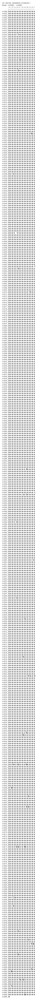

# CJK Unified Ideographs Extension F

**Range:** `U+2CEB0` - `U+2EBEF`

[← Back to Index](../README.md)

```text
        0 1 2 3 4 5 6 7 8 9 A B C D E F
       ┌───────────────────────────────
U+2CEB_│𬺰𬺱𬺲𬺳𬺴𬺵𬺶𬺷𬺸𬺹𬺺𬺻𬺼𬺽𬺾𬺿
U+2CEC_│𬻀𬻁𬻂𬻃𬻄𬻅𬻆𬻇𬻈𬻉𬻊𬻋𬻌𬻍𬻎𬻏
U+2CED_│𬻐𬻑𬻒𬻓𬻔𬻕𬻖𬻗𬻘𬻙𬻚𬻛𬻜𬻝𬻞𬻟
U+2CEE_│𬻠𬻡𬻢𬻣𬻤𬻥𬻦𬻧𬻨𬻩𬻪𬻫𬻬𬻭𬻮𬻯
U+2CEF_│𬻰𬻱𬻲𬻳𬻴𬻵𬻶𬻷𬻸𬻹𬻺𬻻𬻼𬻽𬻾𬻿
U+2CF0_│𬼀𬼁𬼂𬼃𬼄𬼅𬼆𬼇𬼈𬼉𬼊𬼋𬼌𬼍𬼎𬼏
U+2CF1_│𬼐𬼑𬼒𬼓𬼔𬼕𬼖𬼗𬼘𬼙𬼚𬼛𬼜𬼝𬼞𬼟
U+2CF2_│𬼠𬼡𬼢𬼣𬼤𬼥𬼦𬼧𬼨𬼩𬼪𬼫𬼬𬼭𬼮𬼯
U+2CF3_│𬼰𬼱𬼲𬼳𬼴𬼵𬼶𬼷𬼸𬼹𬼺𬼻𬼼𬼽𬼾𬼿
U+2CF4_│𬽀𬽁𬽂𬽃𬽄𬽅𬽆𬽇𬽈𬽉𬽊𬽋𬽌𬽍𬽎𬽏
U+2CF5_│𬽐𬽑𬽒𬽓𬽔𬽕𬽖𬽗𬽘𬽙𬽚𬽛𬽜𬽝𬽞𬽟
U+2CF6_│𬽠𬽡𬽢𬽣𬽤𬽥𬽦𬽧𬽨𬽩𬽪𬽫𬽬𬽭𬽮𬽯
U+2CF7_│𬽰𬽱𬽲𬽳𬽴𬽵𬽶𬽷𬽸𬽹𬽺𬽻𬽼𬽽𬽾𬽿
U+2CF8_│𬾀𬾁𬾂𬾃𬾄𬾅𬾆𬾇𬾈𬾉𬾊𬾋𬾌𬾍𬾎𬾏
U+2CF9_│𬾐𬾑𬾒𬾓𬾔𬾕𬾖𬾗𬾘𬾙𬾚𬾛𬾜𬾝𬾞𬾟
U+2CFA_│𬾠𬾡𬾢𬾣𬾤𬾥𬾦𬾧𬾨𬾩𬾪𬾫𬾬𬾭𬾮𬾯
U+2CFB_│𬾰𬾱𬾲𬾳𬾴𬾵𬾶𬾷𬾸𬾹𬾺𬾻𬾼𬾽𬾾𬾿
U+2CFC_│𬿀𬿁𬿂𬿃𬿄𬿅𬿆𬿇𬿈𬿉𬿊𬿋𬿌𬿍𬿎𬿏
U+2CFD_│𬿐𬿑𬿒𬿓𬿔𬿕𬿖𬿗𬿘𬿙𬿚𬿛𬿜𬿝𬿞𬿟
U+2CFE_│𬿠𬿡𬿢𬿣𬿤𬿥𬿦𬿧𬿨𬿩𬿪𬿫𬿬𬿭𬿮𬿯
U+2CFF_│𬿰𬿱𬿲𬿳𬿴𬿵𬿶𬿷𬿸𬿹𬿺𬿻𬿼𬿽𬿾𬿿
U+2D00_│𭀀𭀁𭀂𭀃𭀄𭀅𭀆𭀇𭀈𭀉𭀊𭀋𭀌𭀍𭀎𭀏
U+2D01_│𭀐𭀑𭀒𭀓𭀔𭀕𭀖𭀗𭀘𭀙𭀚𭀛𭀜𭀝𭀞𭀟
U+2D02_│𭀠𭀡𭀢𭀣𭀤𭀥𭀦𭀧𭀨𭀩𭀪𭀫𭀬𭀭𭀮𭀯
U+2D03_│𭀰𭀱𭀲𭀳𭀴𭀵𭀶𭀷𭀸𭀹𭀺𭀻𭀼𭀽𭀾𭀿
U+2D04_│𭁀𭁁𭁂𭁃𭁄𭁅𭁆𭁇𭁈𭁉𭁊𭁋𭁌𭁍𭁎𭁏
U+2D05_│𭁐𭁑𭁒𭁓𭁔𭁕𭁖𭁗𭁘𭁙𭁚𭁛𭁜𭁝𭁞𭁟
U+2D06_│𭁠𭁡𭁢𭁣𭁤𭁥𭁦𭁧𭁨𭁩𭁪𭁫𭁬𭁭𭁮𭁯
U+2D07_│𭁰𭁱𭁲𭁳𭁴𭁵𭁶𭁷𭁸𭁹𭁺𭁻𭁼𭁽𭁾𭁿
U+2D08_│𭂀𭂁𭂂𭂃𭂄𭂅𭂆𭂇𭂈𭂉𭂊𭂋𭂌𭂍𭂎𭂏
U+2D09_│𭂐𭂑𭂒𭂓𭂔𭂕𭂖𭂗𭂘𭂙𭂚𭂛𭂜𭂝𭂞𭂟
U+2D0A_│𭂠𭂡𭂢𭂣𭂤𭂥𭂦𭂧𭂨𭂩𭂪𭂫𭂬𭂭𭂮𭂯
U+2D0B_│𭂰𭂱𭂲𭂳𭂴𭂵𭂶𭂷𭂸𭂹𭂺𭂻𭂼𭂽𭂾𭂿
U+2D0C_│𭃀𭃁𭃂𭃃𭃄𭃅𭃆𭃇𭃈𭃉𭃊𭃋𭃌𭃍𭃎𭃏
U+2D0D_│𭃐𭃑𭃒𭃓𭃔𭃕𭃖𭃗𭃘𭃙𭃚𭃛𭃜𭃝𭃞𭃟
U+2D0E_│𭃠𭃡𭃢𭃣𭃤𭃥𭃦𭃧𭃨𭃩𭃪𭃫𭃬𭃭𭃮𭃯
U+2D0F_│𭃰𭃱𭃲𭃳𭃴𭃵𭃶𭃷𭃸𭃹𭃺𭃻𭃼𭃽𭃾𭃿
U+2D10_│𭄀𭄁𭄂𭄃𭄄𭄅𭄆𭄇𭄈𭄉𭄊𭄋𭄌𭄍𭄎𭄏
U+2D11_│𭄐𭄑𭄒𭄓𭄔𭄕𭄖𭄗𭄘𭄙𭄚𭄛𭄜𭄝𭄞𭄟
U+2D12_│𭄠𭄡𭄢𭄣𭄤𭄥𭄦𭄧𭄨𭄩𭄪𭄫𭄬𭄭𭄮𭄯
U+2D13_│𭄰𭄱𭄲𭄳𭄴𭄵𭄶𭄷𭄸𭄹𭄺𭄻𭄼𭄽𭄾𭄿
U+2D14_│𭅀𭅁𭅂𭅃𭅄𭅅𭅆𭅇𭅈𭅉𭅊𭅋𭅌𭅍𭅎𭅏
U+2D15_│𭅐𭅑𭅒𭅓𭅔𭅕𭅖𭅗𭅘𭅙𭅚𭅛𭅜𭅝𭅞𭅟
U+2D16_│𭅠𭅡𭅢𭅣𭅤𭅥𭅦𭅧𭅨𭅩𭅪𭅫𭅬𭅭𭅮𭅯
U+2D17_│𭅰𭅱𭅲𭅳𭅴𭅵𭅶𭅷𭅸𭅹𭅺𭅻𭅼𭅽𭅾𭅿
U+2D18_│𭆀𭆁𭆂𭆃𭆄𭆅𭆆𭆇𭆈𭆉𭆊𭆋𭆌𭆍𭆎𭆏
U+2D19_│𭆐𭆑𭆒𭆓𭆔𭆕𭆖𭆗𭆘𭆙𭆚𭆛𭆜𭆝𭆞𭆟
U+2D1A_│𭆠𭆡𭆢𭆣𭆤𭆥𭆦𭆧𭆨𭆩𭆪𭆫𭆬𭆭𭆮𭆯
U+2D1B_│𭆰𭆱𭆲𭆳𭆴𭆵𭆶𭆷𭆸𭆹𭆺𭆻𭆼𭆽𭆾𭆿
U+2D1C_│𭇀𭇁𭇂𭇃𭇄𭇅𭇆𭇇𭇈𭇉𭇊𭇋𭇌𭇍𭇎𭇏
U+2D1D_│𭇐𭇑𭇒𭇓𭇔𭇕𭇖𭇗𭇘𭇙𭇚𭇛𭇜𭇝𭇞𭇟
U+2D1E_│𭇠𭇡𭇢𭇣𭇤𭇥𭇦𭇧𭇨𭇩𭇪𭇫𭇬𭇭𭇮𭇯
U+2D1F_│𭇰𭇱𭇲𭇳𭇴𭇵𭇶𭇷𭇸𭇹𭇺𭇻𭇼𭇽𭇾𭇿
U+2D20_│𭈀𭈁𭈂𭈃𭈄𭈅𭈆𭈇𭈈𭈉𭈊𭈋𭈌𭈍𭈎𭈏
U+2D21_│𭈐𭈑𭈒𭈓𭈔𭈕𭈖𭈗𭈘𭈙𭈚𭈛𭈜𭈝𭈞𭈟
U+2D22_│𭈠𭈡𭈢𭈣𭈤𭈥𭈦𭈧𭈨𭈩𭈪𭈫𭈬𭈭𭈮𭈯
U+2D23_│𭈰𭈱𭈲𭈳𭈴𭈵𭈶𭈷𭈸𭈹𭈺𭈻𭈼𭈽𭈾𭈿
U+2D24_│𭉀𭉁𭉂𭉃𭉄𭉅𭉆𭉇𭉈𭉉𭉊𭉋𭉌𭉍𭉎𭉏
U+2D25_│𭉐𭉑𭉒𭉓𭉔𭉕𭉖𭉗𭉘𭉙𭉚𭉛𭉜𭉝𭉞𭉟
U+2D26_│𭉠𭉡𭉢𭉣𭉤𭉥𭉦𭉧𭉨𭉩𭉪𭉫𭉬𭉭𭉮𭉯
U+2D27_│𭉰𭉱𭉲𭉳𭉴𭉵𭉶𭉷𭉸𭉹𭉺𭉻𭉼𭉽𭉾𭉿
U+2D28_│𭊀𭊁𭊂𭊃𭊄𭊅𭊆𭊇𭊈𭊉𭊊𭊋𭊌𭊍𭊎𭊏
U+2D29_│𭊐𭊑𭊒𭊓𭊔𭊕𭊖𭊗𭊘𭊙𭊚𭊛𭊜𭊝𭊞𭊟
U+2D2A_│𭊠𭊡𭊢𭊣𭊤𭊥𭊦𭊧𭊨𭊩𭊪𭊫𭊬𭊭𭊮𭊯
U+2D2B_│𭊰𭊱𭊲𭊳𭊴𭊵𭊶𭊷𭊸𭊹𭊺𭊻𭊼𭊽𭊾𭊿
U+2D2C_│𭋀𭋁𭋂𭋃𭋄𭋅𭋆𭋇𭋈𭋉𭋊𭋋𭋌𭋍𭋎𭋏
U+2D2D_│𭋐𭋑𭋒𭋓𭋔𭋕𭋖𭋗𭋘𭋙𭋚𭋛𭋜𭋝𭋞𭋟
U+2D2E_│𭋠𭋡𭋢𭋣𭋤𭋥𭋦𭋧𭋨𭋩𭋪𭋫𭋬𭋭𭋮𭋯
U+2D2F_│𭋰𭋱𭋲𭋳𭋴𭋵𭋶𭋷𭋸𭋹𭋺𭋻𭋼𭋽𭋾𭋿
U+2D30_│𭌀𭌁𭌂𭌃𭌄𭌅𭌆𭌇𭌈𭌉𭌊𭌋𭌌𭌍𭌎𭌏
U+2D31_│𭌐𭌑𭌒𭌓𭌔𭌕𭌖𭌗𭌘𭌙𭌚𭌛𭌜𭌝𭌞𭌟
U+2D32_│𭌠𭌡𭌢𭌣𭌤𭌥𭌦𭌧𭌨𭌩𭌪𭌫𭌬𭌭𭌮𭌯
U+2D33_│𭌰𭌱𭌲𭌳𭌴𭌵𭌶𭌷𭌸𭌹𭌺𭌻𭌼𭌽𭌾𭌿
U+2D34_│𭍀𭍁𭍂𭍃𭍄𭍅𭍆𭍇𭍈𭍉𭍊𭍋𭍌𭍍𭍎𭍏
U+2D35_│𭍐𭍑𭍒𭍓𭍔𭍕𭍖𭍗𭍘𭍙𭍚𭍛𭍜𭍝𭍞𭍟
U+2D36_│𭍠𭍡𭍢𭍣𭍤𭍥𭍦𭍧𭍨𭍩𭍪𭍫𭍬𭍭𭍮𭍯
U+2D37_│𭍰𭍱𭍲𭍳𭍴𭍵𭍶𭍷𭍸𭍹𭍺𭍻𭍼𭍽𭍾𭍿
U+2D38_│𭎀𭎁𭎂𭎃𭎄𭎅𭎆𭎇𭎈𭎉𭎊𭎋𭎌𭎍𭎎𭎏
U+2D39_│𭎐𭎑𭎒𭎓𭎔𭎕𭎖𭎗𭎘𭎙𭎚𭎛𭎜𭎝𭎞𭎟
U+2D3A_│𭎠𭎡𭎢𭎣𭎤𭎥𭎦𭎧𭎨𭎩𭎪𭎫𭎬𭎭𭎮𭎯
U+2D3B_│𭎰𭎱𭎲𭎳𭎴𭎵𭎶𭎷𭎸𭎹𭎺𭎻𭎼𭎽𭎾𭎿
U+2D3C_│𭏀𭏁𭏂𭏃𭏄𭏅𭏆𭏇𭏈𭏉𭏊𭏋𭏌𭏍𭏎𭏏
U+2D3D_│𭏐𭏑𭏒𭏓𭏔𭏕𭏖𭏗𭏘𭏙𭏚𭏛𭏜𭏝𭏞𭏟
U+2D3E_│𭏠𭏡𭏢𭏣𭏤𭏥𭏦𭏧𭏨𭏩𭏪𭏫𭏬𭏭𭏮𭏯
U+2D3F_│𭏰𭏱𭏲𭏳𭏴𭏵𭏶𭏷𭏸𭏹𭏺𭏻𭏼𭏽𭏾𭏿
U+2D40_│𭐀𭐁𭐂𭐃𭐄𭐅𭐆𭐇𭐈𭐉𭐊𭐋𭐌𭐍𭐎𭐏
U+2D41_│𭐐𭐑𭐒𭐓𭐔𭐕𭐖𭐗𭐘𭐙𭐚𭐛𭐜𭐝𭐞𭐟
U+2D42_│𭐠𭐡𭐢𭐣𭐤𭐥𭐦𭐧𭐨𭐩𭐪𭐫𭐬𭐭𭐮𭐯
U+2D43_│𭐰𭐱𭐲𭐳𭐴𭐵𭐶𭐷𭐸𭐹𭐺𭐻𭐼𭐽𭐾𭐿
U+2D44_│𭑀𭑁𭑂𭑃𭑄𭑅𭑆𭑇𭑈𭑉𭑊𭑋𭑌𭑍𭑎𭑏
U+2D45_│𭑐𭑑𭑒𭑓𭑔𭑕𭑖𭑗𭑘𭑙𭑚𭑛𭑜𭑝𭑞𭑟
U+2D46_│𭑠𭑡𭑢𭑣𭑤𭑥𭑦𭑧𭑨𭑩𭑪𭑫𭑬𭑭𭑮𭑯
U+2D47_│𭑰𭑱𭑲𭑳𭑴𭑵𭑶𭑷𭑸𭑹𭑺𭑻𭑼𭑽𭑾𭑿
U+2D48_│𭒀𭒁𭒂𭒃𭒄𭒅𭒆𭒇𭒈𭒉𭒊𭒋𭒌𭒍𭒎𭒏
U+2D49_│𭒐𭒑𭒒𭒓𭒔𭒕𭒖𭒗𭒘𭒙𭒚𭒛𭒜𭒝𭒞𭒟
U+2D4A_│𭒠𭒡𭒢𭒣𭒤𭒥𭒦𭒧𭒨𭒩𭒪𭒫𭒬𭒭𭒮𭒯
U+2D4B_│𭒰𭒱𭒲𭒳𭒴𭒵𭒶𭒷𭒸𭒹𭒺𭒻𭒼𭒽𭒾𭒿
U+2D4C_│𭓀𭓁𭓂𭓃𭓄𭓅𭓆𭓇𭓈𭓉𭓊𭓋𭓌𭓍𭓎𭓏
U+2D4D_│𭓐𭓑𭓒𭓓𭓔𭓕𭓖𭓗𭓘𭓙𭓚𭓛𭓜𭓝𭓞𭓟
U+2D4E_│𭓠𭓡𭓢𭓣𭓤𭓥𭓦𭓧𭓨𭓩𭓪𭓫𭓬𭓭𭓮𭓯
U+2D4F_│𭓰𭓱𭓲𭓳𭓴𭓵𭓶𭓷𭓸𭓹𭓺𭓻𭓼𭓽𭓾𭓿
U+2D50_│𭔀𭔁𭔂𭔃𭔄𭔅𭔆𭔇𭔈𭔉𭔊𭔋𭔌𭔍𭔎𭔏
U+2D51_│𭔐𭔑𭔒𭔓𭔔𭔕𭔖𭔗𭔘𭔙𭔚𭔛𭔜𭔝𭔞𭔟
U+2D52_│𭔠𭔡𭔢𭔣𭔤𭔥𭔦𭔧𭔨𭔩𭔪𭔫𭔬𭔭𭔮𭔯
U+2D53_│𭔰𭔱𭔲𭔳𭔴𭔵𭔶𭔷𭔸𭔹𭔺𭔻𭔼𭔽𭔾𭔿
U+2D54_│𭕀𭕁𭕂𭕃𭕄𭕅𭕆𭕇𭕈𭕉𭕊𭕋𭕌𭕍𭕎𭕏
U+2D55_│𭕐𭕑𭕒𭕓𭕔𭕕𭕖𭕗𭕘𭕙𭕚𭕛𭕜𭕝𭕞𭕟
U+2D56_│𭕠𭕡𭕢𭕣𭕤𭕥𭕦𭕧𭕨𭕩𭕪𭕫𭕬𭕭𭕮𭕯
U+2D57_│𭕰𭕱𭕲𭕳𭕴𭕵𭕶𭕷𭕸𭕹𭕺𭕻𭕼𭕽𭕾𭕿
U+2D58_│𭖀𭖁𭖂𭖃𭖄𭖅𭖆𭖇𭖈𭖉𭖊𭖋𭖌𭖍𭖎𭖏
U+2D59_│𭖐𭖑𭖒𭖓𭖔𭖕𭖖𭖗𭖘𭖙𭖚𭖛𭖜𭖝𭖞𭖟
U+2D5A_│𭖠𭖡𭖢𭖣𭖤𭖥𭖦𭖧𭖨𭖩𭖪𭖫𭖬𭖭𭖮𭖯
U+2D5B_│𭖰𭖱𭖲𭖳𭖴𭖵𭖶𭖷𭖸𭖹𭖺𭖻𭖼𭖽𭖾𭖿
U+2D5C_│𭗀𭗁𭗂𭗃𭗄𭗅𭗆𭗇𭗈𭗉𭗊𭗋𭗌𭗍𭗎𭗏
U+2D5D_│𭗐𭗑𭗒𭗓𭗔𭗕𭗖𭗗𭗘𭗙𭗚𭗛𭗜𭗝𭗞𭗟
U+2D5E_│𭗠𭗡𭗢𭗣𭗤𭗥𭗦𭗧𭗨𭗩𭗪𭗫𭗬𭗭𭗮𭗯
U+2D5F_│𭗰𭗱𭗲𭗳𭗴𭗵𭗶𭗷𭗸𭗹𭗺𭗻𭗼𭗽𭗾𭗿
U+2D60_│𭘀𭘁𭘂𭘃𭘄𭘅𭘆𭘇𭘈𭘉𭘊𭘋𭘌𭘍𭘎𭘏
U+2D61_│𭘐𭘑𭘒𭘓𭘔𭘕𭘖𭘗𭘘𭘙𭘚𭘛𭘜𭘝𭘞𭘟
U+2D62_│𭘠𭘡𭘢𭘣𭘤𭘥𭘦𭘧𭘨𭘩𭘪𭘫𭘬𭘭𭘮𭘯
U+2D63_│𭘰𭘱𭘲𭘳𭘴𭘵𭘶𭘷𭘸𭘹𭘺𭘻𭘼𭘽𭘾𭘿
U+2D64_│𭙀𭙁𭙂𭙃𭙄𭙅𭙆𭙇𭙈𭙉𭙊𭙋𭙌𭙍𭙎𭙏
U+2D65_│𭙐𭙑𭙒𭙓𭙔𭙕𭙖𭙗𭙘𭙙𭙚𭙛𭙜𭙝𭙞𭙟
U+2D66_│𭙠𭙡𭙢𭙣𭙤𭙥𭙦𭙧𭙨𭙩𭙪𭙫𭙬𭙭𭙮𭙯
U+2D67_│𭙰𭙱𭙲𭙳𭙴𭙵𭙶𭙷𭙸𭙹𭙺𭙻𭙼𭙽𭙾𭙿
U+2D68_│𭚀𭚁𭚂𭚃𭚄𭚅𭚆𭚇𭚈𭚉𭚊𭚋𭚌𭚍𭚎𭚏
U+2D69_│𭚐𭚑𭚒𭚓𭚔𭚕𭚖𭚗𭚘𭚙𭚚𭚛𭚜𭚝𭚞𭚟
U+2D6A_│𭚠𭚡𭚢𭚣𭚤𭚥𭚦𭚧𭚨𭚩𭚪𭚫𭚬𭚭𭚮𭚯
U+2D6B_│𭚰𭚱𭚲𭚳𭚴𭚵𭚶𭚷𭚸𭚹𭚺𭚻𭚼𭚽𭚾𭚿
U+2D6C_│𭛀𭛁𭛂𭛃𭛄𭛅𭛆𭛇𭛈𭛉𭛊𭛋𭛌𭛍𭛎𭛏
U+2D6D_│𭛐𭛑𭛒𭛓𭛔𭛕𭛖𭛗𭛘𭛙𭛚𭛛𭛜𭛝𭛞𭛟
U+2D6E_│𭛠𭛡𭛢𭛣𭛤𭛥𭛦𭛧𭛨𭛩𭛪𭛫𭛬𭛭𭛮𭛯
U+2D6F_│𭛰𭛱𭛲𭛳𭛴𭛵𭛶𭛷𭛸𭛹𭛺𭛻𭛼𭛽𭛾𭛿
U+2D70_│𭜀𭜁𭜂𭜃𭜄𭜅𭜆𭜇𭜈𭜉𭜊𭜋𭜌𭜍𭜎𭜏
U+2D71_│𭜐𭜑𭜒𭜓𭜔𭜕𭜖𭜗𭜘𭜙𭜚𭜛𭜜𭜝𭜞𭜟
U+2D72_│𭜠𭜡𭜢𭜣𭜤𭜥𭜦𭜧𭜨𭜩𭜪𭜫𭜬𭜭𭜮𭜯
U+2D73_│𭜰𭜱𭜲𭜳𭜴𭜵𭜶𭜷𭜸𭜹𭜺𭜻𭜼𭜽𭜾𭜿
U+2D74_│𭝀𭝁𭝂𭝃𭝄𭝅𭝆𭝇𭝈𭝉𭝊𭝋𭝌𭝍𭝎𭝏
U+2D75_│𭝐𭝑𭝒𭝓𭝔𭝕𭝖𭝗𭝘𭝙𭝚𭝛𭝜𭝝𭝞𭝟
U+2D76_│𭝠𭝡𭝢𭝣𭝤𭝥𭝦𭝧𭝨𭝩𭝪𭝫𭝬𭝭𭝮𭝯
U+2D77_│𭝰𭝱𭝲𭝳𭝴𭝵𭝶𭝷𭝸𭝹𭝺𭝻𭝼𭝽𭝾𭝿
U+2D78_│𭞀𭞁𭞂𭞃𭞄𭞅𭞆𭞇𭞈𭞉𭞊𭞋𭞌𭞍𭞎𭞏
U+2D79_│𭞐𭞑𭞒𭞓𭞔𭞕𭞖𭞗𭞘𭞙𭞚𭞛𭞜𭞝𭞞𭞟
U+2D7A_│𭞠𭞡𭞢𭞣𭞤𭞥𭞦𭞧𭞨𭞩𭞪𭞫𭞬𭞭𭞮𭞯
U+2D7B_│𭞰𭞱𭞲𭞳𭞴𭞵𭞶𭞷𭞸𭞹𭞺𭞻𭞼𭞽𭞾𭞿
U+2D7C_│𭟀𭟁𭟂𭟃𭟄𭟅𭟆𭟇𭟈𭟉𭟊𭟋𭟌𭟍𭟎𭟏
U+2D7D_│𭟐𭟑𭟒𭟓𭟔𭟕𭟖𭟗𭟘𭟙𭟚𭟛𭟜𭟝𭟞𭟟
U+2D7E_│𭟠𭟡𭟢𭟣𭟤𭟥𭟦𭟧𭟨𭟩𭟪𭟫𭟬𭟭𭟮𭟯
U+2D7F_│𭟰𭟱𭟲𭟳𭟴𭟵𭟶𭟷𭟸𭟹𭟺𭟻𭟼𭟽𭟾𭟿
U+2D80_│𭠀𭠁𭠂𭠃𭠄𭠅𭠆𭠇𭠈𭠉𭠊𭠋𭠌𭠍𭠎𭠏
U+2D81_│𭠐𭠑𭠒𭠓𭠔𭠕𭠖𭠗𭠘𭠙𭠚𭠛𭠜𭠝𭠞𭠟
U+2D82_│𭠠𭠡𭠢𭠣𭠤𭠥𭠦𭠧𭠨𭠩𭠪𭠫𭠬𭠭𭠮𭠯
U+2D83_│𭠰𭠱𭠲𭠳𭠴𭠵𭠶𭠷𭠸𭠹𭠺𭠻𭠼𭠽𭠾𭠿
U+2D84_│𭡀𭡁𭡂𭡃𭡄𭡅𭡆𭡇𭡈𭡉𭡊𭡋𭡌𭡍𭡎𭡏
U+2D85_│𭡐𭡑𭡒𭡓𭡔𭡕𭡖𭡗𭡘𭡙𭡚𭡛𭡜𭡝𭡞𭡟
U+2D86_│𭡠𭡡𭡢𭡣𭡤𭡥𭡦𭡧𭡨𭡩𭡪𭡫𭡬𭡭𭡮𭡯
U+2D87_│𭡰𭡱𭡲𭡳𭡴𭡵𭡶𭡷𭡸𭡹𭡺𭡻𭡼𭡽𭡾𭡿
U+2D88_│𭢀𭢁𭢂𭢃𭢄𭢅𭢆𭢇𭢈𭢉𭢊𭢋𭢌𭢍𭢎𭢏
U+2D89_│𭢐𭢑𭢒𭢓𭢔𭢕𭢖𭢗𭢘𭢙𭢚𭢛𭢜𭢝𭢞𭢟
U+2D8A_│𭢠𭢡𭢢𭢣𭢤𭢥𭢦𭢧𭢨𭢩𭢪𭢫𭢬𭢭𭢮𭢯
U+2D8B_│𭢰𭢱𭢲𭢳𭢴𭢵𭢶𭢷𭢸𭢹𭢺𭢻𭢼𭢽𭢾𭢿
U+2D8C_│𭣀𭣁𭣂𭣃𭣄𭣅𭣆𭣇𭣈𭣉𭣊𭣋𭣌𭣍𭣎𭣏
U+2D8D_│𭣐𭣑𭣒𭣓𭣔𭣕𭣖𭣗𭣘𭣙𭣚𭣛𭣜𭣝𭣞𭣟
U+2D8E_│𭣠𭣡𭣢𭣣𭣤𭣥𭣦𭣧𭣨𭣩𭣪𭣫𭣬𭣭𭣮𭣯
U+2D8F_│𭣰𭣱𭣲𭣳𭣴𭣵𭣶𭣷𭣸𭣹𭣺𭣻𭣼𭣽𭣾𭣿
U+2D90_│𭤀𭤁𭤂𭤃𭤄𭤅𭤆𭤇𭤈𭤉𭤊𭤋𭤌𭤍𭤎𭤏
U+2D91_│𭤐𭤑𭤒𭤓𭤔𭤕𭤖𭤗𭤘𭤙𭤚𭤛𭤜𭤝𭤞𭤟
U+2D92_│𭤠𭤡𭤢𭤣𭤤𭤥𭤦𭤧𭤨𭤩𭤪𭤫𭤬𭤭𭤮𭤯
U+2D93_│𭤰𭤱𭤲𭤳𭤴𭤵𭤶𭤷𭤸𭤹𭤺𭤻𭤼𭤽𭤾𭤿
U+2D94_│𭥀𭥁𭥂𭥃𭥄𭥅𭥆𭥇𭥈𭥉𭥊𭥋𭥌𭥍𭥎𭥏
U+2D95_│𭥐𭥑𭥒𭥓𭥔𭥕𭥖𭥗𭥘𭥙𭥚𭥛𭥜𭥝𭥞𭥟
U+2D96_│𭥠𭥡𭥢𭥣𭥤𭥥𭥦𭥧𭥨𭥩𭥪𭥫𭥬𭥭𭥮𭥯
U+2D97_│𭥰𭥱𭥲𭥳𭥴𭥵𭥶𭥷𭥸𭥹𭥺𭥻𭥼𭥽𭥾𭥿
U+2D98_│𭦀𭦁𭦂𭦃𭦄𭦅𭦆𭦇𭦈𭦉𭦊𭦋𭦌𭦍𭦎𭦏
U+2D99_│𭦐𭦑𭦒𭦓𭦔𭦕𭦖𭦗𭦘𭦙𭦚𭦛𭦜𭦝𭦞𭦟
U+2D9A_│𭦠𭦡𭦢𭦣𭦤𭦥𭦦𭦧𭦨𭦩𭦪𭦫𭦬𭦭𭦮𭦯
U+2D9B_│𭦰𭦱𭦲𭦳𭦴𭦵𭦶𭦷𭦸𭦹𭦺𭦻𭦼𭦽𭦾𭦿
U+2D9C_│𭧀𭧁𭧂𭧃𭧄𭧅𭧆𭧇𭧈𭧉𭧊𭧋𭧌𭧍𭧎𭧏
U+2D9D_│𭧐𭧑𭧒𭧓𭧔𭧕𭧖𭧗𭧘𭧙𭧚𭧛𭧜𭧝𭧞𭧟
U+2D9E_│𭧠𭧡𭧢𭧣𭧤𭧥𭧦𭧧𭧨𭧩𭧪𭧫𭧬𭧭𭧮𭧯
U+2D9F_│𭧰𭧱𭧲𭧳𭧴𭧵𭧶𭧷𭧸𭧹𭧺𭧻𭧼𭧽𭧾𭧿
U+2DA0_│𭨀𭨁𭨂𭨃𭨄𭨅𭨆𭨇𭨈𭨉𭨊𭨋𭨌𭨍𭨎𭨏
U+2DA1_│𭨐𭨑𭨒𭨓𭨔𭨕𭨖𭨗𭨘𭨙𭨚𭨛𭨜𭨝𭨞𭨟
U+2DA2_│𭨠𭨡𭨢𭨣𭨤𭨥𭨦𭨧𭨨𭨩𭨪𭨫𭨬𭨭𭨮𭨯
U+2DA3_│𭨰𭨱𭨲𭨳𭨴𭨵𭨶𭨷𭨸𭨹𭨺𭨻𭨼𭨽𭨾𭨿
U+2DA4_│𭩀𭩁𭩂𭩃𭩄𭩅𭩆𭩇𭩈𭩉𭩊𭩋𭩌𭩍𭩎𭩏
U+2DA5_│𭩐𭩑𭩒𭩓𭩔𭩕𭩖𭩗𭩘𭩙𭩚𭩛𭩜𭩝𭩞𭩟
U+2DA6_│𭩠𭩡𭩢𭩣𭩤𭩥𭩦𭩧𭩨𭩩𭩪𭩫𭩬𭩭𭩮𭩯
U+2DA7_│𭩰𭩱𭩲𭩳𭩴𭩵𭩶𭩷𭩸𭩹𭩺𭩻𭩼𭩽𭩾𭩿
U+2DA8_│𭪀𭪁𭪂𭪃𭪄𭪅𭪆𭪇𭪈𭪉𭪊𭪋𭪌𭪍𭪎𭪏
U+2DA9_│𭪐𭪑𭪒𭪓𭪔𭪕𭪖𭪗𭪘𭪙𭪚𭪛𭪜𭪝𭪞𭪟
U+2DAA_│𭪠𭪡𭪢𭪣𭪤𭪥𭪦𭪧𭪨𭪩𭪪𭪫𭪬𭪭𭪮𭪯
U+2DAB_│𭪰𭪱𭪲𭪳𭪴𭪵𭪶𭪷𭪸𭪹𭪺𭪻𭪼𭪽𭪾𭪿
U+2DAC_│𭫀𭫁𭫂𭫃𭫄𭫅𭫆𭫇𭫈𭫉𭫊𭫋𭫌𭫍𭫎𭫏
U+2DAD_│𭫐𭫑𭫒𭫓𭫔𭫕𭫖𭫗𭫘𭫙𭫚𭫛𭫜𭫝𭫞𭫟
U+2DAE_│𭫠𭫡𭫢𭫣𭫤𭫥𭫦𭫧𭫨𭫩𭫪𭫫𭫬𭫭𭫮𭫯
U+2DAF_│𭫰𭫱𭫲𭫳𭫴𭫵𭫶𭫷𭫸𭫹𭫺𭫻𭫼𭫽𭫾𭫿
U+2DB0_│𭬀𭬁𭬂𭬃𭬄𭬅𭬆𭬇𭬈𭬉𭬊𭬋𭬌𭬍𭬎𭬏
U+2DB1_│𭬐𭬑𭬒𭬓𭬔𭬕𭬖𭬗𭬘𭬙𭬚𭬛𭬜𭬝𭬞𭬟
U+2DB2_│𭬠𭬡𭬢𭬣𭬤𭬥𭬦𭬧𭬨𭬩𭬪𭬫𭬬𭬭𭬮𭬯
U+2DB3_│𭬰𭬱𭬲𭬳𭬴𭬵𭬶𭬷𭬸𭬹𭬺𭬻𭬼𭬽𭬾𭬿
U+2DB4_│𭭀𭭁𭭂𭭃𭭄𭭅𭭆𭭇𭭈𭭉𭭊𭭋𭭌𭭍𭭎𭭏
U+2DB5_│𭭐𭭑𭭒𭭓𭭔𭭕𭭖𭭗𭭘𭭙𭭚𭭛𭭜𭭝𭭞𭭟
U+2DB6_│𭭠𭭡𭭢𭭣𭭤𭭥𭭦𭭧𭭨𭭩𭭪𭭫𭭬𭭭𭭮𭭯
U+2DB7_│𭭰𭭱𭭲𭭳𭭴𭭵𭭶𭭷𭭸𭭹𭭺𭭻𭭼𭭽𭭾𭭿
U+2DB8_│𭮀𭮁𭮂𭮃𭮄𭮅𭮆𭮇𭮈𭮉𭮊𭮋𭮌𭮍𭮎𭮏
U+2DB9_│𭮐𭮑𭮒𭮓𭮔𭮕𭮖𭮗𭮘𭮙𭮚𭮛𭮜𭮝𭮞𭮟
U+2DBA_│𭮠𭮡𭮢𭮣𭮤𭮥𭮦𭮧𭮨𭮩𭮪𭮫𭮬𭮭𭮮𭮯
U+2DBB_│𭮰𭮱𭮲𭮳𭮴𭮵𭮶𭮷𭮸𭮹𭮺𭮻𭮼𭮽𭮾𭮿
U+2DBC_│𭯀𭯁𭯂𭯃𭯄𭯅𭯆𭯇𭯈𭯉𭯊𭯋𭯌𭯍𭯎𭯏
U+2DBD_│𭯐𭯑𭯒𭯓𭯔𭯕𭯖𭯗𭯘𭯙𭯚𭯛𭯜𭯝𭯞𭯟
U+2DBE_│𭯠𭯡𭯢𭯣𭯤𭯥𭯦𭯧𭯨𭯩𭯪𭯫𭯬𭯭𭯮𭯯
U+2DBF_│𭯰𭯱𭯲𭯳𭯴𭯵𭯶𭯷𭯸𭯹𭯺𭯻𭯼𭯽𭯾𭯿
U+2DC0_│𭰀𭰁𭰂𭰃𭰄𭰅𭰆𭰇𭰈𭰉𭰊𭰋𭰌𭰍𭰎𭰏
U+2DC1_│𭰐𭰑𭰒𭰓𭰔𭰕𭰖𭰗𭰘𭰙𭰚𭰛𭰜𭰝𭰞𭰟
U+2DC2_│𭰠𭰡𭰢𭰣𭰤𭰥𭰦𭰧𭰨𭰩𭰪𭰫𭰬𭰭𭰮𭰯
U+2DC3_│𭰰𭰱𭰲𭰳𭰴𭰵𭰶𭰷𭰸𭰹𭰺𭰻𭰼𭰽𭰾𭰿
U+2DC4_│𭱀𭱁𭱂𭱃𭱄𭱅𭱆𭱇𭱈𭱉𭱊𭱋𭱌𭱍𭱎𭱏
U+2DC5_│𭱐𭱑𭱒𭱓𭱔𭱕𭱖𭱗𭱘𭱙𭱚𭱛𭱜𭱝𭱞𭱟
U+2DC6_│𭱠𭱡𭱢𭱣𭱤𭱥𭱦𭱧𭱨𭱩𭱪𭱫𭱬𭱭𭱮𭱯
U+2DC7_│𭱰𭱱𭱲𭱳𭱴𭱵𭱶𭱷𭱸𭱹𭱺𭱻𭱼𭱽𭱾𭱿
U+2DC8_│𭲀𭲁𭲂𭲃𭲄𭲅𭲆𭲇𭲈𭲉𭲊𭲋𭲌𭲍𭲎𭲏
U+2DC9_│𭲐𭲑𭲒𭲓𭲔𭲕𭲖𭲗𭲘𭲙𭲚𭲛𭲜𭲝𭲞𭲟
U+2DCA_│𭲠𭲡𭲢𭲣𭲤𭲥𭲦𭲧𭲨𭲩𭲪𭲫𭲬𭲭𭲮𭲯
U+2DCB_│𭲰𭲱𭲲𭲳𭲴𭲵𭲶𭲷𭲸𭲹𭲺𭲻𭲼𭲽𭲾𭲿
U+2DCC_│𭳀𭳁𭳂𭳃𭳄𭳅𭳆𭳇𭳈𭳉𭳊𭳋𭳌𭳍𭳎𭳏
U+2DCD_│𭳐𭳑𭳒𭳓𭳔𭳕𭳖𭳗𭳘𭳙𭳚𭳛𭳜𭳝𭳞𭳟
U+2DCE_│𭳠𭳡𭳢𭳣𭳤𭳥𭳦𭳧𭳨𭳩𭳪𭳫𭳬𭳭𭳮𭳯
U+2DCF_│𭳰𭳱𭳲𭳳𭳴𭳵𭳶𭳷𭳸𭳹𭳺𭳻𭳼𭳽𭳾𭳿
U+2DD0_│𭴀𭴁𭴂𭴃𭴄𭴅𭴆𭴇𭴈𭴉𭴊𭴋𭴌𭴍𭴎𭴏
U+2DD1_│𭴐𭴑𭴒𭴓𭴔𭴕𭴖𭴗𭴘𭴙𭴚𭴛𭴜𭴝𭴞𭴟
U+2DD2_│𭴠𭴡𭴢𭴣𭴤𭴥𭴦𭴧𭴨𭴩𭴪𭴫𭴬𭴭𭴮𭴯
U+2DD3_│𭴰𭴱𭴲𭴳𭴴𭴵𭴶𭴷𭴸𭴹𭴺𭴻𭴼𭴽𭴾𭴿
U+2DD4_│𭵀𭵁𭵂𭵃𭵄𭵅𭵆𭵇𭵈𭵉𭵊𭵋𭵌𭵍𭵎𭵏
U+2DD5_│𭵐𭵑𭵒𭵓𭵔𭵕𭵖𭵗𭵘𭵙𭵚𭵛𭵜𭵝𭵞𭵟
U+2DD6_│𭵠𭵡𭵢𭵣𭵤𭵥𭵦𭵧𭵨𭵩𭵪𭵫𭵬𭵭𭵮𭵯
U+2DD7_│𭵰𭵱𭵲𭵳𭵴𭵵𭵶𭵷𭵸𭵹𭵺𭵻𭵼𭵽𭵾𭵿
U+2DD8_│𭶀𭶁𭶂𭶃𭶄𭶅𭶆𭶇𭶈𭶉𭶊𭶋𭶌𭶍𭶎𭶏
U+2DD9_│𭶐𭶑𭶒𭶓𭶔𭶕𭶖𭶗𭶘𭶙𭶚𭶛𭶜𭶝𭶞𭶟
U+2DDA_│𭶠𭶡𭶢𭶣𭶤𭶥𭶦𭶧𭶨𭶩𭶪𭶫𭶬𭶭𭶮𭶯
U+2DDB_│𭶰𭶱𭶲𭶳𭶴𭶵𭶶𭶷𭶸𭶹𭶺𭶻𭶼𭶽𭶾𭶿
U+2DDC_│𭷀𭷁𭷂𭷃𭷄𭷅𭷆𭷇𭷈𭷉𭷊𭷋𭷌𭷍𭷎𭷏
U+2DDD_│𭷐𭷑𭷒𭷓𭷔𭷕𭷖𭷗𭷘𭷙𭷚𭷛𭷜𭷝𭷞𭷟
U+2DDE_│𭷠𭷡𭷢𭷣𭷤𭷥𭷦𭷧𭷨𭷩𭷪𭷫𭷬𭷭𭷮𭷯
U+2DDF_│𭷰𭷱𭷲𭷳𭷴𭷵𭷶𭷷𭷸𭷹𭷺𭷻𭷼𭷽𭷾𭷿
U+2DE0_│𭸀𭸁𭸂𭸃𭸄𭸅𭸆𭸇𭸈𭸉𭸊𭸋𭸌𭸍𭸎𭸏
U+2DE1_│𭸐𭸑𭸒𭸓𭸔𭸕𭸖𭸗𭸘𭸙𭸚𭸛𭸜𭸝𭸞𭸟
U+2DE2_│𭸠𭸡𭸢𭸣𭸤𭸥𭸦𭸧𭸨𭸩𭸪𭸫𭸬𭸭𭸮𭸯
U+2DE3_│𭸰𭸱𭸲𭸳𭸴𭸵𭸶𭸷𭸸𭸹𭸺𭸻𭸼𭸽𭸾𭸿
U+2DE4_│𭹀𭹁𭹂𭹃𭹄𭹅𭹆𭹇𭹈𭹉𭹊𭹋𭹌𭹍𭹎𭹏
U+2DE5_│𭹐𭹑𭹒𭹓𭹔𭹕𭹖𭹗𭹘𭹙𭹚𭹛𭹜𭹝𭹞𭹟
U+2DE6_│𭹠𭹡𭹢𭹣𭹤𭹥𭹦𭹧𭹨𭹩𭹪𭹫𭹬𭹭𭹮𭹯
U+2DE7_│𭹰𭹱𭹲𭹳𭹴𭹵𭹶𭹷𭹸𭹹𭹺𭹻𭹼𭹽𭹾𭹿
U+2DE8_│𭺀𭺁𭺂𭺃𭺄𭺅𭺆𭺇𭺈𭺉𭺊𭺋𭺌𭺍𭺎𭺏
U+2DE9_│𭺐𭺑𭺒𭺓𭺔𭺕𭺖𭺗𭺘𭺙𭺚𭺛𭺜𭺝𭺞𭺟
U+2DEA_│𭺠𭺡𭺢𭺣𭺤𭺥𭺦𭺧𭺨𭺩𭺪𭺫𭺬𭺭𭺮𭺯
U+2DEB_│𭺰𭺱𭺲𭺳𭺴𭺵𭺶𭺷𭺸𭺹𭺺𭺻𭺼𭺽𭺾𭺿
U+2DEC_│𭻀𭻁𭻂𭻃𭻄𭻅𭻆𭻇𭻈𭻉𭻊𭻋𭻌𭻍𭻎𭻏
U+2DED_│𭻐𭻑𭻒𭻓𭻔𭻕𭻖𭻗𭻘𭻙𭻚𭻛𭻜𭻝𭻞𭻟
U+2DEE_│𭻠𭻡𭻢𭻣𭻤𭻥𭻦𭻧𭻨𭻩𭻪𭻫𭻬𭻭𭻮𭻯
U+2DEF_│𭻰𭻱𭻲𭻳𭻴𭻵𭻶𭻷𭻸𭻹𭻺𭻻𭻼𭻽𭻾𭻿
U+2DF0_│𭼀𭼁𭼂𭼃𭼄𭼅𭼆𭼇𭼈𭼉𭼊𭼋𭼌𭼍𭼎𭼏
U+2DF1_│𭼐𭼑𭼒𭼓𭼔𭼕𭼖𭼗𭼘𭼙𭼚𭼛𭼜𭼝𭼞𭼟
U+2DF2_│𭼠𭼡𭼢𭼣𭼤𭼥𭼦𭼧𭼨𭼩𭼪𭼫𭼬𭼭𭼮𭼯
U+2DF3_│𭼰𭼱𭼲𭼳𭼴𭼵𭼶𭼷𭼸𭼹𭼺𭼻𭼼𭼽𭼾𭼿
U+2DF4_│𭽀𭽁𭽂𭽃𭽄𭽅𭽆𭽇𭽈𭽉𭽊𭽋𭽌𭽍𭽎𭽏
U+2DF5_│𭽐𭽑𭽒𭽓𭽔𭽕𭽖𭽗𭽘𭽙𭽚𭽛𭽜𭽝𭽞𭽟
U+2DF6_│𭽠𭽡𭽢𭽣𭽤𭽥𭽦𭽧𭽨𭽩𭽪𭽫𭽬𭽭𭽮𭽯
U+2DF7_│𭽰𭽱𭽲𭽳𭽴𭽵𭽶𭽷𭽸𭽹𭽺𭽻𭽼𭽽𭽾𭽿
U+2DF8_│𭾀𭾁𭾂𭾃𭾄𭾅𭾆𭾇𭾈𭾉𭾊𭾋𭾌𭾍𭾎𭾏
U+2DF9_│𭾐𭾑𭾒𭾓𭾔𭾕𭾖𭾗𭾘𭾙𭾚𭾛𭾜𭾝𭾞𭾟
U+2DFA_│𭾠𭾡𭾢𭾣𭾤𭾥𭾦𭾧𭾨𭾩𭾪𭾫𭾬𭾭𭾮𭾯
U+2DFB_│𭾰𭾱𭾲𭾳𭾴𭾵𭾶𭾷𭾸𭾹𭾺𭾻𭾼𭾽𭾾𭾿
U+2DFC_│𭿀𭿁𭿂𭿃𭿄𭿅𭿆𭿇𭿈𭿉𭿊𭿋𭿌𭿍𭿎𭿏
U+2DFD_│𭿐𭿑𭿒𭿓𭿔𭿕𭿖𭿗𭿘𭿙𭿚𭿛𭿜𭿝𭿞𭿟
U+2DFE_│𭿠𭿡𭿢𭿣𭿤𭿥𭿦𭿧𭿨𭿩𭿪𭿫𭿬𭿭𭿮𭿯
U+2DFF_│𭿰𭿱𭿲𭿳𭿴𭿵𭿶𭿷𭿸𭿹𭿺𭿻𭿼𭿽𭿾𭿿
U+2E00_│𮀀𮀁𮀂𮀃𮀄𮀅𮀆𮀇𮀈𮀉𮀊𮀋𮀌𮀍𮀎𮀏
U+2E01_│𮀐𮀑𮀒𮀓𮀔𮀕𮀖𮀗𮀘𮀙𮀚𮀛𮀜𮀝𮀞𮀟
U+2E02_│𮀠𮀡𮀢𮀣𮀤𮀥𮀦𮀧𮀨𮀩𮀪𮀫𮀬𮀭𮀮𮀯
U+2E03_│𮀰𮀱𮀲𮀳𮀴𮀵𮀶𮀷𮀸𮀹𮀺𮀻𮀼𮀽𮀾𮀿
U+2E04_│𮁀𮁁𮁂𮁃𮁄𮁅𮁆𮁇𮁈𮁉𮁊𮁋𮁌𮁍𮁎𮁏
U+2E05_│𮁐𮁑𮁒𮁓𮁔𮁕𮁖𮁗𮁘𮁙𮁚𮁛𮁜𮁝𮁞𮁟
U+2E06_│𮁠𮁡𮁢𮁣𮁤𮁥𮁦𮁧𮁨𮁩𮁪𮁫𮁬𮁭𮁮𮁯
U+2E07_│𮁰𮁱𮁲𮁳𮁴𮁵𮁶𮁷𮁸𮁹𮁺𮁻𮁼𮁽𮁾𮁿
U+2E08_│𮂀𮂁𮂂𮂃𮂄𮂅𮂆𮂇𮂈𮂉𮂊𮂋𮂌𮂍𮂎𮂏
U+2E09_│𮂐𮂑𮂒𮂓𮂔𮂕𮂖𮂗𮂘𮂙𮂚𮂛𮂜𮂝𮂞𮂟
U+2E0A_│𮂠𮂡𮂢𮂣𮂤𮂥𮂦𮂧𮂨𮂩𮂪𮂫𮂬𮂭𮂮𮂯
U+2E0B_│𮂰𮂱𮂲𮂳𮂴𮂵𮂶𮂷𮂸𮂹𮂺𮂻𮂼𮂽𮂾𮂿
U+2E0C_│𮃀𮃁𮃂𮃃𮃄𮃅𮃆𮃇𮃈𮃉𮃊𮃋𮃌𮃍𮃎𮃏
U+2E0D_│𮃐𮃑𮃒𮃓𮃔𮃕𮃖𮃗𮃘𮃙𮃚𮃛𮃜𮃝𮃞𮃟
U+2E0E_│𮃠𮃡𮃢𮃣𮃤𮃥𮃦𮃧𮃨𮃩𮃪𮃫𮃬𮃭𮃮𮃯
U+2E0F_│𮃰𮃱𮃲𮃳𮃴𮃵𮃶𮃷𮃸𮃹𮃺𮃻𮃼𮃽𮃾𮃿
U+2E10_│𮄀𮄁𮄂𮄃𮄄𮄅𮄆𮄇𮄈𮄉𮄊𮄋𮄌𮄍𮄎𮄏
U+2E11_│𮄐𮄑𮄒𮄓𮄔𮄕𮄖𮄗𮄘𮄙𮄚𮄛𮄜𮄝𮄞𮄟
U+2E12_│𮄠𮄡𮄢𮄣𮄤𮄥𮄦𮄧𮄨𮄩𮄪𮄫𮄬𮄭𮄮𮄯
U+2E13_│𮄰𮄱𮄲𮄳𮄴𮄵𮄶𮄷𮄸𮄹𮄺𮄻𮄼𮄽𮄾𮄿
U+2E14_│𮅀𮅁𮅂𮅃𮅄𮅅𮅆𮅇𮅈𮅉𮅊𮅋𮅌𮅍𮅎𮅏
U+2E15_│𮅐𮅑𮅒𮅓𮅔𮅕𮅖𮅗𮅘𮅙𮅚𮅛𮅜𮅝𮅞𮅟
U+2E16_│𮅠𮅡𮅢𮅣𮅤𮅥𮅦𮅧𮅨𮅩𮅪𮅫𮅬𮅭𮅮𮅯
U+2E17_│𮅰𮅱𮅲𮅳𮅴𮅵𮅶𮅷𮅸𮅹𮅺𮅻𮅼𮅽𮅾𮅿
U+2E18_│𮆀𮆁𮆂𮆃𮆄𮆅𮆆𮆇𮆈𮆉𮆊𮆋𮆌𮆍𮆎𮆏
U+2E19_│𮆐𮆑𮆒𮆓𮆔𮆕𮆖𮆗𮆘𮆙𮆚𮆛𮆜𮆝𮆞𮆟
U+2E1A_│𮆠𮆡𮆢𮆣𮆤𮆥𮆦𮆧𮆨𮆩𮆪𮆫𮆬𮆭𮆮𮆯
U+2E1B_│𮆰𮆱𮆲𮆳𮆴𮆵𮆶𮆷𮆸𮆹𮆺𮆻𮆼𮆽𮆾𮆿
U+2E1C_│𮇀𮇁𮇂𮇃𮇄𮇅𮇆𮇇𮇈𮇉𮇊𮇋𮇌𮇍𮇎𮇏
U+2E1D_│𮇐𮇑𮇒𮇓𮇔𮇕𮇖𮇗𮇘𮇙𮇚𮇛𮇜𮇝𮇞𮇟
U+2E1E_│𮇠𮇡𮇢𮇣𮇤𮇥𮇦𮇧𮇨𮇩𮇪𮇫𮇬𮇭𮇮𮇯
U+2E1F_│𮇰𮇱𮇲𮇳𮇴𮇵𮇶𮇷𮇸𮇹𮇺𮇻𮇼𮇽𮇾𮇿
U+2E20_│𮈀𮈁𮈂𮈃𮈄𮈅𮈆𮈇𮈈𮈉𮈊𮈋𮈌𮈍𮈎𮈏
U+2E21_│𮈐𮈑𮈒𮈓𮈔𮈕𮈖𮈗𮈘𮈙𮈚𮈛𮈜𮈝𮈞𮈟
U+2E22_│𮈠𮈡𮈢𮈣𮈤𮈥𮈦𮈧𮈨𮈩𮈪𮈫𮈬𮈭𮈮𮈯
U+2E23_│𮈰𮈱𮈲𮈳𮈴𮈵𮈶𮈷𮈸𮈹𮈺𮈻𮈼𮈽𮈾𮈿
U+2E24_│𮉀𮉁𮉂𮉃𮉄𮉅𮉆𮉇𮉈𮉉𮉊𮉋𮉌𮉍𮉎𮉏
U+2E25_│𮉐𮉑𮉒𮉓𮉔𮉕𮉖𮉗𮉘𮉙𮉚𮉛𮉜𮉝𮉞𮉟
U+2E26_│𮉠𮉡𮉢𮉣𮉤𮉥𮉦𮉧𮉨𮉩𮉪𮉫𮉬𮉭𮉮𮉯
U+2E27_│𮉰𮉱𮉲𮉳𮉴𮉵𮉶𮉷𮉸𮉹𮉺𮉻𮉼𮉽𮉾𮉿
U+2E28_│𮊀𮊁𮊂𮊃𮊄𮊅𮊆𮊇𮊈𮊉𮊊𮊋𮊌𮊍𮊎𮊏
U+2E29_│𮊐𮊑𮊒𮊓𮊔𮊕𮊖𮊗𮊘𮊙𮊚𮊛𮊜𮊝𮊞𮊟
U+2E2A_│𮊠𮊡𮊢𮊣𮊤𮊥𮊦𮊧𮊨𮊩𮊪𮊫𮊬𮊭𮊮𮊯
U+2E2B_│𮊰𮊱𮊲𮊳𮊴𮊵𮊶𮊷𮊸𮊹𮊺𮊻𮊼𮊽𮊾𮊿
U+2E2C_│𮋀𮋁𮋂𮋃𮋄𮋅𮋆𮋇𮋈𮋉𮋊𮋋𮋌𮋍𮋎𮋏
U+2E2D_│𮋐𮋑𮋒𮋓𮋔𮋕𮋖𮋗𮋘𮋙𮋚𮋛𮋜𮋝𮋞𮋟
U+2E2E_│𮋠𮋡𮋢𮋣𮋤𮋥𮋦𮋧𮋨𮋩𮋪𮋫𮋬𮋭𮋮𮋯
U+2E2F_│𮋰𮋱𮋲𮋳𮋴𮋵𮋶𮋷𮋸𮋹𮋺𮋻𮋼𮋽𮋾𮋿
U+2E30_│𮌀𮌁𮌂𮌃𮌄𮌅𮌆𮌇𮌈𮌉𮌊𮌋𮌌𮌍𮌎𮌏
U+2E31_│𮌐𮌑𮌒𮌓𮌔𮌕𮌖𮌗𮌘𮌙𮌚𮌛𮌜𮌝𮌞𮌟
U+2E32_│𮌠𮌡𮌢𮌣𮌤𮌥𮌦𮌧𮌨𮌩𮌪𮌫𮌬𮌭𮌮𮌯
U+2E33_│𮌰𮌱𮌲𮌳𮌴𮌵𮌶𮌷𮌸𮌹𮌺𮌻𮌼𮌽𮌾𮌿
U+2E34_│𮍀𮍁𮍂𮍃𮍄𮍅𮍆𮍇𮍈𮍉𮍊𮍋𮍌𮍍𮍎𮍏
U+2E35_│𮍐𮍑𮍒𮍓𮍔𮍕𮍖𮍗𮍘𮍙𮍚𮍛𮍜𮍝𮍞𮍟
U+2E36_│𮍠𮍡𮍢𮍣𮍤𮍥𮍦𮍧𮍨𮍩𮍪𮍫𮍬𮍭𮍮𮍯
U+2E37_│𮍰𮍱𮍲𮍳𮍴𮍵𮍶𮍷𮍸𮍹𮍺𮍻𮍼𮍽𮍾𮍿
U+2E38_│𮎀𮎁𮎂𮎃𮎄𮎅𮎆𮎇𮎈𮎉𮎊𮎋𮎌𮎍𮎎𮎏
U+2E39_│𮎐𮎑𮎒𮎓𮎔𮎕𮎖𮎗𮎘𮎙𮎚𮎛𮎜𮎝𮎞𮎟
U+2E3A_│𮎠𮎡𮎢𮎣𮎤𮎥𮎦𮎧𮎨𮎩𮎪𮎫𮎬𮎭𮎮𮎯
U+2E3B_│𮎰𮎱𮎲𮎳𮎴𮎵𮎶𮎷𮎸𮎹𮎺𮎻𮎼𮎽𮎾𮎿
U+2E3C_│𮏀𮏁𮏂𮏃𮏄𮏅𮏆𮏇𮏈𮏉𮏊𮏋𮏌𮏍𮏎𮏏
U+2E3D_│𮏐𮏑𮏒𮏓𮏔𮏕𮏖𮏗𮏘𮏙𮏚𮏛𮏜𮏝𮏞𮏟
U+2E3E_│𮏠𮏡𮏢𮏣𮏤𮏥𮏦𮏧𮏨𮏩𮏪𮏫𮏬𮏭𮏮𮏯
U+2E3F_│𮏰𮏱𮏲𮏳𮏴𮏵𮏶𮏷𮏸𮏹𮏺𮏻𮏼𮏽𮏾𮏿
U+2E40_│𮐀𮐁𮐂𮐃𮐄𮐅𮐆𮐇𮐈𮐉𮐊𮐋𮐌𮐍𮐎𮐏
U+2E41_│𮐐𮐑𮐒𮐓𮐔𮐕𮐖𮐗𮐘𮐙𮐚𮐛𮐜𮐝𮐞𮐟
U+2E42_│𮐠𮐡𮐢𮐣𮐤𮐥𮐦𮐧𮐨𮐩𮐪𮐫𮐬𮐭𮐮𮐯
U+2E43_│𮐰𮐱𮐲𮐳𮐴𮐵𮐶𮐷𮐸𮐹𮐺𮐻𮐼𮐽𮐾𮐿
U+2E44_│𮑀𮑁𮑂𮑃𮑄𮑅𮑆𮑇𮑈𮑉𮑊𮑋𮑌𮑍𮑎𮑏
U+2E45_│𮑐𮑑𮑒𮑓𮑔𮑕𮑖𮑗𮑘𮑙𮑚𮑛𮑜𮑝𮑞𮑟
U+2E46_│𮑠𮑡𮑢𮑣𮑤𮑥𮑦𮑧𮑨𮑩𮑪𮑫𮑬𮑭𮑮𮑯
U+2E47_│𮑰𮑱𮑲𮑳𮑴𮑵𮑶𮑷𮑸𮑹𮑺𮑻𮑼𮑽𮑾𮑿
U+2E48_│𮒀𮒁𮒂𮒃𮒄𮒅𮒆𮒇𮒈𮒉𮒊𮒋𮒌𮒍𮒎𮒏
U+2E49_│𮒐𮒑𮒒𮒓𮒔𮒕𮒖𮒗𮒘𮒙𮒚𮒛𮒜𮒝𮒞𮒟
U+2E4A_│𮒠𮒡𮒢𮒣𮒤𮒥𮒦𮒧𮒨𮒩𮒪𮒫𮒬𮒭𮒮𮒯
U+2E4B_│𮒰𮒱𮒲𮒳𮒴𮒵𮒶𮒷𮒸𮒹𮒺𮒻𮒼𮒽𮒾𮒿
U+2E4C_│𮓀𮓁𮓂𮓃𮓄𮓅𮓆𮓇𮓈𮓉𮓊𮓋𮓌𮓍𮓎𮓏
U+2E4D_│𮓐𮓑𮓒𮓓𮓔𮓕𮓖𮓗𮓘𮓙𮓚𮓛𮓜𮓝𮓞𮓟
U+2E4E_│𮓠𮓡𮓢𮓣𮓤𮓥𮓦𮓧𮓨𮓩𮓪𮓫𮓬𮓭𮓮𮓯
U+2E4F_│𮓰𮓱𮓲𮓳𮓴𮓵𮓶𮓷𮓸𮓹𮓺𮓻𮓼𮓽𮓾𮓿
U+2E50_│𮔀𮔁𮔂𮔃𮔄𮔅𮔆𮔇𮔈𮔉𮔊𮔋𮔌𮔍𮔎𮔏
U+2E51_│𮔐𮔑𮔒𮔓𮔔𮔕𮔖𮔗𮔘𮔙𮔚𮔛𮔜𮔝𮔞𮔟
U+2E52_│𮔠𮔡𮔢𮔣𮔤𮔥𮔦𮔧𮔨𮔩𮔪𮔫𮔬𮔭𮔮𮔯
U+2E53_│𮔰𮔱𮔲𮔳𮔴𮔵𮔶𮔷𮔸𮔹𮔺𮔻𮔼𮔽𮔾𮔿
U+2E54_│𮕀𮕁𮕂𮕃𮕄𮕅𮕆𮕇𮕈𮕉𮕊𮕋𮕌𮕍𮕎𮕏
U+2E55_│𮕐𮕑𮕒𮕓𮕔𮕕𮕖𮕗𮕘𮕙𮕚𮕛𮕜𮕝𮕞𮕟
U+2E56_│𮕠𮕡𮕢𮕣𮕤𮕥𮕦𮕧𮕨𮕩𮕪𮕫𮕬𮕭𮕮𮕯
U+2E57_│𮕰𮕱𮕲𮕳𮕴𮕵𮕶𮕷𮕸𮕹𮕺𮕻𮕼𮕽𮕾𮕿
U+2E58_│𮖀𮖁𮖂𮖃𮖄𮖅𮖆𮖇𮖈𮖉𮖊𮖋𮖌𮖍𮖎𮖏
U+2E59_│𮖐𮖑𮖒𮖓𮖔𮖕𮖖𮖗𮖘𮖙𮖚𮖛𮖜𮖝𮖞𮖟
U+2E5A_│𮖠𮖡𮖢𮖣𮖤𮖥𮖦𮖧𮖨𮖩𮖪𮖫𮖬𮖭𮖮𮖯
U+2E5B_│𮖰𮖱𮖲𮖳𮖴𮖵𮖶𮖷𮖸𮖹𮖺𮖻𮖼𮖽𮖾𮖿
U+2E5C_│𮗀𮗁𮗂𮗃𮗄𮗅𮗆𮗇𮗈𮗉𮗊𮗋𮗌𮗍𮗎𮗏
U+2E5D_│𮗐𮗑𮗒𮗓𮗔𮗕𮗖𮗗𮗘𮗙𮗚𮗛𮗜𮗝𮗞𮗟
U+2E5E_│𮗠𮗡𮗢𮗣𮗤𮗥𮗦𮗧𮗨𮗩𮗪𮗫𮗬𮗭𮗮𮗯
U+2E5F_│𮗰𮗱𮗲𮗳𮗴𮗵𮗶𮗷𮗸𮗹𮗺𮗻𮗼𮗽𮗾𮗿
U+2E60_│𮘀𮘁𮘂𮘃𮘄𮘅𮘆𮘇𮘈𮘉𮘊𮘋𮘌𮘍𮘎𮘏
U+2E61_│𮘐𮘑𮘒𮘓𮘔𮘕𮘖𮘗𮘘𮘙𮘚𮘛𮘜𮘝𮘞𮘟
U+2E62_│𮘠𮘡𮘢𮘣𮘤𮘥𮘦𮘧𮘨𮘩𮘪𮘫𮘬𮘭𮘮𮘯
U+2E63_│𮘰𮘱𮘲𮘳𮘴𮘵𮘶𮘷𮘸𮘹𮘺𮘻𮘼𮘽𮘾𮘿
U+2E64_│𮙀𮙁𮙂𮙃𮙄𮙅𮙆𮙇𮙈𮙉𮙊𮙋𮙌𮙍𮙎𮙏
U+2E65_│𮙐𮙑𮙒𮙓𮙔𮙕𮙖𮙗𮙘𮙙𮙚𮙛𮙜𮙝𮙞𮙟
U+2E66_│𮙠𮙡𮙢𮙣𮙤𮙥𮙦𮙧𮙨𮙩𮙪𮙫𮙬𮙭𮙮𮙯
U+2E67_│𮙰𮙱𮙲𮙳𮙴𮙵𮙶𮙷𮙸𮙹𮙺𮙻𮙼𮙽𮙾𮙿
U+2E68_│𮚀𮚁𮚂𮚃𮚄𮚅𮚆𮚇𮚈𮚉𮚊𮚋𮚌𮚍𮚎𮚏
U+2E69_│𮚐𮚑𮚒𮚓𮚔𮚕𮚖𮚗𮚘𮚙𮚚𮚛𮚜𮚝𮚞𮚟
U+2E6A_│𮚠𮚡𮚢𮚣𮚤𮚥𮚦𮚧𮚨𮚩𮚪𮚫𮚬𮚭𮚮𮚯
U+2E6B_│𮚰𮚱𮚲𮚳𮚴𮚵𮚶𮚷𮚸𮚹𮚺𮚻𮚼𮚽𮚾𮚿
U+2E6C_│𮛀𮛁𮛂𮛃𮛄𮛅𮛆𮛇𮛈𮛉𮛊𮛋𮛌𮛍𮛎𮛏
U+2E6D_│𮛐𮛑𮛒𮛓𮛔𮛕𮛖𮛗𮛘𮛙𮛚𮛛𮛜𮛝𮛞𮛟
U+2E6E_│𮛠𮛡𮛢𮛣𮛤𮛥𮛦𮛧𮛨𮛩𮛪𮛫𮛬𮛭𮛮𮛯
U+2E6F_│𮛰𮛱𮛲𮛳𮛴𮛵𮛶𮛷𮛸𮛹𮛺𮛻𮛼𮛽𮛾𮛿
U+2E70_│𮜀𮜁𮜂𮜃𮜄𮜅𮜆𮜇𮜈𮜉𮜊𮜋𮜌𮜍𮜎𮜏
U+2E71_│𮜐𮜑𮜒𮜓𮜔𮜕𮜖𮜗𮜘𮜙𮜚𮜛𮜜𮜝𮜞𮜟
U+2E72_│𮜠𮜡𮜢𮜣𮜤𮜥𮜦𮜧𮜨𮜩𮜪𮜫𮜬𮜭𮜮𮜯
U+2E73_│𮜰𮜱𮜲𮜳𮜴𮜵𮜶𮜷𮜸𮜹𮜺𮜻𮜼𮜽𮜾𮜿
U+2E74_│𮝀𮝁𮝂𮝃𮝄𮝅𮝆𮝇𮝈𮝉𮝊𮝋𮝌𮝍𮝎𮝏
U+2E75_│𮝐𮝑𮝒𮝓𮝔𮝕𮝖𮝗𮝘𮝙𮝚𮝛𮝜𮝝𮝞𮝟
U+2E76_│𮝠𮝡𮝢𮝣𮝤𮝥𮝦𮝧𮝨𮝩𮝪𮝫𮝬𮝭𮝮𮝯
U+2E77_│𮝰𮝱𮝲𮝳𮝴𮝵𮝶𮝷𮝸𮝹𮝺𮝻𮝼𮝽𮝾𮝿
U+2E78_│𮞀𮞁𮞂𮞃𮞄𮞅𮞆𮞇𮞈𮞉𮞊𮞋𮞌𮞍𮞎𮞏
U+2E79_│𮞐𮞑𮞒𮞓𮞔𮞕𮞖𮞗𮞘𮞙𮞚𮞛𮞜𮞝𮞞𮞟
U+2E7A_│𮞠𮞡𮞢𮞣𮞤𮞥𮞦𮞧𮞨𮞩𮞪𮞫𮞬𮞭𮞮𮞯
U+2E7B_│𮞰𮞱𮞲𮞳𮞴𮞵𮞶𮞷𮞸𮞹𮞺𮞻𮞼𮞽𮞾𮞿
U+2E7C_│𮟀𮟁𮟂𮟃𮟄𮟅𮟆𮟇𮟈𮟉𮟊𮟋𮟌𮟍𮟎𮟏
U+2E7D_│𮟐𮟑𮟒𮟓𮟔𮟕𮟖𮟗𮟘𮟙𮟚𮟛𮟜𮟝𮟞𮟟
U+2E7E_│𮟠𮟡𮟢𮟣𮟤𮟥𮟦𮟧𮟨𮟩𮟪𮟫𮟬𮟭𮟮𮟯
U+2E7F_│𮟰𮟱𮟲𮟳𮟴𮟵𮟶𮟷𮟸𮟹𮟺𮟻𮟼𮟽𮟾𮟿
U+2E80_│𮠀𮠁𮠂𮠃𮠄𮠅𮠆𮠇𮠈𮠉𮠊𮠋𮠌𮠍𮠎𮠏
U+2E81_│𮠐𮠑𮠒𮠓𮠔𮠕𮠖𮠗𮠘𮠙𮠚𮠛𮠜𮠝𮠞𮠟
U+2E82_│𮠠𮠡𮠢𮠣𮠤𮠥𮠦𮠧𮠨𮠩𮠪𮠫𮠬𮠭𮠮𮠯
U+2E83_│𮠰𮠱𮠲𮠳𮠴𮠵𮠶𮠷𮠸𮠹𮠺𮠻𮠼𮠽𮠾𮠿
U+2E84_│𮡀𮡁𮡂𮡃𮡄𮡅𮡆𮡇𮡈𮡉𮡊𮡋𮡌𮡍𮡎𮡏
U+2E85_│𮡐𮡑𮡒𮡓𮡔𮡕𮡖𮡗𮡘𮡙𮡚𮡛𮡜𮡝𮡞𮡟
U+2E86_│𮡠𮡡𮡢𮡣𮡤𮡥𮡦𮡧𮡨𮡩𮡪𮡫𮡬𮡭𮡮𮡯
U+2E87_│𮡰𮡱𮡲𮡳𮡴𮡵𮡶𮡷𮡸𮡹𮡺𮡻𮡼𮡽𮡾𮡿
U+2E88_│𮢀𮢁𮢂𮢃𮢄𮢅𮢆𮢇𮢈𮢉𮢊𮢋𮢌𮢍𮢎𮢏
U+2E89_│𮢐𮢑𮢒𮢓𮢔𮢕𮢖𮢗𮢘𮢙𮢚𮢛𮢜𮢝𮢞𮢟
U+2E8A_│𮢠𮢡𮢢𮢣𮢤𮢥𮢦𮢧𮢨𮢩𮢪𮢫𮢬𮢭𮢮𮢯
U+2E8B_│𮢰𮢱𮢲𮢳𮢴𮢵𮢶𮢷𮢸𮢹𮢺𮢻𮢼𮢽𮢾𮢿
U+2E8C_│𮣀𮣁𮣂𮣃𮣄𮣅𮣆𮣇𮣈𮣉𮣊𮣋𮣌𮣍𮣎𮣏
U+2E8D_│𮣐𮣑𮣒𮣓𮣔𮣕𮣖𮣗𮣘𮣙𮣚𮣛𮣜𮣝𮣞𮣟
U+2E8E_│𮣠𮣡𮣢𮣣𮣤𮣥𮣦𮣧𮣨𮣩𮣪𮣫𮣬𮣭𮣮𮣯
U+2E8F_│𮣰𮣱𮣲𮣳𮣴𮣵𮣶𮣷𮣸𮣹𮣺𮣻𮣼𮣽𮣾𮣿
U+2E90_│𮤀𮤁𮤂𮤃𮤄𮤅𮤆𮤇𮤈𮤉𮤊𮤋𮤌𮤍𮤎𮤏
U+2E91_│𮤐𮤑𮤒𮤓𮤔𮤕𮤖𮤗𮤘𮤙𮤚𮤛𮤜𮤝𮤞𮤟
U+2E92_│𮤠𮤡𮤢𮤣𮤤𮤥𮤦𮤧𮤨𮤩𮤪𮤫𮤬𮤭𮤮𮤯
U+2E93_│𮤰𮤱𮤲𮤳𮤴𮤵𮤶𮤷𮤸𮤹𮤺𮤻𮤼𮤽𮤾𮤿
U+2E94_│𮥀𮥁𮥂𮥃𮥄𮥅𮥆𮥇𮥈𮥉𮥊𮥋𮥌𮥍𮥎𮥏
U+2E95_│𮥐𮥑𮥒𮥓𮥔𮥕𮥖𮥗𮥘𮥙𮥚𮥛𮥜𮥝𮥞𮥟
U+2E96_│𮥠𮥡𮥢𮥣𮥤𮥥𮥦𮥧𮥨𮥩𮥪𮥫𮥬𮥭𮥮𮥯
U+2E97_│𮥰𮥱𮥲𮥳𮥴𮥵𮥶𮥷𮥸𮥹𮥺𮥻𮥼𮥽𮥾𮥿
U+2E98_│𮦀𮦁𮦂𮦃𮦄𮦅𮦆𮦇𮦈𮦉𮦊𮦋𮦌𮦍𮦎𮦏
U+2E99_│𮦐𮦑𮦒𮦓𮦔𮦕𮦖𮦗𮦘𮦙𮦚𮦛𮦜𮦝𮦞𮦟
U+2E9A_│𮦠𮦡𮦢𮦣𮦤𮦥𮦦𮦧𮦨𮦩𮦪𮦫𮦬𮦭𮦮𮦯
U+2E9B_│𮦰𮦱𮦲𮦳𮦴𮦵𮦶𮦷𮦸𮦹𮦺𮦻𮦼𮦽𮦾𮦿
U+2E9C_│𮧀𮧁𮧂𮧃𮧄𮧅𮧆𮧇𮧈𮧉𮧊𮧋𮧌𮧍𮧎𮧏
U+2E9D_│𮧐𮧑𮧒𮧓𮧔𮧕𮧖𮧗𮧘𮧙𮧚𮧛𮧜𮧝𮧞𮧟
U+2E9E_│𮧠𮧡𮧢𮧣𮧤𮧥𮧦𮧧𮧨𮧩𮧪𮧫𮧬𮧭𮧮𮧯
U+2E9F_│𮧰𮧱𮧲𮧳𮧴𮧵𮧶𮧷𮧸𮧹𮧺𮧻𮧼𮧽𮧾𮧿
U+2EA0_│𮨀𮨁𮨂𮨃𮨄𮨅𮨆𮨇𮨈𮨉𮨊𮨋𮨌𮨍𮨎𮨏
U+2EA1_│𮨐𮨑𮨒𮨓𮨔𮨕𮨖𮨗𮨘𮨙𮨚𮨛𮨜𮨝𮨞𮨟
U+2EA2_│𮨠𮨡𮨢𮨣𮨤𮨥𮨦𮨧𮨨𮨩𮨪𮨫𮨬𮨭𮨮𮨯
U+2EA3_│𮨰𮨱𮨲𮨳𮨴𮨵𮨶𮨷𮨸𮨹𮨺𮨻𮨼𮨽𮨾𮨿
U+2EA4_│𮩀𮩁𮩂𮩃𮩄𮩅𮩆𮩇𮩈𮩉𮩊𮩋𮩌𮩍𮩎𮩏
U+2EA5_│𮩐𮩑𮩒𮩓𮩔𮩕𮩖𮩗𮩘𮩙𮩚𮩛𮩜𮩝𮩞𮩟
U+2EA6_│𮩠𮩡𮩢𮩣𮩤𮩥𮩦𮩧𮩨𮩩𮩪𮩫𮩬𮩭𮩮𮩯
U+2EA7_│𮩰𮩱𮩲𮩳𮩴𮩵𮩶𮩷𮩸𮩹𮩺𮩻𮩼𮩽𮩾𮩿
U+2EA8_│𮪀𮪁𮪂𮪃𮪄𮪅𮪆𮪇𮪈𮪉𮪊𮪋𮪌𮪍𮪎𮪏
U+2EA9_│𮪐𮪑𮪒𮪓𮪔𮪕𮪖𮪗𮪘𮪙𮪚𮪛𮪜𮪝𮪞𮪟
U+2EAA_│𮪠𮪡𮪢𮪣𮪤𮪥𮪦𮪧𮪨𮪩𮪪𮪫𮪬𮪭𮪮𮪯
U+2EAB_│𮪰𮪱𮪲𮪳𮪴𮪵𮪶𮪷𮪸𮪹𮪺𮪻𮪼𮪽𮪾𮪿
U+2EAC_│𮫀𮫁𮫂𮫃𮫄𮫅𮫆𮫇𮫈𮫉𮫊𮫋𮫌𮫍𮫎𮫏
U+2EAD_│𮫐𮫑𮫒𮫓𮫔𮫕𮫖𮫗𮫘𮫙𮫚𮫛𮫜𮫝𮫞𮫟
U+2EAE_│𮫠𮫡𮫢𮫣𮫤𮫥𮫦𮫧𮫨𮫩𮫪𮫫𮫬𮫭𮫮𮫯
U+2EAF_│𮫰𮫱𮫲𮫳𮫴𮫵𮫶𮫷𮫸𮫹𮫺𮫻𮫼𮫽𮫾𮫿
U+2EB0_│𮬀𮬁𮬂𮬃𮬄𮬅𮬆𮬇𮬈𮬉𮬊𮬋𮬌𮬍𮬎𮬏
U+2EB1_│𮬐𮬑𮬒𮬓𮬔𮬕𮬖𮬗𮬘𮬙𮬚𮬛𮬜𮬝𮬞𮬟
U+2EB2_│𮬠𮬡𮬢𮬣𮬤𮬥𮬦𮬧𮬨𮬩𮬪𮬫𮬬𮬭𮬮𮬯
U+2EB3_│𮬰𮬱𮬲𮬳𮬴𮬵𮬶𮬷𮬸𮬹𮬺𮬻𮬼𮬽𮬾𮬿
U+2EB4_│𮭀𮭁𮭂𮭃𮭄𮭅𮭆𮭇𮭈𮭉𮭊𮭋𮭌𮭍𮭎𮭏
U+2EB5_│𮭐𮭑𮭒𮭓𮭔𮭕𮭖𮭗𮭘𮭙𮭚𮭛𮭜𮭝𮭞𮭟
U+2EB6_│𮭠𮭡𮭢𮭣𮭤𮭥𮭦𮭧𮭨𮭩𮭪𮭫𮭬𮭭𮭮𮭯
U+2EB7_│𮭰𮭱𮭲𮭳𮭴𮭵𮭶𮭷𮭸𮭹𮭺𮭻𮭼𮭽𮭾𮭿
U+2EB8_│𮮀𮮁𮮂𮮃𮮄𮮅𮮆𮮇𮮈𮮉𮮊𮮋𮮌𮮍𮮎𮮏
U+2EB9_│𮮐𮮑𮮒𮮓𮮔𮮕𮮖𮮗𮮘𮮙𮮚𮮛𮮜𮮝𮮞𮮟
U+2EBA_│𮮠𮮡𮮢𮮣𮮤𮮥𮮦𮮧𮮨𮮩𮮪𮮫𮮬𮮭𮮮𮮯
U+2EBB_│𮮰𮮱𮮲𮮳𮮴𮮵𮮶𮮷𮮸𮮹𮮺𮮻𮮼𮮽𮮾𮮿
U+2EBC_│𮯀𮯁𮯂𮯃𮯄𮯅𮯆𮯇𮯈𮯉𮯊𮯋𮯌𮯍𮯎𮯏
U+2EBD_│𮯐𮯑𮯒𮯓𮯔𮯕𮯖𮯗𮯘𮯙𮯚𮯛𮯜𮯝𮯞𮯟
U+2EBE_│𮯠
```

## Visual Fallback Reference
If your system lacks the required fonts to render these characters properly, use the image below as a visual guide.


