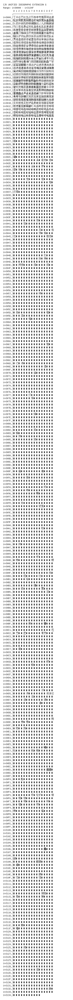

# CJK Unified Ideographs Extension G

**Range:** `U+30000` - `U+3134F`

[← Back to Index](../README.md)

```text
        0 1 2 3 4 5 6 7 8 9 A B C D E F
       ┌───────────────────────────────
U+3000_│𰀀𰀁𰀂𰀃𰀄𰀅𰀆𰀇𰀈𰀉𰀊𰀋𰀌𰀍𰀎𰀏
U+3001_│𰀐𰀑𰀒𰀓𰀔𰀕𰀖𰀗𰀘𰀙𰀚𰀛𰀜𰀝𰀞𰀟
U+3002_│𰀠𰀡𰀢𰀣𰀤𰀥𰀦𰀧𰀨𰀩𰀪𰀫𰀬𰀭𰀮𰀯
U+3003_│𰀰𰀱𰀲𰀳𰀴𰀵𰀶𰀷𰀸𰀹𰀺𰀻𰀼𰀽𰀾𰀿
U+3004_│𰁀𰁁𰁂𰁃𰁄𰁅𰁆𰁇𰁈𰁉𰁊𰁋𰁌𰁍𰁎𰁏
U+3005_│𰁐𰁑𰁒𰁓𰁔𰁕𰁖𰁗𰁘𰁙𰁚𰁛𰁜𰁝𰁞𰁟
U+3006_│𰁠𰁡𰁢𰁣𰁤𰁥𰁦𰁧𰁨𰁩𰁪𰁫𰁬𰁭𰁮𰁯
U+3007_│𰁰𰁱𰁲𰁳𰁴𰁵𰁶𰁷𰁸𰁹𰁺𰁻𰁼𰁽𰁾𰁿
U+3008_│𰂀𰂁𰂂𰂃𰂄𰂅𰂆𰂇𰂈𰂉𰂊𰂋𰂌𰂍𰂎𰂏
U+3009_│𰂐𰂑𰂒𰂓𰂔𰂕𰂖𰂗𰂘𰂙𰂚𰂛𰂜𰂝𰂞𰂟
U+300A_│𰂠𰂡𰂢𰂣𰂤𰂥𰂦𰂧𰂨𰂩𰂪𰂫𰂬𰂭𰂮𰂯
U+300B_│𰂰𰂱𰂲𰂳𰂴𰂵𰂶𰂷𰂸𰂹𰂺𰂻𰂼𰂽𰂾𰂿
U+300C_│𰃀𰃁𰃂𰃃𰃄𰃅𰃆𰃇𰃈𰃉𰃊𰃋𰃌𰃍𰃎𰃏
U+300D_│𰃐𰃑𰃒𰃓𰃔𰃕𰃖𰃗𰃘𰃙𰃚𰃛𰃜𰃝𰃞𰃟
U+300E_│𰃠𰃡𰃢𰃣𰃤𰃥𰃦𰃧𰃨𰃩𰃪𰃫𰃬𰃭𰃮𰃯
U+300F_│𰃰𰃱𰃲𰃳𰃴𰃵𰃶𰃷𰃸𰃹𰃺𰃻𰃼𰃽𰃾𰃿
U+3010_│𰄀𰄁𰄂𰄃𰄄𰄅𰄆𰄇𰄈𰄉𰄊𰄋𰄌𰄍𰄎𰄏
U+3011_│𰄐𰄑𰄒𰄓𰄔𰄕𰄖𰄗𰄘𰄙𰄚𰄛𰄜𰄝𰄞𰄟
U+3012_│𰄠𰄡𰄢𰄣𰄤𰄥𰄦𰄧𰄨𰄩𰄪𰄫𰄬𰄭𰄮𰄯
U+3013_│𰄰𰄱𰄲𰄳𰄴𰄵𰄶𰄷𰄸𰄹𰄺𰄻𰄼𰄽𰄾𰄿
U+3014_│𰅀𰅁𰅂𰅃𰅄𰅅𰅆𰅇𰅈𰅉𰅊𰅋𰅌𰅍𰅎𰅏
U+3015_│𰅐𰅑𰅒𰅓𰅔𰅕𰅖𰅗𰅘𰅙𰅚𰅛𰅜𰅝𰅞𰅟
U+3016_│𰅠𰅡𰅢𰅣𰅤𰅥𰅦𰅧𰅨𰅩𰅪𰅫𰅬𰅭𰅮𰅯
U+3017_│𰅰𰅱𰅲𰅳𰅴𰅵𰅶𰅷𰅸𰅹𰅺𰅻𰅼𰅽𰅾𰅿
U+3018_│𰆀𰆁𰆂𰆃𰆄𰆅𰆆𰆇𰆈𰆉𰆊𰆋𰆌𰆍𰆎𰆏
U+3019_│𰆐𰆑𰆒𰆓𰆔𰆕𰆖𰆗𰆘𰆙𰆚𰆛𰆜𰆝𰆞𰆟
U+301A_│𰆠𰆡𰆢𰆣𰆤𰆥𰆦𰆧𰆨𰆩𰆪𰆫𰆬𰆭𰆮𰆯
U+301B_│𰆰𰆱𰆲𰆳𰆴𰆵𰆶𰆷𰆸𰆹𰆺𰆻𰆼𰆽𰆾𰆿
U+301C_│𰇀𰇁𰇂𰇃𰇄𰇅𰇆𰇇𰇈𰇉𰇊𰇋𰇌𰇍𰇎𰇏
U+301D_│𰇐𰇑𰇒𰇓𰇔𰇕𰇖𰇗𰇘𰇙𰇚𰇛𰇜𰇝𰇞𰇟
U+301E_│𰇠𰇡𰇢𰇣𰇤𰇥𰇦𰇧𰇨𰇩𰇪𰇫𰇬𰇭𰇮𰇯
U+301F_│𰇰𰇱𰇲𰇳𰇴𰇵𰇶𰇷𰇸𰇹𰇺𰇻𰇼𰇽𰇾𰇿
U+3020_│𰈀𰈁𰈂𰈃𰈄𰈅𰈆𰈇𰈈𰈉𰈊𰈋𰈌𰈍𰈎𰈏
U+3021_│𰈐𰈑𰈒𰈓𰈔𰈕𰈖𰈗𰈘𰈙𰈚𰈛𰈜𰈝𰈞𰈟
U+3022_│𰈠𰈡𰈢𰈣𰈤𰈥𰈦𰈧𰈨𰈩𰈪𰈫𰈬𰈭𰈮𰈯
U+3023_│𰈰𰈱𰈲𰈳𰈴𰈵𰈶𰈷𰈸𰈹𰈺𰈻𰈼𰈽𰈾𰈿
U+3024_│𰉀𰉁𰉂𰉃𰉄𰉅𰉆𰉇𰉈𰉉𰉊𰉋𰉌𰉍𰉎𰉏
U+3025_│𰉐𰉑𰉒𰉓𰉔𰉕𰉖𰉗𰉘𰉙𰉚𰉛𰉜𰉝𰉞𰉟
U+3026_│𰉠𰉡𰉢𰉣𰉤𰉥𰉦𰉧𰉨𰉩𰉪𰉫𰉬𰉭𰉮𰉯
U+3027_│𰉰𰉱𰉲𰉳𰉴𰉵𰉶𰉷𰉸𰉹𰉺𰉻𰉼𰉽𰉾𰉿
U+3028_│𰊀𰊁𰊂𰊃𰊄𰊅𰊆𰊇𰊈𰊉𰊊𰊋𰊌𰊍𰊎𰊏
U+3029_│𰊐𰊑𰊒𰊓𰊔𰊕𰊖𰊗𰊘𰊙𰊚𰊛𰊜𰊝𰊞𰊟
U+302A_│𰊠𰊡𰊢𰊣𰊤𰊥𰊦𰊧𰊨𰊩𰊪𰊫𰊬𰊭𰊮𰊯
U+302B_│𰊰𰊱𰊲𰊳𰊴𰊵𰊶𰊷𰊸𰊹𰊺𰊻𰊼𰊽𰊾𰊿
U+302C_│𰋀𰋁𰋂𰋃𰋄𰋅𰋆𰋇𰋈𰋉𰋊𰋋𰋌𰋍𰋎𰋏
U+302D_│𰋐𰋑𰋒𰋓𰋔𰋕𰋖𰋗𰋘𰋙𰋚𰋛𰋜𰋝𰋞𰋟
U+302E_│𰋠𰋡𰋢𰋣𰋤𰋥𰋦𰋧𰋨𰋩𰋪𰋫𰋬𰋭𰋮𰋯
U+302F_│𰋰𰋱𰋲𰋳𰋴𰋵𰋶𰋷𰋸𰋹𰋺𰋻𰋼𰋽𰋾𰋿
U+3030_│𰌀𰌁𰌂𰌃𰌄𰌅𰌆𰌇𰌈𰌉𰌊𰌋𰌌𰌍𰌎𰌏
U+3031_│𰌐𰌑𰌒𰌓𰌔𰌕𰌖𰌗𰌘𰌙𰌚𰌛𰌜𰌝𰌞𰌟
U+3032_│𰌠𰌡𰌢𰌣𰌤𰌥𰌦𰌧𰌨𰌩𰌪𰌫𰌬𰌭𰌮𰌯
U+3033_│𰌰𰌱𰌲𰌳𰌴𰌵𰌶𰌷𰌸𰌹𰌺𰌻𰌼𰌽𰌾𰌿
U+3034_│𰍀𰍁𰍂𰍃𰍄𰍅𰍆𰍇𰍈𰍉𰍊𰍋𰍌𰍍𰍎𰍏
U+3035_│𰍐𰍑𰍒𰍓𰍔𰍕𰍖𰍗𰍘𰍙𰍚𰍛𰍜𰍝𰍞𰍟
U+3036_│𰍠𰍡𰍢𰍣𰍤𰍥𰍦𰍧𰍨𰍩𰍪𰍫𰍬𰍭𰍮𰍯
U+3037_│𰍰𰍱𰍲𰍳𰍴𰍵𰍶𰍷𰍸𰍹𰍺𰍻𰍼𰍽𰍾𰍿
U+3038_│𰎀𰎁𰎂𰎃𰎄𰎅𰎆𰎇𰎈𰎉𰎊𰎋𰎌𰎍𰎎𰎏
U+3039_│𰎐𰎑𰎒𰎓𰎔𰎕𰎖𰎗𰎘𰎙𰎚𰎛𰎜𰎝𰎞𰎟
U+303A_│𰎠𰎡𰎢𰎣𰎤𰎥𰎦𰎧𰎨𰎩𰎪𰎫𰎬𰎭𰎮𰎯
U+303B_│𰎰𰎱𰎲𰎳𰎴𰎵𰎶𰎷𰎸𰎹𰎺𰎻𰎼𰎽𰎾𰎿
U+303C_│𰏀𰏁𰏂𰏃𰏄𰏅𰏆𰏇𰏈𰏉𰏊𰏋𰏌𰏍𰏎𰏏
U+303D_│𰏐𰏑𰏒𰏓𰏔𰏕𰏖𰏗𰏘𰏙𰏚𰏛𰏜𰏝𰏞𰏟
U+303E_│𰏠𰏡𰏢𰏣𰏤𰏥𰏦𰏧𰏨𰏩𰏪𰏫𰏬𰏭𰏮𰏯
U+303F_│𰏰𰏱𰏲𰏳𰏴𰏵𰏶𰏷𰏸𰏹𰏺𰏻𰏼𰏽𰏾𰏿
U+3040_│𰐀𰐁𰐂𰐃𰐄𰐅𰐆𰐇𰐈𰐉𰐊𰐋𰐌𰐍𰐎𰐏
U+3041_│𰐐𰐑𰐒𰐓𰐔𰐕𰐖𰐗𰐘𰐙𰐚𰐛𰐜𰐝𰐞𰐟
U+3042_│𰐠𰐡𰐢𰐣𰐤𰐥𰐦𰐧𰐨𰐩𰐪𰐫𰐬𰐭𰐮𰐯
U+3043_│𰐰𰐱𰐲𰐳𰐴𰐵𰐶𰐷𰐸𰐹𰐺𰐻𰐼𰐽𰐾𰐿
U+3044_│𰑀𰑁𰑂𰑃𰑄𰑅𰑆𰑇𰑈𰑉𰑊𰑋𰑌𰑍𰑎𰑏
U+3045_│𰑐𰑑𰑒𰑓𰑔𰑕𰑖𰑗𰑘𰑙𰑚𰑛𰑜𰑝𰑞𰑟
U+3046_│𰑠𰑡𰑢𰑣𰑤𰑥𰑦𰑧𰑨𰑩𰑪𰑫𰑬𰑭𰑮𰑯
U+3047_│𰑰𰑱𰑲𰑳𰑴𰑵𰑶𰑷𰑸𰑹𰑺𰑻𰑼𰑽𰑾𰑿
U+3048_│𰒀𰒁𰒂𰒃𰒄𰒅𰒆𰒇𰒈𰒉𰒊𰒋𰒌𰒍𰒎𰒏
U+3049_│𰒐𰒑𰒒𰒓𰒔𰒕𰒖𰒗𰒘𰒙𰒚𰒛𰒜𰒝𰒞𰒟
U+304A_│𰒠𰒡𰒢𰒣𰒤𰒥𰒦𰒧𰒨𰒩𰒪𰒫𰒬𰒭𰒮𰒯
U+304B_│𰒰𰒱𰒲𰒳𰒴𰒵𰒶𰒷𰒸𰒹𰒺𰒻𰒼𰒽𰒾𰒿
U+304C_│𰓀𰓁𰓂𰓃𰓄𰓅𰓆𰓇𰓈𰓉𰓊𰓋𰓌𰓍𰓎𰓏
U+304D_│𰓐𰓑𰓒𰓓𰓔𰓕𰓖𰓗𰓘𰓙𰓚𰓛𰓜𰓝𰓞𰓟
U+304E_│𰓠𰓡𰓢𰓣𰓤𰓥𰓦𰓧𰓨𰓩𰓪𰓫𰓬𰓭𰓮𰓯
U+304F_│𰓰𰓱𰓲𰓳𰓴𰓵𰓶𰓷𰓸𰓹𰓺𰓻𰓼𰓽𰓾𰓿
U+3050_│𰔀𰔁𰔂𰔃𰔄𰔅𰔆𰔇𰔈𰔉𰔊𰔋𰔌𰔍𰔎𰔏
U+3051_│𰔐𰔑𰔒𰔓𰔔𰔕𰔖𰔗𰔘𰔙𰔚𰔛𰔜𰔝𰔞𰔟
U+3052_│𰔠𰔡𰔢𰔣𰔤𰔥𰔦𰔧𰔨𰔩𰔪𰔫𰔬𰔭𰔮𰔯
U+3053_│𰔰𰔱𰔲𰔳𰔴𰔵𰔶𰔷𰔸𰔹𰔺𰔻𰔼𰔽𰔾𰔿
U+3054_│𰕀𰕁𰕂𰕃𰕄𰕅𰕆𰕇𰕈𰕉𰕊𰕋𰕌𰕍𰕎𰕏
U+3055_│𰕐𰕑𰕒𰕓𰕔𰕕𰕖𰕗𰕘𰕙𰕚𰕛𰕜𰕝𰕞𰕟
U+3056_│𰕠𰕡𰕢𰕣𰕤𰕥𰕦𰕧𰕨𰕩𰕪𰕫𰕬𰕭𰕮𰕯
U+3057_│𰕰𰕱𰕲𰕳𰕴𰕵𰕶𰕷𰕸𰕹𰕺𰕻𰕼𰕽𰕾𰕿
U+3058_│𰖀𰖁𰖂𰖃𰖄𰖅𰖆𰖇𰖈𰖉𰖊𰖋𰖌𰖍𰖎𰖏
U+3059_│𰖐𰖑𰖒𰖓𰖔𰖕𰖖𰖗𰖘𰖙𰖚𰖛𰖜𰖝𰖞𰖟
U+305A_│𰖠𰖡𰖢𰖣𰖤𰖥𰖦𰖧𰖨𰖩𰖪𰖫𰖬𰖭𰖮𰖯
U+305B_│𰖰𰖱𰖲𰖳𰖴𰖵𰖶𰖷𰖸𰖹𰖺𰖻𰖼𰖽𰖾𰖿
U+305C_│𰗀𰗁𰗂𰗃𰗄𰗅𰗆𰗇𰗈𰗉𰗊𰗋𰗌𰗍𰗎𰗏
U+305D_│𰗐𰗑𰗒𰗓𰗔𰗕𰗖𰗗𰗘𰗙𰗚𰗛𰗜𰗝𰗞𰗟
U+305E_│𰗠𰗡𰗢𰗣𰗤𰗥𰗦𰗧𰗨𰗩𰗪𰗫𰗬𰗭𰗮𰗯
U+305F_│𰗰𰗱𰗲𰗳𰗴𰗵𰗶𰗷𰗸𰗹𰗺𰗻𰗼𰗽𰗾𰗿
U+3060_│𰘀𰘁𰘂𰘃𰘄𰘅𰘆𰘇𰘈𰘉𰘊𰘋𰘌𰘍𰘎𰘏
U+3061_│𰘐𰘑𰘒𰘓𰘔𰘕𰘖𰘗𰘘𰘙𰘚𰘛𰘜𰘝𰘞𰘟
U+3062_│𰘠𰘡𰘢𰘣𰘤𰘥𰘦𰘧𰘨𰘩𰘪𰘫𰘬𰘭𰘮𰘯
U+3063_│𰘰𰘱𰘲𰘳𰘴𰘵𰘶𰘷𰘸𰘹𰘺𰘻𰘼𰘽𰘾𰘿
U+3064_│𰙀𰙁𰙂𰙃𰙄𰙅𰙆𰙇𰙈𰙉𰙊𰙋𰙌𰙍𰙎𰙏
U+3065_│𰙐𰙑𰙒𰙓𰙔𰙕𰙖𰙗𰙘𰙙𰙚𰙛𰙜𰙝𰙞𰙟
U+3066_│𰙠𰙡𰙢𰙣𰙤𰙥𰙦𰙧𰙨𰙩𰙪𰙫𰙬𰙭𰙮𰙯
U+3067_│𰙰𰙱𰙲𰙳𰙴𰙵𰙶𰙷𰙸𰙹𰙺𰙻𰙼𰙽𰙾𰙿
U+3068_│𰚀𰚁𰚂𰚃𰚄𰚅𰚆𰚇𰚈𰚉𰚊𰚋𰚌𰚍𰚎𰚏
U+3069_│𰚐𰚑𰚒𰚓𰚔𰚕𰚖𰚗𰚘𰚙𰚚𰚛𰚜𰚝𰚞𰚟
U+306A_│𰚠𰚡𰚢𰚣𰚤𰚥𰚦𰚧𰚨𰚩𰚪𰚫𰚬𰚭𰚮𰚯
U+306B_│𰚰𰚱𰚲𰚳𰚴𰚵𰚶𰚷𰚸𰚹𰚺𰚻𰚼𰚽𰚾𰚿
U+306C_│𰛀𰛁𰛂𰛃𰛄𰛅𰛆𰛇𰛈𰛉𰛊𰛋𰛌𰛍𰛎𰛏
U+306D_│𰛐𰛑𰛒𰛓𰛔𰛕𰛖𰛗𰛘𰛙𰛚𰛛𰛜𰛝𰛞𰛟
U+306E_│𰛠𰛡𰛢𰛣𰛤𰛥𰛦𰛧𰛨𰛩𰛪𰛫𰛬𰛭𰛮𰛯
U+306F_│𰛰𰛱𰛲𰛳𰛴𰛵𰛶𰛷𰛸𰛹𰛺𰛻𰛼𰛽𰛾𰛿
U+3070_│𰜀𰜁𰜂𰜃𰜄𰜅𰜆𰜇𰜈𰜉𰜊𰜋𰜌𰜍𰜎𰜏
U+3071_│𰜐𰜑𰜒𰜓𰜔𰜕𰜖𰜗𰜘𰜙𰜚𰜛𰜜𰜝𰜞𰜟
U+3072_│𰜠𰜡𰜢𰜣𰜤𰜥𰜦𰜧𰜨𰜩𰜪𰜫𰜬𰜭𰜮𰜯
U+3073_│𰜰𰜱𰜲𰜳𰜴𰜵𰜶𰜷𰜸𰜹𰜺𰜻𰜼𰜽𰜾𰜿
U+3074_│𰝀𰝁𰝂𰝃𰝄𰝅𰝆𰝇𰝈𰝉𰝊𰝋𰝌𰝍𰝎𰝏
U+3075_│𰝐𰝑𰝒𰝓𰝔𰝕𰝖𰝗𰝘𰝙𰝚𰝛𰝜𰝝𰝞𰝟
U+3076_│𰝠𰝡𰝢𰝣𰝤𰝥𰝦𰝧𰝨𰝩𰝪𰝫𰝬𰝭𰝮𰝯
U+3077_│𰝰𰝱𰝲𰝳𰝴𰝵𰝶𰝷𰝸𰝹𰝺𰝻𰝼𰝽𰝾𰝿
U+3078_│𰞀𰞁𰞂𰞃𰞄𰞅𰞆𰞇𰞈𰞉𰞊𰞋𰞌𰞍𰞎𰞏
U+3079_│𰞐𰞑𰞒𰞓𰞔𰞕𰞖𰞗𰞘𰞙𰞚𰞛𰞜𰞝𰞞𰞟
U+307A_│𰞠𰞡𰞢𰞣𰞤𰞥𰞦𰞧𰞨𰞩𰞪𰞫𰞬𰞭𰞮𰞯
U+307B_│𰞰𰞱𰞲𰞳𰞴𰞵𰞶𰞷𰞸𰞹𰞺𰞻𰞼𰞽𰞾𰞿
U+307C_│𰟀𰟁𰟂𰟃𰟄𰟅𰟆𰟇𰟈𰟉𰟊𰟋𰟌𰟍𰟎𰟏
U+307D_│𰟐𰟑𰟒𰟓𰟔𰟕𰟖𰟗𰟘𰟙𰟚𰟛𰟜𰟝𰟞𰟟
U+307E_│𰟠𰟡𰟢𰟣𰟤𰟥𰟦𰟧𰟨𰟩𰟪𰟫𰟬𰟭𰟮𰟯
U+307F_│𰟰𰟱𰟲𰟳𰟴𰟵𰟶𰟷𰟸𰟹𰟺𰟻𰟼𰟽𰟾𰟿
U+3080_│𰠀𰠁𰠂𰠃𰠄𰠅𰠆𰠇𰠈𰠉𰠊𰠋𰠌𰠍𰠎𰠏
U+3081_│𰠐𰠑𰠒𰠓𰠔𰠕𰠖𰠗𰠘𰠙𰠚𰠛𰠜𰠝𰠞𰠟
U+3082_│𰠠𰠡𰠢𰠣𰠤𰠥𰠦𰠧𰠨𰠩𰠪𰠫𰠬𰠭𰠮𰠯
U+3083_│𰠰𰠱𰠲𰠳𰠴𰠵𰠶𰠷𰠸𰠹𰠺𰠻𰠼𰠽𰠾𰠿
U+3084_│𰡀𰡁𰡂𰡃𰡄𰡅𰡆𰡇𰡈𰡉𰡊𰡋𰡌𰡍𰡎𰡏
U+3085_│𰡐𰡑𰡒𰡓𰡔𰡕𰡖𰡗𰡘𰡙𰡚𰡛𰡜𰡝𰡞𰡟
U+3086_│𰡠𰡡𰡢𰡣𰡤𰡥𰡦𰡧𰡨𰡩𰡪𰡫𰡬𰡭𰡮𰡯
U+3087_│𰡰𰡱𰡲𰡳𰡴𰡵𰡶𰡷𰡸𰡹𰡺𰡻𰡼𰡽𰡾𰡿
U+3088_│𰢀𰢁𰢂𰢃𰢄𰢅𰢆𰢇𰢈𰢉𰢊𰢋𰢌𰢍𰢎𰢏
U+3089_│𰢐𰢑𰢒𰢓𰢔𰢕𰢖𰢗𰢘𰢙𰢚𰢛𰢜𰢝𰢞𰢟
U+308A_│𰢠𰢡𰢢𰢣𰢤𰢥𰢦𰢧𰢨𰢩𰢪𰢫𰢬𰢭𰢮𰢯
U+308B_│𰢰𰢱𰢲𰢳𰢴𰢵𰢶𰢷𰢸𰢹𰢺𰢻𰢼𰢽𰢾𰢿
U+308C_│𰣀𰣁𰣂𰣃𰣄𰣅𰣆𰣇𰣈𰣉𰣊𰣋𰣌𰣍𰣎𰣏
U+308D_│𰣐𰣑𰣒𰣓𰣔𰣕𰣖𰣗𰣘𰣙𰣚𰣛𰣜𰣝𰣞𰣟
U+308E_│𰣠𰣡𰣢𰣣𰣤𰣥𰣦𰣧𰣨𰣩𰣪𰣫𰣬𰣭𰣮𰣯
U+308F_│𰣰𰣱𰣲𰣳𰣴𰣵𰣶𰣷𰣸𰣹𰣺𰣻𰣼𰣽𰣾𰣿
U+3090_│𰤀𰤁𰤂𰤃𰤄𰤅𰤆𰤇𰤈𰤉𰤊𰤋𰤌𰤍𰤎𰤏
U+3091_│𰤐𰤑𰤒𰤓𰤔𰤕𰤖𰤗𰤘𰤙𰤚𰤛𰤜𰤝𰤞𰤟
U+3092_│𰤠𰤡𰤢𰤣𰤤𰤥𰤦𰤧𰤨𰤩𰤪𰤫𰤬𰤭𰤮𰤯
U+3093_│𰤰𰤱𰤲𰤳𰤴𰤵𰤶𰤷𰤸𰤹𰤺𰤻𰤼𰤽𰤾𰤿
U+3094_│𰥀𰥁𰥂𰥃𰥄𰥅𰥆𰥇𰥈𰥉𰥊𰥋𰥌𰥍𰥎𰥏
U+3095_│𰥐𰥑𰥒𰥓𰥔𰥕𰥖𰥗𰥘𰥙𰥚𰥛𰥜𰥝𰥞𰥟
U+3096_│𰥠𰥡𰥢𰥣𰥤𰥥𰥦𰥧𰥨𰥩𰥪𰥫𰥬𰥭𰥮𰥯
U+3097_│𰥰𰥱𰥲𰥳𰥴𰥵𰥶𰥷𰥸𰥹𰥺𰥻𰥼𰥽𰥾𰥿
U+3098_│𰦀𰦁𰦂𰦃𰦄𰦅𰦆𰦇𰦈𰦉𰦊𰦋𰦌𰦍𰦎𰦏
U+3099_│𰦐𰦑𰦒𰦓𰦔𰦕𰦖𰦗𰦘𰦙𰦚𰦛𰦜𰦝𰦞𰦟
U+309A_│𰦠𰦡𰦢𰦣𰦤𰦥𰦦𰦧𰦨𰦩𰦪𰦫𰦬𰦭𰦮𰦯
U+309B_│𰦰𰦱𰦲𰦳𰦴𰦵𰦶𰦷𰦸𰦹𰦺𰦻𰦼𰦽𰦾𰦿
U+309C_│𰧀𰧁𰧂𰧃𰧄𰧅𰧆𰧇𰧈𰧉𰧊𰧋𰧌𰧍𰧎𰧏
U+309D_│𰧐𰧑𰧒𰧓𰧔𰧕𰧖𰧗𰧘𰧙𰧚𰧛𰧜𰧝𰧞𰧟
U+309E_│𰧠𰧡𰧢𰧣𰧤𰧥𰧦𰧧𰧨𰧩𰧪𰧫𰧬𰧭𰧮𰧯
U+309F_│𰧰𰧱𰧲𰧳𰧴𰧵𰧶𰧷𰧸𰧹𰧺𰧻𰧼𰧽𰧾𰧿
U+30A0_│𰨀𰨁𰨂𰨃𰨄𰨅𰨆𰨇𰨈𰨉𰨊𰨋𰨌𰨍𰨎𰨏
U+30A1_│𰨐𰨑𰨒𰨓𰨔𰨕𰨖𰨗𰨘𰨙𰨚𰨛𰨜𰨝𰨞𰨟
U+30A2_│𰨠𰨡𰨢𰨣𰨤𰨥𰨦𰨧𰨨𰨩𰨪𰨫𰨬𰨭𰨮𰨯
U+30A3_│𰨰𰨱𰨲𰨳𰨴𰨵𰨶𰨷𰨸𰨹𰨺𰨻𰨼𰨽𰨾𰨿
U+30A4_│𰩀𰩁𰩂𰩃𰩄𰩅𰩆𰩇𰩈𰩉𰩊𰩋𰩌𰩍𰩎𰩏
U+30A5_│𰩐𰩑𰩒𰩓𰩔𰩕𰩖𰩗𰩘𰩙𰩚𰩛𰩜𰩝𰩞𰩟
U+30A6_│𰩠𰩡𰩢𰩣𰩤𰩥𰩦𰩧𰩨𰩩𰩪𰩫𰩬𰩭𰩮𰩯
U+30A7_│𰩰𰩱𰩲𰩳𰩴𰩵𰩶𰩷𰩸𰩹𰩺𰩻𰩼𰩽𰩾𰩿
U+30A8_│𰪀𰪁𰪂𰪃𰪄𰪅𰪆𰪇𰪈𰪉𰪊𰪋𰪌𰪍𰪎𰪏
U+30A9_│𰪐𰪑𰪒𰪓𰪔𰪕𰪖𰪗𰪘𰪙𰪚𰪛𰪜𰪝𰪞𰪟
U+30AA_│𰪠𰪡𰪢𰪣𰪤𰪥𰪦𰪧𰪨𰪩𰪪𰪫𰪬𰪭𰪮𰪯
U+30AB_│𰪰𰪱𰪲𰪳𰪴𰪵𰪶𰪷𰪸𰪹𰪺𰪻𰪼𰪽𰪾𰪿
U+30AC_│𰫀𰫁𰫂𰫃𰫄𰫅𰫆𰫇𰫈𰫉𰫊𰫋𰫌𰫍𰫎𰫏
U+30AD_│𰫐𰫑𰫒𰫓𰫔𰫕𰫖𰫗𰫘𰫙𰫚𰫛𰫜𰫝𰫞𰫟
U+30AE_│𰫠𰫡𰫢𰫣𰫤𰫥𰫦𰫧𰫨𰫩𰫪𰫫𰫬𰫭𰫮𰫯
U+30AF_│𰫰𰫱𰫲𰫳𰫴𰫵𰫶𰫷𰫸𰫹𰫺𰫻𰫼𰫽𰫾𰫿
U+30B0_│𰬀𰬁𰬂𰬃𰬄𰬅𰬆𰬇𰬈𰬉𰬊𰬋𰬌𰬍𰬎𰬏
U+30B1_│𰬐𰬑𰬒𰬓𰬔𰬕𰬖𰬗𰬘𰬙𰬚𰬛𰬜𰬝𰬞𰬟
U+30B2_│𰬠𰬡𰬢𰬣𰬤𰬥𰬦𰬧𰬨𰬩𰬪𰬫𰬬𰬭𰬮𰬯
U+30B3_│𰬰𰬱𰬲𰬳𰬴𰬵𰬶𰬷𰬸𰬹𰬺𰬻𰬼𰬽𰬾𰬿
U+30B4_│𰭀𰭁𰭂𰭃𰭄𰭅𰭆𰭇𰭈𰭉𰭊𰭋𰭌𰭍𰭎𰭏
U+30B5_│𰭐𰭑𰭒𰭓𰭔𰭕𰭖𰭗𰭘𰭙𰭚𰭛𰭜𰭝𰭞𰭟
U+30B6_│𰭠𰭡𰭢𰭣𰭤𰭥𰭦𰭧𰭨𰭩𰭪𰭫𰭬𰭭𰭮𰭯
U+30B7_│𰭰𰭱𰭲𰭳𰭴𰭵𰭶𰭷𰭸𰭹𰭺𰭻𰭼𰭽𰭾𰭿
U+30B8_│𰮀𰮁𰮂𰮃𰮄𰮅𰮆𰮇𰮈𰮉𰮊𰮋𰮌𰮍𰮎𰮏
U+30B9_│𰮐𰮑𰮒𰮓𰮔𰮕𰮖𰮗𰮘𰮙𰮚𰮛𰮜𰮝𰮞𰮟
U+30BA_│𰮠𰮡𰮢𰮣𰮤𰮥𰮦𰮧𰮨𰮩𰮪𰮫𰮬𰮭𰮮𰮯
U+30BB_│𰮰𰮱𰮲𰮳𰮴𰮵𰮶𰮷𰮸𰮹𰮺𰮻𰮼𰮽𰮾𰮿
U+30BC_│𰯀𰯁𰯂𰯃𰯄𰯅𰯆𰯇𰯈𰯉𰯊𰯋𰯌𰯍𰯎𰯏
U+30BD_│𰯐𰯑𰯒𰯓𰯔𰯕𰯖𰯗𰯘𰯙𰯚𰯛𰯜𰯝𰯞𰯟
U+30BE_│𰯠𰯡𰯢𰯣𰯤𰯥𰯦𰯧𰯨𰯩𰯪𰯫𰯬𰯭𰯮𰯯
U+30BF_│𰯰𰯱𰯲𰯳𰯴𰯵𰯶𰯷𰯸𰯹𰯺𰯻𰯼𰯽𰯾𰯿
U+30C0_│𰰀𰰁𰰂𰰃𰰄𰰅𰰆𰰇𰰈𰰉𰰊𰰋𰰌𰰍𰰎𰰏
U+30C1_│𰰐𰰑𰰒𰰓𰰔𰰕𰰖𰰗𰰘𰰙𰰚𰰛𰰜𰰝𰰞𰰟
U+30C2_│𰰠𰰡𰰢𰰣𰰤𰰥𰰦𰰧𰰨𰰩𰰪𰰫𰰬𰰭𰰮𰰯
U+30C3_│𰰰𰰱𰰲𰰳𰰴𰰵𰰶𰰷𰰸𰰹𰰺𰰻𰰼𰰽𰰾𰰿
U+30C4_│𰱀𰱁𰱂𰱃𰱄𰱅𰱆𰱇𰱈𰱉𰱊𰱋𰱌𰱍𰱎𰱏
U+30C5_│𰱐𰱑𰱒𰱓𰱔𰱕𰱖𰱗𰱘𰱙𰱚𰱛𰱜𰱝𰱞𰱟
U+30C6_│𰱠𰱡𰱢𰱣𰱤𰱥𰱦𰱧𰱨𰱩𰱪𰱫𰱬𰱭𰱮𰱯
U+30C7_│𰱰𰱱𰱲𰱳𰱴𰱵𰱶𰱷𰱸𰱹𰱺𰱻𰱼𰱽𰱾𰱿
U+30C8_│𰲀𰲁𰲂𰲃𰲄𰲅𰲆𰲇𰲈𰲉𰲊𰲋𰲌𰲍𰲎𰲏
U+30C9_│𰲐𰲑𰲒𰲓𰲔𰲕𰲖𰲗𰲘𰲙𰲚𰲛𰲜𰲝𰲞𰲟
U+30CA_│𰲠𰲡𰲢𰲣𰲤𰲥𰲦𰲧𰲨𰲩𰲪𰲫𰲬𰲭𰲮𰲯
U+30CB_│𰲰𰲱𰲲𰲳𰲴𰲵𰲶𰲷𰲸𰲹𰲺𰲻𰲼𰲽𰲾𰲿
U+30CC_│𰳀𰳁𰳂𰳃𰳄𰳅𰳆𰳇𰳈𰳉𰳊𰳋𰳌𰳍𰳎𰳏
U+30CD_│𰳐𰳑𰳒𰳓𰳔𰳕𰳖𰳗𰳘𰳙𰳚𰳛𰳜𰳝𰳞𰳟
U+30CE_│𰳠𰳡𰳢𰳣𰳤𰳥𰳦𰳧𰳨𰳩𰳪𰳫𰳬𰳭𰳮𰳯
U+30CF_│𰳰𰳱𰳲𰳳𰳴𰳵𰳶𰳷𰳸𰳹𰳺𰳻𰳼𰳽𰳾𰳿
U+30D0_│𰴀𰴁𰴂𰴃𰴄𰴅𰴆𰴇𰴈𰴉𰴊𰴋𰴌𰴍𰴎𰴏
U+30D1_│𰴐𰴑𰴒𰴓𰴔𰴕𰴖𰴗𰴘𰴙𰴚𰴛𰴜𰴝𰴞𰴟
U+30D2_│𰴠𰴡𰴢𰴣𰴤𰴥𰴦𰴧𰴨𰴩𰴪𰴫𰴬𰴭𰴮𰴯
U+30D3_│𰴰𰴱𰴲𰴳𰴴𰴵𰴶𰴷𰴸𰴹𰴺𰴻𰴼𰴽𰴾𰴿
U+30D4_│𰵀𰵁𰵂𰵃𰵄𰵅𰵆𰵇𰵈𰵉𰵊𰵋𰵌𰵍𰵎𰵏
U+30D5_│𰵐𰵑𰵒𰵓𰵔𰵕𰵖𰵗𰵘𰵙𰵚𰵛𰵜𰵝𰵞𰵟
U+30D6_│𰵠𰵡𰵢𰵣𰵤𰵥𰵦𰵧𰵨𰵩𰵪𰵫𰵬𰵭𰵮𰵯
U+30D7_│𰵰𰵱𰵲𰵳𰵴𰵵𰵶𰵷𰵸𰵹𰵺𰵻𰵼𰵽𰵾𰵿
U+30D8_│𰶀𰶁𰶂𰶃𰶄𰶅𰶆𰶇𰶈𰶉𰶊𰶋𰶌𰶍𰶎𰶏
U+30D9_│𰶐𰶑𰶒𰶓𰶔𰶕𰶖𰶗𰶘𰶙𰶚𰶛𰶜𰶝𰶞𰶟
U+30DA_│𰶠𰶡𰶢𰶣𰶤𰶥𰶦𰶧𰶨𰶩𰶪𰶫𰶬𰶭𰶮𰶯
U+30DB_│𰶰𰶱𰶲𰶳𰶴𰶵𰶶𰶷𰶸𰶹𰶺𰶻𰶼𰶽𰶾𰶿
U+30DC_│𰷀𰷁𰷂𰷃𰷄𰷅𰷆𰷇𰷈𰷉𰷊𰷋𰷌𰷍𰷎𰷏
U+30DD_│𰷐𰷑𰷒𰷓𰷔𰷕𰷖𰷗𰷘𰷙𰷚𰷛𰷜𰷝𰷞𰷟
U+30DE_│𰷠𰷡𰷢𰷣𰷤𰷥𰷦𰷧𰷨𰷩𰷪𰷫𰷬𰷭𰷮𰷯
U+30DF_│𰷰𰷱𰷲𰷳𰷴𰷵𰷶𰷷𰷸𰷹𰷺𰷻𰷼𰷽𰷾𰷿
U+30E0_│𰸀𰸁𰸂𰸃𰸄𰸅𰸆𰸇𰸈𰸉𰸊𰸋𰸌𰸍𰸎𰸏
U+30E1_│𰸐𰸑𰸒𰸓𰸔𰸕𰸖𰸗𰸘𰸙𰸚𰸛𰸜𰸝𰸞𰸟
U+30E2_│𰸠𰸡𰸢𰸣𰸤𰸥𰸦𰸧𰸨𰸩𰸪𰸫𰸬𰸭𰸮𰸯
U+30E3_│𰸰𰸱𰸲𰸳𰸴𰸵𰸶𰸷𰸸𰸹𰸺𰸻𰸼𰸽𰸾𰸿
U+30E4_│𰹀𰹁𰹂𰹃𰹄𰹅𰹆𰹇𰹈𰹉𰹊𰹋𰹌𰹍𰹎𰹏
U+30E5_│𰹐𰹑𰹒𰹓𰹔𰹕𰹖𰹗𰹘𰹙𰹚𰹛𰹜𰹝𰹞𰹟
U+30E6_│𰹠𰹡𰹢𰹣𰹤𰹥𰹦𰹧𰹨𰹩𰹪𰹫𰹬𰹭𰹮𰹯
U+30E7_│𰹰𰹱𰹲𰹳𰹴𰹵𰹶𰹷𰹸𰹹𰹺𰹻𰹼𰹽𰹾𰹿
U+30E8_│𰺀𰺁𰺂𰺃𰺄𰺅𰺆𰺇𰺈𰺉𰺊𰺋𰺌𰺍𰺎𰺏
U+30E9_│𰺐𰺑𰺒𰺓𰺔𰺕𰺖𰺗𰺘𰺙𰺚𰺛𰺜𰺝𰺞𰺟
U+30EA_│𰺠𰺡𰺢𰺣𰺤𰺥𰺦𰺧𰺨𰺩𰺪𰺫𰺬𰺭𰺮𰺯
U+30EB_│𰺰𰺱𰺲𰺳𰺴𰺵𰺶𰺷𰺸𰺹𰺺𰺻𰺼𰺽𰺾𰺿
U+30EC_│𰻀𰻁𰻂𰻃𰻄𰻅𰻆𰻇𰻈𰻉𰻊𰻋𰻌𰻍𰻎𰻏
U+30ED_│𰻐𰻑𰻒𰻓𰻔𰻕𰻖𰻗𰻘𰻙𰻚𰻛𰻜𰻝𰻞𰻟
U+30EE_│𰻠𰻡𰻢𰻣𰻤𰻥𰻦𰻧𰻨𰻩𰻪𰻫𰻬𰻭𰻮𰻯
U+30EF_│𰻰𰻱𰻲𰻳𰻴𰻵𰻶𰻷𰻸𰻹𰻺𰻻𰻼𰻽𰻾𰻿
U+30F0_│𰼀𰼁𰼂𰼃𰼄𰼅𰼆𰼇𰼈𰼉𰼊𰼋𰼌𰼍𰼎𰼏
U+30F1_│𰼐𰼑𰼒𰼓𰼔𰼕𰼖𰼗𰼘𰼙𰼚𰼛𰼜𰼝𰼞𰼟
U+30F2_│𰼠𰼡𰼢𰼣𰼤𰼥𰼦𰼧𰼨𰼩𰼪𰼫𰼬𰼭𰼮𰼯
U+30F3_│𰼰𰼱𰼲𰼳𰼴𰼵𰼶𰼷𰼸𰼹𰼺𰼻𰼼𰼽𰼾𰼿
U+30F4_│𰽀𰽁𰽂𰽃𰽄𰽅𰽆𰽇𰽈𰽉𰽊𰽋𰽌𰽍𰽎𰽏
U+30F5_│𰽐𰽑𰽒𰽓𰽔𰽕𰽖𰽗𰽘𰽙𰽚𰽛𰽜𰽝𰽞𰽟
U+30F6_│𰽠𰽡𰽢𰽣𰽤𰽥𰽦𰽧𰽨𰽩𰽪𰽫𰽬𰽭𰽮𰽯
U+30F7_│𰽰𰽱𰽲𰽳𰽴𰽵𰽶𰽷𰽸𰽹𰽺𰽻𰽼𰽽𰽾𰽿
U+30F8_│𰾀𰾁𰾂𰾃𰾄𰾅𰾆𰾇𰾈𰾉𰾊𰾋𰾌𰾍𰾎𰾏
U+30F9_│𰾐𰾑𰾒𰾓𰾔𰾕𰾖𰾗𰾘𰾙𰾚𰾛𰾜𰾝𰾞𰾟
U+30FA_│𰾠𰾡𰾢𰾣𰾤𰾥𰾦𰾧𰾨𰾩𰾪𰾫𰾬𰾭𰾮𰾯
U+30FB_│𰾰𰾱𰾲𰾳𰾴𰾵𰾶𰾷𰾸𰾹𰾺𰾻𰾼𰾽𰾾𰾿
U+30FC_│𰿀𰿁𰿂𰿃𰿄𰿅𰿆𰿇𰿈𰿉𰿊𰿋𰿌𰿍𰿎𰿏
U+30FD_│𰿐𰿑𰿒𰿓𰿔𰿕𰿖𰿗𰿘𰿙𰿚𰿛𰿜𰿝𰿞𰿟
U+30FE_│𰿠𰿡𰿢𰿣𰿤𰿥𰿦𰿧𰿨𰿩𰿪𰿫𰿬𰿭𰿮𰿯
U+30FF_│𰿰𰿱𰿲𰿳𰿴𰿵𰿶𰿷𰿸𰿹𰿺𰿻𰿼𰿽𰿾𰿿
U+3100_│𱀀𱀁𱀂𱀃𱀄𱀅𱀆𱀇𱀈𱀉𱀊𱀋𱀌𱀍𱀎𱀏
U+3101_│𱀐𱀑𱀒𱀓𱀔𱀕𱀖𱀗𱀘𱀙𱀚𱀛𱀜𱀝𱀞𱀟
U+3102_│𱀠𱀡𱀢𱀣𱀤𱀥𱀦𱀧𱀨𱀩𱀪𱀫𱀬𱀭𱀮𱀯
U+3103_│𱀰𱀱𱀲𱀳𱀴𱀵𱀶𱀷𱀸𱀹𱀺𱀻𱀼𱀽𱀾𱀿
U+3104_│𱁀𱁁𱁂𱁃𱁄𱁅𱁆𱁇𱁈𱁉𱁊𱁋𱁌𱁍𱁎𱁏
U+3105_│𱁐𱁑𱁒𱁓𱁔𱁕𱁖𱁗𱁘𱁙𱁚𱁛𱁜𱁝𱁞𱁟
U+3106_│𱁠𱁡𱁢𱁣𱁤𱁥𱁦𱁧𱁨𱁩𱁪𱁫𱁬𱁭𱁮𱁯
U+3107_│𱁰𱁱𱁲𱁳𱁴𱁵𱁶𱁷𱁸𱁹𱁺𱁻𱁼𱁽𱁾𱁿
U+3108_│𱂀𱂁𱂂𱂃𱂄𱂅𱂆𱂇𱂈𱂉𱂊𱂋𱂌𱂍𱂎𱂏
U+3109_│𱂐𱂑𱂒𱂓𱂔𱂕𱂖𱂗𱂘𱂙𱂚𱂛𱂜𱂝𱂞𱂟
U+310A_│𱂠𱂡𱂢𱂣𱂤𱂥𱂦𱂧𱂨𱂩𱂪𱂫𱂬𱂭𱂮𱂯
U+310B_│𱂰𱂱𱂲𱂳𱂴𱂵𱂶𱂷𱂸𱂹𱂺𱂻𱂼𱂽𱂾𱂿
U+310C_│𱃀𱃁𱃂𱃃𱃄𱃅𱃆𱃇𱃈𱃉𱃊𱃋𱃌𱃍𱃎𱃏
U+310D_│𱃐𱃑𱃒𱃓𱃔𱃕𱃖𱃗𱃘𱃙𱃚𱃛𱃜𱃝𱃞𱃟
U+310E_│𱃠𱃡𱃢𱃣𱃤𱃥𱃦𱃧𱃨𱃩𱃪𱃫𱃬𱃭𱃮𱃯
U+310F_│𱃰𱃱𱃲𱃳𱃴𱃵𱃶𱃷𱃸𱃹𱃺𱃻𱃼𱃽𱃾𱃿
U+3110_│𱄀𱄁𱄂𱄃𱄄𱄅𱄆𱄇𱄈𱄉𱄊𱄋𱄌𱄍𱄎𱄏
U+3111_│𱄐𱄑𱄒𱄓𱄔𱄕𱄖𱄗𱄘𱄙𱄚𱄛𱄜𱄝𱄞𱄟
U+3112_│𱄠𱄡𱄢𱄣𱄤𱄥𱄦𱄧𱄨𱄩𱄪𱄫𱄬𱄭𱄮𱄯
U+3113_│𱄰𱄱𱄲𱄳𱄴𱄵𱄶𱄷𱄸𱄹𱄺𱄻𱄼𱄽𱄾𱄿
U+3114_│𱅀𱅁𱅂𱅃𱅄𱅅𱅆𱅇𱅈𱅉𱅊𱅋𱅌𱅍𱅎𱅏
U+3115_│𱅐𱅑𱅒𱅓𱅔𱅕𱅖𱅗𱅘𱅙𱅚𱅛𱅜𱅝𱅞𱅟
U+3116_│𱅠𱅡𱅢𱅣𱅤𱅥𱅦𱅧𱅨𱅩𱅪𱅫𱅬𱅭𱅮𱅯
U+3117_│𱅰𱅱𱅲𱅳𱅴𱅵𱅶𱅷𱅸𱅹𱅺𱅻𱅼𱅽𱅾𱅿
U+3118_│𱆀𱆁𱆂𱆃𱆄𱆅𱆆𱆇𱆈𱆉𱆊𱆋𱆌𱆍𱆎𱆏
U+3119_│𱆐𱆑𱆒𱆓𱆔𱆕𱆖𱆗𱆘𱆙𱆚𱆛𱆜𱆝𱆞𱆟
U+311A_│𱆠𱆡𱆢𱆣𱆤𱆥𱆦𱆧𱆨𱆩𱆪𱆫𱆬𱆭𱆮𱆯
U+311B_│𱆰𱆱𱆲𱆳𱆴𱆵𱆶𱆷𱆸𱆹𱆺𱆻𱆼𱆽𱆾𱆿
U+311C_│𱇀𱇁𱇂𱇃𱇄𱇅𱇆𱇇𱇈𱇉𱇊𱇋𱇌𱇍𱇎𱇏
U+311D_│𱇐𱇑𱇒𱇓𱇔𱇕𱇖𱇗𱇘𱇙𱇚𱇛𱇜𱇝𱇞𱇟
U+311E_│𱇠𱇡𱇢𱇣𱇤𱇥𱇦𱇧𱇨𱇩𱇪𱇫𱇬𱇭𱇮𱇯
U+311F_│𱇰𱇱𱇲𱇳𱇴𱇵𱇶𱇷𱇸𱇹𱇺𱇻𱇼𱇽𱇾𱇿
U+3120_│𱈀𱈁𱈂𱈃𱈄𱈅𱈆𱈇𱈈𱈉𱈊𱈋𱈌𱈍𱈎𱈏
U+3121_│𱈐𱈑𱈒𱈓𱈔𱈕𱈖𱈗𱈘𱈙𱈚𱈛𱈜𱈝𱈞𱈟
U+3122_│𱈠𱈡𱈢𱈣𱈤𱈥𱈦𱈧𱈨𱈩𱈪𱈫𱈬𱈭𱈮𱈯
U+3123_│𱈰𱈱𱈲𱈳𱈴𱈵𱈶𱈷𱈸𱈹𱈺𱈻𱈼𱈽𱈾𱈿
U+3124_│𱉀𱉁𱉂𱉃𱉄𱉅𱉆𱉇𱉈𱉉𱉊𱉋𱉌𱉍𱉎𱉏
U+3125_│𱉐𱉑𱉒𱉓𱉔𱉕𱉖𱉗𱉘𱉙𱉚𱉛𱉜𱉝𱉞𱉟
U+3126_│𱉠𱉡𱉢𱉣𱉤𱉥𱉦𱉧𱉨𱉩𱉪𱉫𱉬𱉭𱉮𱉯
U+3127_│𱉰𱉱𱉲𱉳𱉴𱉵𱉶𱉷𱉸𱉹𱉺𱉻𱉼𱉽𱉾𱉿
U+3128_│𱊀𱊁𱊂𱊃𱊄𱊅𱊆𱊇𱊈𱊉𱊊𱊋𱊌𱊍𱊎𱊏
U+3129_│𱊐𱊑𱊒𱊓𱊔𱊕𱊖𱊗𱊘𱊙𱊚𱊛𱊜𱊝𱊞𱊟
U+312A_│𱊠𱊡𱊢𱊣𱊤𱊥𱊦𱊧𱊨𱊩𱊪𱊫𱊬𱊭𱊮𱊯
U+312B_│𱊰𱊱𱊲𱊳𱊴𱊵𱊶𱊷𱊸𱊹𱊺𱊻𱊼𱊽𱊾𱊿
U+312C_│𱋀𱋁𱋂𱋃𱋄𱋅𱋆𱋇𱋈𱋉𱋊𱋋𱋌𱋍𱋎𱋏
U+312D_│𱋐𱋑𱋒𱋓𱋔𱋕𱋖𱋗𱋘𱋙𱋚𱋛𱋜𱋝𱋞𱋟
U+312E_│𱋠𱋡𱋢𱋣𱋤𱋥𱋦𱋧𱋨𱋩𱋪𱋫𱋬𱋭𱋮𱋯
U+312F_│𱋰𱋱𱋲𱋳𱋴𱋵𱋶𱋷𱋸𱋹𱋺𱋻𱋼𱋽𱋾𱋿
U+3130_│𱌀𱌁𱌂𱌃𱌄𱌅𱌆𱌇𱌈𱌉𱌊𱌋𱌌𱌍𱌎𱌏
U+3131_│𱌐𱌑𱌒𱌓𱌔𱌕𱌖𱌗𱌘𱌙𱌚𱌛𱌜𱌝𱌞𱌟
U+3132_│𱌠𱌡𱌢𱌣𱌤𱌥𱌦𱌧𱌨𱌩𱌪𱌫𱌬𱌭𱌮𱌯
U+3133_│𱌰𱌱𱌲𱌳𱌴𱌵𱌶𱌷𱌸𱌹𱌺𱌻𱌼𱌽𱌾𱌿
U+3134_│𱍀𱍁𱍂𱍃𱍄𱍅𱍆𱍇𱍈𱍉𱍊
```

## Visual Fallback Reference
If your system lacks the required fonts to render these characters properly, use the image below as a visual guide.


