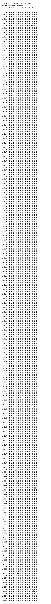

# CJK Unified Ideographs Extension H

**Range:** `U+31350` - `U+323AF`

[← Back to Index](../README.md)

```text
        0 1 2 3 4 5 6 7 8 9 A B C D E F
       ┌───────────────────────────────
U+3135_│𱍐𱍑𱍒𱍓𱍔𱍕𱍖𱍗𱍘𱍙𱍚𱍛𱍜𱍝𱍞𱍟
U+3136_│𱍠𱍡𱍢𱍣𱍤𱍥𱍦𱍧𱍨𱍩𱍪𱍫𱍬𱍭𱍮𱍯
U+3137_│𱍰𱍱𱍲𱍳𱍴𱍵𱍶𱍷𱍸𱍹𱍺𱍻𱍼𱍽𱍾𱍿
U+3138_│𱎀𱎁𱎂𱎃𱎄𱎅𱎆𱎇𱎈𱎉𱎊𱎋𱎌𱎍𱎎𱎏
U+3139_│𱎐𱎑𱎒𱎓𱎔𱎕𱎖𱎗𱎘𱎙𱎚𱎛𱎜𱎝𱎞𱎟
U+313A_│𱎠𱎡𱎢𱎣𱎤𱎥𱎦𱎧𱎨𱎩𱎪𱎫𱎬𱎭𱎮𱎯
U+313B_│𱎰𱎱𱎲𱎳𱎴𱎵𱎶𱎷𱎸𱎹𱎺𱎻𱎼𱎽𱎾𱎿
U+313C_│𱏀𱏁𱏂𱏃𱏄𱏅𱏆𱏇𱏈𱏉𱏊𱏋𱏌𱏍𱏎𱏏
U+313D_│𱏐𱏑𱏒𱏓𱏔𱏕𱏖𱏗𱏘𱏙𱏚𱏛𱏜𱏝𱏞𱏟
U+313E_│𱏠𱏡𱏢𱏣𱏤𱏥𱏦𱏧𱏨𱏩𱏪𱏫𱏬𱏭𱏮𱏯
U+313F_│𱏰𱏱𱏲𱏳𱏴𱏵𱏶𱏷𱏸𱏹𱏺𱏻𱏼𱏽𱏾𱏿
U+3140_│𱐀𱐁𱐂𱐃𱐄𱐅𱐆𱐇𱐈𱐉𱐊𱐋𱐌𱐍𱐎𱐏
U+3141_│𱐐𱐑𱐒𱐓𱐔𱐕𱐖𱐗𱐘𱐙𱐚𱐛𱐜𱐝𱐞𱐟
U+3142_│𱐠𱐡𱐢𱐣𱐤𱐥𱐦𱐧𱐨𱐩𱐪𱐫𱐬𱐭𱐮𱐯
U+3143_│𱐰𱐱𱐲𱐳𱐴𱐵𱐶𱐷𱐸𱐹𱐺𱐻𱐼𱐽𱐾𱐿
U+3144_│𱑀𱑁𱑂𱑃𱑄𱑅𱑆𱑇𱑈𱑉𱑊𱑋𱑌𱑍𱑎𱑏
U+3145_│𱑐𱑑𱑒𱑓𱑔𱑕𱑖𱑗𱑘𱑙𱑚𱑛𱑜𱑝𱑞𱑟
U+3146_│𱑠𱑡𱑢𱑣𱑤𱑥𱑦𱑧𱑨𱑩𱑪𱑫𱑬𱑭𱑮𱑯
U+3147_│𱑰𱑱𱑲𱑳𱑴𱑵𱑶𱑷𱑸𱑹𱑺𱑻𱑼𱑽𱑾𱑿
U+3148_│𱒀𱒁𱒂𱒃𱒄𱒅𱒆𱒇𱒈𱒉𱒊𱒋𱒌𱒍𱒎𱒏
U+3149_│𱒐𱒑𱒒𱒓𱒔𱒕𱒖𱒗𱒘𱒙𱒚𱒛𱒜𱒝𱒞𱒟
U+314A_│𱒠𱒡𱒢𱒣𱒤𱒥𱒦𱒧𱒨𱒩𱒪𱒫𱒬𱒭𱒮𱒯
U+314B_│𱒰𱒱𱒲𱒳𱒴𱒵𱒶𱒷𱒸𱒹𱒺𱒻𱒼𱒽𱒾𱒿
U+314C_│𱓀𱓁𱓂𱓃𱓄𱓅𱓆𱓇𱓈𱓉𱓊𱓋𱓌𱓍𱓎𱓏
U+314D_│𱓐𱓑𱓒𱓓𱓔𱓕𱓖𱓗𱓘𱓙𱓚𱓛𱓜𱓝𱓞𱓟
U+314E_│𱓠𱓡𱓢𱓣𱓤𱓥𱓦𱓧𱓨𱓩𱓪𱓫𱓬𱓭𱓮𱓯
U+314F_│𱓰𱓱𱓲𱓳𱓴𱓵𱓶𱓷𱓸𱓹𱓺𱓻𱓼𱓽𱓾𱓿
U+3150_│𱔀𱔁𱔂𱔃𱔄𱔅𱔆𱔇𱔈𱔉𱔊𱔋𱔌𱔍𱔎𱔏
U+3151_│𱔐𱔑𱔒𱔓𱔔𱔕𱔖𱔗𱔘𱔙𱔚𱔛𱔜𱔝𱔞𱔟
U+3152_│𱔠𱔡𱔢𱔣𱔤𱔥𱔦𱔧𱔨𱔩𱔪𱔫𱔬𱔭𱔮𱔯
U+3153_│𱔰𱔱𱔲𱔳𱔴𱔵𱔶𱔷𱔸𱔹𱔺𱔻𱔼𱔽𱔾𱔿
U+3154_│𱕀𱕁𱕂𱕃𱕄𱕅𱕆𱕇𱕈𱕉𱕊𱕋𱕌𱕍𱕎𱕏
U+3155_│𱕐𱕑𱕒𱕓𱕔𱕕𱕖𱕗𱕘𱕙𱕚𱕛𱕜𱕝𱕞𱕟
U+3156_│𱕠𱕡𱕢𱕣𱕤𱕥𱕦𱕧𱕨𱕩𱕪𱕫𱕬𱕭𱕮𱕯
U+3157_│𱕰𱕱𱕲𱕳𱕴𱕵𱕶𱕷𱕸𱕹𱕺𱕻𱕼𱕽𱕾𱕿
U+3158_│𱖀𱖁𱖂𱖃𱖄𱖅𱖆𱖇𱖈𱖉𱖊𱖋𱖌𱖍𱖎𱖏
U+3159_│𱖐𱖑𱖒𱖓𱖔𱖕𱖖𱖗𱖘𱖙𱖚𱖛𱖜𱖝𱖞𱖟
U+315A_│𱖠𱖡𱖢𱖣𱖤𱖥𱖦𱖧𱖨𱖩𱖪𱖫𱖬𱖭𱖮𱖯
U+315B_│𱖰𱖱𱖲𱖳𱖴𱖵𱖶𱖷𱖸𱖹𱖺𱖻𱖼𱖽𱖾𱖿
U+315C_│𱗀𱗁𱗂𱗃𱗄𱗅𱗆𱗇𱗈𱗉𱗊𱗋𱗌𱗍𱗎𱗏
U+315D_│𱗐𱗑𱗒𱗓𱗔𱗕𱗖𱗗𱗘𱗙𱗚𱗛𱗜𱗝𱗞𱗟
U+315E_│𱗠𱗡𱗢𱗣𱗤𱗥𱗦𱗧𱗨𱗩𱗪𱗫𱗬𱗭𱗮𱗯
U+315F_│𱗰𱗱𱗲𱗳𱗴𱗵𱗶𱗷𱗸𱗹𱗺𱗻𱗼𱗽𱗾𱗿
U+3160_│𱘀𱘁𱘂𱘃𱘄𱘅𱘆𱘇𱘈𱘉𱘊𱘋𱘌𱘍𱘎𱘏
U+3161_│𱘐𱘑𱘒𱘓𱘔𱘕𱘖𱘗𱘘𱘙𱘚𱘛𱘜𱘝𱘞𱘟
U+3162_│𱘠𱘡𱘢𱘣𱘤𱘥𱘦𱘧𱘨𱘩𱘪𱘫𱘬𱘭𱘮𱘯
U+3163_│𱘰𱘱𱘲𱘳𱘴𱘵𱘶𱘷𱘸𱘹𱘺𱘻𱘼𱘽𱘾𱘿
U+3164_│𱙀𱙁𱙂𱙃𱙄𱙅𱙆𱙇𱙈𱙉𱙊𱙋𱙌𱙍𱙎𱙏
U+3165_│𱙐𱙑𱙒𱙓𱙔𱙕𱙖𱙗𱙘𱙙𱙚𱙛𱙜𱙝𱙞𱙟
U+3166_│𱙠𱙡𱙢𱙣𱙤𱙥𱙦𱙧𱙨𱙩𱙪𱙫𱙬𱙭𱙮𱙯
U+3167_│𱙰𱙱𱙲𱙳𱙴𱙵𱙶𱙷𱙸𱙹𱙺𱙻𱙼𱙽𱙾𱙿
U+3168_│𱚀𱚁𱚂𱚃𱚄𱚅𱚆𱚇𱚈𱚉𱚊𱚋𱚌𱚍𱚎𱚏
U+3169_│𱚐𱚑𱚒𱚓𱚔𱚕𱚖𱚗𱚘𱚙𱚚𱚛𱚜𱚝𱚞𱚟
U+316A_│𱚠𱚡𱚢𱚣𱚤𱚥𱚦𱚧𱚨𱚩𱚪𱚫𱚬𱚭𱚮𱚯
U+316B_│𱚰𱚱𱚲𱚳𱚴𱚵𱚶𱚷𱚸𱚹𱚺𱚻𱚼𱚽𱚾𱚿
U+316C_│𱛀𱛁𱛂𱛃𱛄𱛅𱛆𱛇𱛈𱛉𱛊𱛋𱛌𱛍𱛎𱛏
U+316D_│𱛐𱛑𱛒𱛓𱛔𱛕𱛖𱛗𱛘𱛙𱛚𱛛𱛜𱛝𱛞𱛟
U+316E_│𱛠𱛡𱛢𱛣𱛤𱛥𱛦𱛧𱛨𱛩𱛪𱛫𱛬𱛭𱛮𱛯
U+316F_│𱛰𱛱𱛲𱛳𱛴𱛵𱛶𱛷𱛸𱛹𱛺𱛻𱛼𱛽𱛾𱛿
U+3170_│𱜀𱜁𱜂𱜃𱜄𱜅𱜆𱜇𱜈𱜉𱜊𱜋𱜌𱜍𱜎𱜏
U+3171_│𱜐𱜑𱜒𱜓𱜔𱜕𱜖𱜗𱜘𱜙𱜚𱜛𱜜𱜝𱜞𱜟
U+3172_│𱜠𱜡𱜢𱜣𱜤𱜥𱜦𱜧𱜨𱜩𱜪𱜫𱜬𱜭𱜮𱜯
U+3173_│𱜰𱜱𱜲𱜳𱜴𱜵𱜶𱜷𱜸𱜹𱜺𱜻𱜼𱜽𱜾𱜿
U+3174_│𱝀𱝁𱝂𱝃𱝄𱝅𱝆𱝇𱝈𱝉𱝊𱝋𱝌𱝍𱝎𱝏
U+3175_│𱝐𱝑𱝒𱝓𱝔𱝕𱝖𱝗𱝘𱝙𱝚𱝛𱝜𱝝𱝞𱝟
U+3176_│𱝠𱝡𱝢𱝣𱝤𱝥𱝦𱝧𱝨𱝩𱝪𱝫𱝬𱝭𱝮𱝯
U+3177_│𱝰𱝱𱝲𱝳𱝴𱝵𱝶𱝷𱝸𱝹𱝺𱝻𱝼𱝽𱝾𱝿
U+3178_│𱞀𱞁𱞂𱞃𱞄𱞅𱞆𱞇𱞈𱞉𱞊𱞋𱞌𱞍𱞎𱞏
U+3179_│𱞐𱞑𱞒𱞓𱞔𱞕𱞖𱞗𱞘𱞙𱞚𱞛𱞜𱞝𱞞𱞟
U+317A_│𱞠𱞡𱞢𱞣𱞤𱞥𱞦𱞧𱞨𱞩𱞪𱞫𱞬𱞭𱞮𱞯
U+317B_│𱞰𱞱𱞲𱞳𱞴𱞵𱞶𱞷𱞸𱞹𱞺𱞻𱞼𱞽𱞾𱞿
U+317C_│𱟀𱟁𱟂𱟃𱟄𱟅𱟆𱟇𱟈𱟉𱟊𱟋𱟌𱟍𱟎𱟏
U+317D_│𱟐𱟑𱟒𱟓𱟔𱟕𱟖𱟗𱟘𱟙𱟚𱟛𱟜𱟝𱟞𱟟
U+317E_│𱟠𱟡𱟢𱟣𱟤𱟥𱟦𱟧𱟨𱟩𱟪𱟫𱟬𱟭𱟮𱟯
U+317F_│𱟰𱟱𱟲𱟳𱟴𱟵𱟶𱟷𱟸𱟹𱟺𱟻𱟼𱟽𱟾𱟿
U+3180_│𱠀𱠁𱠂𱠃𱠄𱠅𱠆𱠇𱠈𱠉𱠊𱠋𱠌𱠍𱠎𱠏
U+3181_│𱠐𱠑𱠒𱠓𱠔𱠕𱠖𱠗𱠘𱠙𱠚𱠛𱠜𱠝𱠞𱠟
U+3182_│𱠠𱠡𱠢𱠣𱠤𱠥𱠦𱠧𱠨𱠩𱠪𱠫𱠬𱠭𱠮𱠯
U+3183_│𱠰𱠱𱠲𱠳𱠴𱠵𱠶𱠷𱠸𱠹𱠺𱠻𱠼𱠽𱠾𱠿
U+3184_│𱡀𱡁𱡂𱡃𱡄𱡅𱡆𱡇𱡈𱡉𱡊𱡋𱡌𱡍𱡎𱡏
U+3185_│𱡐𱡑𱡒𱡓𱡔𱡕𱡖𱡗𱡘𱡙𱡚𱡛𱡜𱡝𱡞𱡟
U+3186_│𱡠𱡡𱡢𱡣𱡤𱡥𱡦𱡧𱡨𱡩𱡪𱡫𱡬𱡭𱡮𱡯
U+3187_│𱡰𱡱𱡲𱡳𱡴𱡵𱡶𱡷𱡸𱡹𱡺𱡻𱡼𱡽𱡾𱡿
U+3188_│𱢀𱢁𱢂𱢃𱢄𱢅𱢆𱢇𱢈𱢉𱢊𱢋𱢌𱢍𱢎𱢏
U+3189_│𱢐𱢑𱢒𱢓𱢔𱢕𱢖𱢗𱢘𱢙𱢚𱢛𱢜𱢝𱢞𱢟
U+318A_│𱢠𱢡𱢢𱢣𱢤𱢥𱢦𱢧𱢨𱢩𱢪𱢫𱢬𱢭𱢮𱢯
U+318B_│𱢰𱢱𱢲𱢳𱢴𱢵𱢶𱢷𱢸𱢹𱢺𱢻𱢼𱢽𱢾𱢿
U+318C_│𱣀𱣁𱣂𱣃𱣄𱣅𱣆𱣇𱣈𱣉𱣊𱣋𱣌𱣍𱣎𱣏
U+318D_│𱣐𱣑𱣒𱣓𱣔𱣕𱣖𱣗𱣘𱣙𱣚𱣛𱣜𱣝𱣞𱣟
U+318E_│𱣠𱣡𱣢𱣣𱣤𱣥𱣦𱣧𱣨𱣩𱣪𱣫𱣬𱣭𱣮𱣯
U+318F_│𱣰𱣱𱣲𱣳𱣴𱣵𱣶𱣷𱣸𱣹𱣺𱣻𱣼𱣽𱣾𱣿
U+3190_│𱤀𱤁𱤂𱤃𱤄𱤅𱤆𱤇𱤈𱤉𱤊𱤋𱤌𱤍𱤎𱤏
U+3191_│𱤐𱤑𱤒𱤓𱤔𱤕𱤖𱤗𱤘𱤙𱤚𱤛𱤜𱤝𱤞𱤟
U+3192_│𱤠𱤡𱤢𱤣𱤤𱤥𱤦𱤧𱤨𱤩𱤪𱤫𱤬𱤭𱤮𱤯
U+3193_│𱤰𱤱𱤲𱤳𱤴𱤵𱤶𱤷𱤸𱤹𱤺𱤻𱤼𱤽𱤾𱤿
U+3194_│𱥀𱥁𱥂𱥃𱥄𱥅𱥆𱥇𱥈𱥉𱥊𱥋𱥌𱥍𱥎𱥏
U+3195_│𱥐𱥑𱥒𱥓𱥔𱥕𱥖𱥗𱥘𱥙𱥚𱥛𱥜𱥝𱥞𱥟
U+3196_│𱥠𱥡𱥢𱥣𱥤𱥥𱥦𱥧𱥨𱥩𱥪𱥫𱥬𱥭𱥮𱥯
U+3197_│𱥰𱥱𱥲𱥳𱥴𱥵𱥶𱥷𱥸𱥹𱥺𱥻𱥼𱥽𱥾𱥿
U+3198_│𱦀𱦁𱦂𱦃𱦄𱦅𱦆𱦇𱦈𱦉𱦊𱦋𱦌𱦍𱦎𱦏
U+3199_│𱦐𱦑𱦒𱦓𱦔𱦕𱦖𱦗𱦘𱦙𱦚𱦛𱦜𱦝𱦞𱦟
U+319A_│𱦠𱦡𱦢𱦣𱦤𱦥𱦦𱦧𱦨𱦩𱦪𱦫𱦬𱦭𱦮𱦯
U+319B_│𱦰𱦱𱦲𱦳𱦴𱦵𱦶𱦷𱦸𱦹𱦺𱦻𱦼𱦽𱦾𱦿
U+319C_│𱧀𱧁𱧂𱧃𱧄𱧅𱧆𱧇𱧈𱧉𱧊𱧋𱧌𱧍𱧎𱧏
U+319D_│𱧐𱧑𱧒𱧓𱧔𱧕𱧖𱧗𱧘𱧙𱧚𱧛𱧜𱧝𱧞𱧟
U+319E_│𱧠𱧡𱧢𱧣𱧤𱧥𱧦𱧧𱧨𱧩𱧪𱧫𱧬𱧭𱧮𱧯
U+319F_│𱧰𱧱𱧲𱧳𱧴𱧵𱧶𱧷𱧸𱧹𱧺𱧻𱧼𱧽𱧾𱧿
U+31A0_│𱨀𱨁𱨂𱨃𱨄𱨅𱨆𱨇𱨈𱨉𱨊𱨋𱨌𱨍𱨎𱨏
U+31A1_│𱨐𱨑𱨒𱨓𱨔𱨕𱨖𱨗𱨘𱨙𱨚𱨛𱨜𱨝𱨞𱨟
U+31A2_│𱨠𱨡𱨢𱨣𱨤𱨥𱨦𱨧𱨨𱨩𱨪𱨫𱨬𱨭𱨮𱨯
U+31A3_│𱨰𱨱𱨲𱨳𱨴𱨵𱨶𱨷𱨸𱨹𱨺𱨻𱨼𱨽𱨾𱨿
U+31A4_│𱩀𱩁𱩂𱩃𱩄𱩅𱩆𱩇𱩈𱩉𱩊𱩋𱩌𱩍𱩎𱩏
U+31A5_│𱩐𱩑𱩒𱩓𱩔𱩕𱩖𱩗𱩘𱩙𱩚𱩛𱩜𱩝𱩞𱩟
U+31A6_│𱩠𱩡𱩢𱩣𱩤𱩥𱩦𱩧𱩨𱩩𱩪𱩫𱩬𱩭𱩮𱩯
U+31A7_│𱩰𱩱𱩲𱩳𱩴𱩵𱩶𱩷𱩸𱩹𱩺𱩻𱩼𱩽𱩾𱩿
U+31A8_│𱪀𱪁𱪂𱪃𱪄𱪅𱪆𱪇𱪈𱪉𱪊𱪋𱪌𱪍𱪎𱪏
U+31A9_│𱪐𱪑𱪒𱪓𱪔𱪕𱪖𱪗𱪘𱪙𱪚𱪛𱪜𱪝𱪞𱪟
U+31AA_│𱪠𱪡𱪢𱪣𱪤𱪥𱪦𱪧𱪨𱪩𱪪𱪫𱪬𱪭𱪮𱪯
U+31AB_│𱪰𱪱𱪲𱪳𱪴𱪵𱪶𱪷𱪸𱪹𱪺𱪻𱪼𱪽𱪾𱪿
U+31AC_│𱫀𱫁𱫂𱫃𱫄𱫅𱫆𱫇𱫈𱫉𱫊𱫋𱫌𱫍𱫎𱫏
U+31AD_│𱫐𱫑𱫒𱫓𱫔𱫕𱫖𱫗𱫘𱫙𱫚𱫛𱫜𱫝𱫞𱫟
U+31AE_│𱫠𱫡𱫢𱫣𱫤𱫥𱫦𱫧𱫨𱫩𱫪𱫫𱫬𱫭𱫮𱫯
U+31AF_│𱫰𱫱𱫲𱫳𱫴𱫵𱫶𱫷𱫸𱫹𱫺𱫻𱫼𱫽𱫾𱫿
U+31B0_│𱬀𱬁𱬂𱬃𱬄𱬅𱬆𱬇𱬈𱬉𱬊𱬋𱬌𱬍𱬎𱬏
U+31B1_│𱬐𱬑𱬒𱬓𱬔𱬕𱬖𱬗𱬘𱬙𱬚𱬛𱬜𱬝𱬞𱬟
U+31B2_│𱬠𱬡𱬢𱬣𱬤𱬥𱬦𱬧𱬨𱬩𱬪𱬫𱬬𱬭𱬮𱬯
U+31B3_│𱬰𱬱𱬲𱬳𱬴𱬵𱬶𱬷𱬸𱬹𱬺𱬻𱬼𱬽𱬾𱬿
U+31B4_│𱭀𱭁𱭂𱭃𱭄𱭅𱭆𱭇𱭈𱭉𱭊𱭋𱭌𱭍𱭎𱭏
U+31B5_│𱭐𱭑𱭒𱭓𱭔𱭕𱭖𱭗𱭘𱭙𱭚𱭛𱭜𱭝𱭞𱭟
U+31B6_│𱭠𱭡𱭢𱭣𱭤𱭥𱭦𱭧𱭨𱭩𱭪𱭫𱭬𱭭𱭮𱭯
U+31B7_│𱭰𱭱𱭲𱭳𱭴𱭵𱭶𱭷𱭸𱭹𱭺𱭻𱭼𱭽𱭾𱭿
U+31B8_│𱮀𱮁𱮂𱮃𱮄𱮅𱮆𱮇𱮈𱮉𱮊𱮋𱮌𱮍𱮎𱮏
U+31B9_│𱮐𱮑𱮒𱮓𱮔𱮕𱮖𱮗𱮘𱮙𱮚𱮛𱮜𱮝𱮞𱮟
U+31BA_│𱮠𱮡𱮢𱮣𱮤𱮥𱮦𱮧𱮨𱮩𱮪𱮫𱮬𱮭𱮮𱮯
U+31BB_│𱮰𱮱𱮲𱮳𱮴𱮵𱮶𱮷𱮸𱮹𱮺𱮻𱮼𱮽𱮾𱮿
U+31BC_│𱯀𱯁𱯂𱯃𱯄𱯅𱯆𱯇𱯈𱯉𱯊𱯋𱯌𱯍𱯎𱯏
U+31BD_│𱯐𱯑𱯒𱯓𱯔𱯕𱯖𱯗𱯘𱯙𱯚𱯛𱯜𱯝𱯞𱯟
U+31BE_│𱯠𱯡𱯢𱯣𱯤𱯥𱯦𱯧𱯨𱯩𱯪𱯫𱯬𱯭𱯮𱯯
U+31BF_│𱯰𱯱𱯲𱯳𱯴𱯵𱯶𱯷𱯸𱯹𱯺𱯻𱯼𱯽𱯾𱯿
U+31C0_│𱰀𱰁𱰂𱰃𱰄𱰅𱰆𱰇𱰈𱰉𱰊𱰋𱰌𱰍𱰎𱰏
U+31C1_│𱰐𱰑𱰒𱰓𱰔𱰕𱰖𱰗𱰘𱰙𱰚𱰛𱰜𱰝𱰞𱰟
U+31C2_│𱰠𱰡𱰢𱰣𱰤𱰥𱰦𱰧𱰨𱰩𱰪𱰫𱰬𱰭𱰮𱰯
U+31C3_│𱰰𱰱𱰲𱰳𱰴𱰵𱰶𱰷𱰸𱰹𱰺𱰻𱰼𱰽𱰾𱰿
U+31C4_│𱱀𱱁𱱂𱱃𱱄𱱅𱱆𱱇𱱈𱱉𱱊𱱋𱱌𱱍𱱎𱱏
U+31C5_│𱱐𱱑𱱒𱱓𱱔𱱕𱱖𱱗𱱘𱱙𱱚𱱛𱱜𱱝𱱞𱱟
U+31C6_│𱱠𱱡𱱢𱱣𱱤𱱥𱱦𱱧𱱨𱱩𱱪𱱫𱱬𱱭𱱮𱱯
U+31C7_│𱱰𱱱𱱲𱱳𱱴𱱵𱱶𱱷𱱸𱱹𱱺𱱻𱱼𱱽𱱾𱱿
U+31C8_│𱲀𱲁𱲂𱲃𱲄𱲅𱲆𱲇𱲈𱲉𱲊𱲋𱲌𱲍𱲎𱲏
U+31C9_│𱲐𱲑𱲒𱲓𱲔𱲕𱲖𱲗𱲘𱲙𱲚𱲛𱲜𱲝𱲞𱲟
U+31CA_│𱲠𱲡𱲢𱲣𱲤𱲥𱲦𱲧𱲨𱲩𱲪𱲫𱲬𱲭𱲮𱲯
U+31CB_│𱲰𱲱𱲲𱲳𱲴𱲵𱲶𱲷𱲸𱲹𱲺𱲻𱲼𱲽𱲾𱲿
U+31CC_│𱳀𱳁𱳂𱳃𱳄𱳅𱳆𱳇𱳈𱳉𱳊𱳋𱳌𱳍𱳎𱳏
U+31CD_│𱳐𱳑𱳒𱳓𱳔𱳕𱳖𱳗𱳘𱳙𱳚𱳛𱳜𱳝𱳞𱳟
U+31CE_│𱳠𱳡𱳢𱳣𱳤𱳥𱳦𱳧𱳨𱳩𱳪𱳫𱳬𱳭𱳮𱳯
U+31CF_│𱳰𱳱𱳲𱳳𱳴𱳵𱳶𱳷𱳸𱳹𱳺𱳻𱳼𱳽𱳾𱳿
U+31D0_│𱴀𱴁𱴂𱴃𱴄𱴅𱴆𱴇𱴈𱴉𱴊𱴋𱴌𱴍𱴎𱴏
U+31D1_│𱴐𱴑𱴒𱴓𱴔𱴕𱴖𱴗𱴘𱴙𱴚𱴛𱴜𱴝𱴞𱴟
U+31D2_│𱴠𱴡𱴢𱴣𱴤𱴥𱴦𱴧𱴨𱴩𱴪𱴫𱴬𱴭𱴮𱴯
U+31D3_│𱴰𱴱𱴲𱴳𱴴𱴵𱴶𱴷𱴸𱴹𱴺𱴻𱴼𱴽𱴾𱴿
U+31D4_│𱵀𱵁𱵂𱵃𱵄𱵅𱵆𱵇𱵈𱵉𱵊𱵋𱵌𱵍𱵎𱵏
U+31D5_│𱵐𱵑𱵒𱵓𱵔𱵕𱵖𱵗𱵘𱵙𱵚𱵛𱵜𱵝𱵞𱵟
U+31D6_│𱵠𱵡𱵢𱵣𱵤𱵥𱵦𱵧𱵨𱵩𱵪𱵫𱵬𱵭𱵮𱵯
U+31D7_│𱵰𱵱𱵲𱵳𱵴𱵵𱵶𱵷𱵸𱵹𱵺𱵻𱵼𱵽𱵾𱵿
U+31D8_│𱶀𱶁𱶂𱶃𱶄𱶅𱶆𱶇𱶈𱶉𱶊𱶋𱶌𱶍𱶎𱶏
U+31D9_│𱶐𱶑𱶒𱶓𱶔𱶕𱶖𱶗𱶘𱶙𱶚𱶛𱶜𱶝𱶞𱶟
U+31DA_│𱶠𱶡𱶢𱶣𱶤𱶥𱶦𱶧𱶨𱶩𱶪𱶫𱶬𱶭𱶮𱶯
U+31DB_│𱶰𱶱𱶲𱶳𱶴𱶵𱶶𱶷𱶸𱶹𱶺𱶻𱶼𱶽𱶾𱶿
U+31DC_│𱷀𱷁𱷂𱷃𱷄𱷅𱷆𱷇𱷈𱷉𱷊𱷋𱷌𱷍𱷎𱷏
U+31DD_│𱷐𱷑𱷒𱷓𱷔𱷕𱷖𱷗𱷘𱷙𱷚𱷛𱷜𱷝𱷞𱷟
U+31DE_│𱷠𱷡𱷢𱷣𱷤𱷥𱷦𱷧𱷨𱷩𱷪𱷫𱷬𱷭𱷮𱷯
U+31DF_│𱷰𱷱𱷲𱷳𱷴𱷵𱷶𱷷𱷸𱷹𱷺𱷻𱷼𱷽𱷾𱷿
U+31E0_│𱸀𱸁𱸂𱸃𱸄𱸅𱸆𱸇𱸈𱸉𱸊𱸋𱸌𱸍𱸎𱸏
U+31E1_│𱸐𱸑𱸒𱸓𱸔𱸕𱸖𱸗𱸘𱸙𱸚𱸛𱸜𱸝𱸞𱸟
U+31E2_│𱸠𱸡𱸢𱸣𱸤𱸥𱸦𱸧𱸨𱸩𱸪𱸫𱸬𱸭𱸮𱸯
U+31E3_│𱸰𱸱𱸲𱸳𱸴𱸵𱸶𱸷𱸸𱸹𱸺𱸻𱸼𱸽𱸾𱸿
U+31E4_│𱹀𱹁𱹂𱹃𱹄𱹅𱹆𱹇𱹈𱹉𱹊𱹋𱹌𱹍𱹎𱹏
U+31E5_│𱹐𱹑𱹒𱹓𱹔𱹕𱹖𱹗𱹘𱹙𱹚𱹛𱹜𱹝𱹞𱹟
U+31E6_│𱹠𱹡𱹢𱹣𱹤𱹥𱹦𱹧𱹨𱹩𱹪𱹫𱹬𱹭𱹮𱹯
U+31E7_│𱹰𱹱𱹲𱹳𱹴𱹵𱹶𱹷𱹸𱹹𱹺𱹻𱹼𱹽𱹾𱹿
U+31E8_│𱺀𱺁𱺂𱺃𱺄𱺅𱺆𱺇𱺈𱺉𱺊𱺋𱺌𱺍𱺎𱺏
U+31E9_│𱺐𱺑𱺒𱺓𱺔𱺕𱺖𱺗𱺘𱺙𱺚𱺛𱺜𱺝𱺞𱺟
U+31EA_│𱺠𱺡𱺢𱺣𱺤𱺥𱺦𱺧𱺨𱺩𱺪𱺫𱺬𱺭𱺮𱺯
U+31EB_│𱺰𱺱𱺲𱺳𱺴𱺵𱺶𱺷𱺸𱺹𱺺𱺻𱺼𱺽𱺾𱺿
U+31EC_│𱻀𱻁𱻂𱻃𱻄𱻅𱻆𱻇𱻈𱻉𱻊𱻋𱻌𱻍𱻎𱻏
U+31ED_│𱻐𱻑𱻒𱻓𱻔𱻕𱻖𱻗𱻘𱻙𱻚𱻛𱻜𱻝𱻞𱻟
U+31EE_│𱻠𱻡𱻢𱻣𱻤𱻥𱻦𱻧𱻨𱻩𱻪𱻫𱻬𱻭𱻮𱻯
U+31EF_│𱻰𱻱𱻲𱻳𱻴𱻵𱻶𱻷𱻸𱻹𱻺𱻻𱻼𱻽𱻾𱻿
U+31F0_│𱼀𱼁𱼂𱼃𱼄𱼅𱼆𱼇𱼈𱼉𱼊𱼋𱼌𱼍𱼎𱼏
U+31F1_│𱼐𱼑𱼒𱼓𱼔𱼕𱼖𱼗𱼘𱼙𱼚𱼛𱼜𱼝𱼞𱼟
U+31F2_│𱼠𱼡𱼢𱼣𱼤𱼥𱼦𱼧𱼨𱼩𱼪𱼫𱼬𱼭𱼮𱼯
U+31F3_│𱼰𱼱𱼲𱼳𱼴𱼵𱼶𱼷𱼸𱼹𱼺𱼻𱼼𱼽𱼾𱼿
U+31F4_│𱽀𱽁𱽂𱽃𱽄𱽅𱽆𱽇𱽈𱽉𱽊𱽋𱽌𱽍𱽎𱽏
U+31F5_│𱽐𱽑𱽒𱽓𱽔𱽕𱽖𱽗𱽘𱽙𱽚𱽛𱽜𱽝𱽞𱽟
U+31F6_│𱽠𱽡𱽢𱽣𱽤𱽥𱽦𱽧𱽨𱽩𱽪𱽫𱽬𱽭𱽮𱽯
U+31F7_│𱽰𱽱𱽲𱽳𱽴𱽵𱽶𱽷𱽸𱽹𱽺𱽻𱽼𱽽𱽾𱽿
U+31F8_│𱾀𱾁𱾂𱾃𱾄𱾅𱾆𱾇𱾈𱾉𱾊𱾋𱾌𱾍𱾎𱾏
U+31F9_│𱾐𱾑𱾒𱾓𱾔𱾕𱾖𱾗𱾘𱾙𱾚𱾛𱾜𱾝𱾞𱾟
U+31FA_│𱾠𱾡𱾢𱾣𱾤𱾥𱾦𱾧𱾨𱾩𱾪𱾫𱾬𱾭𱾮𱾯
U+31FB_│𱾰𱾱𱾲𱾳𱾴𱾵𱾶𱾷𱾸𱾹𱾺𱾻𱾼𱾽𱾾𱾿
U+31FC_│𱿀𱿁𱿂𱿃𱿄𱿅𱿆𱿇𱿈𱿉𱿊𱿋𱿌𱿍𱿎𱿏
U+31FD_│𱿐𱿑𱿒𱿓𱿔𱿕𱿖𱿗𱿘𱿙𱿚𱿛𱿜𱿝𱿞𱿟
U+31FE_│𱿠𱿡𱿢𱿣𱿤𱿥𱿦𱿧𱿨𱿩𱿪𱿫𱿬𱿭𱿮𱿯
U+31FF_│𱿰𱿱𱿲𱿳𱿴𱿵𱿶𱿷𱿸𱿹𱿺𱿻𱿼𱿽𱿾𱿿
U+3200_│𲀀𲀁𲀂𲀃𲀄𲀅𲀆𲀇𲀈𲀉𲀊𲀋𲀌𲀍𲀎𲀏
U+3201_│𲀐𲀑𲀒𲀓𲀔𲀕𲀖𲀗𲀘𲀙𲀚𲀛𲀜𲀝𲀞𲀟
U+3202_│𲀠𲀡𲀢𲀣𲀤𲀥𲀦𲀧𲀨𲀩𲀪𲀫𲀬𲀭𲀮𲀯
U+3203_│𲀰𲀱𲀲𲀳𲀴𲀵𲀶𲀷𲀸𲀹𲀺𲀻𲀼𲀽𲀾𲀿
U+3204_│𲁀𲁁𲁂𲁃𲁄𲁅𲁆𲁇𲁈𲁉𲁊𲁋𲁌𲁍𲁎𲁏
U+3205_│𲁐𲁑𲁒𲁓𲁔𲁕𲁖𲁗𲁘𲁙𲁚𲁛𲁜𲁝𲁞𲁟
U+3206_│𲁠𲁡𲁢𲁣𲁤𲁥𲁦𲁧𲁨𲁩𲁪𲁫𲁬𲁭𲁮𲁯
U+3207_│𲁰𲁱𲁲𲁳𲁴𲁵𲁶𲁷𲁸𲁹𲁺𲁻𲁼𲁽𲁾𲁿
U+3208_│𲂀𲂁𲂂𲂃𲂄𲂅𲂆𲂇𲂈𲂉𲂊𲂋𲂌𲂍𲂎𲂏
U+3209_│𲂐𲂑𲂒𲂓𲂔𲂕𲂖𲂗𲂘𲂙𲂚𲂛𲂜𲂝𲂞𲂟
U+320A_│𲂠𲂡𲂢𲂣𲂤𲂥𲂦𲂧𲂨𲂩𲂪𲂫𲂬𲂭𲂮𲂯
U+320B_│𲂰𲂱𲂲𲂳𲂴𲂵𲂶𲂷𲂸𲂹𲂺𲂻𲂼𲂽𲂾𲂿
U+320C_│𲃀𲃁𲃂𲃃𲃄𲃅𲃆𲃇𲃈𲃉𲃊𲃋𲃌𲃍𲃎𲃏
U+320D_│𲃐𲃑𲃒𲃓𲃔𲃕𲃖𲃗𲃘𲃙𲃚𲃛𲃜𲃝𲃞𲃟
U+320E_│𲃠𲃡𲃢𲃣𲃤𲃥𲃦𲃧𲃨𲃩𲃪𲃫𲃬𲃭𲃮𲃯
U+320F_│𲃰𲃱𲃲𲃳𲃴𲃵𲃶𲃷𲃸𲃹𲃺𲃻𲃼𲃽𲃾𲃿
U+3210_│𲄀𲄁𲄂𲄃𲄄𲄅𲄆𲄇𲄈𲄉𲄊𲄋𲄌𲄍𲄎𲄏
U+3211_│𲄐𲄑𲄒𲄓𲄔𲄕𲄖𲄗𲄘𲄙𲄚𲄛𲄜𲄝𲄞𲄟
U+3212_│𲄠𲄡𲄢𲄣𲄤𲄥𲄦𲄧𲄨𲄩𲄪𲄫𲄬𲄭𲄮𲄯
U+3213_│𲄰𲄱𲄲𲄳𲄴𲄵𲄶𲄷𲄸𲄹𲄺𲄻𲄼𲄽𲄾𲄿
U+3214_│𲅀𲅁𲅂𲅃𲅄𲅅𲅆𲅇𲅈𲅉𲅊𲅋𲅌𲅍𲅎𲅏
U+3215_│𲅐𲅑𲅒𲅓𲅔𲅕𲅖𲅗𲅘𲅙𲅚𲅛𲅜𲅝𲅞𲅟
U+3216_│𲅠𲅡𲅢𲅣𲅤𲅥𲅦𲅧𲅨𲅩𲅪𲅫𲅬𲅭𲅮𲅯
U+3217_│𲅰𲅱𲅲𲅳𲅴𲅵𲅶𲅷𲅸𲅹𲅺𲅻𲅼𲅽𲅾𲅿
U+3218_│𲆀𲆁𲆂𲆃𲆄𲆅𲆆𲆇𲆈𲆉𲆊𲆋𲆌𲆍𲆎𲆏
U+3219_│𲆐𲆑𲆒𲆓𲆔𲆕𲆖𲆗𲆘𲆙𲆚𲆛𲆜𲆝𲆞𲆟
U+321A_│𲆠𲆡𲆢𲆣𲆤𲆥𲆦𲆧𲆨𲆩𲆪𲆫𲆬𲆭𲆮𲆯
U+321B_│𲆰𲆱𲆲𲆳𲆴𲆵𲆶𲆷𲆸𲆹𲆺𲆻𲆼𲆽𲆾𲆿
U+321C_│𲇀𲇁𲇂𲇃𲇄𲇅𲇆𲇇𲇈𲇉𲇊𲇋𲇌𲇍𲇎𲇏
U+321D_│𲇐𲇑𲇒𲇓𲇔𲇕𲇖𲇗𲇘𲇙𲇚𲇛𲇜𲇝𲇞𲇟
U+321E_│𲇠𲇡𲇢𲇣𲇤𲇥𲇦𲇧𲇨𲇩𲇪𲇫𲇬𲇭𲇮𲇯
U+321F_│𲇰𲇱𲇲𲇳𲇴𲇵𲇶𲇷𲇸𲇹𲇺𲇻𲇼𲇽𲇾𲇿
U+3220_│𲈀𲈁𲈂𲈃𲈄𲈅𲈆𲈇𲈈𲈉𲈊𲈋𲈌𲈍𲈎𲈏
U+3221_│𲈐𲈑𲈒𲈓𲈔𲈕𲈖𲈗𲈘𲈙𲈚𲈛𲈜𲈝𲈞𲈟
U+3222_│𲈠𲈡𲈢𲈣𲈤𲈥𲈦𲈧𲈨𲈩𲈪𲈫𲈬𲈭𲈮𲈯
U+3223_│𲈰𲈱𲈲𲈳𲈴𲈵𲈶𲈷𲈸𲈹𲈺𲈻𲈼𲈽𲈾𲈿
U+3224_│𲉀𲉁𲉂𲉃𲉄𲉅𲉆𲉇𲉈𲉉𲉊𲉋𲉌𲉍𲉎𲉏
U+3225_│𲉐𲉑𲉒𲉓𲉔𲉕𲉖𲉗𲉘𲉙𲉚𲉛𲉜𲉝𲉞𲉟
U+3226_│𲉠𲉡𲉢𲉣𲉤𲉥𲉦𲉧𲉨𲉩𲉪𲉫𲉬𲉭𲉮𲉯
U+3227_│𲉰𲉱𲉲𲉳𲉴𲉵𲉶𲉷𲉸𲉹𲉺𲉻𲉼𲉽𲉾𲉿
U+3228_│𲊀𲊁𲊂𲊃𲊄𲊅𲊆𲊇𲊈𲊉𲊊𲊋𲊌𲊍𲊎𲊏
U+3229_│𲊐𲊑𲊒𲊓𲊔𲊕𲊖𲊗𲊘𲊙𲊚𲊛𲊜𲊝𲊞𲊟
U+322A_│𲊠𲊡𲊢𲊣𲊤𲊥𲊦𲊧𲊨𲊩𲊪𲊫𲊬𲊭𲊮𲊯
U+322B_│𲊰𲊱𲊲𲊳𲊴𲊵𲊶𲊷𲊸𲊹𲊺𲊻𲊼𲊽𲊾𲊿
U+322C_│𲋀𲋁𲋂𲋃𲋄𲋅𲋆𲋇𲋈𲋉𲋊𲋋𲋌𲋍𲋎𲋏
U+322D_│𲋐𲋑𲋒𲋓𲋔𲋕𲋖𲋗𲋘𲋙𲋚𲋛𲋜𲋝𲋞𲋟
U+322E_│𲋠𲋡𲋢𲋣𲋤𲋥𲋦𲋧𲋨𲋩𲋪𲋫𲋬𲋭𲋮𲋯
U+322F_│𲋰𲋱𲋲𲋳𲋴𲋵𲋶𲋷𲋸𲋹𲋺𲋻𲋼𲋽𲋾𲋿
U+3230_│𲌀𲌁𲌂𲌃𲌄𲌅𲌆𲌇𲌈𲌉𲌊𲌋𲌌𲌍𲌎𲌏
U+3231_│𲌐𲌑𲌒𲌓𲌔𲌕𲌖𲌗𲌘𲌙𲌚𲌛𲌜𲌝𲌞𲌟
U+3232_│𲌠𲌡𲌢𲌣𲌤𲌥𲌦𲌧𲌨𲌩𲌪𲌫𲌬𲌭𲌮𲌯
U+3233_│𲌰𲌱𲌲𲌳𲌴𲌵𲌶𲌷𲌸𲌹𲌺𲌻𲌼𲌽𲌾𲌿
U+3234_│𲍀𲍁𲍂𲍃𲍄𲍅𲍆𲍇𲍈𲍉𲍊𲍋𲍌𲍍𲍎𲍏
U+3235_│𲍐𲍑𲍒𲍓𲍔𲍕𲍖𲍗𲍘𲍙𲍚𲍛𲍜𲍝𲍞𲍟
U+3236_│𲍠𲍡𲍢𲍣𲍤𲍥𲍦𲍧𲍨𲍩𲍪𲍫𲍬𲍭𲍮𲍯
U+3237_│𲍰𲍱𲍲𲍳𲍴𲍵𲍶𲍷𲍸𲍹𲍺𲍻𲍼𲍽𲍾𲍿
U+3238_│𲎀𲎁𲎂𲎃𲎄𲎅𲎆𲎇𲎈𲎉𲎊𲎋𲎌𲎍𲎎𲎏
U+3239_│𲎐𲎑𲎒𲎓𲎔𲎕𲎖𲎗𲎘𲎙𲎚𲎛𲎜𲎝𲎞𲎟
U+323A_│𲎠𲎡𲎢𲎣𲎤𲎥𲎦𲎧𲎨𲎩𲎪𲎫𲎬𲎭𲎮𲎯
```

## Visual Fallback Reference
If your system lacks the required fonts to render these characters properly, use the image below as a visual guide.


