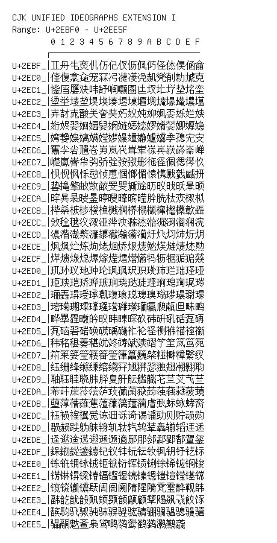

# CJK Unified Ideographs Extension I

**Range:** `U+2EBF0` - `U+2EE5F`

[← Back to Index](../README.md)

```text
        0 1 2 3 4 5 6 7 8 9 A B C D E F
       ┌───────────────────────────────
U+2EBF_│𮯰𮯱𮯲𮯳𮯴𮯵𮯶𮯷𮯸𮯹𮯺𮯻𮯼𮯽𮯾𮯿
U+2EC0_│𮰀𮰁𮰂𮰃𮰄𮰅𮰆𮰇𮰈𮰉𮰊𮰋𮰌𮰍𮰎𮰏
U+2EC1_│𮰐𮰑𮰒𮰓𮰔𮰕𮰖𮰗𮰘𮰙𮰚𮰛𮰜𮰝𮰞𮰟
U+2EC2_│𮰠𮰡𮰢𮰣𮰤𮰥𮰦𮰧𮰨𮰩𮰪𮰫𮰬𮰭𮰮𮰯
U+2EC3_│𮰰𮰱𮰲𮰳𮰴𮰵𮰶𮰷𮰸𮰹𮰺𮰻𮰼𮰽𮰾𮰿
U+2EC4_│𮱀𮱁𮱂𮱃𮱄𮱅𮱆𮱇𮱈𮱉𮱊𮱋𮱌𮱍𮱎𮱏
U+2EC5_│𮱐𮱑𮱒𮱓𮱔𮱕𮱖𮱗𮱘𮱙𮱚𮱛𮱜𮱝𮱞𮱟
U+2EC6_│𮱠𮱡𮱢𮱣𮱤𮱥𮱦𮱧𮱨𮱩𮱪𮱫𮱬𮱭𮱮𮱯
U+2EC7_│𮱰𮱱𮱲𮱳𮱴𮱵𮱶𮱷𮱸𮱹𮱺𮱻𮱼𮱽𮱾𮱿
U+2EC8_│𮲀𮲁𮲂𮲃𮲄𮲅𮲆𮲇𮲈𮲉𮲊𮲋𮲌𮲍𮲎𮲏
U+2EC9_│𮲐𮲑𮲒𮲓𮲔𮲕𮲖𮲗𮲘𮲙𮲚𮲛𮲜𮲝𮲞𮲟
U+2ECA_│𮲠𮲡𮲢𮲣𮲤𮲥𮲦𮲧𮲨𮲩𮲪𮲫𮲬𮲭𮲮𮲯
U+2ECB_│𮲰𮲱𮲲𮲳𮲴𮲵𮲶𮲷𮲸𮲹𮲺𮲻𮲼𮲽𮲾𮲿
U+2ECC_│𮳀𮳁𮳂𮳃𮳄𮳅𮳆𮳇𮳈𮳉𮳊𮳋𮳌𮳍𮳎𮳏
U+2ECD_│𮳐𮳑𮳒𮳓𮳔𮳕𮳖𮳗𮳘𮳙𮳚𮳛𮳜𮳝𮳞𮳟
U+2ECE_│𮳠𮳡𮳢𮳣𮳤𮳥𮳦𮳧𮳨𮳩𮳪𮳫𮳬𮳭𮳮𮳯
U+2ECF_│𮳰𮳱𮳲𮳳𮳴𮳵𮳶𮳷𮳸𮳹𮳺𮳻𮳼𮳽𮳾𮳿
U+2ED0_│𮴀𮴁𮴂𮴃𮴄𮴅𮴆𮴇𮴈𮴉𮴊𮴋𮴌𮴍𮴎𮴏
U+2ED1_│𮴐𮴑𮴒𮴓𮴔𮴕𮴖𮴗𮴘𮴙𮴚𮴛𮴜𮴝𮴞𮴟
U+2ED2_│𮴠𮴡𮴢𮴣𮴤𮴥𮴦𮴧𮴨𮴩𮴪𮴫𮴬𮴭𮴮𮴯
U+2ED3_│𮴰𮴱𮴲𮴳𮴴𮴵𮴶𮴷𮴸𮴹𮴺𮴻𮴼𮴽𮴾𮴿
U+2ED4_│𮵀𮵁𮵂𮵃𮵄𮵅𮵆𮵇𮵈𮵉𮵊𮵋𮵌𮵍𮵎𮵏
U+2ED5_│𮵐𮵑𮵒𮵓𮵔𮵕𮵖𮵗𮵘𮵙𮵚𮵛𮵜𮵝𮵞𮵟
U+2ED6_│𮵠𮵡𮵢𮵣𮵤𮵥𮵦𮵧𮵨𮵩𮵪𮵫𮵬𮵭𮵮𮵯
U+2ED7_│𮵰𮵱𮵲𮵳𮵴𮵵𮵶𮵷𮵸𮵹𮵺𮵻𮵼𮵽𮵾𮵿
U+2ED8_│𮶀𮶁𮶂𮶃𮶄𮶅𮶆𮶇𮶈𮶉𮶊𮶋𮶌𮶍𮶎𮶏
U+2ED9_│𮶐𮶑𮶒𮶓𮶔𮶕𮶖𮶗𮶘𮶙𮶚𮶛𮶜𮶝𮶞𮶟
U+2EDA_│𮶠𮶡𮶢𮶣𮶤𮶥𮶦𮶧𮶨𮶩𮶪𮶫𮶬𮶭𮶮𮶯
U+2EDB_│𮶰𮶱𮶲𮶳𮶴𮶵𮶶𮶷𮶸𮶹𮶺𮶻𮶼𮶽𮶾𮶿
U+2EDC_│𮷀𮷁𮷂𮷃𮷄𮷅𮷆𮷇𮷈𮷉𮷊𮷋𮷌𮷍𮷎𮷏
U+2EDD_│𮷐𮷑𮷒𮷓𮷔𮷕𮷖𮷗𮷘𮷙𮷚𮷛𮷜𮷝𮷞𮷟
U+2EDE_│𮷠𮷡𮷢𮷣𮷤𮷥𮷦𮷧𮷨𮷩𮷪𮷫𮷬𮷭𮷮𮷯
U+2EDF_│𮷰𮷱𮷲𮷳𮷴𮷵𮷶𮷷𮷸𮷹𮷺𮷻𮷼𮷽𮷾𮷿
U+2EE0_│𮸀𮸁𮸂𮸃𮸄𮸅𮸆𮸇𮸈𮸉𮸊𮸋𮸌𮸍𮸎𮸏
U+2EE1_│𮸐𮸑𮸒𮸓𮸔𮸕𮸖𮸗𮸘𮸙𮸚𮸛𮸜𮸝𮸞𮸟
U+2EE2_│𮸠𮸡𮸢𮸣𮸤𮸥𮸦𮸧𮸨𮸩𮸪𮸫𮸬𮸭𮸮𮸯
U+2EE3_│𮸰𮸱𮸲𮸳𮸴𮸵𮸶𮸷𮸸𮸹𮸺𮸻𮸼𮸽𮸾𮸿
U+2EE4_│𮹀𮹁𮹂𮹃𮹄𮹅𮹆𮹇𮹈𮹉𮹊𮹋𮹌𮹍𮹎𮹏
U+2EE5_│𮹐𮹑𮹒𮹓𮹔𮹕𮹖𮹗𮹘𮹙𮹚𮹛𮹜𮹝
```

## Visual Fallback Reference
If your system lacks the required fonts to render these characters properly, use the image below as a visual guide.


