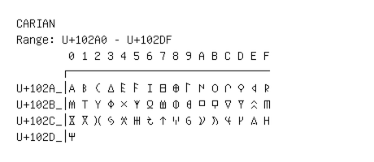

# Carian

**Range:** `U+102A0` - `U+102DF`

[← Back to Index](../README.md)

```text
        0 1 2 3 4 5 6 7 8 9 A B C D E F
       ┌───────────────────────────────
U+102A_│𐊠 𐊡 𐊢 𐊣 𐊤 𐊥 𐊦 𐊧 𐊨 𐊩 𐊪 𐊫 𐊬 𐊭 𐊮 𐊯
U+102B_│𐊰 𐊱 𐊲 𐊳 𐊴 𐊵 𐊶 𐊷 𐊸 𐊹 𐊺 𐊻 𐊼 𐊽 𐊾 𐊿
U+102C_│𐋀 𐋁 𐋂 𐋃 𐋄 𐋅 𐋆 𐋇 𐋈 𐋉 𐋊 𐋋 𐋌 𐋍 𐋎 𐋏
U+102D_│𐋐
```

## Visual Fallback Reference
If your system lacks the required fonts to render these characters properly, use the image below as a visual guide.


