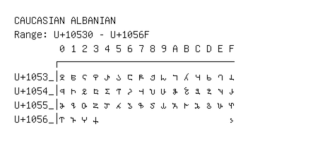

# Caucasian Albanian

**Range:** `U+10530` - `U+1056F`

[← Back to Index](../README.md)

```text
        0 1 2 3 4 5 6 7 8 9 A B C D E F
       ┌───────────────────────────────
U+1053_│𐔰 𐔱 𐔲 𐔳 𐔴 𐔵 𐔶 𐔷 𐔸 𐔹 𐔺 𐔻 𐔼 𐔽 𐔾 𐔿
U+1054_│𐕀 𐕁 𐕂 𐕃 𐕄 𐕅 𐕆 𐕇 𐕈 𐕉 𐕊 𐕋 𐕌 𐕍 𐕎 𐕏
U+1055_│𐕐 𐕑 𐕒 𐕓 𐕔 𐕕 𐕖 𐕗 𐕘 𐕙 𐕚 𐕛 𐕜 𐕝 𐕞 𐕟
U+1056_│𐕠 𐕡 𐕢 𐕣                       𐕯
```

## Visual Fallback Reference
If your system lacks the required fonts to render these characters properly, use the image below as a visual guide.


