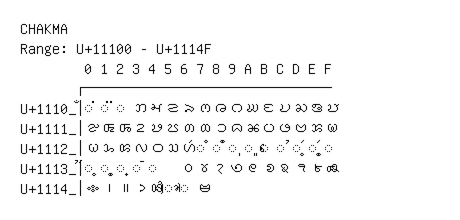

# Chakma

**Range:** `U+11100` - `U+1114F`

[← Back to Index](../README.md)

```text
        0 1 2 3 4 5 6 7 8 9 A B C D E F
       ┌───────────────────────────────
U+1110_│◌𑄀 ◌𑄁 ◌𑄂 𑄃 𑄄 𑄅 𑄆 𑄇 𑄈 𑄉 𑄊 𑄋 𑄌 𑄍 𑄎 𑄏
U+1111_│𑄐 𑄑 𑄒 𑄓 𑄔 𑄕 𑄖 𑄗 𑄘 𑄙 𑄚 𑄛 𑄜 𑄝 𑄞 𑄟
U+1112_│𑄠 𑄡 𑄢 𑄣 𑄤 𑄥 𑄦 ◌𑄧 ◌𑄨 ◌𑄩 ◌𑄪 ◌𑄫 ◌𑄬 ◌𑄭 ◌𑄮 ◌𑄯
U+1113_│◌𑄰 ◌𑄱 ◌𑄲 ◌𑄳 ◌𑄴   𑄶 𑄷 𑄸 𑄹 𑄺 𑄻 𑄼 𑄽 𑄾 𑄿
U+1114_│𑅀 𑅁 𑅂 𑅃 𑅄 ◌𑅅 ◌𑅆 𑅇
```

## Visual Fallback Reference
If your system lacks the required fonts to render these characters properly, use the image below as a visual guide.


