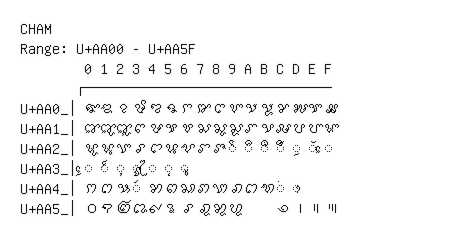

# Cham

**Range:** `U+AA00` - `U+AA5F`

[← Back to Index](../README.md)

```text
        0 1 2 3 4 5 6 7 8 9 A B C D E F
       ┌───────────────────────────────
U+AA0_│ꨀ ꨁ ꨂ ꨃ ꨄ ꨅ ꨆ ꨇ ꨈ ꨉ ꨊ ꨋ ꨌ ꨍ ꨎ ꨏ
U+AA1_│ꨐ ꨑ ꨒ ꨓ ꨔ ꨕ ꨖ ꨗ ꨘ ꨙ ꨚ ꨛ ꨜ ꨝ ꨞ ꨟ
U+AA2_│ꨠ ꨡ ꨢ ꨣ ꨤ ꨥ ꨦ ꨧ ꨨ ◌ꨩ ◌ꨪ ◌ꨫ ◌ꨬ ◌ꨭ ◌ꨮ ◌ꨯ
U+AA3_│◌ꨰ ◌ꨱ ◌ꨲ ◌ꨳ ◌ꨴ ◌ꨵ ◌ꨶ
U+AA4_│ꩀ ꩁ ꩂ ◌ꩃ ꩄ ꩅ ꩆ ꩇ ꩈ ꩉ ꩊ ꩋ ◌ꩌ ◌ꩍ
U+AA5_│꩐ ꩑ ꩒ ꩓ ꩔ ꩕ ꩖ ꩗ ꩘ ꩙     ꩜ ꩝ ꩞ ꩟
```

## Visual Fallback Reference
If your system lacks the required fonts to render these characters properly, use the image below as a visual guide.


